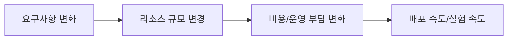

# 1. Cloud Computing이란 무엇인가

## 1. Cloud Computing의 정의

Cloud Computing은 Compute, Storage, Network 같은 인프라 자원을 "내가 소유한 장비"가 아니라 "필요할 때 빌려 쓰는 서비스"로 소비하는 방식이다. 핵심은 자원을 구매하는 것이 아니라, **요청하고 프로비저닝된 결과를 사용하는 것**이다.

Cloud는 단순히 서버를 임대하는 개념이 아니다. 인프라를 구성하는 요소(네트워크, 보안, 스토리지, 모니터링)가 서비스 형태로 제공되고, 이 서비스들을 연결해 배포 가능한 환경을 만든다는 점이 중요하다.

### ① On-Premise vs Cloud

On-Premise는 물리 장비와 네트워크/보안 장비를 직접 구매하고 운영한다. 하드웨어 조달, 설치, 패치, 장애 대응까지 운영 책임이 조직 내부에 있다.

Cloud는 동일한 자원을 서비스로 소비한다. 사용자는 데이터센터 운영을 하지 않고, Console에서 리소스를 생성하고 연결해 원하는 인프라 상태를 만든다. 운영 책임은 "서비스 제공자(AWS)와 사용자" 사이에서 분리된다.

---

# 2. Cloud의 핵심 가치

## 1. 운영 방식이 바뀐다

Cloud의 가치는 기능 목록이 아니라, 인프라 운영 방식의 변화를 만든다는 점에 있다.

이 다이어그램은 요구사항 변화가 리소스 규모 조정으로 이어지고, 그것이 비용과 운영 부담을 바꾸며, 결과적으로 배포 속도와 실험 속도에 영향을 주는 흐름을 보여준다. 이 시리즈는 이 흐름을 Console로 직접 구성해보는 데 초점을 둔다.

### ① 탄력성(Elasticity)

탄력성은 트래픽이나 작업량 변화에 맞춰 리소스를 빠르게 늘리고 줄일 수 있는 성질이다. On-Premise에서는 장비 구매와 설치가 선행되므로 규모 조정이 느리다. Cloud에서는 리소스를 생성/확장/삭제하는 방식으로 규모 조정이 빠르다.

### ② 종량제(Pay-as-you-go)

종량제는 사용한 만큼 비용을 지불하는 모델이다. 종량제는 "정리하지 않으면 비용이 계속 쌓인다"는 운영 현실과 직결된다. 이 시리즈의 Lab에서 자원 정리를 반복적으로 강조하는 이유가 여기에 있다.

### ③ 글로벌 배포(Global Reach)

Cloud는 여러 Region과 Availability Zone(AZ)을 통해 전 세계 사용자에게 서비스를 제공할 수 있는 기반을 제공한다. AWS의 글로벌 인프라(Region, AZ, Edge Location)는 다음 Section에서 별도로 다룬다.

---

# 3. 서비스 모델(Service Model)

## 1. IaaS / PaaS / SaaS

서비스 모델은 "누가 무엇을 운영하는가"를 구분하는 분류다. 개발자가 Cloud를 사용할 때 가장 중요한 관점은 **운영 책임이 어디까지 내려오는가**다.

### ① IaaS(Infrastructure as a Service)

IaaS는 가상 서버, 네트워크, 스토리지 같은 인프라 자원을 제공한다. 사용자는 OS와 애플리케이션부터 운영 책임을 가진다. AWS에서 EC2가 대표적인 IaaS다.

### ② PaaS(Platform as a Service)

PaaS는 런타임과 실행 환경을 제공한다. 사용자는 애플리케이션 코드와 설정에 집중하고, 서버 운영의 일부를 서비스에 위임한다. AWS에서는 RDS나 ECS 같은 관리형 서비스가 이 성격을 포함한다.

### ③ SaaS(Software as a Service)

SaaS는 완성된 소프트웨어를 서비스로 제공한다. 사용자는 기능을 사용하고 데이터/권한을 관리하며, 인프라 운영은 하지 않는다.

## 2. 개발자 관점의 트레이드오프

IaaS는 자유도가 높지만 운영 범위가 넓다. PaaS는 운영 부담이 줄지만 제약이 늘어난다. SaaS는 운영 부담이 거의 없지만 "서비스가 제공하는 기능" 안에서만 움직인다.

Cloud 아키텍처는 이 트레이드오프를 상황에 맞게 선택하는 작업이다. 이 시리즈는 Console 기반으로 IaaS에서 시작해 관리형 서비스까지 확장하면서, 운영 책임이 어떻게 바뀌는지 체감하도록 구성한다.

---

# 4. 배포 모델(Deployment Model)

## 1. Public / Private / Hybrid

### ① Public Cloud

Public Cloud는 AWS 같은 퍼블릭 제공자의 인프라를 공유 기반으로 소비하는 모델이다. 사용자는 논리적으로 격리된 환경을 사용하지만, 물리 인프라는 제공자에 의해 운영된다.

### ② Private Cloud

Private Cloud는 단일 조직이 전용으로 사용하는 Cloud 환경이다. 자체 데이터센터를 Cloud 방식으로 운영하거나, 전용 인프라를 제공받아 사용하는 형태가 포함된다.

### ③ Hybrid Cloud

Hybrid Cloud는 On-Premise와 Cloud를 함께 사용하는 모델이다. 데이터/규정/레거시 제약 때문에 Hybrid가 선택되는 경우가 많다.

이 시리즈는 Public Cloud(AWS)를 기준으로 진행한다. Private/Hybrid의 상세 설계는 인접 시리즈에서 다룬다.

---

# 5. 개발자에게 Cloud가 주는 의미

## 1. "코드"뿐 아니라 "환경"도 설계 대상이다

Cloud에서는 애플리케이션 코드와 별개로, 애플리케이션이 실행되는 환경(VPC, Subnet, Routing, Security, Storage)이 결과에 직접 영향을 준다. 성능, 보안, 가용성, 비용이 인프라 구조에서 결정되는 경우가 많다.

## 2. Console 기반 실습의 목적

이 시리즈는 IaC나 CLI로 자동화하지 않는다. Console에서 리소스를 직접 생성하고 연결하면서, "무엇이 어디에 붙어 있고 어떤 경로로 트래픽이 흐르는지"를 눈으로 확인하는 경험을 만든다.

자동화는 다음 시리즈에서 다룬다. 여기서는 배포 가능한 구조의 기본 형태를 손으로 구성해보는 것이 목적이다.

---

# 핵심 정리

- Cloud Computing은 인프라 자원을 소유하지 않고 서비스로 소비하는 방식이며, 리소스 연결 구조가 결과를 결정한다.
- Cloud의 핵심 가치는 탄력성(Elasticity), 종량제(Pay-as-you-go), 글로벌 배포(Global Reach)로 요약할 수 있다.
- 서비스 모델(IaaS/PaaS/SaaS)은 운영 책임 경계를 이해하는 도구이며, 아키텍처는 트레이드오프 선택의 결과다.
- Console 기반 실습은 리소스 연결 구조를 눈으로 확인해 IaC 이해의 기반을 만든다.

---

# 참고 자료

- [What is Cloud Computing? (AWS)](https://aws.amazon.com/what-is-cloud-computing/)
- [AWS Cloud Computing Concepts](https://docs.aws.amazon.com/whitepapers/latest/aws-overview/aws-overview.pdf)
- [AWS Pricing](https://aws.amazon.com/pricing/)

