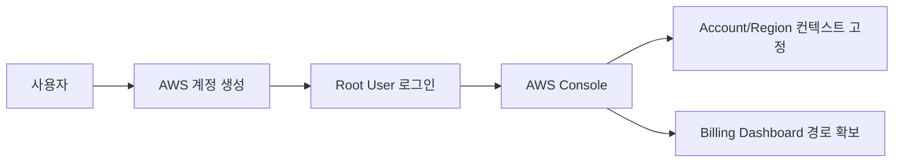
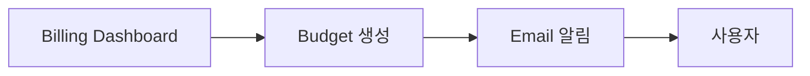

# 1. AWS 계정과 Identity 컨텍스트

## 1. Root User와 IAM User의 역할

AWS 계정은 단순 로그인 계정이 아니라, 모든 리소스가 귀속되는 보안/과금/운영의 경계다. 계정 작업에서 가장 먼저 정리해야 하는 것은 "어떤 Identity로 작업하는가"다.

- Root User: 계정 소유자. 결제/계정 설정 등 최상위 권한
- IAM User: 일상 작업자. 권한을 통제할 수 있는 실무 기본 단위

이 시리즈는 Root User를 최소 사용하고, 이후 Chapter에서 IAM User/Role 기반으로 실습을 진행한다.

### ① Console 상단 바가 보여주는 것

[이미지: AWS Console - 상단 바 - 계정 메뉴/Region 드롭다운 위치 - 현재 컨텍스트 확인 포인트]

이 위치는 이후 모든 실습의 전제다. "내가 어떤 계정/Identity로, 어느 Region에 리소스를 만들고 있는가"가 여기서 결정된다.

---

# 2. Region 컨텍스트

## 1. Region이 실습에 미치는 영향

Region은 리소스가 실제로 생성되는 물리적 위치를 결정한다. 실습 중 리소스가 보이지 않는 가장 흔한 원인은 Region이 다른 것이다.

이 시리즈는 특정 Region을 기준으로 진행한다. 실습을 시작할 때마다 Region을 확인하는 습관을 만든다.

### ① 본 시리즈의 기준 Region

본 시리즈는 **`ap-northeast-2 (Seoul)`** Region을 기준으로 진행한다.

---

# 3. 비용 컨텍스트

## 1. Free Tier와 과금의 현실

Free Tier는 "무조건 무료"가 아니라, **조건이 있는 무료 사용량**이다. 실습이 누적되면 비용 리스크가 생길 수 있으므로, 다음을 항상 확보한다.

- Billing Dashboard 접근 경로
- 비용이 발생하는 리소스를 정리하는 습관
- 예산 초과를 조기에 감지하는 Alert

Budget Alert는 이 Section의 `lab02`에서 구성한다.

---

# 핵심 정리

- 계정(Account), Identity, Region은 이후 모든 리소스 생성의 전제 컨텍스트다.
- Root User는 최소 사용하고, 실무 기본은 IAM 기반으로 권한을 통제한다.
- Region mismatch는 실습에서 가장 흔한 오류 원인이므로, 실습마다 Region을 확인한다.
- 비용 컨텍스트는 미리 확보해야 한다. Billing Dashboard와 Budget Alert가 기본이다.

---

# [실습] lab01: AWS 계정 생성과 Console 탐색

AWS 계정을 생성하고 Root User로 Console에 로그인한 뒤, Region 전환과 서비스 탐색을 수행한다. Console 상단 바에서 계정/Region 컨텍스트를 확인하는 기준점을 만들고, Billing Dashboard 접근 경로를 확보한다.

### 실습 목표

- AWS 계정을 생성한다.
- Root User로 Console에 로그인한다.
- Region을 기준 Region으로 고정한다.
- 주요 서비스 탐색 경로를 확보한다.
- Billing Dashboard 접근 경로를 확보한다.

⚠️ 비용 주의: 계정 생성과 Console 탐색 자체는 무료에 가깝지만, 이후 Lab에서 리소스를 생성하면 과금이 발생할 수 있다. Billing Dashboard 접근 경로를 미리 확보한다.

---

# 1. 전체 아키텍처

이 아키텍처는 "리소스 생성" 전에 계정/Region/비용 컨텍스트를 고정하는 흐름을 보여준다. 이후 모든 Lab은 이 컨텍스트 위에 누적된다.

---

# 2. 사전 준비

- 결제 수단(신용카드 등)
- 이메일/전화 인증 수단

---

# 3. 리소스 생성 및 설정 (생성 + 연결)

각 단계에서 AWS Console 화면 스냅샷을 반드시 명시한다.

## 1. AWS 계정 생성

[이미지: AWS 가입 화면 - 계정 생성 폼 - 이메일/비밀번호 입력 포인트]
[이미지: AWS 가입 화면 - 결제 정보 입력 - 결제 단계 안내]
[이미지: AWS 가입 화면 - Support Plan 선택 - Basic 선택 포인트]

## 2. Root User로 Console 로그인

[이미지: 브라우저 - AWS sign-in - Root User 로그인 진입 화면 - Root login 선택]
[이미지: 브라우저 - AWS Console 첫 진입 화면 - 상단 바(계정/Region) 확인]

## 3. Region 고정

[이미지: AWS Console - 상단 바 - Region 선택 드롭다운 - ap-northeast-2(Seoul) 선택]

## 4. Billing Dashboard 접근 경로 확보

[이미지: AWS Console - 계정 메뉴 - Billing Dashboard 진입 메뉴 위치]

---

# 4. 실행 및 결과 검증

## 1. 서비스 탐색

[이미지: AWS Console - 검색 바 - EC2/IAM/VPC/S3 검색 예]

## 2. 결과 검증

- Root User로 Console에 로그인된다.
- Region이 `ap-northeast-2 (Seoul)`로 설정되어 있다.
- Billing Dashboard 접근 경로를 확인했다.

---

# 5. 자원 정리

이 Lab은 계정/설정 확인 중심이므로 삭제할 리소스가 없다. 다음을 권장한다.

- Console 로그아웃
- Root User 보안 설정은 이후 IAM Section에서 확장한다

---

# [실습] lab02: AWS Budget Alert 설정

Billing Dashboard에서 Budget을 생성하고, 지정한 예산을 초과(또는 임계값 도달)할 때 Email 알림을 받도록 설정한다. 이후 Lab에서 비용 리스크를 조기에 감지할 수 있는 안전장치를 만든다.

### 실습 목표

- Billing Dashboard에서 Budgets로 이동한다.
- 월 예산 Budget을 생성한다.
- 임계값 도달 시 Email 알림을 설정한다.
- Budget 상태와 알림 설정을 검증한다.

⚠️ 비용 주의: Budget 기능 자체는 일반적으로 무료지만, 예산을 넘는 과금은 막아주지 않는다. 알림은 "사후 감지" 장치이며 자원 정리가 비용 통제의 핵심이다.

---

# 1. 전체 아키텍처

이 아키텍처는 비용을 "막는" 것이 아니라, 임계값 도달을 "감지"하는 구조다. 이후 Lab에서는 이 감지 위에 자원 정리 습관을 올린다.

---

# 2. 사전 준비

- Root User 또는 Billing 관련 권한이 있는 Identity로 Console 로그인
- 알림 수신 Email 준비

---

# 3. 리소스 생성 및 설정 (생성 + 연결)

각 단계에서 AWS Console 화면 스냅샷을 반드시 명시한다.

## 1. Budgets 화면 진입

[이미지: AWS Console - Billing Dashboard - Budgets 진입 화면 - 메뉴 위치]

## 2. Budget 생성(월 예산)

[이미지: AWS Console - Budgets - Create budget - Budget type 선택 화면 - Cost budget 선택]
[이미지: AWS Console - Budgets - Budget amount 설정 - 월 예산 금액 입력 포인트]

설정 포인트(예시):

- Budget name: **{budget-name}** (예: `fundamentals-monthly-budget`)
- Budget amount: **{amount}** (예: `10 USD`)

## 3. 알림(Alerts) 설정

[이미지: AWS Console - Budgets - Alerts - 임계값 설정 화면 - 80%/100% 같은 임계값 예]
[이미지: AWS Console - Budgets - Alerts - Email recipients 입력 화면 - 수신자 추가]

---

# 4. 실행 및 결과 검증

## 1. Budget/Alert 설정 상태 확인

[이미지: AWS Console - Budgets - Budget 상세 화면 - 알림 목록/임계값 확인]

## 2. 결과 검증

- Budget이 생성되어 목록에 보인다.
- Alert가 설정되어 있고 Email recipient가 등록되어 있다.

---

# 5. 자원 정리

Budget은 비용 통제 장치이므로 기본적으로 유지한다. 공유 계정/테스트 계정에서 불필요하다면 삭제한다.

[이미지: AWS Console - Budgets - Delete budget 화면 - 삭제 확인]

---

# 참고 자료

- [AWS Billing and Cost Management](https://docs.aws.amazon.com/awsaccountbilling/latest/aboutv2/billing-what-is.html)
- [Managing your costs with AWS Budgets](https://docs.aws.amazon.com/cost-management/latest/userguide/budgets-managing-costs.html)
