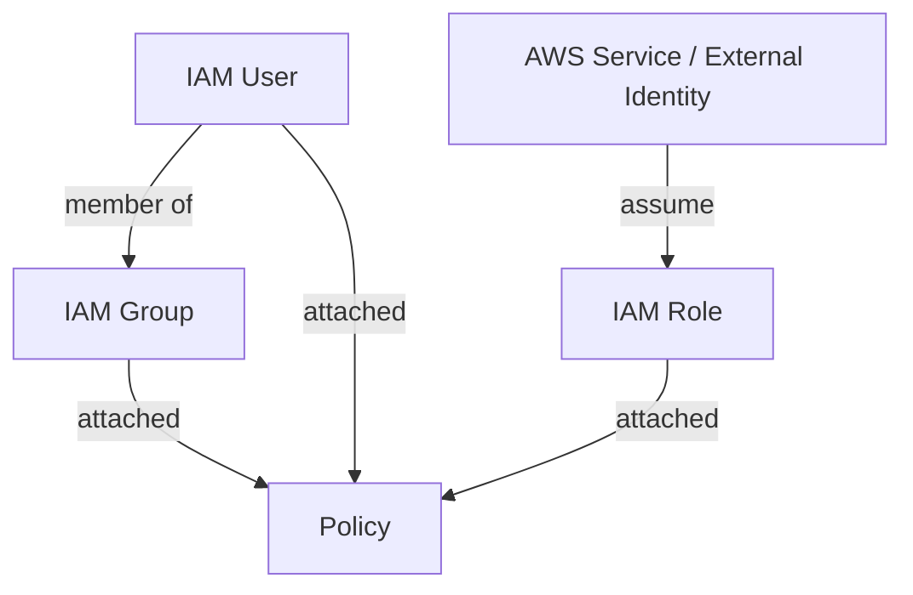

# 1. IAM이 의미하는 것

## 1. IAM은 권한 경계(Security Boundary)다

IAM(Identity and Access Management)은 AWS 리소스에 대한 접근을 안전하게 제어하는 서비스다. AWS 계정에 접근하는 주체(Identity)를 정의하고, 그 주체가 어떤 리소스에 어떤 작업(Action)을 할 수 있는지(Access)를 통제한다.

이 시리즈에서 IAM은 "보안 서비스 하나"가 아니라, 이후에 만들 모든 인프라(VPC, EC2, S3, RDS, ECS)를 안전하게 연결하기 위한 권한 경계로 다룬다.

### ① 인증(Authentication)과 인가(Authorization)

인증(Authentication)은 "누구인가"를 확인하는 과정이다. IAM User로 Console에 로그인하거나, Access Key로 API 요청을 서명하는 단계가 인증에 해당한다.

인가(Authorization)는 "무엇을 할 수 있는가"를 결정하는 과정이다. 인증된 주체가 `s3:GetObject` 같은 Action을 특정 Resource에 대해 수행할 수 있는지 Policy 평가로 결정된다.

```mermaid
flowchart LR
  A[요청 주체] --> B[인증\n(Authentication)]
  B --> C[인가\n(Authorization)]
  C --> D[AWS API 수행]
```

이 다이어그램은 요청이 들어왔을 때 인증과 인가가 순서대로 평가되고, 그 결과가 AWS API 호출 허용/거부로 이어지는 흐름을 보여준다. 이후 Section에서 Policy, Role을 다룰 때 이 흐름 위에 구성 요소를 얹어서 이해한다.

---

# 2. IAM 구성 요소

## 1. User / Group / Policy / Role

IAM은 "누가(Principal) 무엇을(Action) 어떤 리소스(Resource)에 할 수 있는가"를 관리하는 체계다. 이 체계를 구성하는 핵심 요소가 User, Group, Policy, Role이다.



이 다이어그램은 User/Group/Policy/Role의 기본 연결 관계를 보여준다. User는 Group에 속할 수 있고, Policy는 User/Group/Role에 연결된다. Role은 "어떤 주체가 맡을 수 있는 권한 묶음"이라는 점에서 User와 구분된다.

### ① User

User는 AWS에 접근하는 개별 사용자다. Console 접근(Password)과 Programmatic 접근(Access Key) 같은 자격 증명을 가질 수 있다. 이 시리즈는 Console 기반이므로 Console 접근 관점으로 먼저 이해한다.

### ② Group

Group은 User를 묶어 권한(Policy)을 일괄 적용하는 단위다. 권한을 User에 직접 붙이면 운영이 파편화되므로, 기본은 Group 기반 관리다.

### ③ Policy

Policy는 권한을 정의하는 JSON 문서다. 기본 구조는 `Effect(Allow/Deny)`, `Action`, `Resource`, `Condition` 조합이다. 문법과 평가 로직은 다음 Section에서 다룬다.

### ④ Role

Role은 임시 자격 증명(Temporary Credentials)을 통해 권한을 위임하는 방식이다. EC2/ECS 같은 AWS 서비스가 다른 서비스(S3 등)에 접근해야 할 때, Access Key를 코드/서버에 저장하지 않고 권한을 부여하는 기본 패턴이 Role이다.

---

# 3. Root User vs IAM User

## 1. Root User를 최소화해야 하는 이유

Root User는 AWS 계정 생성 시 만들어지는 최상위 권한 주체다. 거의 모든 작업이 가능하며, 실수나 계정 탈취가 발생했을 때 피해 범위가 매우 크다.

Root User는 일상 작업에 사용하지 않는 것이 기본 원칙이다. 이 시리즈의 실습도 Root User로 리소스를 만들기보다, IAM User로 작업하는 방향을 권장한다.

### ① Root User로 하면 안 되는 것

- 일상적인 Console 작업(리소스 생성/삭제)
- 개발/운영 팀원이 공유하는 계정 사용
- Access Key 발급 후 장기간 사용

### ② Root User로 해야 하는 것

- 결제/계정 설정(필요한 경우)
- 계정 보안의 최상위 설정(MFA 등)

---

# 핵심 정리

- IAM은 Identity를 정의하고 접근 권한을 통제하는 권한 경계(Security Boundary)다.
- 인증(Authentication)과 인가(Authorization)를 분리해 이해해야 한다.
- User/Group/Policy/Role은 연결 구조로 이해해야 한다.
- Root User는 최소 사용하고, 일상 작업은 IAM 기반으로 수행한다.

---

# 참고 자료

- [What is IAM? (AWS)](https://docs.aws.amazon.com/IAM/latest/UserGuide/introduction.html)
- [IAM identities (AWS)](https://docs.aws.amazon.com/IAM/latest/UserGuide/id.html)

