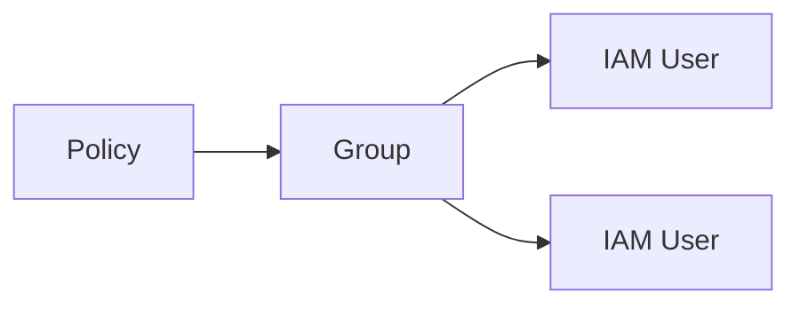

# 1. IAM User

## 1. IAM User가 의미하는 것

IAM User는 AWS 계정 안에서 작업을 수행하는 개별 사용자(Identity)다. Root User가 "계정 소유자"라면, IAM User는 "일상 작업을 수행하는 작업자"다.

이 시리즈의 실습은 Root User가 아니라 IAM User를 기준으로 진행한다. 이유는 단순하다.

- Root User는 권한이 너무 강하다.
- 사고(키 유출/실수 삭제)가 곧 계정 사고로 이어진다.
- 실무에서는 역할 분리와 감사(Audit)를 위해 IAM 기반으로 작업한다.

### ① Console 접근 vs Programmatic 접근

IAM User는 두 방식으로 접근할 수 있다.

- Console 접근: Username + Password로 AWS Management Console 로그인
- Programmatic 접근: Access Key로 API/CLI/SDK 호출

이 시리즈는 Console 기반 학습이므로, 이 Section의 실습은 Console 접근을 우선으로 구성한다. Access Key는 "의미와 보안 리스크"만 이해하고, 실제 사용은 다루지 않는다.

---

# 2. IAM Group

## 1. Group 기반 권한 관리

User에 Policy를 직접 붙여도 동작은 한다. 하지만 User가 늘어나면 권한 관리가 파편화되고, 누가 어떤 권한을 갖는지 추적이 어려워진다.

Group은 여러 User를 묶어 권한(Policy)을 일괄 적용하기 위한 단위다.



이 다이어그램은 권한을 Policy로 정의하고 Group으로 묶은 다음, User에게 일괄 적용하는 구조를 보여준다. User가 늘어나도 Group에 추가만 하면 되므로 운영이 단순해진다.

### ① Admin Group을 실습에서 쓰는 이유

초기 학습 단계에서는 권한 부족으로 실습이 막히는 경우가 많다. `lab03`에서는 Admin 권한을 가진 Group을 만들어 "권한 구조"를 먼저 잡고, 이후 `Policy` Section에서 최소 권한 원칙과 정책 설계를 다룬다.

Admin Group은 실무 권장 모델이 아니라, 학습 흐름을 단순화하기 위한 장치다.

---

# 3. MFA(Multi-Factor Authentication)

## 1. MFA가 의미하는 것

MFA(Multi-Factor Authentication)는 비밀번호(지식)만으로 로그인하지 않고, 추가 인증 요소(소유)를 요구하는 방식이다. 계정 보안에서 MFA는 선택이 아니라 기본이다.

### ① 왜 MFA가 필요한가

- Password는 유출될 수 있다(피싱/재사용/유출).
- MFA가 있으면 Password 유출만으로 계정이 뚫리지 않는다.

### ② 어떤 Identity에 MFA를 적용하는가

최소 기준은 다음이다.

- Root User: 반드시 MFA
- 일상 작업 IAM User: 가능하면 MFA

이 Section의 실습은 IAM User에 MFA를 설정해 "관리자 권한 User라도 MFA가 기본"이라는 감각을 만든다.

---

# 핵심 정리

- IAM User는 계정 내 작업자 Identity이며, 일상 작업은 Root User가 아니라 IAM User로 수행해야 한다.
- 권한은 User에 직접 붙이면 확장성이 무너진다. Policy를 Group에 연결하고 User를 Group으로 관리하는 구조가 기본이다.
- MFA는 Password 유출만으로 계정이 침해되지 않게 만드는 최소 방어선이다.

---

# [실습] lab03: IAM User와 Group 생성

Admin 권한을 가진 Group을 생성하고, IAM User를 생성한 뒤 Group에 추가한다. 이어서 가상 MFA 디바이스를 설정하고, IAM User로 Console에 로그인해 권한이 정상 적용되었는지 확인한다.

### 실습 목표

- Admin 권한 Group을 생성한다.
- IAM User를 생성하고 Group에 추가한다.
- IAM User에 가상 MFA 디바이스를 설정한다.
- IAM User로 Console에 로그인해 접근 권한을 확인한다.

⚠️ 비용 주의: IAM 설정 자체는 과금 리소스 생성보다 영향이 작지만, 계정 보안/권한 설정은 운영에 영향을 줄 수 있으므로 신중히 진행한다.

---

# 1. 전체 아키텍처

```mermaid
flowchart LR
  P[AdministratorAccess\n(AWS Managed Policy)] --> G[Admin Group]
  G --> U[IAM User]
  U --> MFA[Virtual MFA Device]
  U --> Console[AWS Management Console]
```

이 아키텍처는 "권한은 Group으로 묶고(User는 Group에 들어가며), 로그인에는 MFA를 추가한다"는 최소 보안 구조를 보여준다. 이후 Lab들은 이 구조 위에서 리소스를 생성하고 연결한다.

---

# 2. 사전 준비

- Root User 또는 권한이 충분한 IAM User로 Console 로그인
- 알림 수신 가능한 MFA 앱 준비(Google Authenticator 등)

---

# 3. 리소스 생성 및 설정 (생성 + 연결)

각 단계에서 AWS Console 화면 스냅샷을 반드시 명시한다.

## 1. Admin Group 생성(Policy 연결 포함)

설명: User 권한을 Group 단위로 일괄 관리하기 위한 Group을 만든다.

[이미지: AWS Console - IAM - User groups - Create group 화면 - Group name/Policy 선택 포인트]

설정 포인트(예시):

- Group name: **{admin-group-name}** (예: `fundamentals-admin`)
- Permissions policies: `AdministratorAccess` (AWS managed)

## 2. IAM User 생성 + Group 추가

설명: 일상 작업용 IAM User를 만들고, Admin Group에 추가해 권한을 부여한다.

[이미지: AWS Console - IAM - Users - Create user 화면 - User name/Console access 설정 포인트]
[이미지: AWS Console - IAM - Users - Create user 화면 - Add user to group 단계 - Admin Group 선택 포인트]
[이미지: AWS Console - IAM - Users - Create user 결과 화면 - Console sign-in URL/Username 확인 포인트]

설정 포인트(예시):

- User name: **{iam-user-name}**
- Provide user access to the AWS Management Console: Enabled
- Require password reset: Enabled(권장)

## 3. MFA 설정

설명: IAM User에 가상 MFA 디바이스를 연결한다.

[이미지: AWS Console - IAM - Users - Security credentials 탭 - Assign MFA device 버튼 위치]
[이미지: AWS Console - IAM - MFA device 설정 화면 - Authenticator app 선택/QR 코드 표시 화면]

진행 포인트:

- Authenticator 앱에서 QR 코드를 스캔한다.
- 연속된 MFA 코드를 입력해 등록을 완료한다.

## 4. (연결 확인) Group/Policy/User 상속 경로 확인

[이미지: AWS Console - IAM - User groups - Group details - Users 탭 - User 포함 여부 확인]
[이미지: AWS Console - IAM - User groups - Group details - Permissions 탭 - Attached policy 확인]
[이미지: AWS Console - IAM - Users - User details - Permissions 탭 - Group 상속 경로 확인]

---

# 4. 실행 및 결과 검증

## 1. IAM User로 Console 로그인

[이미지: 브라우저 - AWS sign-in - IAM User 로그인 진입 화면 - IAM User 로그인 선택]
[이미지: 브라우저 - AWS sign-in - MFA 코드 입력 화면 - 정상 로그인 예]


## 2. 결과 검증

- IAM User로 Console 로그인 시 MFA가 요구되고, 정상 로그인된다.
- User 권한이 Group을 통해 상속되어 적용된다.


---

# 5. 자원 정리

학습용 User/Group은 계정 보안 리스크가 될 수 있으므로 정리 기준을 명확히 한다.

- 이후 Lab을 계속 진행할 경우:
  - IAM User/Group은 유지한다(이 시리즈 실습 계정으로 사용).
- 실습을 중단하거나 공유 계정 환경일 경우:
  - IAM User 삭제
  - IAM Group 삭제

[이미지: AWS Console - IAM - Users - Delete user 화면 - Delete 확인 포인트]
[이미지: AWS Console - IAM - User groups - Delete group 화면 - Delete 확인 포인트]

---

# 참고 자료

- [IAM users (AWS)](https://docs.aws.amazon.com/IAM/latest/UserGuide/id_users.html)
- [IAM user groups (AWS)](https://docs.aws.amazon.com/IAM/latest/UserGuide/id_groups.html)
- [AWS multi-factor authentication (MFA) (AWS)](https://docs.aws.amazon.com/IAM/latest/UserGuide/id_credentials_mfa.html)
