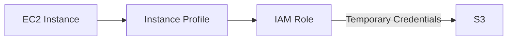

# 1. IAM Role

## 1. Role이 의미하는 것

IAM Role은 권한을 "사용자"에게 고정으로 주는 대신, **필요한 순간에 임시로 맡아(Assume) 쓰는 권한 단위**다. Role의 핵심은 임시 자격 증명(Temporary Credentials)이다.

User는 장기 자격 증명(Password/Access Key)을 가지지만, Role은 "누가 맡을 수 있는가"와 "맡았을 때 무엇을 할 수 있는가"를 분리해 설계한다.

### ① User와 Role의 차이

- User: 계정 내 사람/시스템을 표현하는 Identity, 장기 자격 증명 중심
- Role: 권한 묶음, 임시 자격 증명 중심(Assume Role)

### ② Role이 필요한 대표 시나리오

- EC2/ECS 같은 AWS 서비스가 다른 서비스(S3 등)에 접근해야 한다
- 서비스 간 권한 위임이 필요하다
- Cross-account 접근이 필요하다(개념 소개)

이 시리즈는 첫 번째 시나리오(EC2 ↔ S3)를 위한 Role을 먼저 만든다.

---

# 2. Trust Policy와 Permission Policy

## 1. Role은 두 정책으로 분리된다

### ① Trust Policy(Assume Role 정책)

Trust Policy는 "누가 이 Role을 맡을 수 있는가"를 정의한다. 즉, Role을 사용할 수 있는 주체(Principal)를 정의한다.

예: EC2 서비스가 이 Role을 맡을 수 있다.

[이미지: AWS Console - IAM - Roles - Role details - Trust relationships 탭 - Principal(Service: ec2.amazonaws.com) 확인]

### ② Permission Policy(권한 정책)

Permission Policy는 "이 Role이 무엇을 할 수 있는가"를 정의한다. Role을 맡은 주체는 이 Permission Policy 범위 안에서만 API를 호출할 수 있다.

예: S3 ReadOnly 접근 허용.

---

# 3. Instance Profile

## 1. EC2에서 Role이 적용되는 방식

EC2에서 Role은 Instance에 직접 붙는 것처럼 보이지만, 실제로는 **Instance Profile**을 통해 연결된다.

- Role: 권한 단위(Trust + Permission)
- Instance Profile: EC2 Instance에 Role을 연결하는 컨테이너

### ① Access Key 없이 서비스 접근이 가능한 이유

EC2에 Role을 연결하면, AWS가 Instance 내부에서 임시 자격 증명을 주기적으로 발급해준다. 애플리케이션은 이 임시 자격 증명으로 S3 같은 서비스에 접근한다.

이 시리즈는 "코드/서버에 자격 증명을 박지 않는다"는 원칙을 Role로 체감하도록 구성한다. 실제 EC2-S3 연동 실습은 Ch06에서 다룬다.

---

# 핵심 정리

- Role은 임시 자격 증명 기반 권한 단위이며, 필요할 때 맡아(Assume) 쓰는 방식으로 설계한다.
- Role은 Trust Policy(누가 맡는가)와 Permission Policy(무엇을 하는가)로 분리된다.
- EC2에서 Role은 Instance Profile을 통해 Instance에 연결되며, Access Key 없이 서비스 접근이 가능해진다.

---

# [실습] lab05: EC2용 IAM Role 생성

EC2가 S3 같은 AWS 서비스에 접근할 수 있도록 IAM Role을 생성한다. Trust Policy로 EC2 서비스를 지정하고, Permission Policy로 S3 접근 권한을 연결한다. 생성한 Role(Instance Profile)은 이후 EC2 Instance 생성 시 선택해 재사용한다.

### 실습 목표

- EC2 서비스가 맡을 수 있는(Role Trust) Role을 생성한다.
- Role에 S3 접근 권한(Permission Policy)을 연결한다.
- Role의 Trust/Permissions/Instance Profile을 Console에서 검증한다.
- EC2 생성 화면에서 Role 선택 위치를 확인한다.

⚠️ 비용 주의: IAM 설정 자체는 과금 리소스 생성보다 영향이 작지만, 권한 설정은 운영에 영향을 줄 수 있으므로 신중히 진행한다.

---

# 1. 전체 아키텍처

이 아키텍처는 EC2가 Role을 통해 임시 자격 증명을 받아 다른 AWS 서비스(S3)에 접근하는 구조를 보여준다. 이 방식은 Access Key를 서버에 저장하지 않는 안전한 기본 패턴이다.

---

# 2. 사전 준비

- 관리자 권한으로 Console 로그인(예: Root 또는 Admin Group User)

---

# 3. 리소스 생성 및 설정 (생성 + 연결)

각 단계에서 AWS Console 화면 스냅샷을 반드시 명시한다.

## 1. Role 생성(Trusted entity: AWS service = EC2)

설명: EC2가 맡을 수 있는 Role을 만든다.

[이미지: AWS Console - IAM - Roles - Create role 화면 - Trusted entity: AWS service/Use case: EC2 선택 포인트]

설정 포인트(예시):

- Use case: EC2
- Role name: **{ec2-role-name}** (예: `fundamentals-ec2-s3-role`)

## 2. Permission Policy 연결

설명: EC2가 S3에 접근할 수 있도록 권한을 연결한다.

[이미지: AWS Console - IAM - Roles - Add permissions 화면 - AmazonS3ReadOnlyAccess 선택 포인트]

권장(학습 단순화):

- `AmazonS3ReadOnlyAccess` (AWS managed)

## 3. Trust/Permissions/Instance Profile 확인

[이미지: AWS Console - IAM - Roles - Trust relationships 탭 - ec2.amazonaws.com 확인]
[이미지: AWS Console - IAM - Roles - Permissions 탭 - AmazonS3ReadOnlyAccess 연결 확인]
[이미지: AWS Console - IAM - Roles - Summary 화면 - Instance profile ARN/이름 확인 포인트]

---

# 4. 실행 및 결과 검증

## 1. EC2 생성 시 Role 선택 위치 확인

다음 Chapter(EC2) 또는 이후 EC2 생성 화면에서 `IAM instance profile`(또는 `IAM role`) 선택 항목으로 이 Role을 선택할 수 있어야 한다.

[이미지: AWS Console - EC2 - Launch instance - Advanced details - IAM instance profile 선택 위치]

## 2. 결과 검증

- Role의 Trust relationship에 EC2 서비스(`ec2.amazonaws.com`)가 포함되어 있다.
- Role에 S3 접근 권한 Policy가 연결되어 있다.
- Role이 Instance Profile 형태로 EC2에서 선택 가능한 상태다.

---

# 5. 자원 정리

이 Role은 이후 실습(특히 S3 연동)에서 재사용할 수 있으므로, 기본적으로 유지하는 것을 권장한다.

- 이후 Lab을 계속 진행할 경우(권장): Role 유지
- 실습을 중단하거나 공유 계정 환경일 경우: Role 삭제

[이미지: AWS Console - IAM - Roles - Delete role 화면 - 삭제 확인 포인트]

⚠️ 주의:

- Role이 EC2 Instance에 연결되어 있으면 삭제할 수 없다(먼저 Instance에서 분리).

---

# 참고 자료

- [IAM roles (AWS)](https://docs.aws.amazon.com/IAM/latest/UserGuide/id_roles.html)
- [IAM JSON policy elements: Principal (AWS)](https://docs.aws.amazon.com/IAM/latest/UserGuide/reference_policies_elements_principal.html)
- [Using IAM roles to grant permissions to applications running on Amazon EC2 instances (AWS)](https://docs.aws.amazon.com/IAM/latest/UserGuide/id_roles_use_switch-role-ec2.html)
