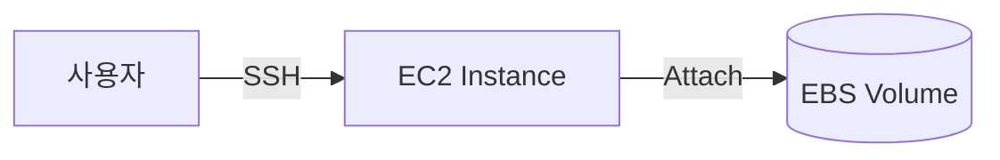
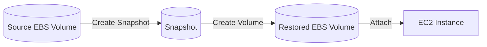
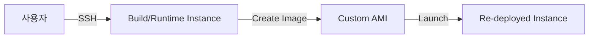

# 1. EBS(Elastic Block Store)

## 1. EBS가 의미하는 것

EBS(Elastic Block Store)는 EC2 Instance에 연결해 사용하는 블록 스토리지다. "서버 안에 디스크를 추가로 꽂는다"는 감각으로 이해하면 된다. EC2는 Compute이고, EBS는 그 Compute가 사용할 영속적인 디스크를 제공한다.

EBS를 사용하는 이유는 단순히 용량을 늘리기 위해서가 아니다.

- 데이터 분리: OS(Root)와 애플리케이션 데이터(Data)를 분리한다.
- 영속성: Instance를 Stop/Start해도 데이터가 유지된다.
- 백업/복구: Snapshot으로 특정 시점 상태를 저장하고 복원한다.

### ① Instance Store vs EBS

- Instance Store: Instance 수명에 강하게 종속되는 일시적 스토리지 성격
- EBS: Instance와 분리된 리소스이며 Detach/Attach가 가능(영속적)

---

## 2. EBS는 AZ 단위로 묶인다

EBS Volume은 특정 Availability Zone(AZ)에 속한다. 따라서 Volume을 Attach하려는 Instance도 같은 AZ에 있어야 한다.

[이미지: AWS Console - EC2 - Instance details - Availability Zone 확인 위치]
[이미지: AWS Console - EBS - Volumes - Availability Zone 확인 위치]

---

# 2. Volume Type

## 1. 주요 타입과 선택 감각

EBS Volume Type은 성능과 비용을 함께 결정한다. 이 시리즈에서는 "어떤 상황에 어떤 타입을 고르는가"의 감각만 잡는다.

### ① gp3 / io2 / st1 / sc1

- `gp3` (General Purpose SSD): 일반 워크로드 기본값
- `io2` (Provisioned IOPS SSD): 높은 IOPS가 필요한 워크로드
- `st1` (Throughput Optimized HDD): 처리량 위주의 대용량 워크로드
- `sc1` (Cold HDD): 접근 빈도가 낮은 대용량 데이터

---

# 3. Snapshot

## 1. Snapshot이 의미하는 것

Snapshot은 EBS Volume의 특정 시점을 백업하는 기능이다. Snapshot 자체를 Instance에 붙이지 않고, Snapshot에서 새 Volume을 생성해 Attach하는 방식으로 복구/복제한다.

### ① Snapshot으로 가능한 작업

- 백업: 복원 지점 확보
- 복구: Snapshot에서 새 Volume 생성 후 Attach
- 복제: 동일 데이터로 새 Volume 생성

## 2. Snapshot과 AMI(Instance Image)

AMI(Amazon Machine Image)는 EC2 Instance를 부팅하기 위한 이미지(OS + 디스크 상태)다. Custom AMI를 생성할 때, EC2는 Instance의 Root Volume(EBS)에 대해 Snapshot을 생성하고 그 Snapshot을 기반으로 AMI를 만든다.

### ① 이 시리즈에서의 사용 맥락

- `lab09`에서 Gallery 배포/빌드에 필요한 기본 도구(Java, Git, Maven 등)를 설치한 뒤, 그 상태를 AMI로 고정한다.
- `lab08`과 `lab09`의 핵심은 "한 번 만든 상태를 재현 가능한 형태로 저장하고, 필요할 때 복원한다"는 관점이다.

---

# 핵심 정리

- EBS는 EC2에 붙여 쓰는 블록 스토리지이며, Compute(EC2)와 데이터(EBS)를 분리해 운영할 수 있게 한다.
- EBS Volume은 AZ 단위 리소스이므로 Instance와 AZ 일치가 Attach의 전제다.
- Snapshot은 특정 시점 백업이며, 복구는 Snapshot에서 새 Volume을 만들어 Attach하는 방식으로 이뤄진다.

---

# [실습] lab07: EBS Volume 생성과 연결

추가 EBS Volume을 생성해 EC2 Instance에 Attach하고, Linux에서 디바이스를 포맷/마운트하여 실제로 데이터를 쓸 수 있는 상태로 만든다. 이 Lab은 "디스크를 붙이고 OS에서 실제로 쓰게 만드는" 기본 흐름에 집중한다.

### 실습 목표

- 추가 EBS Volume을 생성한다.
- 실행 중인 EC2 Instance에 Volume을 Attach한다.
- OS에서 디바이스를 포맷하고 마운트한다.
- 마운트 경로에 테스트 파일을 쓰고 읽으며 동작을 검증한다.

⚠️ 비용 주의: 본 실습에서는 EBS Volume을 생성하므로 과금이 발생할 수 있다. 실습 종료 시 자원 정리 기준을 적용한다.

---

# 1. 전체 아키텍처



이 구조는 "Instance에 디스크를 추가한다"는 최소 흐름이다. 핵심은 AZ 일치와 Attach 후 OS 포맷/마운트다.

---

# 2. 사전 준비

- AWS Console 로그인
- EC2 Instance 준비
  - 앞선 `lab06`에서 만든 Instance를 사용한다.

---

# 3. 리소스 생성 및 설정 (생성 + 연결)

각 단계에서 AWS Console 화면 스냅샷을 반드시 명시한다.

## 1. Instance의 AZ 확인

[이미지: AWS Console - EC2 - Instance details - Availability Zone 확인 화면]

## 2. EBS Volume 생성

[이미지: AWS Console - EBS - Volumes - Create volume 화면 - Volume type/Size/AZ 선택 포인트]

설정 포인트(예시):

- Volume type: `gp3`
- Size: **{your-volume-size-gb}** GB
- Availability Zone: **{same-as-instance-az}**
- Tag(Name): **{your-ebs-volume-name}**

## 3. Volume을 Instance에 Attach

[이미지: AWS Console - EBS - Volumes - Attach volume 화면 - Instance 선택/Device name 확인 포인트]

확인 포인트:

- Instance: **{your-instance-id}**
- Device name: **{device-name}** (예: `/dev/sdf`)

## 4. (연결 확인) Instance Storage 탭에서 Attached volumes 확인

[이미지: AWS Console - EC2 - Instance details - Storage 탭 - Attached volumes 확인]

---

# 4. 실행 및 결과 검증

## 1. 새 디바이스 확인

```bash
lsblk
```

## 2. 파일 시스템 생성(포맷)

```bash
sudo mkfs -t xfs **{/dev/xvdf}**
```

## 3. 마운트

```bash
sudo mkdir -p **{/mnt/data}**
sudo mount **{/dev/xvdf}** **{/mnt/data}**
df -h
```

## 4. 결과 검증(쓰기/읽기)

```bash
echo "hello-ebs" | sudo tee **{/mnt/data/hello.txt}**
cat **{/mnt/data/hello.txt}**
```

---

# 5. 자원 정리

- 이 EBS Volume은 다음 `lab08`에서 Snapshot 복원 실습에 사용할 수 있다.
- 학습을 이어갈 경우(권장): Volume 유지
- 학습을 중단할 경우(비용 방지): Volume Detach 후 삭제

[이미지: AWS Console - EBS - Volumes - Detach volume 화면 - Detach 확인]
[이미지: AWS Console - EBS - Volumes - Delete volume 화면 - Delete 확인]

---

# [실습] lab08: 스냅샷 생성 및 복원

`lab07`에서 만든 EBS Volume을 Snapshot으로 백업하고, Snapshot에서 새 Volume을 생성해 Instance에 다시 Attach하여 "복원"을 검증한다. 이 Lab의 목적은 데이터가 특정 시점 상태로 복원될 수 있음을 체감하는 것이다.

### 실습 목표

- EBS Volume Snapshot을 생성한다.
- Snapshot에서 새 Volume을 생성한다.
- 새 Volume을 Instance에 Attach하고 마운트해 데이터가 복원되는지 확인한다.

⚠️ 비용 주의: Snapshot은 보관되는 동안 비용이 발생할 수 있다. 학습을 중단하면 Snapshot 삭제로 정리한다.

---

# 1. 전체 아키텍처



이 구조는 "Volume 상태를 Snapshot으로 저장하고, 필요할 때 Volume을 다시 만들어 복원한다"는 흐름이다.

---

# 2. 사전 준비

- `lab07`에서 생성한 EBS Volume
- EC2 Instance(실행 중)

---

# 3. 리소스 생성 및 설정 (생성 + 연결)

각 단계에서 AWS Console 화면 스냅샷을 반드시 명시한다.

## 1. Snapshot 생성

[이미지: AWS Console - EBS - Volumes - Create snapshot 화면 - 대상 Volume 선택/설명 입력]

설정 포인트(예시):

- Description: **{lab08-snapshot-for-restore}**

## 2. Snapshot에서 새 Volume 생성

[이미지: AWS Console - EBS - Snapshots - Create volume from snapshot 화면 - AZ/Size 선택 포인트]

⚠️ 주의: 복원 Volume도 Instance와 같은 AZ에 있어야 Attach할 수 있다.

## 3. (선택) 기존 Volume 분리/삭제로 복원 시나리오 만들기

[이미지: AWS Console - EBS - Volumes - Detach volume 화면 - Detach 확인]

이 단계를 수행하면 "원본 Volume이 없어도 Snapshot으로 복원 가능"을 더 명확히 검증할 수 있다.

## 4. 복원 Volume을 Instance에 Attach

[이미지: AWS Console - EBS - Volumes - Attach volume 화면 - Instance/Device 선택 포인트]

---

# 4. 실행 및 결과 검증

## 1. 디바이스 인식 확인

```bash
lsblk
```

## 2. 마운트(이미 포맷된 Volume이므로 포맷 생략)

```bash
sudo mkdir -p **{/mnt/restore}**
sudo mount **{/dev/xvdf}** **{/mnt/restore}**
df -h
```

## 3. 복원 데이터 확인

```bash
cat **{/mnt/restore/hello.txt}**
```

---

# 5. 자원 정리

- 계속 학습할 경우: Snapshot은 유지할 필요가 낮다(복원 검증이 끝났으면 삭제 권장).
- 학습을 중단할 경우: Snapshot 삭제 + 불필요한 Volume 삭제

[이미지: AWS Console - EBS - Snapshots - Delete snapshot 화면 - Delete 확인]
[이미지: AWS Console - EBS - Volumes - Delete volume 화면 - Delete 확인]

---

# [실습] lab09: AMI(Java 빌드/실행 환경) 생성 및 재배포

EC2 Instance에 Java, Git, Maven 같은 기본 빌드/실행 도구를 설치한 뒤, 그 상태를 AMI(Custom Image)로 만들어 보관한다. 이어서 이 AMI로 새 Instance를 생성해 "재배포" 과정을 검증한다. 이후 Gallery 프로젝트 Lab은 이 AMI 기반 Instance를 표준 실행 환경으로 사용한다.

### 실습 목표

- EC2 Instance에 Java, Git, Maven을 설치한다.
- Instance 상태를 Custom AMI로 생성한다(내부적으로 Root Volume Snapshot 생성).
- Custom AMI로 새 Instance를 생성해 환경이 재현되는지 검증한다.

⚠️ 비용 주의: AMI를 만들면 EBS Snapshot이 생성되며, Snapshot은 보관되는 동안 비용이 발생할 수 있다. 학습을 중단하면 AMI 등록 해제(Deregister)와 Snapshot 삭제로 정리한다.

---

# 1. 전체 아키텍처



이 아키텍처는 "환경을 한 번 만들고(설치), 이미지로 고정한 뒤(AMI), 필요할 때 같은 환경을 다시 만든다(재배포)"는 흐름이다.

---

# 2. 사전 준비

- AWS Console 로그인
- EC2 Instance 준비
  - 앞선 `lab06`에서 만든 Instance를 사용하거나, 별도 Instance를 준비한다.
- SSH 접속 준비(Key Pair, 로컬 SSH)

⚠️ 주의: 이 AMI는 "Gallery 빌드/실행 도구"를 담는 것이 목적이다. 추가 Data Volume(EBS)을 포함하려면 블록 디바이스 매핑을 별도로 설계해야 하므로, 이 Lab에서는 기본 설정(루트 볼륨 중심)으로 진행한다.

---

# 3. 리소스 생성 및 설정 (생성 + 연결)

각 단계에서 AWS Console 화면 스냅샷을 반드시 명시한다.

## 1. Custom AMI 생성(스냅샷 생성)

[이미지: AWS Console - EC2 - Instances - Actions - Image and templates - Create image 화면 - Image name/설정 포인트]

설정 포인트(예시):

- Image name: **{fundamentals-gallery-ami-v1}**
- Description: **{gallery build/runtime base image}**
- Reboot instance: Enabled(권장)

---

# 4. 실행 및 결과 검증

## 1. Instance에 접속(SSH)

```bash
ssh -i **{path-to-key.pem}** **{user}**@**{public-endpoint}**
```

## 2. OS 확인

```bash
cat /etc/os-release
```

## 3. Java/Git/Maven 설치

Amazon Linux 계열 기준 예시:

```bash
sudo dnf install -y java-21-amazon-corretto-headless git maven || sudo yum install -y java-21-amazon-corretto-headless git maven
```

## 4. 설치 결과 확인

```bash
java -version
git --version
mvn -version
```

## 5. (재배포 검증) AMI로 새 Instance 생성 후 동일 도구 확인

[이미지: AWS Console - EC2 - AMIs - 생성된 AMI 확인 화면 - Name/AMI ID 확인]
[이미지: AWS Console - EC2 - AMIs - Launch instance 화면 - Instance type/Key pair/Security Group 선택 포인트]
[이미지: AWS Console - EC2 - Instances - 새 Instance Running 상태 확인 - Public IPv4 확인]

새 Instance에 접속해 아래를 다시 확인한다:

```bash
java -version
git --version
mvn -version
```

---

# 5. 자원 정리

- 계속 학습할 경우(권장): AMI 유지, Snapshot 유지
- 학습을 중단할 경우(비용 방지): AMI 등록 해제 + Snapshot 삭제

[이미지: AWS Console - EC2 - AMIs - Deregister AMI 화면 - Deregister 확인]
[이미지: AWS Console - EBS - Snapshots - AMI 관련 Snapshot 식별 - Delete snapshot 확인]

---

# 참고 자료

- [Amazon EBS volumes (AWS)](https://docs.aws.amazon.com/ebs/latest/userguide/ebs-volumes.html)
- [Amazon EBS volume types (AWS)](https://docs.aws.amazon.com/ebs/latest/userguide/ebs-volume-types.html)
- [Amazon EBS snapshots (AWS)](https://docs.aws.amazon.com/ebs/latest/userguide/ebs-snapshots.html)
