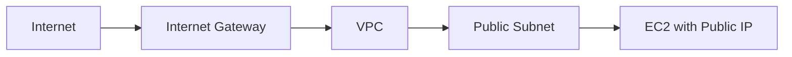
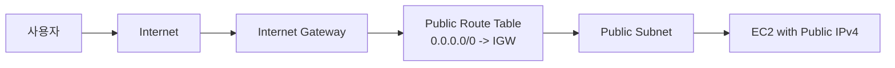

# 1. Internet Gateway(IGW)

## 1. IGW가 의미하는 것

Internet Gateway(IGW)는 VPC가 인터넷과 통신할 수 있게 하는 관문이다. VPC는 "사설 네트워크"이므로, 외부(Internet)와의 연결 경로를 명시적으로 만들지 않으면 어떤 리소스도 인터넷으로 나갈 수 없다.

### ① IGW는 VPC에 Attach된다

IGW는 Subnet에 붙는 리소스가 아니라 VPC에 붙는 리소스다. "VPC당 하나의 IGW 연결" 구조를 갖고, 인터넷 방향 라우팅의 Target으로 사용된다.



이 구조는 "IGW는 VPC의 외부 출입구"라는 관점을 보여준다. 다만 IGW를 붙이는 것만으로 인터넷이 되는 것은 아니며, Route Table에 경로를 추가해야 한다.

### ② IGW는 Route Table의 Target이다

IGW는 Route Table에서 `0.0.0.0/0 -> igw-...` 같은 라우트의 Target으로 쓰인다. 즉, "인터넷으로 향하는 패킷은 IGW로 보낸다"를 라우팅 규칙으로 선언하는 방식이다.

---

# 2. Public Route Table로 인터넷 경로 만들기

## 1. Public Route Table은 "0.0.0.0/0 -> IGW"를 갖는다

Public Subnet의 핵심 조건은 "인터넷 목적지 트래픽을 IGW로 보낼 수 있는 라우트"가 존재하는 것이다. 이를 위해 Public Subnet이 사용할 Route Table에 다음 라우트를 추가한다.

- Destination: `0.0.0.0/0`
- Target: `igw-...`

[이미지: AWS Console - VPC - Route tables - Routes 탭 - 0.0.0.0/0 -> IGW 추가/Active 확인 포인트]

## 2. Subnet association으로 Public Subnet을 확정한다

Route Table을 만들었다면, Public Subnet이 그 Route Table을 사용하도록 association해야 한다. association이 빠지면 "라우트는 있는데도" 기대한 경로로 나가지 못한다.

[이미지: AWS Console - VPC - Route tables - Subnet associations 탭 - Public Subnet 선택/연결 확인 포인트]

---

# 3. Public Subnet의 조건

## 1. IGW route + Public IPv4 할당 가능

Public Subnet은 "이름"이 아니라 조건으로 결정된다.

- Subnet이 Association된 Route Table에 `0.0.0.0/0 -> IGW`가 있다.
- 인스턴스가 Public IPv4를 갖거나, EIP가 Association되어 있다.

둘 중 하나가 빠지면 인터넷 통신은 실패한다.

### ① 가장 흔한 실패 원인

- IGW는 붙였는데 Route Table에 `0.0.0.0/0`가 없다
- Route Table은 만들었는데 Subnet association이 안 되어 있다
- 인스턴스가 Public IPv4가 없다(또는 EIP가 없다)
- Security Group outbound이 막혀 있다

이 Chapter는 이 실패를 "흐름으로 설명"할 수 있도록 만드는 것이 목표다. Traffic Flow는 04.07에서 종합한다.

---

# 핵심 정리

- IGW는 VPC의 인터넷 관문이며, Route Table의 Target으로 사용된다.
- Public Subnet은 Subnet 이름이 아니라 Route Table(0.0.0.0/0 -> IGW)과 Public IPv4 조건으로 결정된다.
- 인터넷이 안 될 때는 IGW, Route Table 라우트, Subnet association, Public IP, SG 순서로 확인한다.

---

# [실습] lab12: Public Subnet 인터넷 연결(IGW + Route Table)

Custom VPC에 IGW를 연결하고, Public Route Table을 생성해 `0.0.0.0/0 -> IGW` 라우트를 추가한 뒤 Public Subnet과 Association한다. Public Subnet에 EC2를 배치해 인터넷 통신이 되는지 검증한다.

---

### 실습 목표

- IGW를 생성하고 VPC에 attach한다.
- Public Route Table을 생성하고 인터넷 라우트를 추가한다.
- Public Subnet을 Public Route Table에 association한다.
- Public Subnet EC2에서 인터넷 통신을 확인한다.

⚠️ 비용 주의: IGW/Route Table 자체 비용은 크지 않지만, EC2 및 Public IPv4/EIP는 조건에 따라 비용이 발생할 수 있다. 실습 종료 시 자원 정리 기준을 유지한다.

---

# 1. 전체 아키텍처



이 실습은 "Public Subnet이 인터넷으로 나가는 조건"을 구현한다. IGW가 있어도 Route Table과 Subnet association이 없으면 동작하지 않는다.

---

# 2. 사전 준비

- 리전: `ap-northeast-2 (Seoul)`
- `lab11` 완료
  - Custom VPC와 Public/Private Subnet 4개가 존재해야 한다

---

# 3. 리소스 생성 및 설정 (생성 + 연결)

각 단계에서 AWS Console 화면 스냅샷을 반드시 명시한다.

## 1. Internet Gateway 생성 및 VPC 연결

설명: VPC에 인터넷 관문(IGW)을 붙인다.

[이미지: AWS Console - VPC - Internet Gateways - Create internet gateway 화면 - Name tag 입력 포인트]
[이미지: AWS Console - VPC - Internet Gateways - Actions - Attach to VPC 화면 - VPC 선택 포인트]

설정 포인트(예시):

- IGW name: **{igw-name}** (예: `fundamentals-igw`)
- VPC: **{vpc-id}**

## 2. Public Route Table 생성

설명: Public Subnet이 사용할 Route Table을 별도로 만든다.

[이미지: AWS Console - VPC - Route tables - Create route table 화면 - VPC 선택/Name 입력 포인트]

설정 포인트(예시):

- Route table name: **{public-rt-name}** (예: `fundamentals-rt-public`)
- VPC: **{vpc-id}**

## 3. 인터넷 라우트 추가(0.0.0.0/0 -> IGW)

설명: 인터넷 목적지 트래픽을 IGW로 보낸다.

[이미지: AWS Console - VPC - Route tables - Routes 탭 - Edit routes 화면 - Destination/Target(IGW) 입력 포인트]

설정 포인트(예시):

- Destination: `0.0.0.0/0`
- Target: `**{igw-id}**`

## 4. Public Subnet association

설명: Public Subnet이 Public Route Table을 사용하도록 연결한다.

[이미지: AWS Console - VPC - Route tables - Subnet associations 탭 - Edit subnet associations 화면 - Public Subnet 2개 선택 포인트]

## 5. (검증용) EC2 Instance 생성(Public Subnet)

설명: Public Subnet의 인터넷 통신을 검증할 대상 인스턴스를 만든다.

[이미지: AWS Console - EC2 - Instances - Launch instance 화면 - VPC/Subnet 선택 포인트]
[이미지: AWS Console - EC2 - Instances - Network settings - Auto-assign public IP Enabled 확인 포인트]

설정 포인트(예시):

- Name: **{public-ec2-name}** (예: `fundamentals-public-ec2`)
- VPC: **{vpc-id}**
- Subnet: **{public-subnet-a-id}**
- Auto-assign public IP: Enabled
- Security Group inbound:
  - SSH(22) from **{your-ip-or-cidr}**

---

# 4. 실행 및 결과 검증

설명: Public Subnet EC2가 인터넷으로 나갈 수 있고, Route Table과 IGW 연결이 의도대로 구성되었는지 확인한다.

## 1. Route Table/Association 확인

[이미지: AWS Console - VPC - Route tables - Routes - 0.0.0.0/0 -> IGW Active 확인]
[이미지: AWS Console - VPC - Route tables - Subnet associations - Public Subnet 연결 확인]

## 2. EC2 Public IPv4 확인

[이미지: AWS Console - EC2 - Instance summary - Public IPv4 address 확인]

## 3. EC2에서 인터넷 통신 확인

[이미지: 터미널 - SSH 접속 - 접속 성공 로그]
[이미지: 터미널 - curl 실행 - 200 또는 응답 헤더 확인]

예시:

```bash
curl -I https://aws.amazon.com
```

---

# 5. 자원 정리

다음 Lab(lab13: Security Group 트래픽 제어)까지 이어서 진행한다면, Custom VPC/IGW/Route Table/EC2를 유지한다.

정리가 필요한 경우 다음을 삭제한다.

- EC2 Instance 종료/삭제
- (선택) Public Route Table 삭제(association 해제 후)
- IGW detach 후 삭제

[이미지: AWS Console - EC2 - Terminate instance 화면 - 종료 확인]
[이미지: AWS Console - VPC - Internet Gateways - Detach from VPC 화면 - detach 확인]
[이미지: AWS Console - VPC - Internet Gateways - Delete internet gateway 화면 - 삭제 확인]

⚠️ 주의:

- IGW는 VPC에 attach된 상태로는 삭제할 수 없다.
- Route Table은 association을 해제해야 삭제할 수 있다.

---

# 참고 자료

- [Internet gateways (AWS)](https://docs.aws.amazon.com/vpc/latest/userguide/VPC_Internet_Gateway.html)
- [Route tables (AWS)](https://docs.aws.amazon.com/vpc/latest/userguide/VPC_Route_Tables.html)
- [Subnets and route tables (AWS)](https://docs.aws.amazon.com/vpc/latest/userguide/VPC_Route_Tables.html#route-table-association)
