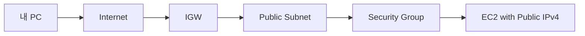

# 1. Security Group이 하는 일

## 1. SG는 ENI 수준의 트래픽 제어다

Security Group(SG)은 EC2 인스턴스에 붙는 방화벽처럼 보이지만, 정확히는 ENI(Elastic Network Interface)에 적용되는 규칙 집합이다. 인스턴스가 어떤 네트워크 트래픽을 받을 수 있는지(또는 내보낼 수 있는지)를 Inbound/Outbound 규칙으로 정의한다.

### ① Stateful이다

SG는 stateful이다. Inbound에서 허용된 연결의 응답은 Outbound 규칙을 별도로 열지 않아도 자동 허용된다.

[이미지: 네트워크 흐름 - SG stateful 예시 - SSH 허용 시 응답 트래픽 자동 허용]

이 특성 때문에 SG는 "애플리케이션 접근 제어"의 기본 도구로 쓰인다. 운영에서 가장 먼저 만지는 트래픽 제어 지점이 SG인 이유다.

### ② Allow 규칙만 존재한다

SG에는 Deny 규칙이 없다. 차단은 "허용하지 않음"으로 표현된다. 따라서 설계는 필요한 것만 열고, 나머지는 기본적으로 막는 형태가 된다.

---

# 2. SG로 무엇을 통제하는가

## 1. Port 기반 제어(SSH, HTTP)

가장 흔한 SG 제어는 포트 기반이다.

- SSH(22): 운영 접근 경로
- HTTP/HTTPS(80/443): 웹 트래픽
- 애플리케이션 포트(예: 8080): 내부 또는 ALB 경유 접근

## 2. Protocol 기반 제어(ICMP)

ICMP(ping)는 운영에서 "네트워크가 살아 있는가"를 확인하는 도구로 쓰인다. 다만 운영 정책상 ICMP를 막는 경우도 많다. 이 Section의 목표는 ICMP를 열고 닫으면서 "SG가 실제로 트래픽을 제어한다"를 체감하는 것이다.

---

# 3. 실무 관점의 기본 규칙

## 1. SSH는 내 IP(또는 Session Manager)로 제한한다

SSH는 0.0.0.0/0로 열지 않는다. 최소한 내 IP(CIDR)로 제한하고, 운영형으로는 Session Manager(SSM) 같은 관리 경로를 둔다.

## 2. 웹 트래픽은 엔드포인트(ALB) 중심으로 제어한다

Public EC2로 직접 노출하기보다, Public 엔드포인트는 ALB로 두고 애플리케이션 서버는 Private Subnet으로 숨기는 패턴이 표준이다. 이 연결은 Ch05에서 완성한다.

---

# 핵심 정리

- SG는 ENI 수준의 트래픽 제어이며 Inbound/Outbound 규칙으로 접근을 통제한다.
- SG는 stateful이며 Allow 규칙만 가진다.
- SSH는 내 IP로 제한하고, 운영형으로는 Session Manager(SSM) 같은 관리 경로를 둔다.
- ICMP(ping) 허용/차단은 SG 동작을 빠르게 체감하는 검증 도구다.

---

# [실습] lab13: Security Group 트래픽 제어(ICMP, SSH)

Public Subnet의 EC2에 대해 SG 규칙을 바꿔가며 ICMP(ping)와 SSH 접속 허용/차단을 확인한다. "SG가 트래픽을 제어한다"는 사실을 가장 단순한 방법으로 검증한다.

---

### 실습 목표

- Public Subnet EC2를 준비하고 SG를 연결한다.
- ICMP 허용/차단에 따라 ping 결과가 달라지는 것을 확인한다.
- SSH(22) 허용/차단에 따라 접속 가능 여부가 달라지는 것을 확인한다.

⚠️ 비용 주의: SG 자체 비용은 없지만, 검증용 EC2를 생성할 수 있다. 실습 종료 시 불필요 인스턴스를 정리한다.

---

# 1. 전체 아키텍처



이 실습은 SG가 "인스턴스로 들어오는 트래픽"을 제어한다는 것을 확인한다. 같은 인스턴스라도 SG 규칙이 바뀌면 ping/ssh 결과가 즉시 달라진다.

---

# 2. 사전 준비

- 리전: `ap-northeast-2 (Seoul)`
- `lab12` 완료(IGW/Route Table로 Public Subnet 인터넷 경로 구성)
- Key Pair 준비
- 내 IP 확인: **{your-ip-or-cidr}**

---

# 3. 리소스 생성 및 설정 (생성 + 연결)

각 단계에서 AWS Console 화면 스냅샷을 반드시 명시한다.

## 1. Security Group 생성(초기: SSH + ICMP 허용)

설명: ping/ssh 검증을 위해 Inbound 규칙을 갖는 SG를 만든다.

[이미지: AWS Console - EC2 - Security Groups - Create security group 화면 - VPC 선택/Name 입력]
[이미지: AWS Console - EC2 - Security Groups - Inbound rules - SSH/ICMP 규칙 추가 화면]

설정 포인트(예시):

- Name: **{sg-name}** (예: `fundamentals-sg-traffic-control`)
- Inbound
  - SSH(22) from **{your-ip-or-cidr}**
  - ICMP - IPv4(Echo Request) from **{your-ip-or-cidr}**

## 2. EC2 생성(Public Subnet)

설명: Public IPv4를 가진 인스턴스를 만들어 내 PC에서 ping/ssh로 접근한다.

[이미지: AWS Console - EC2 - Launch instance - Network settings - Public Subnet/Auto-assign public IP 확인]

설정 포인트(예시):

- Subnet: **{public-subnet-id}**
- Auto-assign public IP: Enabled
- SG: `**{sg-id}**`

---

# 4. 실행 및 결과 검증

설명: SG 규칙 변경에 따라 ping/ssh 결과가 달라지는 것을 확인한다.

## 1. ping 동작 확인(ICMP 허용 상태)

[이미지: 터미널 - ping 실행 - 응답 확인]

예시:

```bash
ping **{ec2-public-ip}**
```

## 2. ICMP 차단 후 ping 실패 확인

[이미지: AWS Console - EC2 - SG Inbound rules - ICMP 규칙 제거 화면]
[이미지: 터미널 - ping timeout 또는 no response 확인]

## 3. SSH 접속 확인(SSH 허용 상태)

[이미지: 터미널 - ssh 접속 성공]

예시:

```bash
ssh -i **{path-to-key.pem}** ec2-user@**{ec2-public-ip}**
```

## 4. SSH 차단 후 접속 실패 확인

[이미지: AWS Console - EC2 - SG Inbound rules - SSH 규칙 제거 화면]
[이미지: 터미널 - ssh timeout 또는 connection refused 확인]

⚠️ 주의:

- "차단이 되었는가"는 콘솔에서 로그로 보이기보다, 클라이언트 타임아웃 형태로 체감되는 경우가 많다.

---

# 5. 자원 정리

다음 Lab(NACL 실험)에서 같은 EC2/SG를 재사용한다면 유지한다.

정리가 필요한 경우 다음을 정리한다.

- EC2 종료/삭제
- Security Group 삭제

[이미지: AWS Console - EC2 - Terminate instance - 종료 확인]
[이미지: AWS Console - EC2 - Security Groups - Delete security group - 삭제 확인]

⚠️ 주의:

- SG는 연결된 ENI가 있으면 삭제할 수 없다. 먼저 EC2를 종료한다.

---

# 참고 자료

- [Security groups (AWS)](https://docs.aws.amazon.com/vpc/latest/userguide/vpc-security-groups.html)
- [Security group rules (AWS)](https://docs.aws.amazon.com/vpc/latest/userguide/security-group-rules.html)
