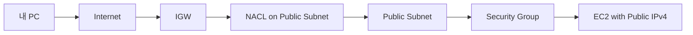

# 1. Network ACL(NACL)의 역할

## 1. NACL은 Subnet 수준의 트래픽 제어다

Network ACL(NACL)은 Subnet에 적용되는 방화벽이다. Subnet 경계에서 들어오고 나가는 트래픽을 제어한다.

### ① Stateless이다

NACL은 stateless다. 요청과 응답이 별개로 평가된다. 따라서 Inbound에서 허용된 요청도, 응답이 나가려면 Outbound 규칙이 맞아야 한다.

[이미지: 네트워크 흐름 - NACL stateless 예시 - SSH 요청 허용만으로는 응답 경로가 자동 보장되지 않음]

이 차이가 SG(stateful)와 NACL(stateless)을 구분하는 핵심이다. SG에서 되는 통신이 NACL에서 깨질 수 있는 이유가 여기 있다.

### ② Allow/Deny가 모두 존재하고, 번호 순서로 평가된다

NACL은 규칙 번호가 낮은 것부터 평가되고, 첫 매칭 규칙이 Allow/Deny를 결정한다.

[이미지: AWS Console - VPC - Network ACLs - Inbound rules - Rule number/Allow/Deny 평가 순서 확인]

---

# 2. SG와 NACL의 범위 차이

## 1. SG는 인스턴스(ENI), NACL은 Subnet이다

트래픽 제어의 목적은 같아 보이지만 범위가 다르다.

- SG: 인스턴스(ENI) 단위의 접근 제어(기본 도구)
- NACL: Subnet 단위의 추가 보안 계층(정책/보안 경계 강화)

## 2. 이 시리즈에서의 결론

이 시리즈의 실습 수준에서 "트래픽 제어" 목적은 주로 SG로 달성한다. NACL은 다음을 이해하기 위해 다룬다.

- stateless라는 특성
- Subnet 경계에서 제어할 수 있다는 범위 차이
- SG로는 허용했는데도 NACL에서 막힐 수 있다는 현실

---

# 3. Ephemeral port(개요)

## 1. NACL에서는 응답 트래픽을 고려해야 한다

클라이언트는 임시 포트(ephemeral port)를 사용한다. NACL은 stateless이므로, "요청 포트만 열면 끝"이 아니다. 응답이 돌아갈 포트 범위가 Outbound에서 허용되어야 한다.

이 Section은 포트 범위를 외우는 것이 목적이 아니다. "왜 SG는 되는데 NACL에서 깨질 수 있는가"를 흐름으로 설명할 수 있게 만드는 것이 목적이다.

---

# 핵심 정리

- NACL은 Subnet 수준의 stateless 방화벽이며 Allow/Deny를 번호 순서로 평가한다.
- SG는 ENI 수준의 stateful 방화벽이며 실무에서 기본 도구다.
- 이 시리즈에서는 트래픽 제어는 주로 SG로 하고, NACL은 범위/특성 차이를 체감하는 수준으로 다룬다.

---

# [실습] lab14: NACL 트래픽 제어 실험(SG 허용, NACL 차단)

`lab13`에서 SG로 허용한 SSH/ICMP 트래픽을, NACL에서 차단해 통신이 실패하는 것을 확인한다. 같은 인스턴스라도 "Subnet 경계(NACL)"에서 막히면 접근이 되지 않는다는 차이를 체감한다.

---

### 실습 목표

- Public Subnet에 적용할 NACL을 생성하고 association한다.
- SG는 허용 상태로 두고, NACL 규칙만 바꿔 SSH/ICMP를 차단한다.
- NACL 규칙을 원복해 통신이 복구되는 것을 확인한다.

⚠️ 비용 주의: NACL 자체 비용은 없다. 다만 이 실습은 `lab13`의 EC2를 재사용하므로 EC2 비용이 누적될 수 있다.

---

# 1. 전체 아키텍처

이 실습은 "SG는 허용인데도 NACL에서 막히면 접근이 안 된다"를 확인한다. 목적은 운영형 NACL 설계가 아니라, 범위와 특성 차이를 체감하는 것이다.

---

# 2. 사전 준비

- 리전: `ap-northeast-2 (Seoul)`
- `lab13` 완료
  - Public Subnet EC2 1대와 SG가 준비되어 있어야 한다(SSH/ICMP 허용 상태)

⚠️ 주의:

- 이 실습은 의도적으로 통신을 끊는다. 실습 종료 시 반드시 원복한다.

---

# 3. 리소스 생성 및 설정 (생성 + 연결)

각 단계에서 AWS Console 화면 스냅샷을 반드시 명시한다.

## 1. NACL 생성

설명: Public Subnet 경계에서 트래픽을 제어할 NACL을 만든다.

[이미지: AWS Console - VPC - Network ACLs - Create network ACL 화면 - VPC 선택/Name 입력]

설정 포인트(예시):

- Name: **{nacl-name}** (예: `fundamentals-nacl-public`)
- VPC: **{vpc-id}**

## 2. Public Subnet association

설명: `lab13`에서 사용한 Public Subnet을 이 NACL에 연결한다.

[이미지: AWS Console - VPC - Network ACLs - Subnet associations - Edit subnet associations 화면 - Public Subnet 선택]

## 3. (기본) Allow 규칙 확인

설명: 기본 NACL은 대체로 allow all 형태다. 실험을 위해 현재 규칙 상태를 확인한다.

[이미지: AWS Console - VPC - Network ACLs - Inbound rules - 현재 규칙 확인]
[이미지: AWS Console - VPC - Network ACLs - Outbound rules - 현재 규칙 확인]

## 4. SSH 차단 규칙 추가(Deny 22)

설명: SG는 SSH를 허용한 상태로 두고, NACL Inbound에서 22를 Deny해 접속이 끊기는지 확인한다.

[이미지: AWS Console - VPC - Network ACLs - Inbound rules - Edit inbound rules - TCP 22 Deny 추가]

설정 포인트(예시):

- Rule number: 100
- Type: SSH(22)
- Source: **{your-ip-or-cidr}**
- Allow/Deny: Deny

## 5. (선택) ICMP 차단 규칙 추가

설명: ping 차단도 같은 방식으로 확인할 수 있다.

[이미지: AWS Console - VPC - Network ACLs - Inbound rules - ICMP Deny 추가 화면]

⚠️ 주의:

- ICMP 규칙(type/code)은 환경에 따라 표현이 다를 수 있다. SSH 차단만으로도 목표(범위 차이)는 충분히 달성된다.

---

# 4. 실행 및 결과 검증

설명: SG는 허용인데, NACL Deny 규칙 때문에 통신이 실패하면 성공이다.

## 1. SSH 실패 확인(NACL Deny 상태)

[이미지: 터미널 - ssh 접속 실패(timeout) 확인]

## 2. NACL 원복 후 SSH 복구 확인

[이미지: AWS Console - VPC - Network ACLs - Inbound rules - Deny 규칙 제거 화면]
[이미지: 터미널 - ssh 접속 성공 확인]

---

# 5. 자원 정리

실습 환경을 안정화하기 위해 NACL을 원복한다.

- (권장) Public Subnet association을 기본 NACL로 되돌린다
- (선택) 실험용 NACL 삭제

[이미지: AWS Console - VPC - Network ACLs - Subnet associations - 기본 NACL로 재연결 화면]
[이미지: AWS Console - VPC - Network ACLs - Delete network ACL - 삭제 확인]

⚠️ 주의:

- association을 되돌리지 않으면 이후 실습에서 예기치 않게 트래픽이 막힐 수 있다.

---

# 참고 자료

- [Network ACLs (AWS)](https://docs.aws.amazon.com/vpc/latest/userguide/vpc-network-acls.html)
- [Security groups vs network ACLs (AWS)](https://docs.aws.amazon.com/vpc/latest/userguide/VPC_Security.html)
