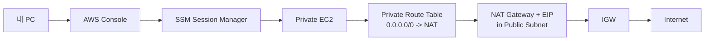

# 1. NAT Gateway가 해결하는 문제

## 1. Private Subnet의 Outbound 필요

Private Subnet은 외부에서 직접 접근(Inbound)을 막기 위한 격리 경계다. 그러나 운영에서는 Private 인스턴스도 외부로 나가야 하는 순간이 생긴다.

- OS 패키지 설치/업데이트
- 애플리케이션 의존성 다운로드
- 외부 API 호출

이때 필요한 것이 Outbound 경로이며, 대표 리소스가 NAT Gateway다.

### ② VPC Endpoint의 한계와 NAT의 역할

앞 Section(04.05)에서 VPC Endpoint로 "Private에서 필요한 AWS 서비스"에 연결하는 방법을 다뤘다. 하지만 VPC Endpoint는 서비스별 연결이며, 다음 같은 범용 요구를 해결하지 못한다.

- OS 패키지 설치/업데이트
- Git clone 등 외부 네트워크 접근
- 외부 API 호출

이런 "인터넷 전체로의 Outbound"가 필요해지는 순간, NAT Gateway가 범용 해법이 된다.

### ① NAT는 Inbound를 열지 않는다

NAT(Network Address Translation)는 사설 IP 트래픽을 공인 IP로 변환해 외부 통신을 가능하게 한다. 핵심은 다음이다.

- Private 인스턴스는 외부로 나갈 수 있다
- 외부에서 Private 인스턴스로 신규 연결을 시작할 수는 없다

즉, NAT는 "격리를 유지한 채 Outbound만 연다"는 목표에 맞는 리소스다.

---

# 2. NAT Gateway 구성 요소

## 1. NAT Gateway는 Public Subnet에 둔다

NAT Gateway는 인터넷으로 나가야 하므로, IGW 경로가 있는 Public Subnet에 배치한다.

## 2. Elastic IP가 필요하다

NAT Gateway는 공인 출구 IP가 필요하므로 Elastic IP(EIP)를 연결한다. 이 EIP가 Private 인스턴스의 Outbound 트래픽이 나가는 공인 IP가 된다.

[이미지: 네트워크 구조 - Private Subnet -> Private RT(0.0.0.0/0 -> NAT) -> NAT(EIP) -> IGW -> Internet]

이 구조는 Private Subnet의 `0.0.0.0/0` Target이 IGW가 아니라 NAT Gateway라는 점을 강조한다. 인터넷으로 나가지만 직접 출구가 아니라 대리 출구를 통해 나간다.

---

# 3. 비용 고려사항

## 1. NAT Gateway는 비용이 빠르게 누적된다

NAT Gateway는 시간당 비용과 데이터 처리 비용이 발생한다. 실습에서 NAT를 만든 순간부터 비용이 발생하므로, 유지/삭제 기준을 명확히 해야 한다.

---

# 핵심 정리

- NAT Gateway는 Private Subnet 인스턴스의 Outbound를 가능하게 하지만 Inbound를 열지는 않는다.
- NAT Gateway는 Public Subnet에 배치하고 EIP를 연결한다.
- Private Route Table의 `0.0.0.0/0` Target은 NAT Gateway가 된다.
- NAT Gateway는 비용이 누적되므로 실습 종료 시 정리 기준이 필수다.
- VPC Endpoint는 서비스별 연결이고, NAT Gateway는 범용 Outbound 연결이다. 둘은 대체 관계가 아니라 목적이 다르다.

---

# [실습] lab16: NAT Gateway 구성과 Private EC2 Outbound 검증

Public Subnet에 NAT Gateway(EIP)를 생성하고, Private Route Table에 `0.0.0.0/0 -> NAT` 라우트를 추가한다. Private EC2에서 인터넷 Outbound가 되는지 확인하고, 동시에 NAT가 Inbound를 열지 않는다는 것을 확인한다. 또한 NAT가 생기면 VPC Endpoint 없이도 Session Manager(SSM)가 동작할 수 있음을 개념적으로 정리한다.

---

### 실습 목표

- NAT Gateway(EIP)를 생성한다.
- Private Route Table에 NAT 라우트를 추가한다.
- Private EC2에서 인터넷 Outbound가 되는지 확인한다.
- NAT가 Inbound를 열지 않는다는 것을 확인한다(Private는 여전히 직접 접근 불가).
- (선택) NAT가 있으면 VPC Endpoint 없이도 SSM 운영 접속이 가능하다는 점을 확인한다.

⚠️ 비용 주의: NAT Gateway는 시간당 비용과 데이터 처리 비용이 발생한다. 실습이 끝나면 NAT Gateway와 EIP를 정리하거나, 다음 Chapter까지 계속 쓸지 결정한다.

---

# 1. 전체 아키텍처



이 실습은 "Private EC2가 인터넷으로 나갈 수 있다"를 확인한다. 하지만 NAT는 Outbound만 열기 때문에 외부에서 Private EC2로 신규 연결을 시작하는 문제(Inbound)는 해결되지 않는다.

---

# 2. 사전 준비

- 리전: `ap-northeast-2 (Seoul)`
- `lab15` 완료
  - Private EC2가 준비되어 있고 Session Manager로 접속 가능해야 한다
  - Private Route Table이 Private Subnet에 association된 상태여야 한다(local route만)

⚠️ 주의:

- `lab15`에서 만든 VPC Endpoint를 유지해도 되고, NAT 구성 후에는 Endpoint 없이도 SSM이 동작할 수 있다.
  - 이 Lab에서는 NAT 구성 후 "Endpoint 없이도 SSM이 된다"는 관점을 (선택)으로 확인한다.

---

# 3. 리소스 생성 및 설정 (생성 + 연결)

각 단계에서 AWS Console 화면 스냅샷을 반드시 명시한다.

## 1. Elastic IP 할당

설명: NAT Gateway의 공인 출구 IP(EIP)를 준비한다.

[이미지: AWS Console - EC2 - Elastic IP addresses - Allocate Elastic IP - 할당 확인]

## 2. NAT Gateway 생성(Public Subnet)

설명: Public Subnet에 NAT Gateway를 만들고 EIP를 연결한다.

[이미지: AWS Console - VPC - NAT gateways - Create NAT gateway - Public Subnet/EIP 선택]

설정 포인트(예시):

- Subnet: **{public-subnet-id}**
- Elastic IP allocation ID: **{eip-allocation-id}**
- Name: **{natgw-name}**

## 3. Private Route Table에 NAT 라우트 추가

설명: Private Subnet Outbound를 NAT로 보내도록 `0.0.0.0/0` 라우트를 추가한다.

[이미지: AWS Console - VPC - Route tables - Private RT - Routes - Edit routes - 0.0.0.0/0 -> NAT]

## 4. (선택) VPC Endpoint 유지/삭제 판단

설명: NAT가 준비되면 SSM Agent는 인터넷(SSM public endpoint) 방향으로도 통신할 수 있다. 비용/운영 관점에서 VPC Endpoint를 유지할지, NAT만으로 운영할지 선택한다.

[이미지: AWS Console - VPC - Endpoints - ssm/ssmmessages/ec2messages Endpoint 목록 확인]

---

# 4. 실행 및 결과 검증

설명: Private EC2에서 인터넷 Outbound가 되고, NAT가 Inbound를 열지 않는다는 것을 확인하면 성공이다.

## 1. Session Manager로 Private EC2 접속

[이미지: AWS Console - EC2 - Connect - Session Manager - Connected 확인]

## 2. Private EC2에서 인터넷 Outbound 확인

[이미지: 터미널 - Private EC2 - curl 성공]

예시:

```bash
curl -I https://aws.amazon.com
```

## 3. Inbound가 여전히 불가능한 상태 확인

[이미지: AWS Console - EC2 - Instance summary - Public IPv4 없음 확인]
[이미지: 내 PC 브라우저 - Private IP로는 접근 불가(라우팅 경로 없음) 확인]

정리:

- NAT는 Outbound만 열어준다.
- 외부에서 접근 가능한 엔드포인트는 필요하며, 표준은 ALB다.
- 다음 Chapter에서 ALB를 통해 "Private에 있는 앱에 외부에서 접근"하는 경로를 만든다.

## 4. (선택) VPC Endpoint 없이도 Session Manager가 되는지 확인

설명: VPC Endpoint를 삭제(또는 비활성)해도, NAT가 있다면 SSM Agent는 인터넷 방향으로 통신할 수 있다. 즉 "운영 접속 경로"는 VPC Endpoint만이 유일한 해법은 아니다.

[이미지: AWS Console - VPC - Endpoints - Endpoint 삭제 화면(선택)]
[이미지: AWS Console - EC2 - Connect - Session Manager - 재접속 성공 확인]

---

# 5. 자원 정리

다음 Chapter(ALB)로 이어서 진행한다면 NAT와 인스턴스를 유지할 수 있다.

정리가 필요한 경우 다음을 정리한다.

- NAT Gateway 삭제
- Elastic IP 릴리스

[이미지: AWS Console - VPC - NAT gateways - Delete NAT gateway - 삭제 확인]
[이미지: AWS Console - EC2 - Elastic IP addresses - Release address - 릴리스 확인]

⚠️ 주의:

- NAT Gateway 삭제가 완료되어야 EIP를 릴리스할 수 있다.

---

# 참고 자료

- [NAT gateways (AWS)](https://docs.aws.amazon.com/vpc/latest/userguide/vpc-nat-gateway.html)
- [NAT gateway pricing (AWS)](https://aws.amazon.com/vpc/pricing/)
