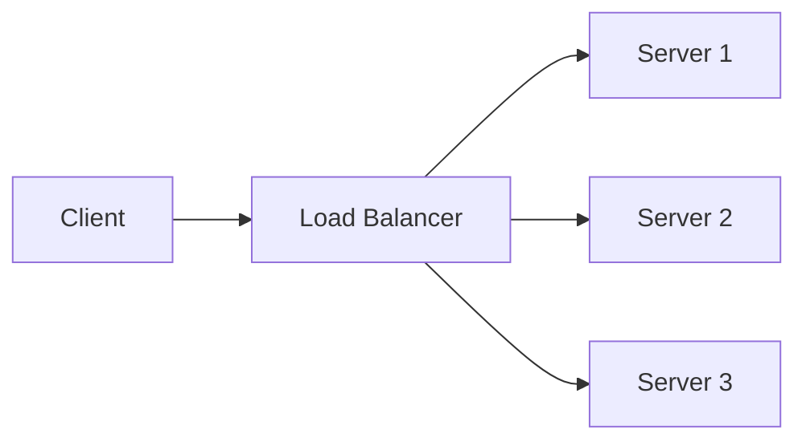
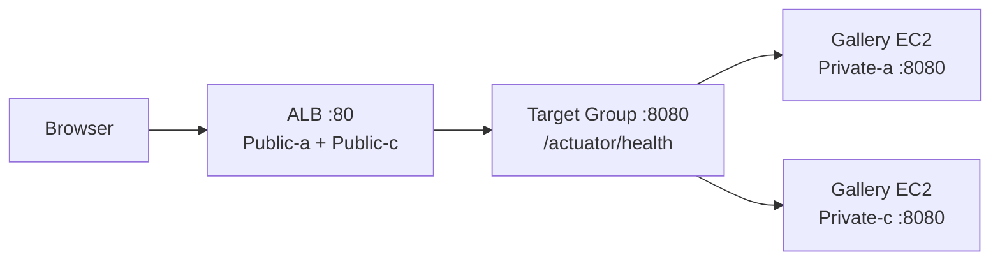

# 1. Load Balancing이 필요한 이유

## 1. 트래픽 분산, 고가용성, 장애 격리

서버가 1대일 때는 "요청 -> 서버"로 끝나지만, 운영 관점에서는 다음 요구사항이 빠르게 생긴다.

- 트래픽이 몰릴 때 수평 확장(서버 추가)
- 서버 1대 장애 시 서비스 지속(고가용성)
- 배포/장애를 한 서버에 격리(롤링 업데이트, 점진적 교체)

Load Balancer는 이 요구를 "진입점(Endpoint) 1개" 뒤에 서버 여러 대를 두는 방식으로 해결한다.



이 구조의 핵심은 "서버는 늘고 줄어도, 진입점은 바뀌지 않는다"는 점이다. 이후 Auto Scaling과 연결되면, 서버 수가 자동으로 변해도 서비스 접근 경로가 유지된다.

## 2. ELB 유형과 본 시리즈의 범위

AWS의 Elastic Load Balancing(ELB)은 크게 다음 유형이 있다.

- ALB(Application Load Balancer): HTTP/HTTPS, Layer 7
- NLB(Network Load Balancer): TCP/UDP, Layer 4
- GLB(Gateway Load Balancer): 네트워크/보안 어플라이언스 연결(L3/L4 패턴)

CLB(Classic Load Balancer)는 레거시이므로 본 시리즈에서는 다루지 않는다.

### ① ALB vs NLB vs GLB: 언제 무엇을 쓰는가

이 시리즈 관점에서 핵심 차이는 "내 트래픽이 무엇인가"다.

- ALB: HTTP 앱을 운영할 때 기본 선택
  - Host/Path 기반 라우팅, 리다이렉트, 헤더 기반 Rule 같은 L7 기능
  - HTTP Health check(`/actuator/health` 같은 경로)를 "정상 상태"로 정의할 수 있음
- NLB: TCP/UDP 레벨에서 연결을 빠르고 단순하게 분산할 때 선택
  - 고정 IP(EIP) 또는 Static IP가 필요할 때 유리
  - 소스 IP 보존 같은 네트워크 요구가 중심인 경우가 많음
- GLB: 방화벽/IDS/IPS 같은 네트워크 어플라이언스를 인라인으로 붙이는 목적
  - 애플리케이션 분산이 아니라 "트래픽 검사/전달" 계층에 가깝다

### ② 왜 앱 개발 환경에서는 ALB가 선호되는가

일반적인 웹 애플리케이션 배포 환경에서는 L7 기준선이 중요하다.

- 서비스가 "HTTP 요청/응답"으로 모델링된다(상태 코드, 경로, 헤더, 리다이렉트)
- 운영에서 Health check는 "프로세스가 떠 있다"가 아니라 "서비스가 살아 있다"로 정의된다
  - 예: `/actuator/health`가 200을 준다
- 이후 확장(ASG, Route 53, WAF, 인증/권한)과의 연결도 ALB 기준으로 설명하기 쉽다

따라서 AWS Fundamentals에서는 ELB를 개관하되, 실습은 ALB를 중심으로 진행한다.

---

# 2. ALB의 구성 요소

## 1. Listener, Rule, Target Group

ALB는 요청을 받는 Listener와, 그 요청을 어디로 보낼지 정의하는 Rule, 그리고 실제 요청을 처리할 Target들의 묶음(Target Group)으로 구성된다.

[이미지: AWS Console - EC2 - Load Balancers - Listener/Rules 화면 - 요청이 Target Group으로 Forward되는 지점]

이 화면은 "포트/프로토콜로 들어온 요청이 어떤 조건으로 라우팅되는지"를 보여준다. 기본은 HTTP:80에서 하나의 Target Group으로 Forward하는 단순 구성을 만든다.

## 2. Target Group의 Target type

Target Group은 어떤 대상을 Target으로 취급할지 유형이 있다.

- Instance: EC2 인스턴스
- IP: IP 주소(예: ECS/Fargate Task)
- Lambda: Lambda 함수

Ch05에서는 Instance Target Group을 다룬다. Ch08(ECS)에서는 Target type IP가 핵심이 된다.

---

# 3. Health check가 의미하는 것

## 1. Health check는 트래픽 전달 가능 여부의 기준이다

ALB는 Target Group health check로 Target의 정상/비정상을 판단한다. Target이 비정상(Unhealthy)으로 판정되면, ALB는 그 Target으로 트래픽을 보내지 않는다.

### ① 헬스 체크가 잘못되면 "정상인데 차단"이 된다

- 경로가 잘못됐다(예: `/health`가 없는데 `/health`로 체크)
- 포트가 다르다(서버는 8080인데 80으로 체크)
- 응답 시간이 길다(Timeout)

[이미지: AWS Console - EC2 - Target Groups - Health checks 설정 화면 - Path/Port/Threshold 확인 포인트]

헬스 체크는 단순 기능이 아니라, "정상 상태"를 정의하는 운영 규칙이다. 이 규칙이 틀리면 트래픽이 한 대도 못 받는 상황이 발생한다.

---

# 4. 실무 표준 패턴: ALB는 Public, EC2는 Private

## 1. 외부 노출을 ALB로 제한한다

실무에서 흔한 패턴은 다음이다.

- ALB: Public Subnet(인터넷에서 접근 가능)
- EC2: Private Subnet(ALB를 통해서만 접근)

[이미지: 네트워크 구조 - Public Subnet의 ALB -> Private Subnet의 EC2(Target) - SG는 ALB SG만 허용]

이 패턴은 공격 표면을 줄이고, 접근 경로를 표준화한다. EC2가 직접 Public IPv4를 갖지 않아도, ALB가 요청을 전달할 수 있다.

---

# 핵심 정리

- Load Balancer는 트래픽 분산과 고가용성을 위해 "진입점 1개" 뒤에 서버 여러 대를 둔다.
- ELB는 ALB/NLB/GLB로 나뉘며, 트래픽 성격(HTTP vs TCP/UDP vs 어플라이언스)에 따라 선택이 달라진다.
- ALB는 Listener/Rule/Target Group으로 구성되며, HTTP/HTTPS 라우팅의 기본이 된다.
- Health check는 "정상 상태"의 정의이며 잘못되면 모든 Target이 Unhealthy가 될 수 있다.
- 실무 표준은 ALB는 Public, 서버는 Private로 두어 외부 노출을 ALB로 제한하는 구조다.

---

# [실습] Gallery: ALB와 Target Group 구성

Gallery를 Target으로 두고 ALB와 Target Group을 구성한다. Health check는 `/actuator/health`, Target port는 `8080`으로 고정한다. 이 Lab은 "ALB가 Public 엔드포인트, 애플리케이션은 Private Subnet"인 실무 표준 패턴을 Gallery로 체감하는 것이 목표다.

---

### 실습 목표

- Gallery용 Target Group(Instance, port 8080)을 만들고 Health check(`/actuator/health`)를 설정한다.
- Public Subnet(AZ-a, AZ-c)에 ALB를 만들고 HTTP:80 -> Target Group으로 연결한다.
- Private Subnet(AZ-a, AZ-c)에 Gallery EC2 2대를 배치하고 Target으로 등록한다.
- 브라우저에서 ALB DNS로 접근해, 응답에서 instance-id가 바뀌는 것을 확인한다.

⚠️ 비용 주의: ALB는 시간당 비용과 LCU 비용이 발생한다. 이 Lab에서는 NAT Gateway도 추가로 만들 수 있으므로 비용이 누적될 수 있다.

---

# 1. 전체 아키텍처



이 실습은 "Public 엔드포인트는 ALB로, 애플리케이션은 Private Subnet으로"를 Gallery로 완성한다. 인스턴스는 Public IPv4 없이도 정상 응답할 수 있다.

---

# 2. 사전 준비

- 리전: `ap-northeast-2 (Seoul)`
- `Lab: Gallery - Custom VPC 이전(04.07)` 완료(권장)
  - `aws-fund-gallery-vpc (10.10.0.0/16)`
  - AZ-a에 `aws-fund-gallery-subnet-public-a`, `aws-fund-gallery-subnet-private-a`
  - `aws-fund-gallery-natgw-a` (Gallery 빌드/실행을 위한 Outbound)
- Golden AMI 준비: `aws-fund-golden-image-v1` (`lab09` 기반)

⚠️ 주의:

- 이 Lab에서는 AZ-c에도 Private EC2를 만들고 Gallery를 빌드해야 한다. 따라서 AZ-c에도 NAT Outbound가 필요하며, `aws-fund-gallery-natgw-c`를 추가로 구성한다.

---

# 3. 리소스 생성 및 설정 (생성 + 연결)

각 단계에서 AWS Console 화면 스냅샷을 반드시 명시한다.

## 1. Subnet 추가 생성(AZ-c)

설명: ALB/ASG의 Multi-AZ 구성을 위해 AZ-c에 Public/Private Subnet 1쌍을 추가한다.

[이미지: AWS Console - VPC - Subnets - Create subnet - AZ-c 선택]

이름/CIDR 예시:

- Public-c: `aws-fund-gallery-subnet-public-c`, `10.10.2.0/24`
- Private-c: `aws-fund-gallery-subnet-private-c`, `10.10.102.0/24`

## 2. Public Route Table association(Public-c)

설명: Public-c Subnet이 IGW 경로를 갖도록, Public Route Table에 association한다.

[이미지: AWS Console - VPC - Route tables - aws-fund-gallery-rt-public - Subnet associations - public-c 연결]

## 3. NAT Gateway 구성(AZ-c)

설명: Private-c 인스턴스가 Outbound로 소스 다운로드/빌드를 할 수 있도록 NAT Gateway를 AZ-c에 추가한다.

[이미지: AWS Console - EC2 - Elastic IP - Allocate - aws-fund-gallery-eip-natgw-c]
[이미지: AWS Console - VPC - NAT gateways - Create - Subnet=public-c + EIP 연결]

이름 예시:

- EIP: `aws-fund-gallery-eip-natgw-c`
- NAT GW: `aws-fund-gallery-natgw-c`

## 4. Private Route Table 생성/association + NAT 라우트 추가(Private-c)

설명: Private-c 전용 Route Table을 만들고, `0.0.0.0/0 -> aws-fund-gallery-natgw-c`로 Outbound를 연다.

[이미지: AWS Console - VPC - Route tables - Create - aws-fund-gallery-rt-private-c]
[이미지: AWS Console - VPC - Route tables - Subnet associations - private-c 연결]
[이미지: AWS Console - VPC - Route tables - Routes - 0.0.0.0/0 -> NATGW-c 추가]

## 5. Security Group 생성(ALB SG, Gallery EC2 SG)

설명: 외부 노출은 ALB로만 하고, Gallery EC2는 ALB에서만 8080을 받는다.

[이미지: AWS Console - EC2 - Security Groups - Create - ALB SG]
[이미지: AWS Console - EC2 - Security Groups - Create - Gallery EC2 SG]

설정 예시:

- ALB SG: `aws-fund-gallery-sg-alb`
  - Inbound: HTTP(80) from `0.0.0.0/0`
- Gallery EC2 SG: `aws-fund-gallery-sg-gallery`
  - Inbound: TCP(8080) from `aws-fund-gallery-sg-alb`

⚠️ 주의:

- Gallery EC2 SG inbound에 8080을 `0.0.0.0/0`로 열지 않는다.

## 6. Target Group 생성(Instance, port 8080)

설명: ALB가 전달할 대상 그룹을 Gallery 포트(8080)로 만든다.

[이미지: AWS Console - EC2 - Target Groups - Create - Instance/HTTP/8080]
[이미지: AWS Console - EC2 - Target Groups - Health checks - /actuator/health 설정]

설정 예시:

- Protocol: HTTP
- Port: `8080`
- Health check path: `/actuator/health`

## 7. ALB 생성(Internet-facing)

설명: ALB를 Public Subnet(AZ-a, AZ-c)에 배치하고, HTTP:80 Listener가 Target Group으로 Forward하도록 만든다.

[이미지: AWS Console - EC2 - Load Balancers - Create ALB]
[이미지: AWS Console - EC2 - Load Balancers - Network mapping - public-a/public-c 선택]
[이미지: AWS Console - EC2 - Load Balancers - Listeners and routing - Forward to TG 선택]

## 8. Gallery EC2 2대 생성(Private-a, Private-c)

설명: Golden AMI + user data로 Gallery를 자동으로 빌드/실행하는 인스턴스를 2대 만든다.

[이미지: AWS Console - EC2 - Launch instance - AMI=aws-fund-golden-image-v1 선택]
[이미지: AWS Console - EC2 - Launch instance - VPC=aws-fund-gallery-vpc, Subnet=private-a/private-c 선택]
[이미지: AWS Console - EC2 - Launch instance - Key pair: None]
[이미지: AWS Console - EC2 - Launch instance - Security Group=aws-fund-gallery-sg-gallery]
[이미지: AWS Console - EC2 - Launch instance - Advanced details - IAM Role(SSM) 연결]
[이미지: AWS Console - EC2 - Launch instance - Advanced details - User data 입력]

User data 예시:

```bash
#!/bin/bash
set -euo pipefail

APP_DIR=/opt/gallery
REPO_DIR=/home/ec2-user/workspace
JAR_PATH=/opt/gallery/gallery.jar

mkdir -p "${APP_DIR}"
chown -R ec2-user:ec2-user "${APP_DIR}"

sudo -u ec2-user bash -lc "
set -euo pipefail
cd /home/ec2-user
rm -rf workspace
git clone --filter=blob:none --sparse https://github.com/kickscar/learning-series.git workspace
cd workspace
git sparse-checkout init --no-cone
git sparse-checkout set Cloud/Workloads/gallery-spring-boot
cd Cloud/Workloads/gallery-spring-boot
./mvnw clean package -DskipTests -Dbuild.finalName=gallery
"

cp "${REPO_DIR}/Cloud/Workloads/gallery-spring-boot/target/gallery.jar" "${JAR_PATH}"
chown ec2-user:ec2-user "${JAR_PATH}"

cat >/etc/systemd/system/gallery.service <<EOF
[Unit]
Description=Gallery Spring Boot
After=network.target

[Service]
Type=simple
User=ec2-user
WorkingDirectory=/opt/gallery
ExecStart=/usr/bin/java -jar /opt/gallery/gallery.jar --server.port=8080
Restart=always
RestartSec=5
SuccessExitStatus=143

[Install]
WantedBy=multi-user.target
EOF

systemctl daemon-reload
systemctl enable --now gallery.service
```

## 9. Target 등록 및 Health 확인

설명: Target Group에 EC2 2대를 등록하고 Healthy가 되는지 확인한다.

[이미지: AWS Console - EC2 - Target Groups - Targets - Register targets]
[이미지: AWS Console - EC2 - Target Groups - Targets - Healthy 확인]

---

# 4. 실행 및 결과 검증

## 1. ALB DNS name 확인

[이미지: AWS Console - EC2 - Load Balancers - DNS name 확인]

## 2. 브라우저 접근(분산 확인)

[이미지: 브라우저 - http://{alb-dns-name} - Gallery 응답 확인(Instance ID 표기)]

다음을 확인한다.

- Target이 2개 모두 Healthy다.
- 새로고침 시 응답에 표시되는 instance-id가 바뀐다.
- `/actuator/health`가 정상 응답한다(Health check 기준).

## 3. 애플리케이션 동작 이슈 관찰(의도된 문제)

설명: 인프라(ALB, Target Group, Multi-AZ)는 정상인데, 애플리케이션이 "상태(state)"를 로컬에 가지고 있으면 분산 환경에서 기능이 깨질 수 있다. 이 문제를 의도적으로 관찰하고, 이후 Chapter에서 "중앙화"로 해결한다.

대표 증상:

- 로컬 이미지 저장: 업로드가 성공한 것처럼 보이지만, 새로고침 시 다른 인스턴스로 라우팅되면 이미지가 안 보이거나 404가 날 수 있다.
- 로컬 DB(H2 등): 글/데이터 생성(POST) 후 리다이렉트가 발생하는 전통적인 웹앱 흐름에서, 다음 요청이 다른 인스턴스로 가면 "방금 만든 데이터"가 없는 것처럼 보일 수 있다.

[이미지: 브라우저 - 업로드/등록 동작 - 성공처럼 보이는 화면]
[이미지: 브라우저 - 새로고침 또는 재시도 - instance-id가 바뀐 상태에서 이미지/데이터가 일관되지 않은 화면]

결론:

- ALB/ASG는 트래픽을 분산하지만, 파일/DB 같은 상태를 공유해주지는 않는다.
- 해결은 "스토리지 중앙화(S3)"와 "DB 중앙화(RDS)"다. 이 시리즈는 Ch06(S3), Ch07(RDS)에서 이를 단계적으로 완성한다.

---

# 5. 자원 정리

다음 Lab(ASG, Route 53, 프로젝트 Lab)에서 ALB/Target Group을 재사용한다면 유지한다.

정리가 필요한 경우 다음을 정리한다.

- ALB 삭제
- Target Group 삭제
- Gallery EC2 2대 종료/삭제
- (선택) NAT Gateway-c + EIP 릴리스

[이미지: AWS Console - EC2 - Load Balancers - Delete load balancer - 삭제 확인]
[이미지: AWS Console - EC2 - Target Groups - Delete target group - 삭제 확인]

---

# 참고 자료

- [What is an Application Load Balancer? (AWS)](https://docs.aws.amazon.com/elasticloadbalancing/latest/application/introduction.html)
- [Target groups for ALB (AWS)](https://docs.aws.amazon.com/elasticloadbalancing/latest/application/load-balancer-target-groups.html)
- [Health checks for ALB (AWS)](https://docs.aws.amazon.com/elasticloadbalancing/latest/application/target-group-health-checks.html)
