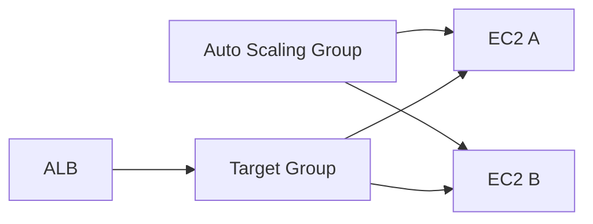
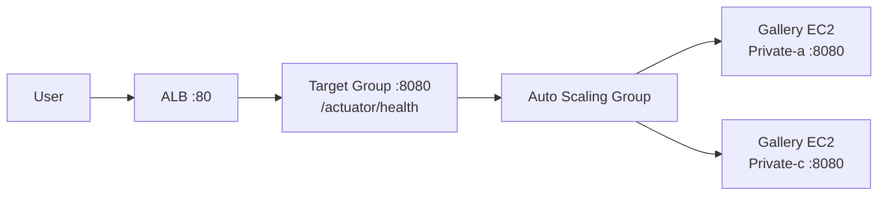

# 1. Auto Scaling이 해결하는 문제

## 1. 수요 변화와 장애에 대응한다

서버 1대는 다음 문제를 동시에 해결하기 어렵다.

- 트래픽 증가에 따른 성능 저하
- 서버 장애 시 서비스 중단

Auto Scaling은 서버 수를 자동으로 늘리고 줄이며, 장애가 난 인스턴스를 교체해 "원하는 용량"을 유지한다. Ch05에서는 Auto Scaling을 ALB 뒤에 붙여 "진입점은 고정, 서버 수는 가변" 구조를 완성한다.

---

# 2. Launch Template

## 1. "어떤 인스턴스를 만들 것인가"를 정의한다

Auto Scaling은 새로운 인스턴스를 자동 생성한다. 따라서 "새 인스턴스가 어떤 설정으로 만들어져야 하는가"를 표준화해야 한다. Launch Template이 그 역할이다.

Launch Template에 들어가는 핵심은 다음이다.

- AMI, Instance type
- Key pair(필요 시)
- Security Group
- User data(부팅 시 설정)

[이미지: AWS Console - EC2 - Launch Templates - Create launch template 화면 - AMI/SG/User data 입력 포인트]

이 설정이 흐트러지면 Auto Scaling은 인스턴스를 늘릴 수는 있어도, "동일한 서버"를 재현하지 못한다. 운영에서 Launch Template은 배포 품질의 출발점이다.

---

# 3. Auto Scaling Group(ASG)

## 1. Min/Desired/Max

ASG는 인스턴스 수를 다음 3가지 값으로 제어한다.

- Min: 최소 유지 개수
- Desired: 현재 목표 개수
- Max: 최대 확장 한도

Desired는 운영 중 변할 수 있고, Scaling policy가 Desired를 자동으로 조절한다.

## 2. Multi-AZ 배치와 ALB 연동

ASG는 여러 Subnet(AZ)에 인스턴스를 분산 배치할 수 있다. 또한 Target Group과 연동하면, ASG가 만든 인스턴스가 자동으로 Target으로 등록/해제된다.



이 구조는 "인스턴스의 생명주기(생성/종료)"가 "트래픽 전달(등록/해제)"와 연결된다는 점을 보여준다. 운영 관점에서는 이 자동 연결이 핵심이다.

---

# 4. Scaling policy(개요)

## 1. Target tracking이 가장 흔한 형태다

Scaling policy는 Desired를 자동 조절한다.

- Target tracking: CPU 50% 같은 목표를 유지하도록 조절
- Step scaling: 지표 구간에 따라 단계적으로 조절
- Scheduled scaling: 시간 기반

이 Section은 "기본 배포 흐름"을 완성하는 것이 목표이므로, 정책을 하나 구성해 구조를 이해하는 수준으로 진행한다.

---

# 핵심 정리

- Auto Scaling은 수요 변화와 장애에 대응해 인스턴스 수를 자동으로 조절한다.
- Launch Template은 Auto Scaling이 만들 인스턴스의 표준(AMI, SG, user data)이다.
- ASG는 Min/Desired/Max로 용량을 관리하고, Multi-AZ와 Target Group 연동으로 가용성을 높인다.
- Scaling policy는 Desired를 자동 조절하며, 이 Section에서는 존재와 연결 구조를 확인한다.

---

# [실습] Gallery: Auto Scaling Group

Golden AMI(`aws-fund-golden-image-v1`)와 user data로 Gallery를 부팅 시 자동 빌드/실행하도록 Launch Template을 만들고, ASG로 AZ-a/AZ-c에 분산 배치한다. Target Group 연동으로 인스턴스 등록/해제가 자동으로 이루어지는 흐름을 확인한다.

---

### 실습 목표

- Launch Template을 생성한다(AMI=golden, IAM Role=SSM, SG, user data).
- ASG를 생성한다(min:1, desired:2, max:3) (AZ-a + AZ-c).
- ASG를 Target Group에 연결한다(자동 등록/해제).
- 인스턴스 증감/교체 시 Target 등록/해제와 Health를 확인한다.

⚠️ 비용 주의: ASG 자체는 비용이 없지만, 생성되는 EC2/ALB는 비용이 발생한다. 실습 종료 시 불필요 리소스를 정리한다.

---

# 1. 전체 아키텍처



이 실습은 "서버 수가 자동으로 바뀌어도, ALB는 동일한 Target Group으로 트래픽을 전달한다"는 구조를 완성한다.

---

# 2. 사전 준비

- "Gallery: ALB와 Target Group 구성" 완료(권장)
  - Gallery용 ALB + Target Group(port 8080, `/actuator/health`)이 존재해야 한다
  - `aws-fund-gallery-vpc`에 Private Subnet(AZ-a, AZ-c)이 있어야 한다
- NAT Gateway Outbound(권장)
  - `aws-fund-gallery-natgw-a`, `aws-fund-gallery-natgw-c`
- Golden AMI: `aws-fund-golden-image-v1`

⚠️ 주의:

- "Gallery: ALB와 Target Group 구성"에서 수동으로 만든 Gallery EC2가 있다면, 이 실습에서는 ASG로 대체한다. 혼동/비용을 줄이기 위해 수동 인스턴스는 Target Group에서 제거하고 종료하는 것을 권장한다.

---

# 3. 리소스 생성 및 설정 (생성 + 연결)

각 단계에서 AWS Console 화면 스냅샷을 반드시 명시한다.

## 1. Launch Template 생성

설명: ASG가 생성할 인스턴스의 표준을 만든다.

[이미지: AWS Console - EC2 - Launch Templates - Create launch template - AMI/SG/IAM/User data 입력]

User data 예시(Gallery 부팅 시 빌드/실행):

```bash
#!/bin/bash
set -euo pipefail

APP_DIR=/opt/gallery
REPO_DIR=/home/ec2-user/workspace
JAR_PATH=/opt/gallery/gallery.jar

mkdir -p "${APP_DIR}"
chown -R ec2-user:ec2-user "${APP_DIR}"

sudo -u ec2-user bash -lc "
set -euo pipefail
cd /home/ec2-user
rm -rf workspace
git clone --filter=blob:none --sparse https://github.com/kickscar/learning-series.git workspace
cd workspace
git sparse-checkout init --no-cone
git sparse-checkout set Cloud/Workloads/gallery-spring-boot
cd Cloud/Workloads/gallery-spring-boot
./mvnw clean package -DskipTests -Dbuild.finalName=gallery
"

cp "${REPO_DIR}/Cloud/Workloads/gallery-spring-boot/target/gallery.jar" "${JAR_PATH}"
chown ec2-user:ec2-user "${JAR_PATH}"

cat >/etc/systemd/system/gallery.service <<EOF
[Unit]
Description=Gallery Spring Boot
After=network.target

[Service]
Type=simple
User=ec2-user
WorkingDirectory=/opt/gallery
ExecStart=/usr/bin/java -jar /opt/gallery/gallery.jar --server.port=8080
Restart=always
RestartSec=5
SuccessExitStatus=143

[Install]
WantedBy=multi-user.target
EOF

systemctl daemon-reload
systemctl enable --now gallery.service
```

설정 포인트(예시):

- Template name: **{lt-name}** (예: `aws-fund-gallery-lt`)
- AMI: `aws-fund-golden-image-v1`
- Key pair: None
- IAM instance profile: (SSM) `AmazonSSMManagedInstanceCore`가 포함된 Role
- SG: `aws-fund-gallery-sg-gallery` (Inbound 8080 from ALB SG)

## 2. Auto Scaling Group 생성

설명: Launch Template을 기준으로 ASG를 만들고, Private Subnet에 Multi-AZ로 배치한다.

[이미지: AWS Console - EC2 - Auto Scaling groups - Create Auto Scaling group 화면 - Launch template 선택]
[이미지: AWS Console - EC2 - Auto Scaling groups - Network - VPC/Subnet(Private) 선택]
[이미지: AWS Console - EC2 - Auto Scaling groups - Group size - min/desired/max 입력]

설정 포인트(예시):

- ASG name: **{asg-name}** (예: `aws-fund-gallery-asg`)
- Subnets: `aws-fund-gallery-subnet-private-a`, `aws-fund-gallery-subnet-private-c`
- Min: 1, Desired: 2, Max: 3

## 3. Target Group 연결(ALB 연동)

설명: ASG가 만든 인스턴스를 Target Group에 자동 등록되도록 연결한다.

[이미지: AWS Console - EC2 - Auto Scaling group - Load balancing - Attach to an existing load balancer target group 화면]

설정 포인트(예시):

- Attach to target group: `**{target-group-name}**`

## 4. (선택) Scaling policy 생성(Target tracking)

설명: CPU 같은 지표를 기준으로 Desired를 자동 조절하는 정책을 연결한다.

[이미지: AWS Console - EC2 - Auto Scaling group - Automatic scaling - Target tracking policy 설정 화면]

⚠️ 주의:

- 정책이 "언제 트리거되는가"를 실습에서 완벽히 재현하는 것은 어렵다. 이 단계의 목적은 정책이 어디에 붙고 어떤 값을 갖는지 확인하는 것이다.

---

# 4. 실행 및 결과 검증

설명: ASG가 인스턴스를 Desired만큼 만들고, Target Group에 자동 등록되며, ALB로 접근이 가능해야 한다.

## 1. ASG 인스턴스 수 확인

[이미지: AWS Console - EC2 - Auto Scaling group - Instance management - Instances 목록 - 2대 생성 확인]

## 2. Target Group 등록 상태 확인

[이미지: AWS Console - EC2 - Target Groups - Targets - ASG 인스턴스가 등록/Healthy 확인]

## 3. ALB 접근 확인

[이미지: 브라우저 - http://{alb-dns-name} - Gallery 응답 확인(Instance ID 표기)]

이때 Gallery 응답에서 instance-id가 바뀌는지 관찰한다.

## 4. (선택) Desired 변경으로 등록/해제 확인

설명: 자동 정책 대신, Desired를 수동으로 바꿔 인스턴스 생성/종료와 Target 등록/해제를 관찰한다.

[이미지: AWS Console - EC2 - Auto Scaling group - Edit - Desired 변경 화면]
[이미지: AWS Console - EC2 - Target Groups - Targets - 인스턴스 수 변동 확인]

---

# 5. 자원 정리

다음 Lab(Route 53, 프로젝트 Lab)에서 ALB/ASG를 재사용한다면 유지한다.

정리가 필요한 경우 다음을 삭제한다.

- Auto Scaling Group 삭제
- Launch Template 삭제
- (필요 시) ALB 및 Target Group 삭제

[이미지: AWS Console - EC2 - Auto Scaling group - Delete 화면 - 삭제 확인]
[이미지: AWS Console - EC2 - Launch Templates - Delete template 화면 - 삭제 확인]

⚠️ 주의:

- ASG를 삭제하면 생성된 인스턴스도 함께 종료될 수 있다. 삭제 화면의 옵션을 확인한다.

---

# 참고 자료

- [Auto Scaling groups (AWS)](https://docs.aws.amazon.com/autoscaling/ec2/userguide/auto-scaling-groups.html)
- [Launch templates (AWS)](https://docs.aws.amazon.com/AWSEC2/latest/UserGuide/ec2-launch-templates.html)
- [Attach a load balancer to your ASG (AWS)](https://docs.aws.amazon.com/autoscaling/ec2/userguide/attach-load-balancer-asg.html)
