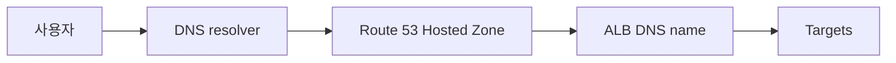

# 1. DNS와 Route 53의 역할

## 1. DNS는 이름을 주소로 바꾼다

DNS(Domain Name System)는 사람이 읽는 도메인 이름을 IP 주소(또는 다른 이름)로 변환한다. 운영에서 중요한 점은 "접근 경로가 바뀌어도 사용자에게는 이름이 고정"된다는 것이다.

ALB를 만들면 DNS name이 제공되지만, 운영에서는 보통 "내 도메인"을 서비스 엔드포인트로 사용한다. Route 53은 이 DNS 계층을 AWS에서 관리하는 서비스다.

---

# 2. Hosted Zone

## 1. Public Hosted Zone과 Private Hosted Zone

- Public Hosted Zone: 인터넷에서 조회 가능한 도메인
- Private Hosted Zone: 특정 VPC 내부에서만 조회 가능한 도메인

Ch05에서는 인터넷에서 접근 가능한 서비스 엔드포인트를 만들기 위해 Public Hosted Zone을 사용한다.

[이미지: AWS Console - Route 53 - Hosted zones - Create hosted zone 화면 - Public 선택 포인트]

이 단계는 "도메인의 DNS 권한을 Route 53에 위임"할 준비를 하는 과정이다. 실제 위임은 도메인 등록기관(NS 레코드 변경)에서 이루어진다.

---

# 3. Record 타입과 Alias

## 1. A, CNAME, Alias

DNS Record는 여러 타입이 있지만, 이 시리즈에서는 다음만 다룬다.

- A: 이름 -> IPv4
- CNAME: 이름 -> 다른 이름
- Alias: AWS 리소스(ALB, CloudFront, S3 등)를 도메인에 직접 연결

## 2. ALB는 Alias로 연결한다

ALB는 IP가 고정되지 않는다. 따라서 "A 레코드에 IP를 박는 방식"은 적절하지 않다. Route 53의 Alias를 사용하면, ALB 같은 AWS 리소스를 도메인에 직접 연결할 수 있다.

[이미지: AWS Console - Route 53 - Records - Create record 화면 - Record type A + Alias to ALB 선택 포인트]

이 방식은 도메인 루트(Zone apex)에서도 사용할 수 있고, AWS 리소스와 연결이 자연스럽다. 운영에서는 Alias가 기본 선택이 된다.

---

# 4. Routing policy(개요)

## 1. Simple routing이 기본이다

Routing policy는 "어떤 응답을 돌려줄 것인가"를 결정한다. 이 시리즈에서는 기본(Simple) 라우팅으로 도메인을 ALB에 연결하는 흐름만 다룬다.

Weighted/Failover/Latency 같은 정책은 고급 트래픽 설계 영역이므로, 이후 아키텍처 설계 시리즈에서 확장하는 것이 적절하다.

---

# 핵심 정리

- DNS는 이름을 주소로 변환하며, 운영에서는 "고정된 이름"이 접근 경로의 기준이 된다.
- Hosted Zone은 도메인에 대한 DNS 관리 영역이다(Public/Private).
- ALB는 IP가 고정되지 않으므로 Route 53 Alias로 연결하는 방식이 표준이다.
- 이 Section에서는 Simple routing으로 도메인 -> ALB 연결을 완성한다.

---

# [실습] Gallery: Route 53 도메인 연결

Public Hosted Zone을 생성하고, ALB에 Alias Record(A)를 연결한다. 도메인 등록기관에서 NS 레코드를 Route 53로 위임한 뒤, 도메인으로 ALB에 접근되는지 확인한다.

---

### 실습 목표

- Public Hosted Zone을 생성한다.
- ALB로 향하는 Alias Record(A)를 생성한다.
- 도메인 등록기관에서 NS 레코드를 Route 53 네임서버로 변경한다.
- 도메인으로 접근이 되는지 확인한다.

⚠️ 비용 주의: Hosted Zone과 DNS 쿼리는 비용이 발생할 수 있다. 도메인 등록은 별도의 과금 항목이며, 필요하면 실습 후 정리 기준을 적용한다.

---

# 1. 전체 아키텍처



이 실습은 "사용자가 도메인으로 접근하면, DNS가 ALB로 라우팅해준다"는 경로를 완성한다. 이후 프로젝트 Lab에서는 Gallery를 이 경로로 노출한다.

---

# 2. 사전 준비

- "Gallery: ALB와 Target Group 구성" 완료: ALB가 존재해야 한다
- 도메인 준비
  - **{your-domain}** (예: `example.com`)
  - 도메인 등록기관(Registrar)에서 NS 레코드를 변경할 수 있어야 한다

⚠️ 주의:

- 도메인이 없다면 Hosted Zone과 Record 생성까지는 가능하지만, 실제 접근 검증은 할 수 없다.
- DNS 전파는 시간이 걸릴 수 있다.

---

# 3. 리소스 생성 및 설정 (생성 + 연결)

각 단계에서 AWS Console 화면 스냅샷을 반드시 명시한다.

## 1. Public Hosted Zone 생성

설명: 도메인에 대한 DNS 관리 영역을 만든다.

[이미지: AWS Console - Route 53 - Hosted zones - Create hosted zone 화면 - Domain name/Public 선택]

설정 포인트(예시):

- Domain name: **{your-domain}**
- Type: Public hosted zone

생성 후 NS 레코드를 확인한다.

[이미지: AWS Console - Route 53 - Hosted zone details - NS 레코드(네임서버) 확인]

## 2. Registrar에서 NS 레코드 변경

설명: 도메인 등록기관에서 NS 레코드를 Route 53 네임서버로 변경해 권한을 위임한다.

[이미지: Registrar 관리 콘솔 - Nameservers 설정 화면 - Route 53 NS 4개 입력]

⚠️ 주의:

- 이 과정은 AWS Console이 아니라 도메인 등록기관 화면에서 진행된다.
- NS 변경은 즉시 반영되지 않을 수 있다(전파 시간 고려).

## 3. Alias Record(A) 생성(ALB 연결)

설명: 도메인 이름을 ALB로 연결한다.

[이미지: AWS Console - Route 53 - Records - Create record 화면 - A/AAAA + Alias to ALB 선택]

설정 포인트(예시):

- Record name: (비워두면 zone apex)
- Record type: A
- Alias: On
- Alias target: `**{alb-dns-name}**`
- Routing policy: Simple

---

# 4. 실행 및 결과 검증

설명: DNS가 ALB로 해석되고, 브라우저에서 도메인으로 접근이 가능해야 한다.

## 1. DNS 해석 확인

[이미지: 터미널 - dig/nslookup - 도메인이 ALB로 해석되는 결과]

예시:

```bash
nslookup **{your-domain}**
```

## 2. 브라우저 접근 확인

[이미지: 브라우저 - http://{your-domain} - ALB 뒤 응답 확인]

⚠️ 주의:

- HTTPS는 인증서(ACM)와 443 Listener가 필요하다. 이 시리즈에서는 HTTP 흐름을 기준으로 진행한다.

---

# 5. 자원 정리

프로젝트 실습에서 도메인을 계속 사용할 예정이라면 Hosted Zone과 Record를 유지한다.

정리가 필요한 경우 다음을 삭제한다.

- Record 삭제
- Hosted Zone 삭제

[이미지: AWS Console - Route 53 - Records - Delete record 화면 - 삭제 확인]
[이미지: AWS Console - Route 53 - Hosted zones - Delete hosted zone 화면 - 삭제 확인]

⚠️ 주의:

- Hosted Zone을 삭제하면 DNS 관리 정보가 사라진다. 운영 중인 도메인이라면 삭제하면 안 된다.

---

# 참고 자료

- [Amazon Route 53 developer guide (AWS)](https://docs.aws.amazon.com/Route53/latest/DeveloperGuide/Welcome.html)
- [Alias records (AWS)](https://docs.aws.amazon.com/Route53/latest/DeveloperGuide/routing-to-elb-load-balancer.html)
- [Choosing between alias and CNAME (AWS)](https://docs.aws.amazon.com/Route53/latest/DeveloperGuide/resource-record-sets-choosing-alias-non-alias.html)
