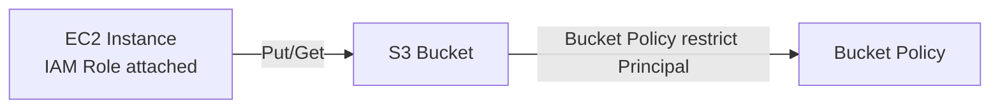

# 1. S3 접근 제어의 구성 요소

## 1. S3는 "누가"와 "어떤 Bucket/Object"를 함께 본다

S3 접근 제어는 Identity(IAM User/Role)가 가진 권한과, Bucket/Object(Resource)에 붙는 정책이 함께 평가된다. 같은 S3 작업이라도 "어떤 Bucket"이냐에 따라 허용/거부가 달라질 수 있다.

### ① Block Public Access

S3는 공개 접근을 차단하기 위한 방어 장치로 Block Public Access를 제공한다. 운영에서는 기본적으로 켜고, 공개가 필요한 경우에도 범위를 최소화하는 것이 일반적이다.

[이미지: AWS Console - S3 - Bucket - Permissions - Block public access 설정 화면 - 전체 차단 토글 확인]

### ② Bucket Policy(리소스 기반 정책)

Bucket Policy는 Bucket에 직접 붙는 리소스 기반 정책이다. IAM Policy와 달리 Principal(누가)을 명시할 수 있다.

Bucket Policy는 다음 상황에서 핵심이다.

- 특정 Role만 해당 Bucket에 접근하도록 제한
- CloudFront(OAC)만 Origin에 접근하도록 제한

### ③ ACL은 레거시다

ACL은 과거 방식이며, 조직은 보통 Bucket Owner Enforced(ACL 비활성화) 설정을 사용한다. 이 시리즈에서는 ACL을 깊게 다루지 않는다.

---

# 2. Bucket Policy 구조

## 1. Principal이 있다는 점이 핵심이다

Bucket Policy는 JSON 문서이며 주요 요소는 다음이다.

- Effect: Allow/Deny
- Principal: 누구에게 적용할지
- Action: 어떤 S3 API를 허용/거부할지
- Resource: 어떤 Bucket/Object에 적용할지
- Condition: 추가 조건(필요 시)

예시(개념 설명용):

```json
{
  "Version": "2012-10-17",
  "Statement": [
    {
      "Sid": "AllowListBucketForSpecificRole",
      "Effect": "Allow",
      "Principal": {
        "AWS": "arn:aws:iam::123456789012:role/fundamentals-ec2-role"
      },
      "Action": ["s3:ListBucket"],
      "Resource": ["arn:aws:s3:::example-bucket"]
    }
  ]
}
```

이 예시는 "특정 Role만 Bucket 목록 조회(ListBucket)를 허용"하는 형태다. Object 작업(GetObject/PutObject)은 Object ARN(`arn:aws:s3:::bucket/*`)로 별도 지정해야 한다.

---

# 3. EC2에서 S3에 접근하는 표준: IAM Role(Instance Profile)

## 1. Access key를 인스턴스에 넣지 않는다

EC2에서 S3에 접근할 때 Access key를 파일로 저장하는 방식은 다음 문제가 있다.

- 키 유출 위험
- 키 회전(rotate) 운영 부담
- 인스턴스 교체/확장 시 배포 문제

따라서 표준은 IAM Role(Instance Profile)이다. 인스턴스는 메타데이터 서비스를 통해 임시 자격 증명을 얻고, 애플리케이션이나 도구는 이를 자동으로 사용한다.

### ① Role을 붙이면 "인스턴스가 권한을 가진다"

[이미지: AWS Console - EC2 - Instance - Security - IAM role 확인 화면 - Role 연결 상태]

이 화면은 "해당 인스턴스가 어떤 Role로 동작하는가"의 단일 진실 원천이다. S3 접근이 안 될 때는 먼저 여기부터 확인한다.

### ② SDK와 CLI는 기본 자격 증명 체인을 사용한다

애플리케이션(AWS SDK)과 `aws` CLI는 기본 자격 증명 체인으로 Role 자격 증명을 획득한다. 이 Section에서는 "Role이 붙으면 자격 증명을 넣지 않아도 동작한다"는 것을 검증한다.

---

# 핵심 정리

- S3 접근 제어는 Block Public Access, Bucket Policy, IAM Role/Policy가 함께 작동한다.
- Bucket Policy는 리소스 기반 정책이며 Principal을 지정할 수 있다.
- EC2에서 S3 접근은 Access key 대신 IAM Role(Instance Profile)로 구성하는 것이 표준이다.
- S3 접근 문제는 Role 연결 여부 -> Policy -> Bucket Policy 순서로 확인한다.

---

# [실습] lab18: Bucket Policy와 EC2-S3 연동

Bucket Policy를 작성해 특정 EC2 IAM Role만 Bucket/Object에 접근할 수 있게 제한한다. EC2 인스턴스에 Role을 연결하고, EC2에서 S3에 Object를 업로드/다운로드해 동작을 검증한다.

---

### 실습 목표

- S3 Bucket을 생성하고 Block Public Access 기본값을 확인한다.
- EC2용 IAM Role을 생성하고 최소 S3 권한을 부여한다.
- Bucket Policy로 Principal(Role)을 제한한다.
- EC2에서 S3 업로드/다운로드가 되는지 확인한다.

⚠️ 비용 주의: S3 저장량/요청 및 EC2 사용에 따라 과금이 발생할 수 있다. 실습 종료 시 리소스를 정리한다.

---

# 1. 전체 아키텍처



이 실습은 "Role을 붙이면 EC2가 S3에 접근할 수 있다"를 확인한다. 접근 권한은 IAM Policy와 Bucket Policy가 함께 결정된다.

---

# 2. 사전 준비

- 리전: `ap-northeast-2 (Seoul)`
- EC2 인스턴스 1대 준비(또는 신규 생성)
  - Public Subnet(접속 편의) 또는 Session Manager(SSM)로 접속(운영형)
- (선택) Key Pair/SSH 접속 준비(SSM을 쓰지 않는 경우)

⚠️ 주의:

- 이 실습은 "EC2에서 S3 접근" 검증이 필요하므로, EC2에 접속 가능한 경로가 있어야 한다.

---

# 3. 리소스 생성 및 설정 (생성 + 연결)

각 단계에서 AWS Console 화면 스냅샷을 반드시 명시한다.

## 1. S3 Bucket 생성

설명: 접근 제어 실험 대상 Bucket을 만든다.

[이미지: AWS Console - S3 - Create bucket - Bucket name/Block Public Access 확인]

설정 포인트(예시):

- Bucket name: **{bucket-name}** (예: `fundamentals-s3-lab18-**{random}**`)
- Block Public Access: Enabled 유지

## 2. IAM Role 생성(EC2용) + Policy 연결

설명: EC2가 S3에 접근할 권한을 갖도록 Role을 만든다.

[이미지: AWS Console - IAM - Roles - Create role - Trusted entity EC2 선택]
[이미지: AWS Console - IAM - Roles - Permissions - S3 권한 정책 연결 화면]

권한 범위(예시):

- ListBucket on `arn:aws:s3:::**{bucket-name}**`
- GetObject/PutObject/DeleteObject on `arn:aws:s3:::**{bucket-name}**/*`

⚠️ 주의:

- 이 실습은 학습용으로 최소 권한을 직접 구성하는 흐름이 목적이다. AWS Managed Policy를 그대로 붙이지 않는다.

## 3. EC2에 IAM Role 연결

설명: 인스턴스가 해당 Role로 동작하도록 Instance profile을 연결한다.

[이미지: AWS Console - EC2 - Instance - Actions - Security - Modify IAM role 화면 - Role 선택 포인트]

## 4. Bucket Policy 작성(Principal 제한)

설명: Bucket이 "특정 Role만" 접근하도록 Bucket Policy로 한 번 더 제한한다.

[이미지: AWS Console - S3 - Bucket - Permissions - Bucket policy 편집 화면 - Principal/Resource 입력 포인트]

Bucket Policy 예시(개념 검증용):

```json
{
  "Version": "2012-10-17",
  "Statement": [
    {
      "Sid": "AllowObjectRWForSpecificRole",
      "Effect": "Allow",
      "Principal": {
        "AWS": "arn:aws:iam::**{account_id}**:role/**{ec2_role_name}**"
      },
      "Action": [
        "s3:ListBucket",
        "s3:GetObject",
        "s3:PutObject",
        "s3:DeleteObject"
      ],
      "Resource": [
        "arn:aws:s3:::**{bucket-name}**",
        "arn:aws:s3:::**{bucket-name}**/*"
      ]
    }
  ]
}
```

⚠️ 주의:

- `ListBucket`은 Bucket ARN에 적용되고, Object 작업은 `bucket/*`에 적용된다.
- 실제 운영에서는 Condition(VPC Endpoint, TLS 등)을 추가하는 경우가 많다.

---

# 4. 실행 및 결과 검증

설명: EC2에서 Role 자격 증명으로 S3 작업이 성공하면 연결이 완료된 것이다.

## 1. EC2에서 Role 적용 확인

[이미지: AWS Console - EC2 - Instance - Security - IAM role 표시 확인]

## 2. EC2에서 S3 업로드/다운로드 확인

[이미지: 터미널 - EC2 - aws s3 ls 실행 - Bucket 조회 결과]
[이미지: 터미널 - EC2 - aws s3 cp 업로드 - 성공 로그]
[이미지: 터미널 - EC2 - aws s3 cp 다운로드 - 파일 생성 확인]

예시(검증용):

```bash
aws s3 ls s3://**{bucket-name}**
echo hello > hello.txt
aws s3 cp hello.txt s3://**{bucket-name}**/lab18/hello.txt
aws s3 cp s3://**{bucket-name}**/lab18/hello.txt hello-downloaded.txt
```

⚠️ 주의:

- 이 실습에서 CLI는 자동화가 아니라 "Role 기반 접근이 동작하는지"를 확인하기 위한 최소 도구로만 사용한다.

## 3. Console에서 Object 생성 확인

[이미지: AWS Console - S3 - Bucket - Objects - lab18/hello.txt 확인]

---

# 5. 자원 정리

프로젝트 Lab(Gallery - S3 연동)을 이어서 진행한다면 Bucket/Role은 재사용할 수 있다.

정리가 필요한 경우 다음을 삭제한다.

- S3 Object 삭제 후 Bucket 삭제
- IAM Role 삭제(연결 해제 후)

[이미지: AWS Console - S3 - Bucket - Empty bucket - 비우기 확인]
[이미지: AWS Console - S3 - Delete bucket - 삭제 확인]
[이미지: AWS Console - IAM - Roles - Delete role - 삭제 확인]

⚠️ 주의:

- EC2에 Role이 연결된 상태로는 Role 삭제가 막힐 수 있다. 먼저 EC2에서 Role 연결을 해제한다.

---

# 참고 자료

- [S3 access control overview (AWS)](https://docs.aws.amazon.com/AmazonS3/latest/userguide/access-control-overview.html)
- [Bucket policies (AWS S3)](https://docs.aws.amazon.com/AmazonS3/latest/userguide/bucket-policies.html)
- [Block Public Access (AWS S3)](https://docs.aws.amazon.com/AmazonS3/latest/userguide/access-control-block-public-access.html)
- [IAM roles for Amazon EC2 (AWS)](https://docs.aws.amazon.com/IAM/latest/UserGuide/id_roles_use_switch-role-ec2.html)
