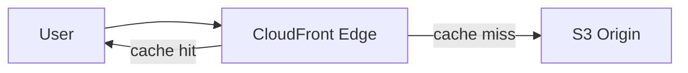

# 1. S3 정적 웹 호스팅

## 1. S3는 정적 파일을 HTTP로 제공할 수 있다

S3는 정적 웹 호스팅 기능을 제공한다. HTML/CSS/JS 같은 정적 파일을 Bucket에 올리고, Website endpoint로 접근하는 방식이다.

### ① Website endpoint는 REST endpoint와 다르다

S3에는 두 종류의 엔드포인트가 있다.

- REST endpoint: API 기반(SDK/CLI), CloudFront OAC와 결합 가능
- Website endpoint: 정적 웹 호스팅 전용, OAC와 결합이 어렵다

⚠️ 주의:

- CloudFront의 OAC는 S3 REST endpoint를 대상으로 한다.
- "S3 Website endpoint + CloudFront + OAC" 조합은 맞지 않다.

이 Section은 먼저 "S3 정적 호스팅"을 단독으로 구성해 개념을 이해하고, 다음으로 CloudFront+OAC 패턴으로 운영형 구성을 만든다.

## 2. Index/Error Document

정적 웹 호스팅은 Index document와 Error document를 설정한다.

[이미지: AWS Console - S3 - Bucket - Properties - Static website hosting 설정 화면 - Index/Error 입력 포인트]

---

# 2. CloudFront가 필요한 이유

## 1. CDN은 "사용자 가까이" 캐시한다

CloudFront는 CDN(Content Delivery Network)이다. Origin(S3, ALB 등)에서 콘텐츠를 가져와 Edge location에 캐시하고, 사용자에게 더 가까운 위치에서 응답한다.



이 구조는 "캐시가 있으면 Edge가 응답하고, 없으면 Origin에서 가져온다"를 보여준다. 정적 콘텐츠는 이 모델에 가장 잘 맞는다.

## 2. 직접 S3 접근을 막고 CloudFront만 허용한다

운영형 패턴에서는 S3 Bucket을 공개하지 않고, CloudFront를 통해서만 접근하게 만든다. 이를 위한 구성 요소가 OAC(Origin Access Control)이다.

[이미지: 전체 아키텍처 구조 - User -> CloudFront -> (OAC) -> S3(private) - direct S3 access blocked]

이 구조는 "S3는 private, CloudFront만 Origin에 접근"이라는 보안 경계를 만든다.

---

# 3. Distribution 구성 요소(필요한 수준만)

## 1. Origin과 Behavior

- Origin: 원본 콘텐츠가 있는 곳(S3, ALB)
- Behavior: 경로별 캐시/메서드/뷰어 프로토콜 정책

[이미지: AWS Console - CloudFront - Distributions - Create distribution 화면 - Origin/Behavior 설정 포인트]

## 2. 캐시 무효화(Invalidation)

정적 파일을 업데이트했는데 사용자에게 이전 파일이 보이면 캐시 문제다. CloudFront는 invalidation으로 특정 경로 캐시를 강제로 비울 수 있다.

[이미지: AWS Console - CloudFront - Distribution - Invalidations 화면 - 경로 입력 포인트]

이 시리즈에서는 invalidation을 "존재와 위치"만 확인한다. 운영에서는 배포 파이프라인과 함께 관리한다.

---

# 핵심 정리

- S3는 정적 웹 호스팅 기능을 제공하지만, 운영형 패턴에서는 CloudFront로 배포하는 것이 일반적이다.
- CloudFront는 Edge 캐시로 지연 시간을 줄이고, Origin을 보호한다.
- OAC는 S3를 private로 두고 CloudFront만 접근하도록 만드는 핵심 구성 요소다.
- S3 Website endpoint와 OAC는 결합이 어렵고, OAC는 REST endpoint 기반으로 구성한다.

---

# [실습] lab19: S3 정적 웹 호스팅과 CloudFront Distribution

S3 Bucket에 정적 웹 파일을 올리고, (1) S3 정적 웹 호스팅을 구성해 Website endpoint로 접근을 확인한다. 이어서 (2) CloudFront Distribution을 생성하고 OAC를 적용해 S3를 private로 전환한 뒤 CloudFront 도메인으로 접근을 확인한다.

---

### 실습 목표

- 정적 웹 파일을 S3에 업로드한다.
- S3 정적 웹 호스팅을 구성하고 Website endpoint로 접근을 확인한다.
- CloudFront Distribution을 생성하고 OAC를 적용한다.
- S3 직접 접근을 차단하고 CloudFront로만 접근되는지 확인한다.

⚠️ 비용 주의: CloudFront는 트래픽과 요청에 따라 과금된다. 학습 종료 시 Distribution과 Bucket을 정리한다.

---

# 1. 전체 아키텍처

```mermaid
flowchart LR
  User --> S3Web[S3 Website endpoint]
  User --> CF[CloudFront]
  CF -->|OAC| S3[S3 (private origin)]
```

이 실습은 2단계로 진행된다. 첫 단계는 S3 웹 호스팅의 형태를 이해하는 것, 두 번째 단계는 운영형 패턴(CloudFront+OAC)로 전환하는 것이다.

---

# 2. 사전 준비

- 리전: `ap-northeast-2 (Seoul)`
- 테스트용 정적 파일 준비
  - `index.html`, `error.html`, (선택) 이미지/JS/CSS

---

# 3. 리소스 생성 및 설정 (생성 + 연결)

각 단계에서 AWS Console 화면 스냅샷을 반드시 명시한다.

## 1. S3 Bucket 생성(정적 웹)

설명: 정적 웹 파일을 담을 Bucket을 만든다.

[이미지: AWS Console - S3 - Create bucket - Bucket name/Block Public Access 확인]

설정 포인트(예시):

- Bucket name: **{bucket-name}** (예: `fundamentals-static-web-**{random}**`)
- Block Public Access: 기본은 Enabled

## 2. 정적 파일 업로드

설명: 웹 호스팅할 정적 파일을 업로드한다.

[이미지: AWS Console - S3 - Bucket - Upload - index.html/error.html 업로드 화면]

## 3. (단계 1) S3 정적 웹 호스팅 활성화

설명: Website endpoint로 접근하기 위해 정적 웹 호스팅을 켠다.

[이미지: AWS Console - S3 - Bucket - Properties - Static website hosting - Enable 화면]

설정 포인트(예시):

- Hosting type: Enable
- Index document: `index.html`
- Error document: `error.html`

## 4. (단계 1) Bucket Policy로 공개 접근 허용

설명: Website endpoint로 접근하려면 Object에 대한 공개 읽기 권한이 필요하다.

[이미지: AWS Console - S3 - Bucket - Permissions - Block public access - Edit 화면 - 필요 시 일부 해제]
[이미지: AWS Console - S3 - Bucket - Permissions - Bucket policy 편집 - Public read 정책 입력 포인트]

Public read 정책 예시(학습용):

```json
{
  "Version": "2012-10-17",
  "Statement": [
    {
      "Sid": "PublicReadForStaticWebsite",
      "Effect": "Allow",
      "Principal": "*",
      "Action": ["s3:GetObject"],
      "Resource": ["arn:aws:s3:::**{bucket-name}**/*"]
    }
  ]
}
```

⚠️ 주의:

- 이 단계는 "S3 website가 공개된 상태"를 경험하기 위한 학습용이다.
- 다음 단계에서 CloudFront+OAC로 전환하면서 S3 public access를 차단한다.

## 5. (단계 2) CloudFront Distribution 생성 + OAC 연결

설명: CloudFront를 만들고 Origin을 S3(REST)로 지정한다. OAC를 생성해 Distribution에 연결한다.

[이미지: AWS Console - CloudFront - Create distribution - Origin domain을 S3 bucket으로 선택하는 화면]
[이미지: AWS Console - CloudFront - Create distribution - Origin access - OAC create and attach 화면]
[이미지: AWS Console - CloudFront - Create distribution - Default behavior - Viewer protocol policy 설정 포인트]

설정 포인트(예시):

- Origin domain: `**{bucket-name}**.s3.ap-northeast-2.amazonaws.com` (REST)
- Origin access: OAC 생성/연결
- Viewer protocol policy: Redirect HTTP to HTTPS(권장)
- Default root object: `index.html`

## 6. (단계 2) Bucket Policy를 OAC 기반으로 변경(Direct S3 차단)

설명: S3를 private로 두고 CloudFront만 접근하도록 Bucket Policy를 바꾼다. Distribution 생성 화면에서 제공되는 정책 예시를 그대로 사용한다.

[이미지: AWS Console - CloudFront - Distribution - Origin - Copy policy 화면 - 정책 제공 위치]
[이미지: AWS Console - S3 - Bucket - Permissions - Bucket policy - CloudFront만 허용 정책 적용]

⚠️ 주의:

- 이 단계에서 S3 공개 정책(Principal "*")은 제거한다.
- Block Public Access는 다시 Enabled로 되돌리는 것을 기본으로 한다.

---

# 4. 실행 및 결과 검증

설명: S3 Website endpoint로는 (단계 1에서) 접근이 되고, OAC 적용 후에는 CloudFront로만 접근이 되어야 한다.

## 1. S3 Website endpoint 접근 확인(단계 1)

[이미지: AWS Console - S3 - Bucket - Properties - Static website hosting - Website endpoint URL 확인]
[이미지: 브라우저 - S3 website endpoint 접근 - index.html 렌더링 확인]

## 2. CloudFront 도메인 접근 확인(단계 2)

[이미지: AWS Console - CloudFront - Distribution - Domain name 확인]
[이미지: 브라우저 - https://{cloudfront-domain} - index.html 렌더링 확인]

## 3. Direct S3 접근 차단 확인(단계 2)

[이미지: 브라우저 - S3 Object URL 직접 접근 - AccessDenied 확인]

---

# 5. 자원 정리

정리가 필요한 경우 다음을 삭제한다.

- CloudFront Distribution 비활성화 후 삭제
- S3 Bucket 비우기 후 삭제

[이미지: AWS Console - CloudFront - Distribution - Disable - 비활성화 확인]
[이미지: AWS Console - CloudFront - Distribution - Delete - 삭제 확인]
[이미지: AWS Console - S3 - Bucket - Empty bucket - 비우기 확인]
[이미지: AWS Console - S3 - Delete bucket - 삭제 확인]

⚠️ 주의:

- CloudFront Distribution은 삭제 전에 Disable이 필요하며, 전파에 시간이 걸릴 수 있다.

---

# [실습] Gallery: S3 연동

Gallery 업로드 저장소를 local disk에서 S3로 전환한다. 운영형 흐름을 만들기 위해 "인스턴스에 접속해 설정을 바꾸는 방식"이 아니라, Launch Template user data를 업데이트하고 ASG Instance Refresh로 롤링 교체해 변경을 반영한다.

---

### 실습 목표

- Gallery 업로드용 S3 Bucket을 준비한다.
- Gallery 실행 EC2의 IAM Role에 S3 권한을 추가한다.
- Launch Template(v2)로 실행 파라미터를 변경하고 Instance Refresh로 반영한다.
- Gallery 설정을 S3 모드로 전환하고 업로드/삭제를 수행한다.
- S3에 Object가 생성/삭제되는 것을 확인한다.

⚠️ 비용 주의: 이 프로젝트 Lab은 S3 저장량/요청 비용이 누적될 수 있다. 학습 종료 시점에 프로젝트 전체 정리 기준을 적용한다.

⚠️ 주의:

- 이 실습에서 다루는 "버전"은 Gallery 앱 버전이 아니라 Launch Template 버전이다.
- 이 흐름은 기능 추가/버그 수정처럼 배포 산출물이 바뀌는 경우에도 동일하게 확장된다(새 버전 -> Refresh).

⚠️ 시리즈 스코프: S3 접근은 **EC2 IAM Role**로 처리한다(액세스 키를 user data에 넣지 않는다). DB 비밀번호 등을 **Secrets Manager / SSM**으로 분리하는 패턴은 본 시리즈 범위 밖이며, **Ch07 Gallery(RDS)** 실습의 datasource 예시와 `AGENTS.md` Scope를 참고한다.

---

# 1. 전체 아키텍처

```mermaid
flowchart LR
  User --> ALB_or_EC2[Gallery endpoint]
  ALB_or_EC2 --> App[Gallery on EC2]
  App -->|Put/Get/Delete| S3[S3 Bucket (uploads)]
```

이 Lab의 핵심은 "업로드 파일이 인스턴스 디스크가 아니라 S3에 남는다"는 전환이다. 이후 ASG/ECS로 실행 환경을 바꿔도 업로드 파일이 유지되는 기반이 된다.

---

# 2. 사전 준비

- Gallery 실행 환경 준비
  - 프로젝트 Lab "Gallery - EC2 기본 배포" 완료 상태
  - (권장) Ch05 Gallery 실습(ALB/ASG/Route 53) 완료 상태
- S3 기본 이해
  - `lab17`, `lab18`에서 Bucket/Policy/Role 흐름을 이해한 상태

필요 값(플레이스홀더):

- **{gallery-repo-url}**
- **{gallery-endpoint}** (ALB DNS 또는 EC2 endpoint)
- **{bucket-name}**
- **{ec2_role_name}**

---

# 3. 리소스 생성 및 설정 (생성 + 연결)

각 단계에서 AWS Console 화면 스냅샷을 반드시 명시한다.

## 1. 업로드용 S3 Bucket 준비

설명: Gallery 업로드 파일을 저장할 Bucket을 만든다(또는 기존 Bucket을 재사용한다).

[이미지: AWS Console - S3 - Create bucket - Bucket name/Region 확인]

## 2. EC2 IAM Role에 S3 권한 추가(Task role이 아니라 EC2 role)

설명: Gallery가 EC2에서 실행되므로, EC2에 연결된 IAM Role에 S3 권한이 필요하다.

[이미지: AWS Console - IAM - Roles - EC2 role - Permissions - 정책 추가 화면]

권한 범위(예시):

- PutObject/GetObject/DeleteObject on `arn:aws:s3:::**{bucket-name}**/*`
- ListBucket on `arn:aws:s3:::**{bucket-name}**`

## 3. Launch Template v2 생성(user data 전체: S3 연동, RDS 이전)

설명: Gallery 실행 파라미터 변경을 "운영형"으로 반영한다. 인스턴스마다 직접 재실행하지 않고, Launch Template 새 버전을 만든 뒤 인스턴스 교체로 일괄 반영한다.

Ch05(`05.02`)에서 만든 Launch Template **v1**과 동일하게 **user data 전체 스크립트**를 한 블록으로 넣되, **v2**에서는 `gallery.service` 의 `ExecStart` 만 S3 모드로 바꾼다. **RDS 전 단계**이므로 `global-bundle.pem` 다운로드나 JDBC 파라미터는 포함하지 않는다.

[이미지: AWS Console - EC2 - Launch Templates - aws-fund-gallery-lt - Versions - Create new version - Source version=v1 선택]
[이미지: AWS Console - EC2 - Launch Templates - Create new version - User data 전체 붙여넣기]

다음은 **v2 기준 user data 전체 예시**다. `gallery.service` 의 `ExecStart` 안 `{bucket-name}` 은 위에서 준비한 S3 Bucket 이름(예: `my-gallery-uploads`)으로 바꾼다.

- **v1 대비 차이**: `ExecStart` 에 `--spring.profiles.active=dev --app.storage.type=s3 --app.storage.s3.bucket=...` 를 추가한다.
- **Ch05와 동일**: `git sparse-checkout` → `./mvnw` → `systemctl enable --now gallery.service` 흐름은 그대로다.

```bash
#!/bin/bash
set -euo pipefail

APP_DIR=/opt/gallery
REPO_DIR=/home/ec2-user/workspace
JAR_PATH=/opt/gallery/gallery.jar

mkdir -p "${APP_DIR}"
chown -R ec2-user:ec2-user "${APP_DIR}"

sudo -u ec2-user bash -lc "
set -euo pipefail
cd /home/ec2-user
rm -rf workspace
git clone --filter=blob:none --sparse https://github.com/kickscar/learning-series.git workspace
cd workspace
git sparse-checkout init --no-cone
git sparse-checkout set Cloud/Workloads/gallery-spring-boot
cd Cloud/Workloads/gallery-spring-boot
./mvnw clean package -DskipTests -Dbuild.finalName=gallery
"

cp "${REPO_DIR}/Cloud/Workloads/gallery-spring-boot/target/gallery.jar" "${JAR_PATH}"
chown ec2-user:ec2-user "${JAR_PATH}"

cat >/etc/systemd/system/gallery.service <<'UNITEOF'
[Unit]
Description=Gallery Spring Boot
After=network.target

[Service]
Type=simple
User=ec2-user
WorkingDirectory=/opt/gallery
ExecStart=/usr/bin/java -jar /opt/gallery/gallery.jar --server.port=8080 --spring.profiles.active=dev --app.storage.type=s3 --app.storage.s3.bucket={bucket-name}
Restart=always
RestartSec=5
SuccessExitStatus=143

[Install]
WantedBy=multi-user.target
UNITEOF

systemctl daemon-reload
systemctl enable --now gallery.service
```

⚠️ 주의:

- S3 접근이 안 되면 애플리케이션에서 오류가 발생할 수 있다. 이때는 EC2 Role 권한과 Bucket Policy를 먼저 확인한다.

## 4. Launch Template 기본 버전(Default version)을 v2로 설정

설명: 이후 생성되는 인스턴스가 v2를 기본으로 사용하도록 기준선을 올린다.

[이미지: AWS Console - EC2 - Launch Templates - Versions - Set default version - v2 선택]

## 5. ASG Instance Refresh 실행(롤링 교체로 변경 반영)

설명: ASG가 기존 인스턴스를 단계적으로 교체하면서 v2가 반영되도록 한다.

[이미지: AWS Console - EC2 - Auto Scaling groups - aws-fund-gallery-asg - Instance refresh - Start - Launch template default version 확인]
[이미지: AWS Console - EC2 - Auto Scaling groups - Instance refresh - Progress - 단계별 교체 진행률]
[이미지: AWS Console - EC2 - Target Groups - aws-fund-gallery-tg - Targets - 신규 인스턴스 Healthy 후 기존 인스턴스가 제거되는 흐름]

⚠️ 주의:

- Instance Refresh는 무조건 "완전한 무정지"를 보장하지 않는다.
- 무중단에 가깝게 만들려면 Health check(`/actuator/health`)가 "준비 완료"를 제대로 반영해야 하고, Warm-up/Minimum healthy 설정이 보수적이어야 한다.

---

# 4. 실행 및 결과 검증

설명: 교체가 끝난 뒤에도 서비스가 유지되고, 업로드/삭제가 S3 Bucket Object 생성/삭제로 이어지면 전환 성공이다.

## 1. 업로드 동작 확인

[이미지: 브라우저 - Gallery 업로드 수행 - 성공 화면]
[이미지: AWS Console - S3 - Bucket - Objects - 새 Object 생성 확인]

## 2. 삭제 동작 확인

[이미지: 브라우저 - Gallery 항목 삭제 - 성공 화면]
[이미지: AWS Console - S3 - Bucket - Objects - Object 삭제 확인]

## 3. 교체 반영 확인(운영 관점)

[이미지: AWS Console - EC2 - Auto Scaling groups - Instance refresh - Completed 확인]
[이미지: AWS Console - EC2 - Target Groups - aws-fund-gallery-tg - Targets - 모든 Target Healthy 확인]

---

# 5. 자원 정리

프로젝트를 이어서 진행한다면 Bucket은 유지한다.

정리가 필요한 경우 다음을 정리한다.

- 테스트 업로드 Object 삭제
- (필요 시) Bucket 삭제

[이미지: AWS Console - S3 - Bucket - Delete objects - 삭제 확인]
[이미지: AWS Console - S3 - Delete bucket - 삭제 확인]

⚠️ 주의:

- 이후 Chapter에서 계속 쓸 계획이면 Bucket을 삭제하지 않는다.

---

# 참고 자료

- [Hosting a static website on Amazon S3 (AWS)](https://docs.aws.amazon.com/AmazonS3/latest/userguide/WebsiteHosting.html)
- [Using CloudFront with Amazon S3 (AWS)](https://docs.aws.amazon.com/AmazonCloudFront/latest/DeveloperGuide/DownloadDistS3AndCustomOrigins.html)
- [Origin Access Control (AWS CloudFront)](https://docs.aws.amazon.com/AmazonCloudFront/latest/DeveloperGuide/private-content-restricting-access-to-s3.html)
- [CloudFront invalidations (AWS)](https://docs.aws.amazon.com/AmazonCloudFront/latest/DeveloperGuide/Invalidation.html)
