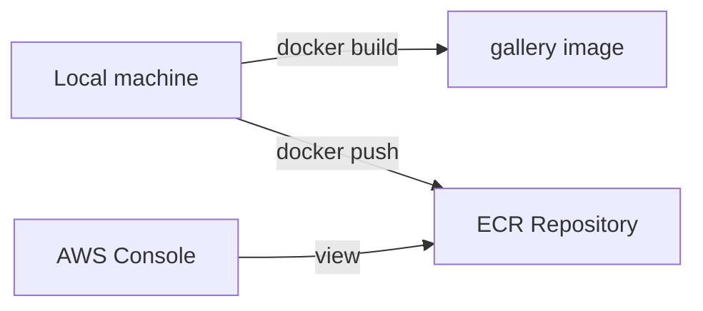

# 1. ECR이 하는 일

## 1. ECR(Elastic Container Registry)의 정의

ECR은 AWS가 제공하는 관리형 Container Registry다. "Container Image"를 계정 내부(Private) Repository에 저장하고, ECS 같은 실행 환경이 그 이미지를 Pull해서 Container를 띄울 수 있게 한다.

ECR을 쓰는 이유는 단순히 "이미지 저장소"를 만들기 위해서가 아니다. 권한(IAM), 네트워크(Region/VPC Endpoint), 배포(ECS Task Definition), 운영(Image Scan/Lifecycle)이 하나의 흐름으로 연결된다.

### ① Registry가 인프라에서 갖는 위치

컨테이너 배포는 크게 다음 흐름으로 분리된다.

- Build: 소스 코드 -> Image 생성
- Ship: Image를 Registry(ECR)에 저장
- Run: 실행 환경(ECS/Fargate)이 Registry에서 Image를 Pull해서 실행

```mermaid
flowchart LR
  Dev[Developer or CI] -->|docker build| Image[Container Image]
  Image -->|docker push| ECR[ECR Repository]
  ECS[ECS Task(Fargate)] -->|docker pull| ECR
  ALB[ALB] --> ECS
```

이 다이어그램은 "누가 이미지를 만들고, 어디에 저장하며, 누가 실행하는가"를 요약한다. Ch08의 핵심은 EC2에 직접 배포하던 방식을, ECR+ECS로 분리해 "실행 환경"을 표준화하는 것이다.

### ② Docker Hub와의 비교(필요한 수준만)

ECR은 Docker Hub와 같은 역할(Registry)을 하지만, AWS 계정/권한 체계와 배포 서비스(ECS)와의 결합이 강하다.

- ECR: 계정 단위 Private Registry가 기본, IAM으로 접근 제어, ECS Task Execution Role로 Pull
- Docker Hub: Public Registry 중심(Private도 가능), 계정/조직 정책은 별도, AWS 배포 흐름과는 느슨하게 연결

이 Section은 Docker 자체의 상세(레이어 캐시, 멀티 스테이지, 빌드 최적화)는 다루지 않는다. 해당 내용은 관련 Docker 시리즈를 참고한다.

---

# 2. Repository URI, Tag, Digest

## 1. Repository URI 구조

ECR Repository는 "Registry URI + Repository name" 형태로 식별된다.

- Registry URI(계정/리전 단위): `{account_id}.dkr.ecr.{region}.amazonaws.com`
- Repository: `{repository_name}`
- Image reference: `{repository_uri}:{tag}` 또는 `{repository_uri}@{digest}`

예:

- `{account_id}.dkr.ecr.ap-northeast-2.amazonaws.com/gallery:latest`

[이미지: AWS Console - ECR - Repositories - Repository details 화면 - Repository URI/Region 확인 포인트]

이 화면에서 "Registry(계정+리전)"와 "Repository name"이 합쳐져 Repository URI가 된다는 점을 확인한다.
이 값이 ECS Task Definition의 Image 입력값으로도 그대로 재사용된다.
Repository URI는 이후 `lab22`에서 Tag/Pull/Push 명령에 그대로 들어간다.

## 2. Tag와 Digest의 차이

### ① Tag는 "사람이 붙이는 이름"이다

Tag는 `latest`, `v1.0.0`, `2026-03-26`, `git-<sha>` 같은 문자열로, 같은 Tag가 다른 Image를 가리키도록 "덮어쓰기"될 수 있다(설정에 따라 제한 가능).

### ② Digest는 "이미지 내용"에 대한 고정 식별자다

Digest(`sha256:...`)는 Image의 내용을 기준으로 생성되는 고정 값이다. 같은 Digest는 같은 Image를 의미한다.

운영에서 재현성이 중요할수록 "Tag만" 의존하지 않고, 빌드 파이프라인에서 Digest를 함께 기록하는 방식이 흔하다.

---

# 3. ECR 운영 포인트: Scan과 Lifecycle

## 1. Image Scan(취약점 검사)

ECR은 Image Scan을 제공한다. 이 Section에서는 "무엇을 보는가"만 다룬다.

- 언제 스캔하는가: "Push 시" 또는 "수동 실행"
- 무엇을 얻는가: 패키지 취약점 목록, Severity 분류
- 무엇을 하지 않는가: 취약점이 있으면 자동으로 고쳐주지는 않는다

[이미지: AWS Console - ECR - Image details - Scan results 화면 - Severity/패키지 목록 확인 포인트]

이 화면은 "어떤 취약점이 있는가"를 보여주지만, "어떻게 고칠 것인가"는 별도 작업이다.
실습에서는 Scan 결과가 생성되고, Findings가 조회되는지만 확인한다.

## 2. Lifecycle Policy(이미지 자동 정리)

ECR은 Image가 쌓이면 스토리지 비용과 운영 복잡도가 올라간다. Lifecycle Policy로 "어떤 Image를 남기고 어떤 Image를 지울지" 규칙을 둔다.

자주 쓰는 정책 예:

- "tagged 이미지는 최근 20개만 유지"
- "untagged 이미지는 7일 이후 삭제"

[이미지: AWS Console - ECR - Lifecycle policies - 정책 편집 화면 - 규칙 미리보기 확인 포인트]

정책은 텍스트 규칙으로 저장되며, Preview로 "어떤 이미지가 삭제 대상인지"를 미리 볼 수 있다.
운영에서는 tagged/untagged를 분리해 정리 기준을 다르게 두는 경우가 많다.

## 3. Tag 전략(실무 관점)

Tag 전략은 조직마다 다르지만, 최소 기준은 다음이다.

- "latest" 단독 사용을 피한다(어떤 빌드가 배포됐는지 추적이 어려워진다).
- 사람이 보는 Tag(예: `v1.2.3`)와 자동 생성 Tag(예: `git-<sha>`)를 함께 쓴다.
- CI가 만든 Image를 덮어쓰는 방식(같은 Tag 재사용)은 기준을 명확히 둔다.

---

# 핵심 정리

- ECR은 AWS 계정 내부에서 Container Image를 저장하는 관리형 Registry이며, ECS 배포의 "Ship" 단계에 해당한다.
- ECR Image reference는 `{repository_uri}:{tag}` 또는 `{repository_uri}@{digest}` 형태이며, Tag는 가변적이고 Digest는 고정 식별자다.
- ECR 운영에서는 Image Scan과 Lifecycle Policy로 "보안 점검"과 "정리"를 함께 가져간다.
- Ch08의 흐름은 "EC2 직접 배포"에서 "ECR 저장 + ECS 실행"으로 역할을 분리하는 데 있다.

---

# [실습] lab22: ECR Repository 생성과 Image Push

ECR Repository를 생성하고, 로컬에서 Container Image를 빌드해 Tag를 붙인 뒤 ECR로 Push한다. Push된 Image가 ECR Console에서 정상적으로 확인되는지 검증한다.

---

### 실습 목표

- ECR Repository를 생성하고 Repository URI를 확인한다.
- 간단한 Gallery Image를 빌드하고 Tag를 부여한다.
- ECR로 Push하고 Console에서 Image/Tag/Scan 결과를 확인한다.

⚠️ 비용 주의: 본 실습에서는 ECR에 Image를 저장한다. 저장량은 작지만, 리소스를 방치하면 스토리지 비용이 누적될 수 있다.

---

# 1. 전체 아키텍처



이 실습은 "이미지를 만든다 -> ECR에 저장한다 -> Console에서 확인한다" 흐름만 다룬다. 다음 Section부터는 이 Image를 ECS Task가 Pull해서 실제로 실행하게 된다.

---

# 2. 사전 준비

- AWS Console 로그인(관리자 권한 또는 ECR 생성/푸시 권한 보유)
- 리전: `ap-northeast-2 (Seoul)`
- 로컬 도구 설치
  - Docker Engine(로컬 빌드/푸시용)
  - AWS CLI v2(로그인 토큰 발급용)
- Gallery 소스 준비(예시)
  - **{git_repo_url}**에서 소스를 가져온다.
  - 본 실습에서는 앱 기능 설명이 아니라 "이미지 빌드/푸시"만 다룬다.

⚠️ 주의:

- 이 실습에서 CLI는 "자동화" 목적이 아니라, ECR에 로그인하고 Image를 Push하기 위한 최소 도구로만 사용한다.
- 명령은 ECR Console의 "View push commands"에서 제공하는 값을 그대로 복사해 사용한다.

---

# 3. 리소스 생성 및 설정

각 단계에서 AWS Console 화면 스냅샷을 반드시 명시한다.
예: `[이미지: AWS Console - ECR - {화면} - {핵심 포인트}]`

## 1. ECR Repository 생성

설명: ECS가 Image를 Pull할 원천 저장소(Registry)로 사용할 Repository를 만든다.

[이미지: AWS Console - ECR - Repositories - Create repository 화면 - Private/Repository name/Scan settings 확인]

설정 포인트(예시):

- Visibility settings: Private
- Repository name: `gallery`
- Image scan settings: "Scan on push" 활성화(가능한 경우)

생성 후 다음을 확인한다.

[이미지: AWS Console - ECR - Repository details - Repository URI 확인 포인트]

- Repository URI: **{account_id}**.dkr.ecr.ap-northeast-2.amazonaws.com/gallery

## 2. (로컬) Gallery JAR 빌드

설명: Container Image에 포함할 애플리케이션 산출물을 만든다.

[이미지: 터미널 - Maven build - target 산출물 생성 로그]

예시:

```bash
./mvnw clean package -DskipTests -Dbuild.finalName=gallery
```

산출물 예:

- `target/gallery.jar`

## 3. (로컬) Dockerfile 준비 및 Image 빌드

설명: "JAR 실행 환경"을 포함한 Container Image를 만든다. Dockerfile 작성 자체의 상세는 관련 Docker 시리즈 범위다.

[이미지: 터미널 - Docker build - 빌드 성공 로그]

Dockerfile 예시:

```dockerfile
FROM eclipse-temurin:21-jre
WORKDIR /app
COPY target/gallery.jar /app/app.jar
EXPOSE 8080
ENTRYPOINT ["java", "-jar", "/app/app.jar"]
```

Image 빌드 예시:

```bash
docker build -t gallery:local .
```

## 4. ECR 로그인 및 Tag/Push

설명: ECR Registry에 로그인한 뒤, 로컬 Image에 ECR용 Tag를 부여하고 Push한다.

Console에서 Push 명령을 확인한다.

[이미지: AWS Console - ECR - Repository - View push commands 화면 - 로그인/태그/푸시 명령 확인]

명령 예시(개념 설명용, 값은 계정에 맞게 다르다):

```bash
aws ecr get-login-password --region ap-northeast-2 | docker login --username AWS --password-stdin {account_id}.dkr.ecr.ap-northeast-2.amazonaws.com
docker tag gallery:local {account_id}.dkr.ecr.ap-northeast-2.amazonaws.com/gallery:lab22
docker push {account_id}.dkr.ecr.ap-northeast-2.amazonaws.com/gallery:lab22
```

⚠️ 주의:

- `docker tag`의 목적은 "같은 이미지에 새 이름을 붙이는 것"이다. 복사가 아니라 메타데이터 수준의 작업이다.
- `lab22` 같은 Tag는 학습용이다. 운영에서는 버전/커밋 기반 Tag 전략을 적용한다.

---

# 4. 실행 및 결과 검증

설명: Push가 성공하면 ECR Console에서 Image가 보이고, Tag/Digest/Scan 결과가 확인 가능해야 한다.

## 1. ECR Console에서 Image 확인

[이미지: AWS Console - ECR - Repository - Images 탭 - Tag/Push time/Digest 확인 포인트]

다음을 확인한다.

- `gallery:lab22` Tag가 존재한다.
- Image digest가 표시된다.
- Scan이 활성화된 경우, Scan status/Findings가 표시된다.

## 2. (선택) 로컬에서 Pull로 재검증

[이미지: 터미널 - Docker pull - Pull 성공 로그]

예시:

```bash
docker pull {account_id}.dkr.ecr.ap-northeast-2.amazonaws.com/gallery:lab22
```

---

# 5. 자원 정리

ECR Repository와 Image를 삭제한다.

- ECR Repository 삭제(Repository 삭제 시 이미지도 함께 정리)
- (선택) 로컬 Docker 이미지 삭제

[이미지: AWS Console - ECR - Repositories - Delete repository 화면 - force delete/이미지 삭제 확인 포인트]

⚠️ 주의:

- Repository에 Image가 남아 있으면 삭제가 막힐 수 있다. 화면의 안내에 따라 이미지 삭제 또는 force delete를 수행한다.

---

# 참고 자료

- [Amazon Elastic Container Registry user guide (AWS)](https://docs.aws.amazon.com/AmazonECR/latest/userguide/what-is-ecr.html)
- [Private registry authentication (AWS ECR)](https://docs.aws.amazon.com/AmazonECR/latest/userguide/registry_auth.html)
- [Working with Amazon ECR repositories (AWS)](https://docs.aws.amazon.com/AmazonECR/latest/userguide/Repositories.html)
- [Image scanning (AWS ECR)](https://docs.aws.amazon.com/AmazonECR/latest/userguide/image-scanning.html)
- [Lifecycle policies (AWS ECR)](https://docs.aws.amazon.com/AmazonECR/latest/userguide/lifecycle_policy.html)
