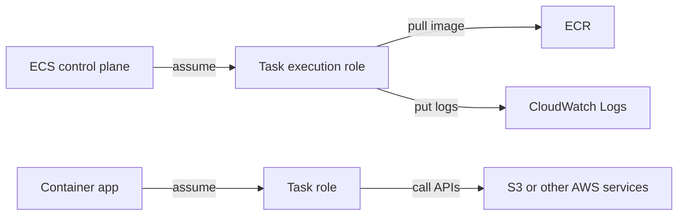
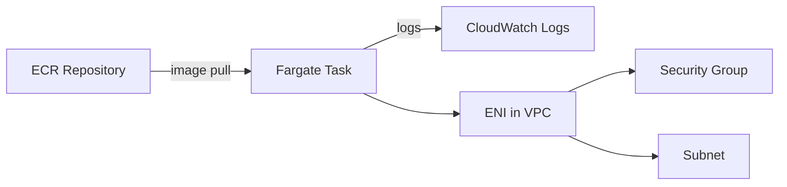

# 1. ECS와 Fargate가 분리하는 책임

## 1. ECS(Elastic Container Service)의 역할

ECS는 컨테이너를 "어디에, 어떤 설정으로, 몇 개를, 어떻게 유지할 것인가"를 관리하는 서비스다. 직접 EC2에 접속해 프로세스를 띄우는 방식과 달리, ECS는 실행 단위를 Task로 모델링하고 원하는 상태(desired state)를 유지하도록 동작한다.

이 Section은 ECS를 "Kubernetes 대체" 같은 관점으로 설명하지 않는다. AWS Fundamentals에서는 ECS가 기존 인프라(VPC, ALB, IAM, CloudWatch Logs) 위에서 어떤 역할을 하는지에 집중한다.

### ① Cluster는 논리적 경계다

ECS Cluster는 Task/Service를 담는 논리적 그룹이다. 네트워크(VPC)를 만들거나 격리하는 기능이 아니라, 운영 단위(환경, 프로젝트, 팀)로 컨테이너 실행을 묶는 단위로 이해하는 것이 유용하다.

### ② Launch type이 "누가 서버를 관리하는가"를 결정한다

ECS는 크게 두 실행 모델을 가진다.

- EC2 launch type: 컨테이너를 띄울 EC2 인스턴스를 사용자가 운영한다.
- Fargate launch type: 컨테이너 실행 인프라를 AWS가 관리한다.

Ch08에서는 Fargate를 기준으로 진행한다. "서버 운영" 부담을 줄이고, 배포 대상이 "인스턴스"가 아니라 "Task Definition"이 되도록 모델을 바꾸는 것이 목적이다.

---

# 2. Task Definition이 의미하는 것

## 1. Task Definition은 "컨테이너 실행 설정서"다

Task Definition은 컨테이너를 어떻게 실행할지 정의하는 템플릿이다. ECS는 Task Definition revision을 기준으로 Task를 실행하고, Service는 특정 revision을 원하는 수만큼 유지한다.

### ① Task Definition에 들어가는 핵심 요소

- Image: ECR Image URI
- Port mappings: 컨테이너 포트, 프로토콜
- CPU/Memory: 리소스 할당(Fargate에서는 조합 제약이 존재)
- Env/Secrets: 환경변수, 민감 정보(운영에서는 Secrets Manager/Parameter Store를 고려)
- Logs: CloudWatch Logs로 로그를 보낼 설정

[이미지: AWS Console - ECS - Task definitions - Create 화면 - Container/Image/Port/Logs 입력 포인트]

이 화면은 "컨테이너를 어떻게 실행하는가"의 핵심이 몰려 있다. Ch08 이후 모든 배포 변경은 이 설정을 바꾸고 revision을 올리는 방식으로 진행된다.

### ② Task Execution Role과 Task Role의 차이

ECS에는 Role이 2개 등장한다. 둘을 혼동하면 권한 문제를 해결하기 어렵다.

- Task execution role: ECS 에이전트가 "실행을 위해" 필요로 하는 권한
  - 대표적으로 ECR Pull, CloudWatch Logs Put
- Task role: 컨테이너 애플리케이션이 "런타임에서" AWS API를 호출하기 위한 권한
  - 예: S3 접근, Parameter Store 조회

이 다이어그램은 "누가 어떤 권한을 쓰는가"를 분리한다. Image Pull과 로그 전송은 execution role, 앱이 S3에 접근하는 것은 task role이다.

---

# 3. Fargate 네트워크 모델: awsvpc

## 1. Fargate Task는 ENI를 가진다

Fargate는 `awsvpc` 네트워크 모드를 사용한다. 각 Task는 VPC 안에서 ENI(Elastic Network Interface)를 할당받고, Security Group과 Subnet에 직접 연결된다.

이 특성 때문에 "컨테이너도 네트워크 관점에서 하나의 서버처럼" 다뤄야 한다.

### ① Subnet 선택이 외부 접근 경로를 결정한다

- Public Subnet + Public IP 할당: 외부에서 직접 접근 가능(학습/검증용)
- Private Subnet + ALB: 운영형 접근 경로(Ch05에서 만든 패턴과 결합)

Ch08의 최종 목표는 Private Subnet의 ECS Service를 ALB 뒤에 두는 구조다. `lab23`에서는 Task Definition을 준비하고, `lab24`에서 Service와 ALB 연동을 완성한다.

### ② Security Group은 Task 단위로 적용된다

EC2처럼 인스턴스 단위가 아니라, Task ENI에 Security Group이 붙는다. 따라서 "어떤 포트를 열어야 하는가"는 Task Definition의 Port mapping과 함께 결정해야 한다.

---

# 핵심 정리

- ECS는 컨테이너 실행을 Task/Service 모델로 관리하고, Cluster는 이를 묶는 논리적 경계다.
- Fargate는 컨테이너 실행 인프라를 AWS가 관리하며, Ch08의 기준 실행 모델이다.
- Task Definition은 컨테이너 실행 설정서이며 revision 단위로 변경이 관리된다.
- Role은 execution role(실행을 위해)과 task role(앱 런타임에서)로 분리해 이해한다.
- Fargate Task는 ENI를 가지며 Subnet/SG 선택이 네트워크 경계를 결정한다.

---

# [실습] lab23: ECS Cluster와 Task Definition 생성

Fargate 기반 ECS Cluster를 생성하고, ECR Image를 사용해 Task Definition을 작성한다. Role, Port mapping, CloudWatch Logs 설정을 포함해 "실행 가능한 컨테이너 설정서"를 완성한다.

---

### 실습 목표

- ECS Cluster(Fargate)를 생성한다.
- Task Definition을 작성하고 revision을 생성한다.
- Task execution role과 task role을 구분해 설정한다.
- CloudWatch Logs로 로그를 보낼 구성을 추가한다.

⚠️ 비용 주의: 본 실습에서는 ECS, CloudWatch Logs, IAM Role 등을 생성한다. 과금이 크지는 않지만 리소스를 방치하면 비용이 누적될 수 있다.

---

# 1. 전체 아키텍처

이 실습은 "실행 환경 준비" 단계다. ECR에 있는 Image를 기준으로 Task Definition을 만들고, 네트워크와 로그 전송까지 실행에 필요한 요소를 연결한다.

---

# 2. 사전 준비

- 리전: `ap-northeast-2 (Seoul)`
- `lab22` 완료
  - ECR Repository와 Image Tag가 존재해야 한다(예: `gallery:lab22`)
- VPC/Subnet 준비
  - 운영형 배포는 Private Subnet + ALB를 사용한다.
  - `lab23`에서는 Task Definition 작성 자체가 목표이므로, Subnet 선택은 `lab24`에서 확정한다.

⚠️ 주의:

- ECS 설정 화면에서 "Role"과 "networking"이 동시에 등장한다. 실행 실패의 대부분은 권한 또는 Subnet/SG 선택 오류에서 발생한다.

---

# 3. 리소스 생성 및 설정

각 단계에서 AWS Console 화면 스냅샷을 반드시 명시한다.
예: `[이미지: AWS Console - ECS - {화면} - {핵심 포인트}]`

## 1. ECS Cluster 생성(Fargate)

설명: Task/Service가 속할 논리적 그룹을 만든다.

[이미지: AWS Console - ECS - Clusters - Create cluster 화면 - Cluster name/Infrastructure 선택 포인트]

설정 포인트(예시):

- Cluster name: `fundamentals-ecs`
- Infrastructure: AWS Fargate(기본)

## 2. IAM Role 준비(Task execution role, Task role)

설명: 실행에 필요한 권한(execution role)과 앱 런타임 권한(task role)을 분리한다.

[이미지: AWS Console - IAM - Roles - Create role(ECS Task) 화면 - Trusted entity/ECS Task 선택 포인트]
[이미지: AWS Console - IAM - Roles - Permissions - 정책 연결 화면 - ECR/Logs 권한 확인 포인트]

권한 포인트(개념 기준):

- Task execution role
  - ECR Pull 권한
  - CloudWatch Logs Put 권한
- Task role
  - 기본은 비워도 된다(이 Lab의 목표는 "구분"이다)
  - S3/RDS 등은 이후 Lab에서 필요 시 추가한다

⚠️ 주의:

- execution role이 없거나 권한이 부족하면 Task가 Image를 Pull하지 못하고 시작 단계에서 실패한다.

## 3. Task Definition 생성(Fargate)

설명: ECR Image URI, Port mapping, Logs, Role을 포함해 실행 설정서를 만든다.

[이미지: AWS Console - ECS - Task definitions - Create new task definition 화면 - Launch type/Fargate 선택 포인트]
[이미지: AWS Console - ECS - Task definition - Container - Image/Port mapping 입력 포인트]
[이미지: AWS Console - ECS - Task definition - Logging - CloudWatch Logs 설정 화면 - log group/stream prefix 확인]
[이미지: AWS Console - ECS - Task definition - Roles - execution role/task role 선택 포인트]

설정 포인트(예시):

- Task definition family: `gallery`
- Launch type: Fargate
- OS/Architecture: Linux/X86_64(기본)
- Task size: CPU/Memory는 최소 조합으로 시작(학습용)
- Container name: `gallery`
- Image URI: **{account_id}**.dkr.ecr.ap-northeast-2.amazonaws.com/gallery:lab22
- Container port: `8080` (Gallery 기본 포트)
- Logs: CloudWatch Logs 활성화
  - Log group: `/ecs/gallery`
  - Stream prefix: `ecs`
- Task execution role: `**{task_execution_role_name}**`
- Task role: `**{task_role_name}**` (또는 none)

## 4. (선택) Task Definition 기반으로 1회 실행 확인

설명: Service를 만들기 전에, Task Definition이 최소한 "Pull -> Start -> Logs"까지 가능한지 확인한다. 이 단계는 학습/디버깅을 위한 선택 항목이다.

[이미지: AWS Console - ECS - Task definitions - Run task 화면 - VPC/Subnet/Assign public IP 선택 포인트]
[이미지: AWS Console - ECS - Tasks - Task details 화면 - Last status/Stopped reason 확인 포인트]
[이미지: AWS Console - CloudWatch Logs - Log group - 로그 스트림 화면 - 앱 시작 로그 확인 포인트]

⚠️ 주의:

- 이 단계에서 Public IP를 쓰는 것은 "검증용"이다. 최종 배포는 Private Subnet + ALB를 기준으로 한다.

---

# 4. 실행 및 결과 검증

설명: Task Definition이 정상적으로 생성되고, (선택) 1회 실행에서 Image Pull 및 Logs 전송이 확인되면 성공이다.

## 1. Task Definition revision 확인

[이미지: AWS Console - ECS - Task definitions - Revisions 목록 - 최신 revision 확인 포인트]

다음을 확인한다.

- Task Definition family가 생성되었다(예: `gallery`)
- revision이 1 이상이다
- Container 정의에 Image/Port/Logs 설정이 들어 있다

## 2. (선택) Task 실행 상태와 Logs 확인

[이미지: AWS Console - ECS - Cluster - Tasks 탭 - RUNNING/STOPPED 상태 확인]
[이미지: AWS Console - CloudWatch Logs - Log group - 최근 로그 확인]

다음을 확인한다.

- Task가 RUNNING 상태로 진입한다(또는 STOPPED인 경우 Stopped reason으로 원인을 확인한다)
- CloudWatch Logs에 앱 시작 로그가 적재된다

---

# 5. 자원 정리

실습 리소스를 정리한다.

- (선택 실행을 한 경우) 실행한 Task stop 또는 종료 확인
- Task Definition은 즉시 삭제되지 않으며, 이후 Lab에서 재사용한다
- IAM Role은 이후 Lab에서 사용할 예정이면 삭제하지 않는다

[이미지: AWS Console - ECS - Cluster - Tasks - Stop task 화면 - 종료 확인 포인트]

⚠️ 주의:

- 다음 Lab에서 Service를 만들 예정이면 Cluster/Role/Task Definition을 유지하는 편이 효율적이다.
- 정리가 필요한 경우는 "불필요한 리소스를 만들었거나 다른 실습과 계정을 분리해야 하는 경우"다.

---

# 참고 자료

- [Amazon ECS developer guide (AWS)](https://docs.aws.amazon.com/AmazonECS/latest/developerguide/Welcome.html)
- [Amazon ECS task definitions (AWS)](https://docs.aws.amazon.com/AmazonECS/latest/developerguide/task_definitions.html)
- [Using Amazon ECS task execution IAM role (AWS)](https://docs.aws.amazon.com/AmazonECS/latest/developerguide/task_execution_IAM_role.html)
- [Fargate task networking (AWS)](https://docs.aws.amazon.com/AmazonECS/latest/developerguide/fargate-task-networking.html)
