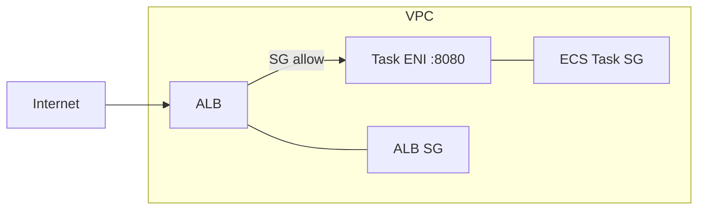

# 1. ECS Service가 하는 일

## 1. Service는 "원하는 상태"를 유지한다

ECS Service는 Task를 지정한 개수(desired count)만큼 유지하는 컨트롤러다. Task가 실패하거나 종료되면 Service가 새 Task를 다시 띄워 상태를 복구한다. EC2에 직접 배포할 때의 "프로세스 감시"를 ECS가 관리형 형태로 제공한다고 보면 된다.

### ① Task와 Service의 관계

- Task: 컨테이너 실행 1회분(실행 인스턴스)
- Service: Task를 지속적으로 유지하고 배포를 수행하는 단위

Service를 만들면 "몇 개를 유지할지", "어느 Subnet/SG에서 띄울지", "어떤 Target Group에 등록할지"가 배포 설정으로 고정된다.

### ② Desired count와 Deployment

Service는 다음을 반복해서 수행한다.

- desired count에 맞춰 Task 수를 맞춘다
- Task Definition revision이 바뀌면 새 revision으로 롤아웃한다
- 헬스체크 실패/실행 실패를 이벤트로 남긴다

[이미지: AWS Console - ECS - Service details - Deployments/Events 화면 - 롤아웃/실패 원인 확인 포인트]

이 화면은 문제 해결의 출발점이다. "왜 Task가 계속 재시작되는가"는 Events, "어떤 revision이 배포됐는가"는 Deployments에서 확인한다.

---

# 2. Fargate + ALB 연동의 핵심 포인트

## 1. Target Group의 Target type은 IP다

Fargate Task는 ENI를 가지므로 ALB는 "인스턴스"가 아니라 "IP"로 Target을 등록해야 한다.

[이미지: AWS Console - EC2 - Target Groups - Create target group 화면 - Target type IP 선택 포인트]

이 설정이 인스턴스(EC2)로 되어 있으면 Fargate Service가 정상적으로 Target 등록을 하지 못한다.

## 2. Health check는 "정상 상태"의 정의다

ALB는 Target Group health check로 Task의 정상 여부를 판단한다. 정상 정의가 잘못되면 다음 현상이 발생한다.

- Task는 RUNNING인데 ALB는 Unhealthy로 판단해 트래픽을 보내지 않는다
- Service가 Unhealthy를 보고 Task를 교체한다(롤아웃이 끝나지 않는다)

Ch08에서는 앱 변경 없이 `/` 경로로 health check를 구성한다. 운영형으로는 별도의 health endpoint를 두는 것을 권장하지만, 애플리케이션 변경은 이 시리즈 범위를 벗어난다.

## 3. Security Group은 "ALB -> Task" 경로를 열어야 한다

Service 배포에서 가장 흔한 실패는 Security Group이다.

- ALB SG: 인터넷(또는 Route 53)에서 들어오는 트래픽 허용(Ch05 패턴)
- ECS Task SG: ALB SG로부터 8080 허용(또는 컨테이너 포트)



이 구조는 "누가 누구에게 어떤 포트로 들어오는가"를 보여준다. Task SG는 Public을 열지 않고, ALB SG를 소스로 제한하는 것이 운영형 패턴이다.

---

# 3. Service Auto Scaling(개요)

## 1. Auto Scaling은 "원하는 상태"를 자동 조정한다

Service Auto Scaling은 desired count를 CPU/Memory 등 지표에 따라 자동으로 늘리거나 줄이는 기능이다. Ch05에서 다룬 EC2 Auto Scaling과 목적은 비슷하지만, 대상이 인스턴스가 아니라 "Task 수"다.

### ① 이 Section에서 다루는 범위

이 Section에서는 Auto Scaling을 "존재와 역할"만 소개한다. 실제 정책 구성은 시리즈의 핵심 범위(기본 배포) 이후 단계에서 다루는 것이 적절하다.

---

# 핵심 정리

- ECS Service는 Task를 desired count만큼 유지하며, 배포 단위(revision)로 롤아웃을 수행한다.
- Fargate는 Target Group에 IP로 등록되어야 하므로 Target type은 IP가 되어야 한다.
- Health check 경로/기준이 잘못되면 Unhealthy 루프가 발생한다.
- Security Group은 "ALB -> Task" 경로를 명시적으로 열어야 한다.

---

# [실습] lab24: Fargate Service 배포와 ALB 연동

ECS Service를 생성해 Fargate Task를 Private Subnet에 배포하고, ALB Target Group(Target type IP)에 연결한다. ALB 도메인으로 접속해 Gallery가 정상 동작하는지 확인한다.

---

### 실습 목표

- ECS Service를 생성하고 desired count로 Task를 유지한다.
- Target Group(Target type IP)과 Listener rule을 구성한다.
- Private Subnet에 배포된 Task에 ALB를 통해 접근한다.
- Events/Logs로 배포 상태를 확인한다.

⚠️ 비용 주의: 본 실습에서는 ALB, ECS, CloudWatch Logs 등을 사용한다. 리소스를 방치하면 비용이 누적될 수 있다.

---

# 1. 전체 아키텍처

```mermaid
flowchart LR
  Internet --> ALB[ALB :80]
  ALB --> TG[Target Group (IP)]
  TG --> Task[Service -> Fargate Tasks :8080]
  Task --> CWL[CloudWatch Logs]
  Task --> ECR[ECR (image pull)]
```

이 실습은 "Service를 만들면 Task가 자동으로 떠 있고, ALB가 그 Task로 트래픽을 전달한다"는 운영형 배포의 최소 형태를 완성한다.

---

# 2. 사전 준비

- `lab22` 완료: ECR Image 존재(예: `gallery:lab22`)
- `lab23` 완료: ECS Cluster, Task Definition 존재
- VPC/ALB 준비
  - Ch05에서 구성한 ALB가 있다면 재사용한다.
  - 없다면 이 Lab에서 ALB를 새로 만드는 대신, 기존 Chapter의 ALB 실습을 먼저 완료하는 것을 권장한다.

⚠️ 주의:

- ALB가 없다면 "Service 배포는 되는데 외부에서 확인이 어려운" 상태가 된다. 이 Lab의 목표는 ALB 경유 접근까지 포함한다.

---

# 3. 리소스 생성 및 설정

각 단계에서 AWS Console 화면 스냅샷을 반드시 명시한다.
예: `[이미지: AWS Console - ECS - {화면} - {핵심 포인트}]`

## 1. Target Group 생성(Target type IP)

설명: ALB가 트래픽을 전달할 대상을 "IP"로 관리하는 Target Group을 만든다.

[이미지: AWS Console - EC2 - Target Groups - Create target group 화면 - Target type IP/Protocol/Port 설정 포인트]

설정 포인트(예시):

- Target type: IP
- Protocol: HTTP
- Port: `8080`
- VPC: `**{vpc_id}**`
- Health check path: `/`

## 2. Listener rule 연결(ALB -> Target Group)

설명: ALB Listener(예: 80)가 요청을 받으면 새 Target Group으로 전달하도록 연결한다.

[이미지: AWS Console - EC2 - Load Balancers - Listeners 탭 - 규칙 편집 화면 - Forward to Target Group 선택]

설정 포인트(예시):

- Listener: HTTP:80
- Rule: path 기반 또는 host 기반(조직/도메인 구성에 따라)
- Action: Forward to `**{target_group_name}**`

⚠️ 주의:

- 기존 EC2 Target Group과 혼동하지 않는다. ECS는 Target type IP가 필요하다.

## 3. ECS Service 생성(Fargate)

설명: Task Definition revision을 기준으로 Service를 만들고, Private Subnet과 SG를 지정해 Task를 원하는 수만큼 유지한다.

[이미지: AWS Console - ECS - Clusters - Services - Create service 화면 - Launch type/Task definition/Service name 선택 포인트]
[이미지: AWS Console - ECS - Create service - Networking 화면 - Subnet/SG/Assign public IP 선택 포인트]
[이미지: AWS Console - ECS - Create service - Load balancing 화면 - ALB/Target Group 연결 포인트]

설정 포인트(예시):

- Cluster: `fundamentals-ecs`
- Launch type: Fargate
- Task definition: `gallery:{latest_revision}`
- Service name: `gallery-svc`
- Desired tasks: `1`
- Networking
  - VPC: `**{vpc_id}**`
  - Subnets: Private Subnet 2개 이상(가능한 경우)
  - Security group: `**{ecs_task_sg_id}**`
  - Assign public IP: Disabled
- Load balancing
  - Load balancer: `**{alb_name}**`
  - Target group: `**{target_group_name}**` (Target type IP)
  - Container: `gallery`
  - Container port: `8080`

## 4. Security Group 설정(ALB -> Task 허용)

설명: Task SG는 ALB SG로부터 컨테이너 포트(8080) inbound를 허용해야 한다.

[이미지: AWS Console - EC2 - Security Groups - ECS Task SG Inbound rules 화면 - Source를 ALB SG로 제한하는 포인트]

설정 포인트(예시):

- ECS Task SG inbound
  - Type: Custom TCP
  - Port: 8080
  - Source: `**{alb_sg_id}**`

⚠️ 주의:

- "0.0.0.0/0로 8080 오픈"은 학습용이라도 피한다. ALB SG를 소스로 제한하는 형태로 습관을 고정한다.

---

# 4. 실행 및 결과 검증

설명: Service가 desired count를 만족하고, Target Group health check가 Healthy가 되며, ALB로 접근이 가능하면 성공이다.

## 1. ECS Service 상태 확인(Deployments/Events)

[이미지: AWS Console - ECS - Service details - Deployments 화면 - PRIMARY revision 확인]
[이미지: AWS Console - ECS - Service details - Events 화면 - 실패/재시작 원인 확인]

다음을 확인한다.

- Running tasks = Desired tasks
- Deployments가 안정화된다
- Events에 반복 오류가 없다

## 2. Target Group health 확인

[이미지: AWS Console - EC2 - Target Groups - Targets 탭 - Healthy 상태 확인]

다음을 확인한다.

- Target이 등록된다
- Health status가 Healthy다

## 3. CloudWatch Logs 확인

[이미지: AWS Console - CloudWatch - Logs - Log group(/ecs/gallery) - 최근 로그 확인]

다음을 확인한다.

- 앱 시작 로그가 적재된다
- 요청이 들어오면 액세스/애플리케이션 로그가 증가한다

## 4. ALB 도메인으로 접속 확인

[이미지: 브라우저 - ALB DNS name 접속 - Gallery 화면 로드 확인]

다음을 확인한다.

- ALB DNS name으로 접속 시 Gallery 화면이 로드된다
- (선택) 업로드/삭제가 기본 동작한다(스토리지/DB는 이후 프로젝트 Lab에서 완성한다)

---

# 5. 자원 정리

학습 흐름을 이어가기 위해, 이 Chapter의 프로젝트 Lab을 진행할 예정이라면 리소스를 유지한다.

정리가 필요한 경우 다음을 삭제한다.

- ECS Service 삭제(Tasks 포함)
- Target Group 삭제
- (필요 시) Listener rule 원복

[이미지: AWS Console - ECS - Service - Delete service 화면 - desired count 0/삭제 확인]
[이미지: AWS Console - EC2 - Target Groups - Delete target group 화면 - 삭제 확인]

⚠️ 주의:

- Service를 삭제하면 연결된 Task가 함께 종료된다.
- Target Group이 Listener에 연결되어 있으면 삭제가 막힐 수 있다. Listener rule을 먼저 분리한다.

---

# [실습] Gallery: ECS(Fargate) 배포

이전 Chapter에서 구성한 Gallery 인프라(VPC, ALB, S3, RDS)를 유지한 채, 실행 환경을 EC2에서 ECS(Fargate)로 전환한다. 같은 Gallery 앱을 컨테이너 이미지로 실행하고, ALB를 통해 접근하며 S3/RDS 연동이 유지되는지 확인한다.

---

### 실습 목표

- Gallery를 컨테이너 이미지로 빌드하고 ECR에 저장한다.
- ECS Task Definition에 S3/RDS 설정을 환경변수로 주입한다.
- ECS Service(Fargate)를 Private Subnet에 배포하고 ALB로 접근한다.
- 기존 Gallery 기능(업로드, 조회, 삭제)이 S3/RDS 기반으로 동작하는지 검증한다.

⚠️ 비용 주의: 본 실습에서는 ECS, ECR, ALB, RDS, S3 등을 사용한다. 리소스를 방치하면 비용이 누적될 수 있다.

---

# 1. 전체 아키텍처

```mermaid
flowchart LR
  Internet --> ALB[ALB :80]
  ALB --> TG[Target Group (IP)]
  TG --> Task[Gallery on ECS(Fargate)]
  Task --> S3[S3 (uploads)]
  Task --> RDS[RDS(MariaDB 11.8.5)]
  Task --> CWL[CloudWatch Logs]
  Task --> ECR[ECR (image pull)]
```

이 프로젝트 Lab은 Ch03~Ch07에서 만든 "동작하는 Gallery 인프라"를 그대로 두고, 실행 주체만 EC2 프로세스에서 Fargate Task로 바꾸는 것이 핵심이다.

---

# 2. 사전 준비

- VPC/ALB: Ch05 Gallery 실습(ALB/ASG/Route 53)까지 완료된 상태
- S3: Ch06 "Gallery - S3 연동"까지 완료된 상태
- RDS: Ch07 "Gallery - RDS(MariaDB 11.8.5) 연동"까지 완료된 상태
- ECR/ECS 준비: `lab22`, `lab23`, `lab24` 개념을 이해한 상태

필요 값(플레이스홀더):

- `**{account_id}**`
- `**{vpc_id}**`
- `**{private_subnet_ids}**`
- `**{alb_dns_name}**`
- `**{s3_bucket_name}**`
- `**{rds_endpoint}**`
- `**{db_name}**`
- `**{db_username}**`
- `**{db_password}**`

⚠️ 주의:

- 비밀번호를 Task Definition에 평문으로 넣는 것은 운영에서는 피한다. 실습에서는 흐름 이해를 위해 환경변수로 주입할 수 있으나, 운영에서는 Secrets Manager/Parameter Store를 검토한다.

---

# 3. 리소스 생성 및 설정

각 단계에서 AWS Console 화면 스냅샷을 반드시 명시한다.
예: `[이미지: AWS Console - ECS - {화면} - {핵심 포인트}]`

## 1. (로컬) Gallery Image 빌드 및 ECR Push

설명: Gallery를 컨테이너 이미지로 만들어 ECR에 저장한다.

[이미지: 터미널 - Maven build - JAR 산출물 생성 로그]
[이미지: 터미널 - Docker build - Image 생성 로그]
[이미지: AWS Console - ECR - View push commands 화면 - 로그인/태그/푸시 명령 확인]

예시(개념 설명용):

```bash
./mvnw clean package -DskipTests -Dbuild.finalName=gallery
docker build -t gallery:local .
docker tag gallery:local {account_id}.dkr.ecr.ap-northeast-2.amazonaws.com/gallery:gallery-ecs
docker push {account_id}.dkr.ecr.ap-northeast-2.amazonaws.com/gallery:gallery-ecs
```

## 2. Task Definition 생성 또는 갱신(환경변수 주입)

설명: S3/RDS 연동을 위해 앱 설정을 환경변수로 주입한다. 기존 `lab23`의 Task Definition을 복제해 새 revision으로 만든다.

[이미지: AWS Console - ECS - Task definitions - Create new revision 화면 - Container environment variables 입력 포인트]

환경변수 예시(플레이스홀더, 키 이름은 workload 구성에 맞게 조정):

- `spring.profiles.active=prod`
- `server.port=8080`
- `app.storage.type=s3`
- `app.storage.s3.bucket=**{s3_bucket_name}**`
- `spring.datasource.url=jdbc:mariadb://**{rds_endpoint}**:3306/**{db_name}**?sslMode=trust`(Ch07 Gallery 연동과 동일, 짧은 URL 유지)
- `spring.datasource.username=**{db_username}**`
- `spring.datasource.password=**{db_password}**`

⚠️ 주의:

- 키 이름은 애플리케이션 구현과 매칭되어야 한다. 실제 키는 workload 설정과 맞춘다.
- 이 실습은 "주입 구조"를 이해하는 것이 목적이며, 세부 키는 프로젝트 상황에 맞게 조정한다.

## 3. ECS Service 생성 또는 업데이트(ALB 연동, Private Subnet)

설명: 새 Task Definition revision으로 Service를 배포하고 ALB Target Group(IP)과 연결한다.

[이미지: AWS Console - ECS - Service update 화면 - Task definition revision 변경 포인트]
[이미지: AWS Console - ECS - Service - Load balancing 화면 - Target Group 연결 확인]

## 4. IAM Role 점검(Task role)

설명: 컨테이너가 S3에 접근해야 하므로 Task role에 S3 권한이 필요하다. (execution role이 아니라 task role이다.)

[이미지: AWS Console - IAM - Roles - Task role - Permissions 탭 - S3 권한 확인 포인트]

---

# 4. 실행 및 결과 검증

설명: ALB로 접근했을 때 Gallery가 정상 동작하고, 업로드 파일이 S3에 저장되며, 데이터가 RDS에 기록되면 성공이다.

## 1. ECS Service 상태 확인

[이미지: AWS Console - ECS - Service details - Deployments/Events - 안정화 확인]

## 2. ALB 접근 및 기능 확인

[이미지: 브라우저 - http://{alb_dns_name} - 목록 화면]
[이미지: 브라우저 - 이미지 업로드 후 - 목록에 표시]

## 3. S3 업로드 확인

[이미지: AWS Console - S3 - Bucket - Objects 목록 - 업로드 파일 확인]

## 4. RDS 반영 확인

[이미지: (옵션) DB Client - item 테이블 조회 결과]

⚠️ 주의:

- DB 조회는 운영에서는 보안상 제한된다. 실습에서는 "데이터가 DB에 남는다"는 개념을 확인하는 수준으로만 수행한다.

---

# 5. 자원 정리

프로젝트 흐름상 이 Lab 이후 추가 진도가 없다면, 비용 방지를 위해 리소스를 정리한다.

- ECS Service 삭제(Tasks 포함)
- Target Group 삭제(Listener rule 분리 후)
- (선택) ECR Image 정리

[이미지: AWS Console - ECS - Service - Delete service 화면 - 삭제 확인]
[이미지: AWS Console - EC2 - Target Groups - Delete target group 화면 - 삭제 확인]
[이미지: AWS Console - ECR - Images - 이미지 삭제 화면 - 삭제 확인]

⚠️ 주의:

- ALB, RDS, S3는 이전 Chapter에서 계속 사용했을 수 있다. 프로젝트 전체 종료 시점에 일괄 정리하는 편이 안전하다.

---

# 참고 자료

- [Amazon ECS services (AWS)](https://docs.aws.amazon.com/AmazonECS/latest/developerguide/ecs_services.html)
- [Service load balancing (AWS ECS)](https://docs.aws.amazon.com/AmazonECS/latest/developerguide/service-load-balancing.html)
- [Target group target type for Fargate (AWS)](https://docs.aws.amazon.com/elasticloadbalancing/latest/application/load-balancer-target-groups.html)
- [Amazon ECS deployment types (AWS)](https://docs.aws.amazon.com/AmazonECS/latest/developerguide/deployment-type.html)
