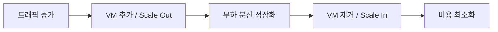

이 시리즈는 Azure Portal을 직접 다루며 Cloud Infrastructure를 이해하는 것을 목표로 한다. 첫 번째 챕터에서는 Cloud Computing이 무엇인지, Azure가 어디에 위치하는지를 잡는다. 개념의 출발점이 명확할수록 이후 실습에서 "왜 이 리소스를 만드는가"에 대한 감각이 생긴다.

# On-premises와 Cloud

On-premises(온프레미스)는 조직이 직접 하드웨어를 구매하고 데이터센터를 운영하는 방식이다. 서버, 네트워크 장비, 전원, 냉각 시스템을 모두 직접 관리한다. 반면 Cloud는 공급자(Azure, AWS, GCP 등)가 물리 인프라를 운영하고, 사용자는 그 위에서 가상화된 리소스를 서비스로 소비한다.

## 1. 비교: 소유 vs 소비

| 항목 | On-premises | Cloud |
|------|------------|-------|
| 인프라 소유 | 조직이 직접 보유 | 공급자 소유, 사용자는 소비 |
| 초기 비용 | 높음 (서버 구매, 공간, 전력) | 낮음 (사용한 만큼만 비용) |
| 확장 속도 | 느림 (하드웨어 조달 필요) | 빠름 (수 분 내 리소스 생성) |
| 운영 책임 | 하드웨어부터 애플리케이션까지 | 공급자와 사용자가 계층별로 분담 |

## 2. Cloud로의 전환이 의미하는 것

Cloud 도입은 단순히 서버를 임대하는 것이 아니다. 핵심은 **인프라 운영 부담을 공급자에게 이전하고, 개발팀이 애플리케이션 로직에 집중**할 수 있는 구조로 바꾸는 것이다. 이 시리즈는 그 구조를 Azure Portal에서 직접 만들어보는 과정이다.

---

# IaaS, PaaS, SaaS

Cloud 서비스는 "어디까지 공급자가 관리하는가"에 따라 세 계층으로 나뉜다.

## 1. 계층 구분

```text
사용자 책임 ←────────────────────────────────────→ 공급자 책임

  On-premises     IaaS          PaaS           SaaS
  ─────────────────────────────────────────────────
  Applications  │ You manage │ You manage  │ Provider
  Data          │ You manage │ You manage  │ Provider
  Runtime       │ You manage │ Provider    │ Provider
  OS            │ You manage │ Provider    │ Provider
  VM / Compute  │ Provider   │ Provider    │ Provider
  Storage       │ Provider   │ Provider    │ Provider
  Network       │ Provider   │ Provider    │ Provider
  Hardware      │ Provider   │ Provider    │ Provider
```

### ① IaaS (Infrastructure as a Service)

VM, Storage, Network 같은 인프라를 서비스로 제공한다. OS 설치, 런타임 설정, 보안 패치는 사용자 책임이다. 인프라를 직접 제어하고 싶지만 하드웨어 소유는 피하고 싶을 때 선택한다.

- Azure 예시: Azure Virtual Machine, Azure VNet, Azure Blob Storage

### ② PaaS (Platform as a Service)

OS와 런타임까지 공급자가 관리한다. 개발자는 코드와 데이터에만 집중할 수 있다. 인프라 운영보다 애플리케이션 개발 속도가 우선일 때 선택한다.

- Azure 예시: Azure App Service, Azure SQL Database, Azure Container Apps

### ③ SaaS (Software as a Service)

완성된 애플리케이션을 서비스로 구독한다. 인프라와 코드 모두 공급자가 운영한다.

- Azure/Microsoft 예시: Microsoft 365, Dynamics 365

## 2. 이 시리즈에서 다루는 계층

이 시리즈는 주로 **IaaS** 중심이다. VM, VNet, Storage를 직접 만들고 연결한다. 마지막 Chapter에서 Azure Container Apps(PaaS에 가까운 영역)를 다루며 IaaS와 비교하는 시점이 온다.

---

# Cloud의 핵심 특성

Cloud가 On-premises와 근본적으로 다른 이유는 세 가지 특성에서 온다.

## 1. 탄력성 (Elasticity)

수요에 따라 리소스를 확장(Scale out)하거나 축소(Scale in)할 수 있다. On-premises에서는 트래픽 급증에 대비해 항상 여유 서버를 보유해야 했다. Cloud에서는 필요한 시점에 리소스를 추가하고, 필요 없을 때 제거한다.



이 흐름은 Ch05(Traffic Management)에서 Azure의 자동 스케일링 기능으로 직접 구현해본다.

## 2. 종량제 (Pay-as-you-go)

사용한 리소스에 대해서만 비용이 발생한다. VM을 실행한 시간, 저장한 데이터 용량, 처리한 네트워크 트래픽이 과금 기준이 된다. 리소스를 삭제하면 비용이 멈춘다. 이 시리즈에서 실습 후 "자원 정리"를 매번 강조하는 이유가 여기에 있다.

## 3. 글로벌 배포 (Global Deployment)

공급자가 전 세계에 데이터센터를 운영하기 때문에, 사용자는 몇 번의 클릭으로 특정 지역(Region)에 리소스를 배포할 수 있다. 사용자와 가까운 Region에 배포하면 응답 속도가 줄고, 규정(데이터 거주지 요건)을 충족할 수 있다.

---

# Azure 서비스 영역 개괄

Azure는 200개 이상의 서비스를 제공한다. 이 시리즈에서 다루는 영역은 다음과 같다.

## 1. 이 시리즈가 다루는 서비스 영역

| 영역 | 대표 서비스 | 다루는 Chapter |
|------|------------|--------------|
| Identity | Microsoft Entra ID | Ch02 |
| Compute | Virtual Machine | Ch03 |
| Networking | Virtual Network, Load Balancer, Application Gateway | Ch04, Ch05 |
| Object Storage | Azure Blob Storage | Ch06 |
| Database | Azure Database for MySQL | Ch07 |
| Container | Azure Container Registry, Azure Container Apps | Ch08 |

## 2. AWS와의 대응 관계

이미 AWS를 사용하거나 AWS Fundamentals 시리즈를 학습한 경우, 다음 대응 관계를 참고할 수 있다. 완전히 동일하지 않지만, 구조를 잡는 데 도움이 된다.

| Azure | AWS |
|-------|-----|
| Virtual Machine | EC2 |
| Virtual Network (VNet) | VPC |
| Azure Blob Storage | Amazon S3 |
| Azure Database for MySQL | Amazon RDS (MySQL) |
| Microsoft Entra ID | AWS IAM |
| Azure Container Apps | AWS ECS (Fargate) |

Azure는 AWS와 개념적으로 유사한 부분이 많지만, 리소스 계층 구조(Tenant → Subscription → Resource Group)와 네트워킹 설계에서 차이가 있다. 이 차이는 각 Chapter에서 직접 다룬다.

---

# 핵심 정리

- Cloud는 인프라 소유가 아니라 서비스 소비 방식이다. 운영 부담을 공급자에게 이전하고 애플리케이션에 집중할 수 있다.
- IaaS는 VM·Storage·Network를 서비스로 제공한다. 이 시리즈는 IaaS 중심으로 Azure 리소스를 직접 만들고 연결한다.
- Cloud의 핵심 특성(탄력성, 종량제, 글로벌 배포)은 인프라 설계 결정과 직결된다. 실습에서 이 특성들이 어디에 반영되는지 확인한다.

---

# 참고 자료

- [What is cloud computing? (Microsoft Azure)](https://azure.microsoft.com/ko-kr/resources/cloud-computing-dictionary/what-is-cloud-computing)
- [What are IaaS, PaaS, and SaaS? (Microsoft Azure)](https://azure.microsoft.com/ko-kr/resources/cloud-computing-dictionary/what-are-iaas-paas-saas)
- [Azure products and services](https://azure.microsoft.com/ko-kr/products)
