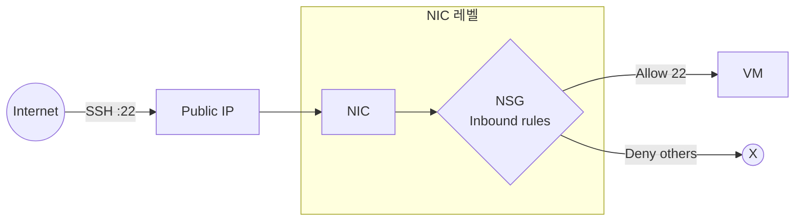
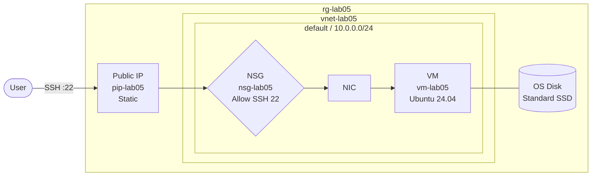

Ch03 섹션 01에서 VM을 구성하는 요소(NIC, Disk, NSG, Public IP)를 파악했다. 이번 섹션에서는 Azure Portal에서 직접 VM을 만들며, 각 설정이 어떤 결정을 요구하는지 확인한다. VM 생성은 선택 항목이 많아 보이지만, 핵심 결정은 Region, Size, 이미지, 인증 방식, 네트워크 설정 다섯 가지로 좁혀진다.

# VM 생성 옵션

## 1. Region과 Size

**Region**은 VM이 배포되는 Azure 데이터센터 위치다. 한국 기준 Korea Central(서울)과 Korea South(부산)가 있다. Region 선택은 세 가지를 고려한다.

- Latency: 사용자와 가까울수록 응답 속도 유리
- 서비스 가용성: 일부 VM Size나 서비스는 특정 Region에서만 제공
- 가격: Region마다 요금이 다름

**Size**는 VM의 하드웨어 프로파일이다. vCPU 수, Memory 용량, 네트워크 대역폭을 결정한다. 이 시리즈 실습에는 B-series(Burstable)를 사용한다.

### ① B-series — 실습/개발 환경에 적합

평균 CPU 사용률이 낮고 간헐적인 부하가 필요한 워크로드용이다. CPU 크레딧을 적립해두었다가 부하가 몰릴 때 소비하는 방식으로 동작한다.

| Size | vCPU | Memory | 비고 |
|------|------|--------|------|
| Standard_B2s | 2 | 4 GiB | B-series v1, previous-gen. Capacity limited, 은퇴 예정(2028-11-15) |
| Standard_B2s_v2 | 2 | 4 GiB | Bsv2-series, 현재 세대. 동일 가격대, 권장 |

이 시리즈 실습은 `Standard_B2s_v2`를 기준으로 진행한다.

## 2. 이미지

VM이 부팅될 때 사용하는 OS 이미지다. 이 시리즈는 **Ubuntu Server 24.04 LTS - x64 Gen2**를 기준으로 사용한다.

- LTS(Long-Term Support): 장기 지원 버전. 2029년까지 보안 업데이트 제공
- Gen2: UEFI 기반 부팅. Gen1 대비 보안 부팅(Secure Boot) 지원, 더 큰 OS 디스크 허용

## 3. 인증 방식

SSH 접속을 위한 인증 방식이다. 이 시리즈는 **SSH public key** 방식을 사용한다.

- Azure Portal에서 키 쌍을 생성하면 공개키가 VM에 자동 등록된다
- 개인키(`.pem` 파일)를 다운로드해 로컬에 보관한다
- SSH 접속 시 이 개인키로 인증한다

SSH 실제 접속 절차는 섹션 03에서 다룬다. 이번 섹션에서는 VM 생성까지가 범위다.

---

# Public IP

Public IP (공용 IP 주소)는 VM이 인터넷에서 접근 가능한 주소를 갖도록 한다.

## 1. Standard SKU — 현재 유일한 선택지

Basic SKU는 2025년 9월 30일 은퇴했다. 현재 Azure Portal에서는 Standard SKU만 생성 가능하다.

| 항목 | Standard SKU |
|------|-------------|
| 할당 방식 | Static만 지원 |
| 기본 인바운드 | 차단 (Secure by default) |
| 가용성 영역 | 지원 |

### ① Static 할당의 의미

Static으로 설정하면 VM을 재시작하거나 중지/시작해도 동일한 IP가 유지된다. 외부에서 고정 주소로 접근해야 하는 경우(SSH 접속, 도메인 연결 등) Static이 필요하다.

### ② Secure by default — NSG가 없으면 접속 불가

Standard SKU Public IP는 기본적으로 모든 인바운드 트래픽을 차단한다. Public IP를 할당해도 NSG에서 명시적으로 허용하지 않으면 SSH를 포함한 어떤 접속도 불가능하다. "Public IP가 있는데 왜 접속이 안 되냐"는 오류의 대부분이 이 원인이다.

---

# NSG와 VM 연결 구조

NSG (Network Security Group)는 인바운드/아웃바운드 트래픽에 대한 허용/차단 규칙의 집합이다. Azure에서 VM 수준의 방화벽 역할을 한다.

## 1. 연결 위치

NSG는 VM에 직접 붙지 않는다. **NIC 레벨** 또는 **Subnet 레벨**에 연결된다.



트래픽은 Public IP를 거쳐 NIC에 도착한 뒤, NIC에 연결된 NSG의 규칙 평가를 받는다. VM 생성 시 기본으로 NIC 레벨에 NSG가 연결된다. Subnet 레벨 NSG를 함께 사용하면 두 곳 모두 통과해야 한다.

## 2. 기본 인바운드 규칙

VM 생성 시 NSG에는 자동으로 세 가지 기본 규칙이 등록된다. 삭제할 수 없다.

| 규칙 이름 | 우선순위 | 동작 |
|----------|---------|------|
| AllowVNetInBound | 65000 | VNet 내부 트래픽 허용 |
| AllowAzureLoadBalancerInBound | 65001 | Azure Load Balancer 허용 |
| DenyAllInbound | 65500 | 나머지 모든 인바운드 차단 |

우선순위 숫자가 낮을수록 먼저 처리된다. 사용자가 추가하는 규칙은 기본 규칙보다 낮은 번호(100~4096)를 부여해 먼저 평가하도록 한다.

## 3. 인바운드 규칙 추가

SSH 접속을 위해 TCP 22 허용 규칙이 필요하다. VM 생성 시 Basics 탭의 인바운드 포트 설정에서 SSH를 선택하면 자동으로 추가된다.

---

# 부팅 진단 (Boot Diagnostics)

VM이 부팅에 실패하거나 OS가 응답하지 않을 때 원인을 파악하는 기능이다. 부팅 화면 스크린샷과 시리얼 콘솔 로그를 Portal에서 확인할 수 있다.

## 1. 기본 활성화

VM 생성 시 Management 탭에서 기본으로 활성화된다(Managed storage account 사용). 별도 Storage Account를 만들 필요 없다.

## 2. 확인 경로

VM 접속이 안 될 때 첫 번째로 확인하는 위치다.

```
Azure Portal > Virtual machines > {vm-name} > Help > Boot diagnostics
```

부팅 스크린샷으로 OS 상태를 시각적으로 확인하고, 시리얼 로그에서 부팅 오류 메시지를 찾는다.

---

# 핵심 정리

- VM 생성의 핵심 결정은 Region, Size, 이미지, 인증 방식, 네트워크 설정이다. 이 다섯 가지를 이해하면 나머지 옵션은 기본값으로 진행할 수 있다.
- Standard Public IP(Static)는 현재 유일한 선택지이며, 기본 인바운드 차단(Secure by default) 원칙이 적용된다. NSG 허용 규칙 없이는 어떤 접속도 불가능하다.
- NSG는 NIC 또는 Subnet 레벨에 연결되며, 우선순위 기반 규칙으로 트래픽을 제어한다. DenyAllInbound 기본 규칙이 있어 명시적 허용이 없으면 모두 차단된다.

---

# 참고 자료

- [Quickstart: Create a Linux VM in the Azure portal](https://learn.microsoft.com/en-us/azure/virtual-machines/linux/quick-create-portal)
- [Public IP addresses in Azure](https://learn.microsoft.com/en-us/azure/virtual-network/ip-services/public-ip-addresses)
- [Azure network security groups overview](https://learn.microsoft.com/en-us/azure/virtual-network/network-security-groups-overview)
- [B family VM sizes (Azure)](https://learn.microsoft.com/en-us/azure/virtual-machines/sizes/general-purpose/b-family)

---

# [실습] lab05: Linux VM 생성 및 기본 구성

Ubuntu VM을 생성하고 Public IP(Static)를 할당한다. NSG에 SSH 인바운드 규칙을 설정해 외부 접속 경로를 구성하고, Portal에서 VM 상태를 확인한다.

### 실습 목표

- Resource Group을 생성하고 VM 리소스를 그룹으로 관리한다
- Ubuntu 24.04 LTS VM(Standard_B2s_v2)을 생성한다
- Public IP를 Static으로 할당한다
- NSG에 SSH(22) 인바운드 허용 규칙을 설정한다
- Portal에서 VM 상태(Running)와 연결 리소스를 확인한다

---

# 1. 전체 아키텍처



이 아키텍처는 의도적으로 단순하다. Default VNet을 그대로 사용하고, Public IP로 직접 외부 노출하는 구조다. Ch04(VNet)에서 Custom VNet으로 이전하고, Ch05(Traffic Management)에서 Load Balancer로 트래픽을 제어한다.

---

# 2. 사전 준비

- Azure 계정 로그인
- Location: **`Korea Central`**

---

# 3. Resource Group 생성

## 1. Azure Portal > Resource groups > **Create**

[콘솔화면: Azure Portal > Resource groups > Create > Basics 탭]

**설정:**

- Subscription: `{구독 선택}`
- Resource group: **`rg-lab05`**
- Region: **`Korea Central`**

## 2. Azure Portal > **Resource groups**

[콘솔화면: Azure Portal > Resource groups 목록 - rg-lab05 생성 확인]

**확인:**

- rg-lab05: **`Succeeded`**

---

# 4. VM 생성

## 1. Azure Portal > Virtual machines > Create > **Azure virtual machine** — Basics

[콘솔화면: Azure Portal > Virtual machines > Create > Azure virtual machine > Basics 탭]

**설정 — Project details:**

- Subscription: `{구독 선택}`
- Resource group: **`rg-lab05`**

**설정 — Instance details:**

- Virtual machine name: **`vm-lab05`**
- Region: **`Korea Central`**
- Availability options: **`No infrastructure redundancy required`**
- Security type: **`Standard`**
- Image: **`Ubuntu Server 24.04 LTS - x64 Gen2`**
- Size: **`Standard_B2s_v2`** (2 vCPU, 4 GiB RAM)

**설정 — Administrator account:**

- Authentication type: **`SSH public key`**
- Username: **`azureuser`**
- SSH public key source: **`Generate new key pair`**
- Key pair name: **`key-lab05`**

**설정 — Inbound port rules:**

- Public inbound ports: **`Allow selected ports`**
- Select inbound ports: **`SSH (22)`**

## 2. Azure Portal > Virtual machines > Create > Azure virtual machine > **Networking**

[콘솔화면: Azure Portal > Virtual machines > Create > Azure virtual machine > Networking 탭 - Public IP Create new 설정]

**설정 — Public IP (Create new):**

- Name: **`pip-lab05`**
- SKU: **`Standard`**
- Assignment: **`Static`**

**설정 — NIC NSG:**

- NIC network security group: **`Basic`**

## 3. Azure Portal > Virtual machines > Create > Azure virtual machine > **Review + create**

[콘솔화면: Azure Portal > Virtual machines > Create > Azure virtual machine > Review + create - Validation passed]

**확인:**

- 상단 배너: **`Validation passed`**

**Create** 클릭 → **Generate new key pair** 팝업에서 **Download private key and create resource** 클릭

**확인:**

- `key-lab05.pem` 파일이 다운로드된다. 이후 SSH 접속에 사용하므로 안전한 위치에 보관한다

---

# 5. 실행 및 결과 검증

## 1. Azure Portal > Virtual machines > **vm-lab05**

[콘솔화면: Azure Portal > Virtual machines > vm-lab05 > Overview - Status: Running, Public IP 표시]

**확인:**

- Status: **`Running`**
- Public IP address: `{할당된 Static IP}` — 이후 SSH 접속 시 사용
- Private IP address: `10.0.0.{x}`
- Size: **`Standard_B2s_v2`**

## 2. Azure Portal > Virtual machines > vm-lab05 > Networking > **Network settings**

[콘솔화면: Azure Portal > Virtual machines > vm-lab05 > Networking > Network settings - NSG 인바운드 규칙]

**확인:**

- 연결된 NSG: **`vm-lab05-nsg`** (VM 이름 기반 자동 생성)
- Inbound security rules에 **`SSH TCP 22 Allow`** 규칙 존재

---

# 6. 자원 정리

생성한 리소스를 삭제한다. Resource Group을 삭제하면 하위 리소스가 모두 함께 삭제된다.

- Resource Group: **`rg-lab05`**
  - Virtual Machine: **`vm-lab05`**
  - Public IP: **`pip-lab05`**
  - NSG: **`vm-lab05-nsg`**
  - NIC: (자동 생성)
  - OS Disk: (자동 생성)
  - Virtual Network: (자동 생성)

## 1. Azure Portal > Resource groups > rg-lab05 > **Delete resource group**

[콘솔화면: Azure Portal > Resource groups > rg-lab05 > Delete resource group - 이름 입력 확인 창]

**설정:**

- 삭제 확인 입력: **`rg-lab05`**

**확인:**

- 삭제 완료 후 Resource groups 목록에서 rg-lab05가 사라졌는지 확인
