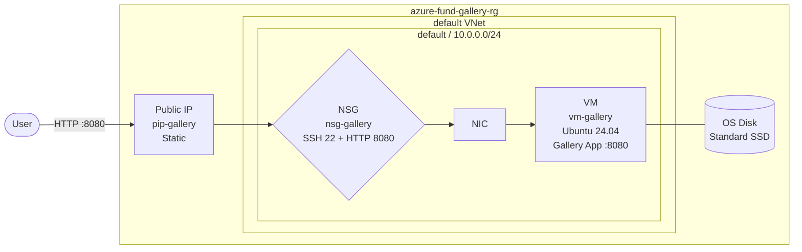

Gallery Spring Boot 앱을 Azure VM에 최초 배포한다. cloud-init Custom Data로 JDK 설치, 소스 빌드, systemd 서비스 등록을 자동화하여 VM 기동 시 앱이 자동 실행되는 환경을 구성한다.

### 실습 목표

- Gallery 전용 Resource Group(`azure-fund-gallery-rg`)을 생성하고 이후 모든 Gallery 리소스를 이 그룹으로 누적 관리한다
- cloud-init Custom Data로 JDK 설치와 Gallery 앱 빌드·실행을 자동화한다
- Public IP(Static)와 NSG로 외부에서 8080 포트 접근이 가능한 환경을 구성한다
- VM 기동 후 Gallery 앱이 자동 실행되는지 확인한다

---

# 1. 전체 아키텍처



Ch03 Gallery의 최초 배포 구조다. VM 하나에 앱과 인메모리 DB(H2)가 모두 포함된 All-in-One 구조로, Public IP를 통해 외부에 직접 노출된다. Ch04(VNet)에서 Private Subnet으로 이전하고, Ch05(Traffic Management)에서 Load Balancer를 앞에 배치한다.

---

# 2. 사전 준비

- lab05 ~ lab07 완료 (VM 생성, SSH 접속, 디스크 구성 경험 필요)
- Location: **`Korea Central`**
- 예제 파일: `cloud-init.yaml` (섹션 디렉토리 `05 [실습] Gallery - Azure VM 기본 배포/` 제공)

---

# 3. Resource Group

Gallery 리소스 전체를 하나의 Resource Group으로 누적 관리한다. 이후 Chapter에서도 이 그룹을 유지한다.

### 1. 설정값

**Resource Group**

- Resource group: `azure-fund-gallery-rg`
- Region: `Korea Central`

### 2. 참고

- [섹션 실습 lab05: Linux VM 생성 및 기본 구성]()

---

# 4. VM 생성

cloud-init Custom Data를 포함해 VM을 생성한다. VM 기동 시 cloud-init이 자동 실행되어 JDK 설치 → 소스 빌드 → systemd 서비스 등록 → 앱 시작 순으로 진행된다.

### 1. 설정값

**Basics — Project details**

- Subscription: (구독 선택)
- Resource group: `azure-fund-gallery-rg`

**Basics — Instance details**

- Virtual machine name: `vm-gallery`
- Region: `Korea Central`
- Availability options: `No infrastructure redundancy required`
- Security type: `Standard`
- Image: `Ubuntu Server 24.04 LTS - x64 Gen2`
- Size: `Standard_B2s_v2` (2 vCPU, 4 GiB RAM)

**Basics — Administrator account**

- Authentication type: `SSH public key`
- Username: `azureuser`
- SSH public key source: `Generate new key pair`
- Key pair name: `key-gallery`

**Basics — Inbound port rules**

- Public inbound ports: `Allow selected ports`
- Select inbound ports: `SSH (22)`

**Networking — Public IP (Create new)**

- Name: `pip-gallery`
- SKU: `Standard`
- Assignment: `Static`

**Networking — NIC network security group**

- NIC network security group: `Basic`

**Advanced — Custom data**

- Custom data: `cloud-init.yaml` 전체 내용 붙여넣기

> `cloud-init.yaml`은 섹션 디렉토리의 예제 파일을 그대로 사용한다.

### 2. 참고

- [섹션 실습 lab05: Linux VM 생성 및 기본 구성]()

---

**Review + create** 클릭 → **Generate new key pair** 팝업에서 **Download private key and create resource** 클릭

**확인:**

- `key-gallery.pem` 파일이 다운로드된다. 이후 SSH 접속에 사용하므로 안전한 위치에 보관한다.

---

# 5. NSG 8080 규칙 추가

VM 생성 후 Gallery 앱 접근을 위한 HTTP 8080 인바운드 규칙을 추가한다.

### 1. 설정값

**Inbound security rule**

- Source: `Any`
- Source port ranges: `*`
- Destination: `Any`
- Service: `Custom`
- Destination port ranges: `8080`
- Protocol: `TCP`
- Action: `Allow`
- Priority: `1010`
- Name: `Allow-HTTP-8080`

[콘솔화면: Azure Portal > Virtual machines > vm-gallery > Networking > Network settings > Add inbound security rule 패널]

### 2. 참고

- [섹션 실습 lab05: Linux VM 생성 및 기본 구성]()

---

# 6. 리소스 확인

## 1. Azure Portal > Resource groups > **azure-fund-gallery-rg**

[콘솔화면: Azure Portal > Resource groups > azure-fund-gallery-rg > 리소스 목록]

**확인:**

- `vm-gallery`: Virtual machine
- `pip-gallery`: Public IP address
- `vm-gallery-nsg`: Network security group
- OS Disk, NIC, Virtual Network: 자동 생성 확인

---

# 7. 앱 자동 배포 확인

cloud-init 실행 완료 여부와 Gallery 서비스 상태를 SSH로 확인한다.

## 1. SSH 접속

```bash
$ chmod 600 key-gallery.pem
$ ssh -i key-gallery.pem azureuser@{pip-gallery IP}
```

## 2. cloud-init 완료 여부 확인

```bash
$ cloud-init status

# 출력 예
status: done
```

`status: running`이 표시되면 아직 실행 중이다. JDK 설치와 Maven 빌드를 포함하므로 완료까지 5~10분 소요될 수 있다.

## 3. Gallery 서비스 상태 확인

```bash
$ sudo systemctl status gallery

# 출력 예
● gallery.service - Gallery Spring Boot Application
     Loaded: loaded (/etc/systemd/system/gallery.service; enabled; vendor preset: enabled)
     Active: active (running) since ...
```

**확인:**

- `Active: active (running)` 상태 확인
- `enabled` 상태 확인 (VM 재시작 시 자동 실행)

---

# 8. 실행 및 결과 검증

## 1. Azure Portal > Virtual machines > **vm-gallery**

[콘솔화면: Azure Portal > Virtual machines > vm-gallery > Overview - Status: Running, Public IP 표시]

**확인:**

- Status: **`Running`**
- Public IP address: `{pip-gallery 할당 IP}` — 이후 Gallery 접속에 사용

## 2. 브라우저 접속

```text
http://{pip-gallery IP}:8080
```

[콘솔화면: 브라우저 - Gallery 앱 메인 화면 정상 출력]

**확인:**

- Gallery 앱 화면이 출력된다
- 이미지 업로드 후 목록에 이미지가 나타나는지 확인한다

> 현재는 인메모리 DB(H2)와 로컬 스토리지를 사용한다. VM 재시작 시 업로드 파일은 유지되지만 DB 데이터는 초기화된다. Ch07(Database)에서 Azure MySQL로 전환한다.

---

# 9. 자원 정리

Gallery 인프라는 다음 Chapter에서 이어서 사용한다. 기본적으로 유지한다.

비용 절감이 필요한 경우 다음을 중지한다 (삭제 아님):

- VM 중지: `vm-gallery`

## 1. Azure Portal > Virtual machines > vm-gallery > **Stop**

[콘솔화면: Azure Portal > Virtual machines > vm-gallery > Overview - Stop 버튼]

**확인:**

- Status: **`Stopped (deallocated)`** — Public IP는 Static이므로 중지 후에도 IP 유지
