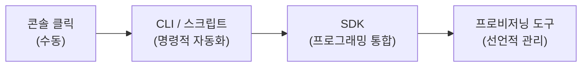

인프라를 코드로 관리한다는 것은 Terraform 하나를 익히는 것이 아니다. 콘솔 클릭에서 시작해 CLI 스크립트, SDK, 그리고 프로비저닝 도구로 이어지는 코드화의 스펙트럼을 이해해야 한다. 이 섹션에서는 IaC의 본질과 세 가지 코드화 수준을 살펴보고, 이 시리즈가 그 스펙트럼 위에서 어디에 집중하는지 정리한다.

# IaC (Infrastructure as Code)

## 1. 콘솔에서 코드로

Azure Fundamentals에서는 Azure Portal에 로그인해 마우스로 리소스를 만들었다. Resource Group을 생성하고, VM을 구성하고, VNet을 설계하는 모든 과정이 콘솔 화면 위에서 이뤄졌다.

이 방식은 학습과 탐색에는 적합하지만, 실무에서는 한계가 뚜렷하다:

- **반복 불가** — 같은 인프라를 다시 만들려면 같은 클릭을 반복해야 한다
- **추적 불가** — 누가, 언제, 무엇을 변경했는지 기록이 남지 않는다
- **공유 불가** — "이렇게 클릭하세요"를 문서로 전달하는 데는 한계가 있다
- **검증 불가** — 배포 전 변경 내용을 미리 확인할 수 없다

IaC (Infrastructure as Code)는 이 문제를 코드로 해결한다. 인프라 구성을 코드 파일로 정의하고, 코드를 실행해 인프라를 생성·변경·삭제한다. 코드이므로 버전 관리가 되고, 리뷰가 가능하고, 반복 실행해도 같은 결과를 보장할 수 있다.

## 2. 코드화는 하나가 아니다

IaC를 떠올리면 Terraform이나 CloudFormation 같은 프로비저닝 도구가 먼저 떠오르지만, 코드화의 방법은 하나가 아니다. 인프라를 코드로 다루는 수준은 크게 세 가지로 나뉜다.



왼쪽에서 오른쪽으로 갈수록 자동화 수준과 추상화 수준이 높아진다. 하지만 오른쪽이 무조건 좋은 것은 아니다. 각 수준은 고유한 역할과 강점이 있으며, 실무에서는 이들을 조합해서 사용한다.

---

# 코드화의 세 가지 수준

## 1. CLI / 스크립트

가장 직관적인 코드화 방식이다. 콘솔에서 클릭하던 작업을 CLI 명령어로 바꾸고, 이를 셸 스크립트로 묶는다.

```bash
#!/bin/bash

az group create --name my-rg --location koreacentral
az network vnet create --resource-group my-rg --name my-vnet --address-prefix 10.0.0.0/16
az network vnet subnet create --resource-group my-rg --vnet-name my-vnet --name web-subnet --address-prefix 10.0.1.0/24
```

이 스크립트를 실행하면 Resource Group, VNet, Subnet이 순서대로 생성된다. 콘솔에서 세 번 클릭할 것을 한 번의 스크립트 실행으로 대체한 것이다.

### ① 강점

- **즉시 자동화** — 스크립트 파일 하나로 반복 작업을 제거한다
- **낮은 진입 장벽** — CLI 명령어를 알면 바로 작성할 수 있다
- **유연성** — 조건문, 반복문, 변수 등 셸의 모든 기능을 활용한다
- **ad-hoc 작업에 적합** — 일회성 정리, 긴급 대응, 운영 스크립트

### ② 한계

- **명령적(imperative)** — "무엇을 해라"를 순서대로 나열한다. 실행 순서가 곧 로직이다
- **멱등성 없음** — 같은 스크립트를 두 번 실행하면 "이미 존재합니다" 오류가 발생할 수 있다
- **상태 추적 없음** — 현재 인프라가 어떤 상태인지 스크립트만으로는 알 수 없다
- **삭제/변경 관리** — 생성은 쉽지만 "이전 상태로 되돌리기"는 별도 스크립트가 필요하다

CLI 스크립트는 ad-hoc 자동화의 도구다. 이것도 **당당한 IaC**다. 하지만 인프라 규모가 커지면 상태 추적과 멱등성의 부재가 발목을 잡는다.

## 2. SDK

SDK (Software Development Kit)는 프로그래밍 언어에서 Azure API를 직접 호출하는 방식이다. CLI가 셸 스크립트 수준의 자동화라면, SDK는 애플리케이션 수준의 통합이다.

Azure는 Java, Python, .NET, Go, JavaScript 등 주요 언어별 SDK를 제공한다:

```java
ResourceGroup resourceGroup = azure.resourceGroups()
    .define("my-rg")
    .withRegion(Region.KOREA_CENTRAL)
    .create();
```

### ① SDK의 역할

SDK는 인프라 프로비저닝보다 **애플리케이션과 인프라의 연결**에 강점이 있다.

Gallery 앱을 예로 들어보자. Gallery 앱은 사용자가 업로드한 이미지를 저장해야 한다. Azure Fundamentals에서 이 저장소를 Azure Blob Storage로 전환했다. 이때 Gallery 앱 코드에서 Blob Storage에 파일을 읽고 쓰는 부분 — 이것이 SDK 영역이다.

```java
BlobClient blobClient = containerClient.getBlobClient(fileName);
blobClient.upload(inputStream, length);
```

IaC를 공부하는 사람이라면 이 연결고리가 자연스럽게 보여야 한다:

- **Terraform**이 Storage Account를 **생성**한다 (인프라 프로비저닝)
- **SDK**가 Storage Account에 파일을 **읽고 쓴다** (애플리케이션 로직)

### ② 강점

- **프로그래밍 언어의 모든 기능** — 타입 시스템, 에러 핸들링, 테스트 프레임워크
- **애플리케이션 통합** — 인프라 관리를 앱 로직에 녹일 수 있다
- **VM 유틸리티 수준의 관리** — VM 목록 조회, 상태 확인, 시작/중지 등

### ③ 한계

- **코드량 과다** — CLI 한 줄이면 되는 작업에 수십 줄이 필요하다
- **의존성 관리** — SDK 라이브러리 버전 관리를 직접 해야 한다
- **인프라 전용이 아님** — SDK는 범용 도구다. 인프라 상태 관리·의존성 해소 같은 기능은 없다

## 3. 프로비저닝 도구

프로비저닝 도구는 인프라 관리에 특화된 전용 도구다. Terraform, CloudFormation, Pulumi 등이 여기에 해당한다. 이 시리즈에서는 Terraform을 사용한다.

CLI 스크립트와 결정적으로 다른 점은 **선언적(declarative)** 접근이다:

```hcl
resource "azurerm_resource_group" "main" {
  name     = "my-rg"
  location = "koreacentral"
}

resource "azurerm_virtual_network" "main" {
  name                = "my-vnet"
  address_space       = ["10.0.0.0/16"]
  location            = azurerm_resource_group.main.location
  resource_group_name = azurerm_resource_group.main.name
}
```

"이 리소스들이 이 상태로 존재해야 한다"고 선언하면, 도구가 현재 상태와 비교해서 필요한 변경만 수행한다.

### ① 강점

- **선언적 정의** — "무엇을 해라"가 아니라 "이 상태여야 한다"를 기술한다
- **멱등성** — 몇 번을 실행해도 같은 결과다. 이미 존재하면 변경할 것만 변경한다
- **상태 관리** — State (상태 파일)로 현재 인프라 상태를 추적한다
- **의존성 해소** — 리소스 간 참조 관계를 자동으로 파악하고 순서를 결정한다
- **Plan / Apply** — 실행 전 변경 내용을 미리 확인(Plan)하고, 확인 후 적용(Apply)한다

### ② 한계

- **학습 곡선** — HCL 문법, State 개념, Provider 구조 등을 별도로 학습해야 한다
- **모든 작업에 적합하지 않음** — 일회성 조회, 긴급 대응에는 CLI가 더 빠르다
- **State 관리 부담** — State 파일의 저장·잠금·동기화를 직접 관리해야 한다

---

# 코드화 스펙트럼

세 가지 수준은 서로 대체하는 관계가 아니라 **보완하는 관계**다.

| 수준 | 방식 | 상태 관리 | 멱등성 | 적합한 작업 |
|------|------|----------|--------|-----------|
| CLI / 스크립트 | 명령적 | 없음 | 없음 | ad-hoc 자동화, 운영 스크립트, 결과 확인 |
| SDK | 프로그래밍 | 없음 | 직접 구현 | 애플리케이션-인프라 통합, 유틸리티 |
| 프로비저닝 도구 | 선언적 | State | 내장 | 인프라 프로비저닝, 변경 관리 |

실무에서는 이들을 조합한다:

- **Terraform**으로 인프라를 프로비저닝하고
- **az CLI**로 결과를 확인하고 운영 작업을 수행하고
- **SDK**로 애플리케이션이 인프라 리소스에 접근한다

이 시리즈에서도 같은 방식을 따른다. Terraform이 주력이지만 az CLI는 모든 실습에서 결과 확인 도구로 사용하고, SDK는 Gallery 앱의 Azure 서비스 연동 맥락에서 등장한다.

---

# 이 시리즈의 범위

## 1. az CLI — 기본 도구

이 시리즈는 콘솔 화면을 거의 사용하지 않는다. Azure Portal 대신 az CLI로 리소스를 확인하고 검증한다. 다음 섹션(01.02)에서 az CLI를 설치하고 핵심 명령어를 실습한다.

## 2. Azure SDK — 개념 이해

SDK를 깊이 다루지는 않는다. 다만 Gallery 앱이 Azure Storage, Database에 연동할 때 SDK가 관여한다는 점을 이해하고, 간단한 VM 유틸리티를 통해 SDK의 감각을 잡는다 (01.03).

## 3. Terraform — 주력

Ch02부터 시리즈 끝까지 Terraform이 중심이다. azurerm Provider를 통해 Azure 인프라를 선언적으로 정의하고, Plan/Apply 워크플로우로 프로비저닝한다. HCL 문법과 Terraform 핵심 개념은 Terraform Core 시리즈에서 학습한 것을 전제로 한다.

---

# 핵심 정리

- IaC는 Terraform만이 아니다 — CLI 스크립트도, SDK도 코드화의 일부다
- 코드화에는 세 가지 수준이 있다: CLI / 스크립트, SDK, 프로비저닝 도구
- 각 수준은 대체가 아닌 보완 관계다 — 실무에서는 조합해서 사용한다
- CLI 스크립트는 ad-hoc 자동화에, SDK는 앱-인프라 통합에, Terraform은 선언적 프로비저닝에 강점이 있다
- 이 시리즈는 Terraform을 주력으로, az CLI를 결과 확인 도구로, SDK를 개념 이해 수준으로 다룬다

# 참고 자료

- [Infrastructure as Code 개요](https://learn.microsoft.com/en-us/devops/deliver/what-is-infrastructure-as-code) — Microsoft Learn
- [Terraform on Azure 문서 허브](https://learn.microsoft.com/en-us/azure/developer/terraform/) — Microsoft Learn
- [Azure CLI 개요](https://learn.microsoft.com/en-us/cli/azure/what-is-azure-cli) — Microsoft Learn
- [Azure SDK for Java](https://learn.microsoft.com/en-us/azure/developer/java/sdk/overview) — Microsoft Learn
