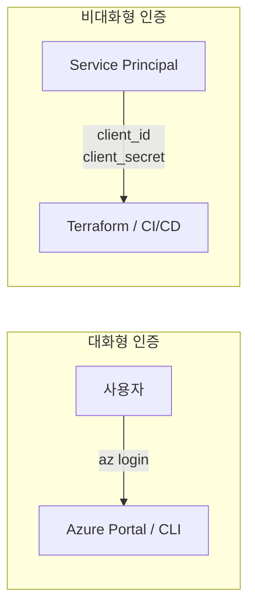
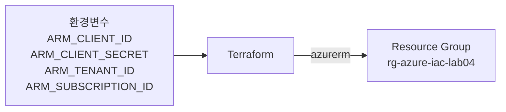

Azure Portal에서는 브라우저에 로그인하면 인증이 끝난다. 하지만 Terraform은 사람이 아니라 코드가 Azure API를 호출한다. 코드에는 "누구인지"를 알려주는 별도의 인증 수단이 필요하다. 이 섹션에서는 Service Principal (서비스 주체)을 생성하고 Terraform에 연결하는 방법을 다룬다.

# Service Principal 인증

## 1. 콘솔 인증과 코드 인증

Azure Fundamentals에서는 Azure Portal에 로그인하면 모든 리소스에 접근할 수 있었다. az CLI에서도 `az login`을 실행하면 브라우저가 열리고, 사용자가 직접 인증한다.

이 방식은 **대화형(interactive) 인증**이다. 사람이 화면 앞에 있어야 한다.

Terraform은 다르다. `terraform plan`이나 `terraform apply`를 실행할 때 브라우저를 열어 로그인할 수 없다. 특히 CI/CD 파이프라인(Ch10)에서는 사람이 개입할 여지가 없다. 코드가 Azure API를 호출하려면 **비대화형(non-interactive) 인증**이 필요하다.



대화형 인증은 사용자가 직접 로그인한다. 비대화형 인증은 Service Principal이 코드를 대신해 Azure에 인증한다.

## 2. Service Principal이란

Service Principal (SP)은 Azure에서 **애플리케이션이나 자동화 도구가 사용하는 ID**다. 사람 계정이 아닌 앱 전용 계정이라고 생각하면 된다.

SP는 세 가지 정보로 구성된다:

| 정보 | 설명 |
|------|------|
| `client_id` (Application ID) | SP의 고유 식별자 |
| `client_secret` | SP의 비밀번호 (또는 인증서) |
| `tenant_id` | Entra ID (Azure AD) 테넌트 식별자 |

여기에 `subscription_id`를 더하면 Terraform이 "어느 테넌트의 어느 구독에서 작업할지"를 알 수 있다.

### ① SP 생성

az CLI로 SP를 생성한다:

```bash
az ad sp create-for-rbac --name "terraform-sp" --role Contributor --scopes /subscriptions/{subscription-id}
```

이 명령은 SP를 생성하고 지정한 Subscription에 Contributor 역할을 부여한다. 결과로 `appId`, `password`, `tenant`가 출력된다.

### ② SP와 Managed Identity의 차이

Ch03에서 다룰 Managed Identity (MI)와 혼동하기 쉽다. 간단히 구분하면:

| | Service Principal | Managed Identity |
|---|---|---|
| 용도 | 외부 도구 인증 (Terraform, CI/CD) | Azure 리소스 간 인증 (VM → Storage) |
| 시크릿 | client_secret 관리 필요 | Azure가 자동 관리 (secretless) |
| 생성 | az CLI로 수동 생성 | Azure 리소스에 자동 연결 |

이 섹션에서는 SP로 Terraform을 인증한다. Ch10에서는 OIDC (Workload Identity Federation)로 진화하여 시크릿 없이 인증하는 방법을 다룬다.

## 3. 인증 정보 전달 방식

SP를 생성했으면 Terraform에 인증 정보를 전달해야 한다. 두 가지 방식이 있다.

### ① provider 블록 직접 지정

```hcl
provider "azurerm" {
  features {}

  client_id       = "xxxxxxxx-xxxx-xxxx-xxxx-xxxxxxxxxxxx"
  client_secret   = "xxxxxxxxxxxxxxxxxxxxxxxxxxxxxxxxxxxxxxxx"
  tenant_id       = "xxxxxxxx-xxxx-xxxx-xxxx-xxxxxxxxxxxx"
  subscription_id = "xxxxxxxx-xxxx-xxxx-xxxx-xxxxxxxxxxxx"
}
```

시크릿이 코드에 노출된다. **절대 사용하지 않는다.**

### ② 환경변수 방식 (권장)

```bash
export ARM_CLIENT_ID="xxxxxxxx-xxxx-xxxx-xxxx-xxxxxxxxxxxx"
export ARM_CLIENT_SECRET="xxxxxxxxxxxxxxxxxxxxxxxxxxxxxxxxxxxxxxxx"
export ARM_TENANT_ID="xxxxxxxx-xxxx-xxxx-xxxx-xxxxxxxxxxxx"
export ARM_SUBSCRIPTION_ID="xxxxxxxx-xxxx-xxxx-xxxx-xxxxxxxxxxxx"
```

환경변수를 설정하면 provider 블록에 인증 정보를 넣지 않아도 azurerm provider가 자동으로 읽는다:

```hcl
provider "azurerm" {
  features {}
}
```

코드에 시크릿이 노출되지 않는다. **이 방식을 사용한다.**

## 4. 보안 주의사항

### ① .tfvars에 시크릿 넣지 않기

`terraform.tfvars`나 `*.auto.tfvars`에 `client_secret`을 넣는 경우가 있다. 이 파일이 Git에 커밋되면 시크릿이 유출된다. 환경변수 방식을 사용하면 이 위험을 원천 차단한다.

### ② .env 파일 + .gitignore

환경변수를 매번 터미널에 입력하는 것은 번거롭다. `.env` 파일에 저장하고 `source .env`로 로드하는 방식을 사용한다:

```bash
# .env (Git에 커밋하지 않음)
export ARM_CLIENT_ID="xxxxxxxx-xxxx-xxxx-xxxx-xxxxxxxxxxxx"
export ARM_CLIENT_SECRET="xxxxxxxxxxxxxxxxxxxxxxxxxxxxxxxxxxxxxxxx"
export ARM_TENANT_ID="xxxxxxxx-xxxx-xxxx-xxxx-xxxxxxxxxxxx"
export ARM_SUBSCRIPTION_ID="xxxxxxxx-xxxx-xxxx-xxxx-xxxxxxxxxxxx"
```

`.gitignore`에 반드시 추가한다:

```text
.env
*.tfvars
.terraform/
```

### ③ SP 권한 최소화

`--role Contributor`는 학습용으로 넓은 권한이다. 실무에서는 필요한 리소스 그룹에만 scope를 제한하고, 최소 권한 역할을 부여한다. 이 주제는 Ch03 RBAC에서 다시 다룬다.

---

# 핵심 정리

- 콘솔/CLI는 대화형 인증, Terraform은 비대화형 인증이 필요하다
- Service Principal은 코드/자동화 도구 전용 인증 ID다
- 인증 정보는 **환경변수 방식**으로 전달한다 — provider 블록에 직접 넣지 않는다
- `.env` 파일로 환경변수를 관리하되, `.gitignore`에 반드시 추가한다
- Ch10에서 OIDC(Workload Identity Federation)로 진화하면 시크릿 자체가 불필요해진다

# 참고 자료

- [azurerm Provider 인증 개요](https://registry.terraform.io/providers/hashicorp/azurerm/latest/docs#authenticating-to-azure) — Terraform Registry
- [Service Principal로 인증](https://registry.terraform.io/providers/hashicorp/azurerm/latest/docs/guides/service_principal_client_secret) — Terraform Registry
- [az ad sp create-for-rbac](https://learn.microsoft.com/en-us/cli/azure/ad/sp?view=azure-cli-latest#az-ad-sp-create-for-rbac) — Microsoft Learn

---

# [실습] lab04: Service Principal 생성 및 인증

### 실습 목표

- az CLI로 Service Principal을 생성한다
- 환경변수 방식으로 Terraform에 인증 정보를 전달한다
- `terraform plan`으로 인증 성공을 확인한다
- `.env` + `.gitignore`로 시크릿을 안전하게 관리한다

# 1. 전체 아키텍처



환경변수로 전달된 SP 인증 정보를 azurerm provider가 읽어 Azure API에 인증하고, 테스트용 Resource Group을 생성한다.

# 2. 사전 준비

- Terraform: 1.14.x 이상
- azurerm provider: ~> 4.x
- az CLI: 설치 및 `az login` 완료 (lab01)
- Azure Subscription ID 확인: `az account show --query id --output tsv`

```text
lab04/
├── providers.tf
├── main.tf
├── outputs.tf
├── .env
└── .gitignore
```

# 3. Service Principal 생성

Subscription ID를 확인한다:

```bash
az account show --query id --output tsv
```

```text
xxxxxxxx-xxxx-xxxx-xxxx-xxxxxxxxxxxx
```

SP를 생성한다:

```bash
az ad sp create-for-rbac --name "terraform-sp" --role Contributor --scopes /subscriptions/{subscription-id}
```

```text
{
  "appId": "xxxxxxxx-xxxx-xxxx-xxxx-xxxxxxxxxxxx",
  "displayName": "terraform-sp",
  "password": "xxxxxxxxxxxxxxxxxxxxxxxxxxxxxxxxxxxxxxxx",
  "tenant": "xxxxxxxx-xxxx-xxxx-xxxx-xxxxxxxxxxxx"
}
```

출력된 값을 매핑한다:

| 출력 | 환경변수 |
|------|---------|
| `appId` | `ARM_CLIENT_ID` |
| `password` | `ARM_CLIENT_SECRET` |
| `tenant` | `ARM_TENANT_ID` |

# 4. 환경변수 설정

## .env

```bash
export ARM_CLIENT_ID="{appId}"
export ARM_CLIENT_SECRET="{password}"
export ARM_TENANT_ID="{tenant}"
export ARM_SUBSCRIPTION_ID="{subscription-id}"
```

## .gitignore

```text
.env
*.tfvars
.terraform/
.terraform.lock.hcl
```

환경변수를 로드한다:

```bash
source .env
```

# 5. Terraform 코드 작성

## providers.tf

```hcl
terraform {
  required_providers {
    azurerm = {
      source  = "hashicorp/azurerm"
      version = "~> 4.0"
    }
  }
}

provider "azurerm" {
  features {}
}
```

provider 블록에 인증 정보가 없다. azurerm provider가 `ARM_*` 환경변수를 자동으로 읽는다.

## main.tf

```hcl
resource "azurerm_resource_group" "main" {
  name     = "rg-azure-iac-lab04"
  location = "koreacentral"
}
```

인증 확인용 테스트 Resource Group이다.

## outputs.tf

```hcl
output "resource_group_name" {
  value = azurerm_resource_group.main.name
}

output "resource_group_location" {
  value = azurerm_resource_group.main.location
}
```

# 6. 배포

## terraform init

```bash
terraform init
```

```text
Initializing the backend...
Initializing provider plugins...
- Finding hashicorp/azurerm versions matching "~> 4.0"...
- Installing hashicorp/azurerm v4.x.x...

Terraform has been successfully initialized!
```

## terraform plan

```bash
terraform plan
```

```text
Terraform used the selected providers to generate the following execution plan.

  + resource "azurerm_resource_group" "main" {
      + id       = (known after apply)
      + location = "koreacentral"
      + name     = "rg-azure-iac-lab04"
    }

Plan: 1 to add, 0 to change, 0 to destroy.

Changes to Outputs:
  + resource_group_name     = "rg-azure-iac-lab04"
  + resource_group_location = "koreacentral"
```

`Plan: 1 to add` — SP 인증이 성공했다. 인증에 실패하면 이 단계에서 오류가 발생한다.

## terraform apply

```bash
terraform apply
```

```text
Apply complete! Resources: 1 added, 0 changed, 0 destroyed.

Outputs:

resource_group_name     = "rg-azure-iac-lab04"
resource_group_location = "koreacentral"
```

# 7. 결과 확인

## terraform output

```bash
terraform output
```

```text
resource_group_name     = "rg-azure-iac-lab04"
resource_group_location = "koreacentral"
```

## az CLI 확인

```bash
az group show --name rg-azure-iac-lab04 --output table
```

```text
Name                Location       Status
------------------  -------------  ---------
rg-azure-iac-lab04  koreacentral   Succeeded
```

SP 인증으로 Terraform이 Resource Group을 생성했다.

# 8. 자원 정리

## terraform destroy

```bash
terraform destroy
```

```text
Destroy complete! Resources: 1 destroyed.
```

> SP 자체는 삭제하지 않는다. 이후 Lab에서 동일한 SP를 계속 사용한다.
> SP를 삭제하려면 `az ad sp delete --id {appId}`를 실행한다.
