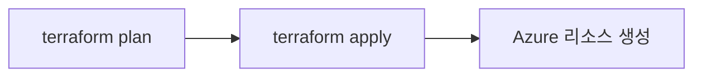
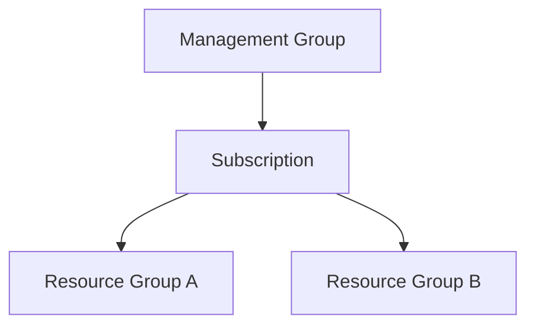
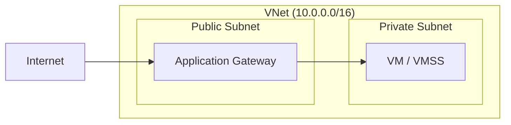

# 다이어그램 생성 규칙

## 기본 도구

**Mermaid**를 기본 다이어그램 도구로 사용한다.

## Notion 호환

- 노드 내 줄바꿈: `\n` 대신 `<br>` 사용
- 복잡한 특수문자 사용 지양

## 다이어그램 유형

### flowchart LR — 프로세스/흐름

요청 흐름, 리소스 간 연결, Terraform 워크플로우에 사용:



### flowchart TB — 계층/포함

계층 구조, 종속 관계, 모듈 의존성에 사용:



### flowchart LR + subgraph — 컨테이너 구조

VNet/Subnet 포함 관계, Azure 아키텍처에 사용:



## 섹션별 사용 가이드

### 이론 섹션

- Azure 리소스 관계도 또는 Terraform 동작 흐름
- 개념 간 관계 시각화

### Lab / Gallery 섹션

- `# 1. 전체 아키텍처` 에 해당 실습의 리소스 구성도
- 이 실습에서 다루는 리소스만 포함 (전체 아키텍처 아님)

## 플레이스홀더

Mermaid로 표현이 어려운 복잡한 구조는 플레이스홀더를 사용한다:

```
[이미지: Azure 네트워크 흐름 — Public IP → LB → Private Subnet VM → NAT GW → Internet]
```

- 이미지 설명을 구체적으로 작성 — 사용자가 직접 제작할 때 참고
- 이론, 실습 구분 없이 필요한 곳에 배치

## 다이어그램 후 설명

모든 다이어그램 아래에 **2~4줄 설명**을 붙인다:

```
위 다이어그램은 Gallery 앱의 네트워크 구조다.
외부 트래픽은 Application Gateway를 통해 Private Subnet의 VMSS로 전달된다.
VMSS의 아웃바운드 트래픽은 NAT Gateway를 경유한다.
```
