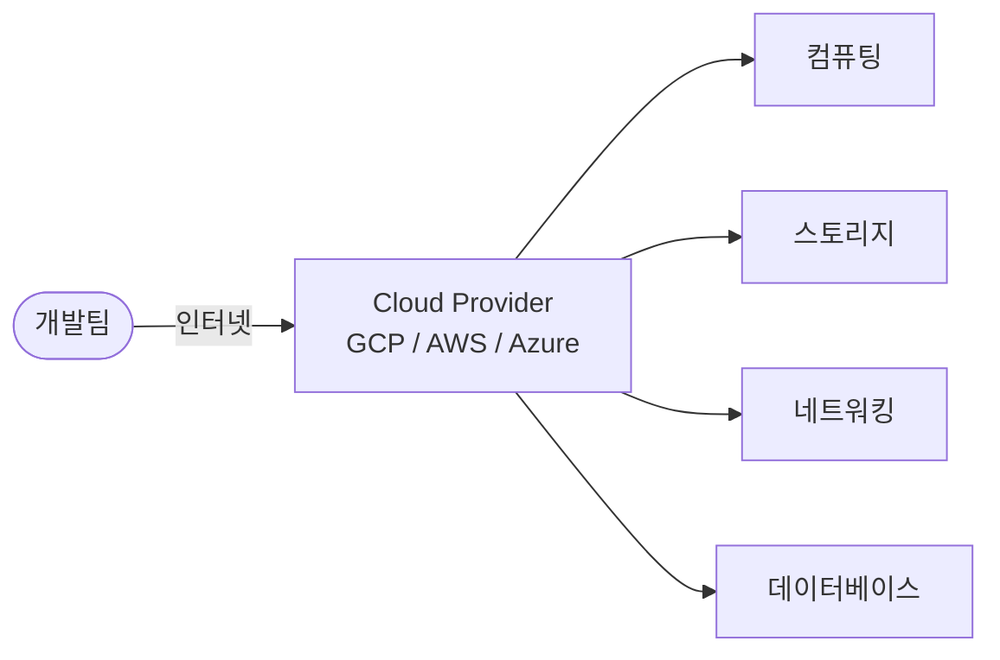

이 시리즈는 GCP 위에서 애플리케이션 인프라를 직접 구성하는 것을 목표로 한다. 그 출발점으로, 먼저 Cloud Computing이 무엇인지 — 왜 등장했고, 무엇을 해결하며, 어떤 구조로 이루어지는지 — 를 이해한다.

# On-premise와 Cloud Computing

서버, 네트워크, 스토리지를 직접 구매해 데이터센터(IDC)에 설치하고 운영하는 방식을 On-premise라고 한다. 자체 인프라를 소유하는 이 방식은 오랫동안 기업 IT의 표준이었지만, 서비스 규모와 트래픽이 예측 불가능하게 변하는 현대 환경에서는 몇 가지 근본적인 한계를 드러낸다.

## 1. On-premise의 한계

### ① 초기 비용과 긴 조달 시간

서버를 구매하고 설치하려면 수주에서 수개월의 시간이 필요하다. 스타트업이 서비스를 빠르게 출시하거나, 예상치 못한 트래픽 급증에 즉각 대응하는 것이 구조적으로 어렵다. 비용 측면에서도 실제 사용 여부와 관계없이 하드웨어를 선구매해야 하는 CapEx(자본 지출, Capital Expenditure) 부담이 크다.

### ② 과잉 프로비저닝과 낭비

트래픽 피크를 대비해 평소보다 훨씬 큰 용량의 서버를 미리 준비해야 한다. 피크가 아닌 평시에는 이 자원의 대부분이 유휴 상태로 낭비된다. 반대로 예상을 초과하는 트래픽이 오면 서비스가 다운되는 위험도 존재한다.

### ③ 운영 부담

하드웨어 장애 대응, OS 패치, 네트워크 구성, 보안 업데이트 등 인프라 운영에 전담 인력이 필요하다. 이는 개발 조직이 본래 집중해야 할 제품과 서비스 개발에 쓸 자원을 분산시킨다.

## 2. Cloud Computing이란

Cloud Computing은 인터넷을 통해 컴퓨팅 자원(서버, 스토리지, 네트워크, 소프트웨어)을 필요한 만큼 빌려 쓰는 모델이다. 자원을 소유하지 않고 서비스로 소비하는 방식으로, 비용 구조가 CapEx에서 OpEx(운영 지출, Operational Expenditure)로 전환된다.

개발팀은 인터넷을 통해 Cloud Provider에 접속하고, Provider는 컴퓨팅·스토리지·네트워킹·데이터베이스 자원을 API로 제공한다. 물리 하드웨어와 데이터센터 운영은 Provider가 전담하며, 개발팀은 자원을 소비하는 역할만 한다.

Cloud Provider가 물리 인프라를 소유하고 운영하며, 개발팀은 인터넷을 통해 필요한 자원을 API로 즉시 프로비저닝해 사용한다. 하드웨어 조달, 데이터센터 운영, 물리 보안은 Provider가 담당한다.

## 3. Cloud의 핵심 특성

### ① 탄력성 (Elasticity)

트래픽 증가에 따라 자원을 자동으로 늘리고, 감소하면 줄일 수 있다. On-premise에서 피크 대비 과잉 구매해야 했던 문제가 해소된다. GCP에서는 Managed Instance Group의 Autoscaling, Cloud Run의 자동 인스턴스 증감 등이 이 특성을 구현한다.

### ② 종량제 (Pay-as-you-go)

사용한 자원만큼만 비용을 지불한다. VM을 1시간 실행하면 1시간치 요금만 발생하고, 삭제하면 과금이 멈춘다. 초기 투자 없이 소규모로 시작해 성장에 따라 점진적으로 확장하는 것이 가능해진다.

### ③ 글로벌 배포

Cloud Provider는 전 세계에 데이터센터를 보유하고 있다. 콘솔 몇 번의 클릭으로 서울, 도쿄, 미국, 유럽 어디에든 동일한 인프라를 즉시 배포할 수 있다. On-premise에서는 해외 데이터센터 임대와 계약에 수개월이 걸리던 일이다.

---

# Cloud 서비스 모델

Cloud 서비스는 Provider가 관리하는 범위에 따라 세 계층으로 나뉜다. 어느 계층을 선택하느냐에 따라 개발팀이 직접 관리해야 할 범위가 달라진다.

[이미지: Cloud 서비스 모델 계층 비교 — On-premise / IaaS / PaaS / SaaS 4단 비교, 각 모델에서 Provider 관리 영역(회색)과 개발팀 관리 영역(파란색) 구분, 하드웨어→OS→런타임→앱→데이터 5개 레이어]

왼쪽(On-premise)에서 오른쪽(SaaS)으로 갈수록 Provider가 더 많은 레이어를 관리하고, 개발팀이 다뤄야 할 범위는 줄어든다. 반대로 오른쪽으로 갈수록 개발팀이 더 많은 통제권을 갖는 대신 운영 부담도 커진다.

## 1. IaaS — Infrastructure as a Service (서비스형 인프라)

가상 서버, 네트워크, 스토리지 등 인프라 자원을 제공한다. OS 설치, 미들웨어 구성, 애플리케이션 배포는 개발팀이 직접 담당한다. On-premise와 가장 유사한 모델로, 기존 환경을 Cloud로 이전(Lift & Shift)할 때 주로 선택한다.

GCP 대표 서비스: Compute Engine (VM)

## 2. PaaS — Platform as a Service (서비스형 플랫폼)

런타임, 미들웨어, 운영체제까지 Provider가 관리한다. 개발팀은 애플리케이션 코드와 데이터에만 집중하면 된다. 서버 패치, OS 업그레이드, 런타임 관리를 신경 쓰지 않아도 된다.

GCP 대표 서비스: App Engine, Cloud Run, Cloud SQL

## 3. SaaS — Software as a Service (서비스형 소프트웨어)

완성된 애플리케이션을 인터넷으로 제공한다. 인프라, 플랫폼, 애플리케이션 모두 Provider가 관리한다. 사용자는 브라우저나 클라이언트로 접속해 사용하기만 한다.

예시: Gmail, Google Workspace, Slack, Notion

## 4. 서비스 모델 비교

| 구분 | On-premise | IaaS | PaaS | SaaS |
|------|-----------|------|------|------|
| 하드웨어 | 직접 | Provider | Provider | Provider |
| 운영체제 | 직접 | 직접 | Provider | Provider |
| 런타임 | 직접 | 직접 | Provider | Provider |
| 애플리케이션 | 직접 | 직접 | 직접 | Provider |
| 데이터 | 직접 | 직접 | 직접 | Provider |

이 시리즈에서 주로 다루는 것은 IaaS(Compute Engine)와 PaaS(Cloud Run, Cloud SQL) 계층이다. 인프라를 직접 구성하고 연결하는 과정을 통해 Cloud의 구조를 체득하는 것이 목표다.

---

# GCP 서비스 영역

Google Cloud Platform(GCP)은 컴퓨팅부터 분석까지 200개 이상의 서비스를 제공한다. 이 시리즈에서 다루는 핵심 영역은 다음과 같다.

## 1. 컴퓨팅 (Compute)

| 서비스 | 설명 | 계층 |
|--------|------|------|
| Compute Engine | 가상 머신(VM) | IaaS |
| Google Kubernetes Engine (GKE) | 컨테이너 오케스트레이션 | IaaS/PaaS |
| Cloud Run | 서버리스 컨테이너 실행 | PaaS |
| App Engine | 서버리스 애플리케이션 플랫폼 | PaaS |

이 시리즈에서는 Compute Engine과 Cloud Run을 중심으로 다룬다.

## 2. 네트워킹 (Networking)

| 서비스 | 설명 |
|--------|------|
| VPC (Virtual Private Cloud) | 가상 사설 네트워크 |
| Cloud Load Balancing | 부하 분산 |
| Cloud DNS | 도메인 이름 서비스 |
| Cloud CDN | 콘텐츠 전송 네트워크 |
| Cloud NAT | 아웃바운드 전용 NAT |
| Cloud Armor | WAF + DDoS 보호 |

## 3. 스토리지 (Storage)

| 서비스 | 설명 |
|--------|------|
| Cloud Storage | 오브젝트 스토리지 |
| Persistent Disk | VM 연결 블록 스토리지 |

## 4. 데이터베이스 (Database)

| 서비스 | 설명 |
|--------|------|
| Cloud SQL | 관리형 관계형 DB (MySQL, PostgreSQL, SQL Server) |
| Cloud Spanner | 글로벌 분산 관계형 DB |
| Firestore | NoSQL 문서 DB |
| BigQuery | 분석용 데이터 웨어하우스 |

이 시리즈에서는 Cloud SQL을 다룬다.

## 5. 보안 및 관리 (Security & Operations)

| 서비스 | 설명 |
|--------|------|
| Cloud IAM | ID 및 접근 관리 |
| Cloud Monitoring | 메트릭 수집 및 알림 |
| Cloud Logging | 로그 수집 및 분석 |

---

# 핵심 정리

- Cloud Computing은 컴퓨팅 자원을 소유하지 않고 서비스로 소비하는 모델이다. CapEx 중심의 On-premise 대비 OpEx 모델로 전환되며, 탄력성·종량제·글로벌 배포가 핵심 특성이다.
- IaaS는 인프라만 제공하고 OS 이상을 직접 관리한다. PaaS는 런타임까지 Provider가 관리해 애플리케이션에만 집중할 수 있다. SaaS는 완성된 애플리케이션을 서비스로 사용한다.
- GCP는 Compute Engine(IaaS), Cloud Run(PaaS), Cloud SQL, Cloud Storage, VPC, Cloud IAM 등 핵심 서비스를 제공한다. 이 시리즈는 이 서비스들을 직접 연결하고 구성하는 방법을 다룬다.

---

# 참고 자료

- [Google Cloud 개요](https://cloud.google.com/docs/overview)
- [Google Cloud 제품 목록](https://cloud.google.com/products)
