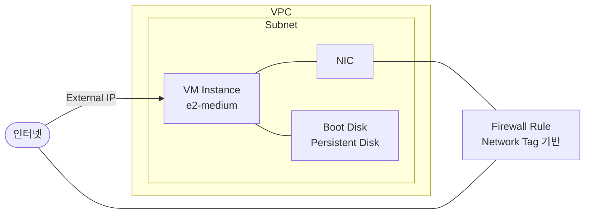
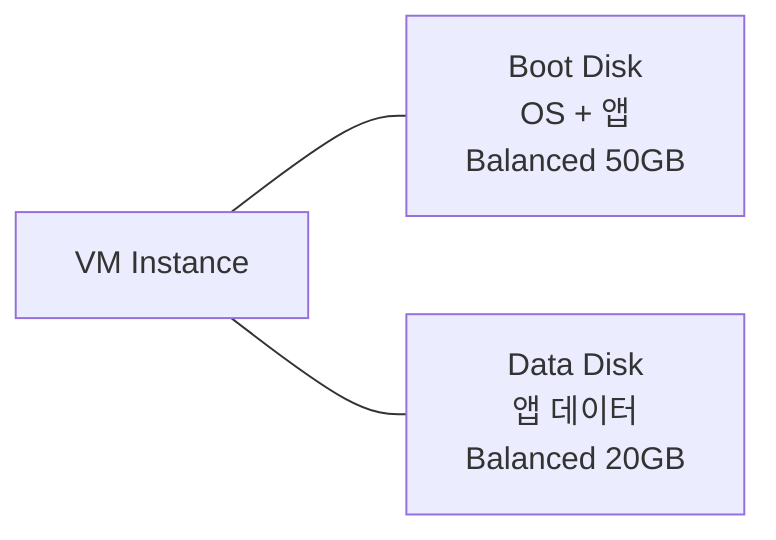

GCP 계정과 IAM 구성을 마쳤다. 이제 실제 애플리케이션이 실행될 컴퓨팅 자원을 다룬다. GCP에서 가상 머신을 제공하는 서비스가 Compute Engine이다.

# Compute Engine

Compute Engine은 GCP의 IaaS 컴퓨팅 서비스다. 물리 서버를 직접 구매하지 않고, 필요한 사양의 가상 머신(Virtual Machine, VM)을 Google의 데이터센터에서 즉시 프로비저닝해 사용한다. 운영체제 선택부터 CPU·메모리 사양, 디스크, 네트워크 구성까지 개발팀이 직접 제어한다.

백엔드 개발자 관점에서 보면 Compute Engine VM은 익숙한 Linux 서버와 동일하다. SSH로 접속하고, apt/yum으로 패키지를 설치하고, 애플리케이션을 직접 실행한다. 차이는 이 서버가 Google의 인프라 위에서 가상화 기술로 실행된다는 것, 그리고 필요 없어지면 언제든 삭제하고 비용을 멈출 수 있다는 것이다.

## 1. VM 구성 요소

Compute Engine VM은 단독으로 존재하지 않는다. 여러 리소스가 연결되어 하나의 VM이 동작한다.

| 구성 요소 | 설명 |
|-----------|------|
| VM Instance | CPU, 메모리를 정의하는 핵심 리소스 |
| NIC (Network Interface Card) | VM을 VPC Subnet에 연결하는 네트워크 인터페이스 |
| Boot Disk | OS가 설치된 Persistent Disk — VM 생성 시 자동 생성 |
| External IP | 인터넷에서 VM으로 접근하는 공인 IP (선택) |
| Firewall Rule | Network Tag 기반 트래픽 허용/차단 규칙 |

## 2. 연결 구조



VM은 VPC의 Subnet에 NIC를 통해 연결된다. 외부 인터넷 트래픽은 External IP를 거쳐 들어오며, Firewall Rule이 허용 여부를 판단한다. Boot Disk는 VM에 직접 연결된 Persistent Disk로, OS와 애플리케이션 데이터를 저장한다. VM을 삭제해도 Disk는 별도로 존재하며, 다른 VM에 재연결할 수 있다.

---

# Machine Type

Machine Type은 VM의 CPU와 메모리 사양을 정의한다. AWS EC2의 Instance Type(t3.medium, m5.large 등)과 동일한 개념이다. GCP는 워크로드 유형에 따라 여러 시리즈로 분류한다.

## 1. 주요 시리즈

| 시리즈 | 분류 | 특징 | 실습 활용 |
|--------|------|------|----------|
| E2 | 범용 | 비용 효율 최적화, 실습·개발 환경에 적합 | ✓ 주로 사용 |
| N2 / N2D | 범용 | E2 대비 고성능, 프로덕션 워크로드 | — |
| N4 | 범용 | 최신 세대, Arm 기반 | — |
| C2 / C3 | 컴퓨팅 최적화 | 고성능 컴퓨팅, HPC | — |
| M2 / M3 | 메모리 최적화 | 대용량 인메모리 DB, SAP HANA | — |

## 2. 명명 규칙

```text
e2-medium
│   └── 사양 (micro / small / medium / standard-N / highmem-N / highcpu-N)
└── 시리즈 (e2 / n2 / c2 / m2 ...)
```

`e2-medium`은 vCPU 2개, 메모리 4GB의 범용 머신이다. 이 시리즈에서는 실습 비용을 최소화하기 위해 주로 `e2-medium` 또는 `e2-micro`를 사용한다.

---

# VM Image

VM Image는 OS와 소프트웨어가 사전 설치된 디스크 스냅샷이다. VM 생성 시 어떤 Image를 Boot Disk에 사용할지 선택한다. AWS의 AMI(Amazon Machine Image)와 동일한 개념이다.

## 1. Image 유형

### ① Public Image

Google과 주요 Linux 배포판 벤더가 제공하는 공식 이미지다. Debian, Ubuntu, CentOS, Rocky Linux, Windows Server 등이 포함된다. 별도 비용 없이 사용할 수 있으며(Windows는 라이선스 비용 포함), 항상 최신 보안 패치가 반영된다.

이 시리즈에서는 **Ubuntu 22.04 LTS**를 기준으로 실습한다.

### ② Custom Image

운영 중인 VM의 Boot Disk를 스냅샷으로 저장해 만든 이미지다. 특정 소프트웨어가 설치된 상태를 이미지로 저장해 동일한 환경의 VM을 빠르게 복제할 때 사용한다. Managed Instance Group(Ch05)의 Instance Template에서 이 방식을 활용한다.

### ③ Marketplace

Google Cloud Marketplace에서 제공하는 이미지다. WordPress, Jenkins, GitLab 등 오픈소스 소프트웨어가 사전 구성된 상태로 제공된다.

---

# Persistent Disk

Persistent Disk는 Compute Engine VM에 연결되는 네트워크 기반 블록 스토리지다. AWS의 EBS(Elastic Block Store)와 동일한 개념이다. VM이 중지(Stop)되거나 삭제되어도 Persistent Disk는 독립적으로 존재하며 데이터가 유지된다.

## 1. 디스크 유형

| 유형 | 특징 | 용도 |
|------|------|------|
| Standard HDD | 저비용, 순차 I/O 적합 | 백업, 대용량 저비용 스토리지 |
| Balanced PD | 비용과 성능 균형 | 범용 워크로드 (기본값) |
| SSD PD | 고성능 랜덤 I/O | 데이터베이스, 고성능 앱 |
| Extreme PD | 최고 성능, IOPS 직접 지정 | 고성능 DB (OLTP) |

## 2. Boot Disk vs Data Disk

VM 생성 시 OS가 설치된 **Boot Disk**가 자동으로 생성된다. 애플리케이션 데이터나 로그를 위해 **Data Disk**를 추가로 연결할 수 있다. 두 가지 모두 Persistent Disk이며, VM과 독립적으로 존재한다.



Boot Disk와 Data Disk는 모두 Persistent Disk이며 VM과 독립적으로 존재한다. Boot Disk에는 OS와 애플리케이션을 설치하고, Data Disk를 별도로 마운트해 데이터를 분리 저장한다. VM을 삭제하거나 재생성하더라도 Data Disk는 유지되어 데이터를 안전하게 보존할 수 있다.

---

# Preemptible / Spot VM

일반 VM 대비 **60~91% 저렴한 단가**로 사용할 수 있는 VM이다. 단, GCP가 다른 워크로드를 위해 자원이 필요하면 예고 없이 VM을 회수(선점)할 수 있다.

- **Preemptible VM**: 최대 24시간 실행, 30초 전 종료 신호 발송 (레거시)
- **Spot VM**: 최대 실행 시간 제한 없음, 동일한 선점 조건 (현재 권장)

배치 작업, CI/CD 빌드, 내결함성이 있는 워크로드에 적합하다. 이 시리즈 실습에서는 중단 없는 환경이 필요하므로 일반 VM을 사용한다.

---

# AWS EC2와의 비교

| 항목 | GCP Compute Engine | AWS EC2 |
|------|-------------------|---------|
| 가상 머신 | VM Instance | EC2 Instance |
| 사양 정의 | Machine Type (e2-medium) | Instance Type (t3.medium) |
| OS 이미지 | VM Image (Public/Custom) | AMI |
| 블록 스토리지 | Persistent Disk | EBS Volume |
| 공인 IP | External IP (Ephemeral/Static) | Elastic IP (Static) |
| 방화벽 | Firewall Rule (Network Tag 기반) | Security Group |
| 안전한 접속 | IAP Tunnel | SSM Session Manager |
| 부팅 자동화 | Startup Script (Metadata) | User Data |
| 저비용 VM | Spot VM | Spot Instance |

가장 큰 차이는 **Firewall Rule의 적용 방식**이다. AWS Security Group은 EC2 인스턴스에 직접 연결되지만, GCP Firewall Rule은 **Network Tag** 기반으로 동작한다. VM에 태그를 부여하면 해당 태그를 대상으로 하는 Firewall Rule이 자동 적용된다. 태그 하나로 여러 VM에 동일한 규칙을 일괄 적용할 수 있어 관리가 유연하다.

---

# 핵심 정리

- Compute Engine VM은 VM Instance, NIC, Persistent Disk, External IP, Firewall Rule이 조합되어 동작한다. VM을 생성한다는 것은 이 구성 요소들을 함께 설정하는 것이다.
- Machine Type은 CPU·메모리 사양을 정의한다. 실습에서는 비용 효율적인 E2 시리즈(e2-medium)를 주로 사용한다.
- Persistent Disk는 VM과 독립적으로 존재하는 네트워크 스토리지다. VM을 삭제해도 데이터는 유지되며, 다른 VM에 재연결할 수 있다.
- GCP Firewall Rule은 Network Tag 기반으로 동작한다. AWS Security Group과 달리 VM에 직접 연결되지 않고, 태그를 통해 적용 대상을 지정한다.

---

# 참고 자료

- [Compute Engine 개요](https://cloud.google.com/compute/docs/overview)
- [Machine Type 목록](https://cloud.google.com/compute/docs/machine-resource)
- [Persistent Disk 유형](https://cloud.google.com/compute/docs/disks)
