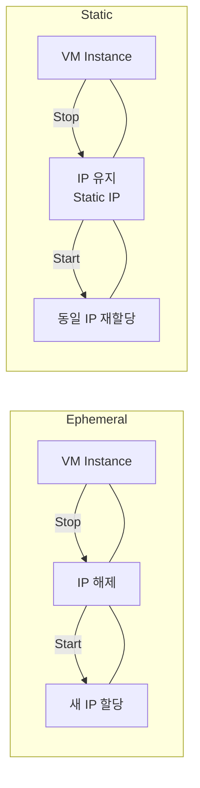
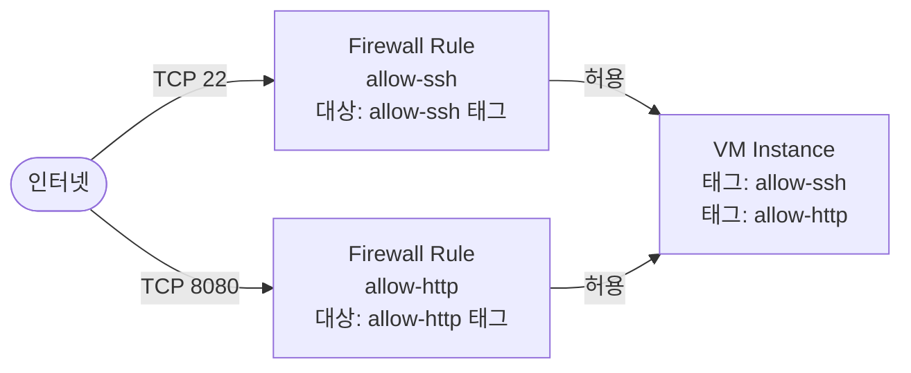
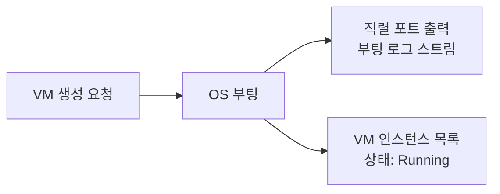
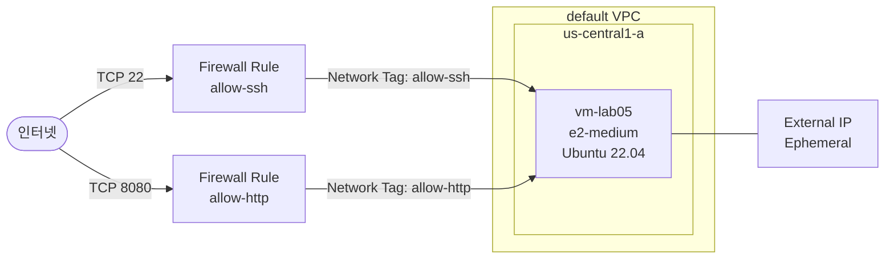

Compute Engine 개요에서 VM을 구성하는 요소들을 파악했다. 이제 콘솔에서 직접 VM을 생성하며, 각 옵션이 어떤 의미를 갖는지 이해한다.

# VM 생성 옵션

VM을 생성할 때 설정하는 주요 옵션들이다. 각 항목은 VM의 성능, 위치, 네트워크 접근 방식을 결정한다.

## 1. Region과 Zone

Region은 GCP 데이터센터가 위치하는 지리적 영역이다 (예: `us-central1` — 미국 아이오와). Zone은 Region 내의 독립 가용 영역이다 (예: `us-central1-a`). VM은 반드시 하나의 Zone에 배치된다.

| 선택 기준 | 권장 Region / Zone |
|-----------|-------------------|
| 한국 서비스 | `asia-northeast3` (서울) |
| 실습 (비용 최소) | `us-central1-a` |

Zone 선택은 가용성과 비용에 영향을 준다. 동일 Region 내 여러 Zone에 분산 배치하면 Zone 장애 시에도 서비스를 유지할 수 있다.

## 2. Machine Type

Machine Type은 VM의 CPU와 메모리 사양을 결정한다. Compute Engine은 먼저 **시리즈**(Series)를 선택하고, 시리즈 내에서 **머신 유형**(Machine Type)을 선택한다.

```text
E2 시리즈 (General Purpose, 비용 효율)
├── e2-micro    (0.25 vCPU, 1 GB)   ← 무료 계층
├── e2-small    (0.5 vCPU, 2 GB)
├── e2-medium   (1 vCPU, 4 GB)      ← 실습 권장
└── e2-standard-2 (2 vCPU, 8 GB)
```

이 시리즈 실습에서는 비용 효율적인 **`e2-medium`** 을 기준으로 사용한다.

## 3. Boot Disk

Boot Disk는 VM에 OS를 설치하는 Persistent Disk다. VM 생성 시 함께 프로비저닝된다.

| 설정 | 선택지 | 실습 기준 |
|------|--------|-----------|
| 이미지 | Ubuntu, Debian, Rocky Linux 등 | **Ubuntu 22.04 LTS** |
| 디스크 유형 | Standard HDD / Balanced PD / SSD PD | **Balanced PD** |
| 크기 | GB 단위 지정 | **20 GB** |

디스크 크기는 VM 생성 후 콘솔에서 확장 가능하지만 축소는 불가능하다. OS와 애플리케이션의 용량을 고려해 여유 있게 설정한다.

---

# External IP

External IP(외부 IP)는 인터넷에서 VM으로 직접 접근할 때 사용하는 공인 IP다. VM 생성 시 두 가지 유형 중 선택한다.

## 1. Ephemeral vs Static

| 유형 | 특징 | 사용 사례 |
|------|------|-----------|
| Ephemeral (임시) | VM 중지 시 해제, 시작 시 새 IP 할당 | 개발·실습 환경 |
| Static (고정) | VM과 무관하게 IP를 예약해 고정 사용 | 프로덕션, DNS 연결 |



Ephemeral은 VM이 중지되면 IP가 반납되고, 재시작 시 다른 IP가 할당된다. Static은 IP를 예약해두기 때문에 VM 중지와 무관하게 동일 IP를 유지한다. 실습에서는 Ephemeral을 사용하며, 프로덕션 환경에서는 DNS 연결을 위해 Static을 사용한다.

External IP가 없으면 인터넷에서 VM에 직접 접근할 수 없다. Ch04에서 다루는 Private VM + IAP 구성은 External IP 없이 안전하게 VM에 접속하는 방식이다.

---

# Network Tag와 Firewall Rule

GCP Firewall Rule은 VM에 직접 연결되지 않는다. **Network Tag** 기반으로 동작한다. VM에 태그를 부여하면, 그 태그를 대상으로 하는 Firewall Rule이 자동 적용된다.

## 1. Network Tag 동작 방식



VM에 `allow-ssh` 태그가 있으면 대상 태그가 `allow-ssh`인 Firewall Rule이 적용된다. 여러 태그를 부여하면 각 태그에 해당하는 규칙이 모두 적용된다. 반대로 태그가 없으면 어떤 태그 기반 규칙도 적용되지 않는다.

## 2. Firewall Rule 주요 속성

| 속성 | 설명 |
|------|------|
| 트래픽 방향 | Ingress(인바운드) / Egress(아웃바운드) |
| 일치 시 작업 | 허용(Allow) / 거부(Deny) |
| 대상 | 특정 태그 / 특정 Service Account / 네트워크 전체 |
| 소스 IP 범위 | `0.0.0.0/0` (전체) 또는 CIDR 지정 |
| 프로토콜 & 포트 | TCP/UDP + 포트 번호 |
| 우선순위 | 숫자 낮을수록 우선 (기본 1000, 암묵적 거부 65535) |

AWS Security Group과의 핵심 차이는 **적용 단위**다. Security Group은 EC2 인스턴스에 직접 연결되지만, GCP Firewall Rule은 Network Tag를 매개로 동작하기 때문에 태그 하나로 수십 개의 VM에 동일한 규칙을 일괄 적용할 수 있다.

---

# VM 상태 확인

VM 생성 후 직렬 포트 출력(Serial Port Output)으로 부팅 로그를 확인할 수 있다. 부팅 과정의 에러를 진단하거나, Startup Script 실행 결과를 확인할 때 유용하다.



VM 생성을 요청하면 OS 부팅이 시작되고, 이 과정이 직렬 포트 출력으로 스트리밍된다. VM 목록에서 상태가 Running으로 바뀌면 준비가 완료된 것이다. Startup Script(Ch03 Sec05)가 있다면 부팅 후 스크립트 실행 결과도 이 로그에서 확인할 수 있다.

---

# 핵심 정리

- VM 생성 시 Region/Zone, Machine Type, Boot Disk 이미지와 디스크 유형을 설정한다. 실습에서는 `us-central1-a`, `e2-medium`, Ubuntu 22.04 LTS, Balanced PD를 기준으로 사용한다.
- External IP는 Ephemeral(VM 중지 시 해제)과 Static(고정 예약) 두 유형이 있다. 실습에서는 Ephemeral을 사용하며, DNS 연결이 필요한 경우 Static을 사용한다.
- GCP Firewall Rule은 Network Tag 기반으로 동작한다. VM에 태그를 부여하면 해당 태그를 대상으로 하는 규칙이 자동 적용된다. AWS Security Group처럼 VM에 직접 연결하지 않는다.
- VM 부팅 후 직렬 포트 출력에서 부팅 로그와 Startup Script 실행 결과를 확인할 수 있다.

---

# 참고 자료

- [VM 인스턴스 만들기](https://cloud.google.com/compute/docs/instances/create-start-instance)
- [외부 IP 주소](https://cloud.google.com/compute/docs/ip-addresses/reserve-static-external-ip-address)
- [방화벽 규칙 사용](https://cloud.google.com/vpc/docs/using-firewalls)
- [직렬 포트 출력](https://cloud.google.com/compute/docs/troubleshooting/viewing-serial-port-output)

---

# [실습] lab05: Linux VM 생성 및 기본 구성

Ubuntu VM을 생성하고, Network Tag와 Firewall Rule을 연결해 외부에서 접근 가능한 기본 환경을 구성한다.

### 실습 목표

- Ubuntu 22.04 LTS VM을 Console에서 생성한다
- Network Tag(`allow-ssh`, `allow-http`)를 부여해 Firewall Rule과 연결한다
- Firewall Rule을 생성해 TCP 22(SSH)와 TCP 8080(HTTP) 트래픽을 허용한다
- VM 상태를 Console에서 확인한다

---

# 전체 아키텍처



외부 인터넷에서 TCP 22와 TCP 8080 트래픽이 각각의 Firewall Rule을 거쳐 VM에 도달한다. Firewall Rule은 VM에 부여된 Network Tag를 통해 적용 대상을 지정한다. External IP는 Ephemeral로 할당되어 인터넷에서 직접 접근할 수 있다.

---

# 사전 준비

- GCP 프로젝트가 생성되어 있고 Billing Account가 연결된 상태
- Compute Engine API가 활성화된 상태 (처음 VM 생성 시 자동 활성화 안내)

---

# 1. VM 생성

## 1. Google Cloud Console > Compute Engine > **VM 인스턴스**

[콘솔화면: Google Cloud Console > Compute Engine > VM 인스턴스 > 인스턴스 목록 화면]

VM 인스턴스 목록 페이지에서 **인스턴스 만들기**를 클릭한다.

## 2. Google Cloud Console > Compute Engine > **인스턴스 만들기**

[콘솔화면: Google Cloud Console > Compute Engine > 인스턴스 만들기 > 기본 구성 화면]

**설정:**

- Name: **`vm-lab05`**
- Region: **`us-central1`** (아이오와)
- Zone: **`us-central1-a`**

## 3. 머신 구성

[콘솔화면: Google Cloud Console > Compute Engine > 인스턴스 만들기 > 머신 구성 섹션]

**설정:**

- Series: **`E2`**
- Machine Type: **`e2-medium`** (1 vCPU, 4 GB 메모리)

## 4. 부팅 디스크

[콘솔화면: Google Cloud Console > Compute Engine > 인스턴스 만들기 > 부팅 디스크 > 변경 버튼 클릭 후 이미지 선택 화면]

**변경** 버튼을 클릭해 이미지를 선택한다.

**설정:**

- Operating system: **`Ubuntu`**
- Version: **`Ubuntu 22.04 LTS`**
- Boot disk type: **`Balanced persistent disk`**
- Size: **`20`** GB

**선택** 클릭 후 부팅 디스크 설정 완료.

## 5. 네트워킹 — Network Tag 설정

[콘솔화면: Google Cloud Console > Compute Engine > 인스턴스 만들기 > 고급 옵션 > 네트워킹 탭]

**고급 옵션 > 네트워킹** 탭을 클릭해 펼친다.

**설정:**

- Network tags: **`allow-ssh`** (입력 후 Enter), **`allow-http`** (입력 후 Enter)
- External IPv4 address: **`임시`** (Ephemeral, 기본값)

## 6. VM 만들기

[콘솔화면: Google Cloud Console > Compute Engine > 인스턴스 만들기 > 하단 만들기 버튼]

**만들기**를 클릭한다. VM 인스턴스 목록으로 돌아오며 `vm-lab05`가 생성 중 상태로 나타난다.

---

# 2. Firewall Rule 생성

## 1. Google Cloud Console > VPC 네트워크 > **방화벽**

[콘솔화면: Google Cloud Console > VPC 네트워크 > 방화벽 > 방화벽 규칙 목록]

탐색 메뉴 > VPC 네트워크 > **방화벽**으로 이동한다. **방화벽 규칙 만들기**를 클릭한다.

### ① allow-ssh 규칙 생성

[콘솔화면: Google Cloud Console > VPC 네트워크 > 방화벽 규칙 만들기 > SSH 규칙 설정 화면]

**설정:**

- Name: **`allow-ssh`**
- Network: **`default`**
- Priority: **`1000`**
- Direction of traffic: **`인그레스`**
- Action on match: **`허용`**
- Targets: **`지정된 대상 태그`**
- Target tags: **`allow-ssh`**
- Source IPv4 ranges: **`0.0.0.0/0`**
- Protocols and ports: TCP, 포트 **`22`**

**만들기** 클릭.

### ② allow-http 규칙 생성

[콘솔화면: Google Cloud Console > VPC 네트워크 > 방화벽 규칙 만들기 > HTTP 규칙 설정 화면]

방화벽 규칙 목록으로 돌아와 **방화벽 규칙 만들기**를 다시 클릭한다.

**설정:**

- Name: **`allow-http`**
- Network: **`default`**
- Priority: **`1000`**
- Direction of traffic: **`인그레스`**
- Action on match: **`허용`**
- Targets: **`지정된 대상 태그`**
- Target tags: **`allow-http`**
- Source IPv4 ranges: **`0.0.0.0/0`**
- Protocols and ports: TCP, 포트 **`8080`**

**만들기** 클릭.

---

# 3. VM 상태 확인

## 1. Google Cloud Console > Compute Engine > **VM 인스턴스**

[콘솔화면: Google Cloud Console > Compute Engine > VM 인스턴스 > vm-lab05 Running 상태]

VM 인스턴스 목록에서 `vm-lab05`의 상태가 **Running** (녹색 체크)인지 확인한다.

**확인:**

- Status: **`Running`**
- External IP: 임시 IP 주소 표시 (예: `34.123.xxx.xxx`)
- Zone: **`us-central1-a`**

## 2. 직렬 포트 출력 확인

[콘솔화면: Google Cloud Console > Compute Engine > VM 인스턴스 > vm-lab05 > 직렬 포트 1(콘솔) 탭]

`vm-lab05`를 클릭해 세부정보 페이지로 이동한다. 상단 탭에서 **직렬 포트 1(콘솔)**을 선택한다.

**확인:**

부팅 로그가 스트리밍된다. 마지막 줄 근처에 아래와 같은 메시지가 나타나면 정상 부팅된 것이다.

```text
...
[  OK  ] Reached target Cloud-config compatibility.
[  OK  ] Finished Apply the settings specified in cloud-config.
```

---

# 자원 정리

이 섹션에서 생성한 리소스는 다음 섹션(03.03 — VM 접속)에서 계속 사용한다. 실습이 완전히 종료되면 아래 리소스를 삭제한다.

| 리소스 | 이름 | 위치 |
|--------|------|------|
| VM 인스턴스 | `vm-lab05` | Compute Engine > VM 인스턴스 |
| Firewall Rule | `allow-ssh` | VPC 네트워크 > 방화벽 |
| Firewall Rule | `allow-http` | VPC 네트워크 > 방화벽 |
