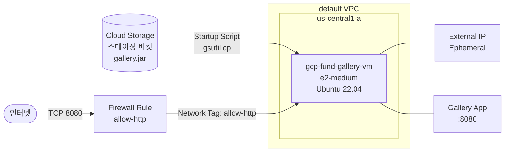

lab05~07에서 VM 생성, SSH 접속, Persistent Disk 구성을 마쳤다. 이제 이 챕터에서 배운 요소들을 실제 애플리케이션 배포에 적용한다. Gallery Spring Boot 앱을 Compute Engine VM에 최초 배포하고, Startup Script로 배포를 자동화한다.

---

# 전체 아키텍처



VM은 기존 lab05에서 생성한 Firewall Rule(`allow-http`, TCP 8080)을 Network Tag로 재사용한다. Startup Script가 부팅 시 GCS에서 `gallery.jar`를 내려받아 설치하고, GCE Metadata Server에서 인스턴스 이름을 조회해 앱에 주입한다. 이번 Gallery는 로컬 스토리지와 H2 인메모리 DB를 기본으로 사용하는 가장 단순한 구성이다.

---

# 사전 준비

- lab05 완료: Firewall Rule `allow-ssh`, `allow-http` 생성됨
- lab06 완료: IAP Tunnel 또는 SSH 접속 가능 상태
- lab07 완료: Persistent Disk 구성 경험
- Google 계정에 **Cloud Storage API** 활성화 확인 (Compute Engine API 활성화 시 함께 활성화됨)

---

# 1. 배포 준비 — JAR 빌드 및 GCS 업로드

Gallery 앱은 Startup Script가 부팅 시 자동으로 내려받을 수 있도록 GCS 버킷에 미리 업로드해야 한다. Cloud Shell은 Google Cloud Console에서 브라우저로 바로 열 수 있는 터미널로, 별도 설치 없이 gcloud, gsutil 등을 사용할 수 있다.

## 1. GCS 스테이징 버킷 생성

[콘솔화면: Google Cloud Console > Cloud Storage > 버킷 > 버킷 만들기 화면]

탐색 메뉴 > Cloud Storage > **버킷** > **만들기** 클릭.

**설정:**

- 버킷 이름: **`gcp-fund-gallery-staging-{PROJECT_ID}`** (전 세계 고유 — Project ID를 suffix로 사용)
- 위치 유형: **`리전`**
- 위치: **`us-central1`**
- 스토리지 클래스: **`Standard`**
- 액세스 제어: **`균일한 버킷 수준 액세스`**

**만들기** 클릭.

> Cloud Storage는 Ch07에서 자세히 다룬다. 여기서는 JAR 파일을 VM에 전달하기 위한 스테이징 용도로만 사용한다.

## 2. Cloud Shell에서 JAR 빌드 및 업로드

[콘솔화면: Google Cloud Console > 우측 상단 Cloud Shell 아이콘 클릭 > 터미널 화면]

Console 우측 상단 터미널 아이콘을 클릭해 Cloud Shell을 연다.

```bash
# 저장소 클론
git clone https://github.com/kickscar/learning-series.git
cd "learning-series/Cloud/Workloads/gallery-spring-boot"

# JAR 빌드 (테스트 생략, 산출물: gallery.jar)
./mvnw clean package -Dbuild.finalName=gallery -DskipTests

# GCS 업로드
gsutil cp target/gallery.jar gs://gcp-fund-gallery-staging-{PROJECT_ID}/gallery.jar
```

**확인:**

```bash
gsutil ls gs://gcp-fund-gallery-staging-{PROJECT_ID}/

# 출력 예
gs://gcp-fund-gallery-staging-{PROJECT_ID}/gallery.jar
```

---

# 2. Startup Script 준비

Startup Script는 VM이 처음 부팅될 때 자동으로 실행되는 셸 스크립트다. JDK 설치부터 앱 실행까지의 과정을 자동화한다.

예제 파일 `startup-script.sh`를 참고하여 `BUCKET_NAME` 값을 실제 버킷 이름으로 수정한다.

```bash
#!/bin/bash
set -e

BUCKET_NAME="gcp-fund-gallery-staging-{PROJECT_ID}"  # 실제 버킷 이름으로 변경
APP_DIR="/app"
LOG_FILE="/var/log/gallery.log"

# 1. JDK 21 설치 (Adoptium Temurin)
apt-get update -y
apt-get install -y wget apt-transport-https gpg

wget -qO - https://packages.adoptium.net/artifactory/api/gpg/key/public | \
  gpg --dearmor | \
  tee /etc/apt/trusted.gpg.d/adoptium.gpg > /dev/null

echo "deb https://packages.adoptium.net/artifactory/deb \
  $(awk -F= '/^VERSION_CODENAME/{print$2}' /etc/os-release) main" | \
  tee /etc/apt/sources.list.d/adoptium.list

apt-get update -y
apt-get install -y temurin-21-jre

# 2. GCS에서 JAR 다운로드
mkdir -p $APP_DIR
gsutil cp gs://$BUCKET_NAME/gallery.jar $APP_DIR/gallery.jar

# 3. GCE Metadata Server에서 인스턴스 이름 조회
INSTANCE_ID=$(curl -sf -H "Metadata-Flavor: Google" \
  http://metadata.google.internal/computeMetadata/v1/instance/name || echo "gallery-vm")

# 4. systemd 서비스 등록 및 시작
cat > /etc/systemd/system/gallery.service << EOF
[Unit]
Description=Gallery Spring Boot App
After=network.target

[Service]
Type=simple
WorkingDirectory=$APP_DIR
ExecStart=/usr/bin/java -jar $APP_DIR/gallery.jar --app.runtime.instance-id=$INSTANCE_ID
Restart=on-failure
StandardOutput=append:$LOG_FILE
StandardError=append:$LOG_FILE

[Install]
WantedBy=multi-user.target
EOF

systemctl daemon-reload
systemctl enable gallery
systemctl start gallery
```

Startup Script의 핵심 동작:
- **JDK 21**: Adoptium Temurin 21 JRE를 Apt 저장소에서 설치한다.
- **JAR 다운로드**: VM의 기본 Service Account 권한으로 GCS 버킷에서 `gallery.jar`를 내려받는다.
- **인스턴스 이름 주입**: GCE Metadata Server(`metadata.google.internal`)에서 VM 이름을 조회해 앱에 전달한다. 화면 Footer에 이 값이 표시된다.
- **systemd 서비스**: 앱을 백그라운드 서비스로 등록해 VM 재시작 시에도 자동으로 실행된다.

---

# 3. gcp-fund-gallery-vm 생성

### 1. 설정값

참고: [섹션 실습 lab05: Linux VM 생성 및 기본 구성]()

- Name: **`gcp-fund-gallery-vm`**
- Region: **`us-central1`**
- Zone: **`us-central1-a`**
- Series: **`E2`**
- Machine Type: **`e2-medium`**
- Boot Disk Image: **`Ubuntu 22.04 LTS`**
- Boot Disk Type: **`Balanced persistent disk`**
- Boot Disk Size: **`20`** GB
- Network Tags: **`allow-ssh`**, **`allow-http`**
- External IPv4 address: **`임시`** (Ephemeral)

**고급 옵션 > 관리 탭 > 자동화 > 시작 스크립트:**

위에서 준비한 Startup Script 전체 내용을 붙여넣는다 (`BUCKET_NAME`이 실제 버킷 이름으로 수정된 상태여야 한다).

[콘솔화면: Google Cloud Console > Compute Engine > 인스턴스 만들기 > 고급 옵션 > 관리 탭 > 시작 스크립트 입력 화면]

**만들기** 클릭.

### 2. 참고

- Firewall Rule `allow-ssh`(TCP 22), `allow-http`(TCP 8080)는 lab05에서 생성한 규칙을 그대로 재사용한다. Network Tag가 동일하면 새 VM에 자동 적용된다.

---

# 4. 앱 동작 확인

## 1. VM 시작 및 Startup Script 실행 확인

[콘솔화면: Google Cloud Console > Compute Engine > VM 인스턴스 > gcp-fund-gallery-vm > 직렬 포트 1(콘솔) 탭]

VM 생성 후 `gcp-fund-gallery-vm` 세부정보 페이지 > **직렬 포트 1(콘솔)** 탭에서 Startup Script 실행 로그를 확인한다.

**확인 포인트:**

```text
...
Starting gallery.service - Gallery Spring Boot App
Started gallery.service - Gallery Spring Boot App
```

JDK 설치, JAR 다운로드, 서비스 시작까지 약 3~5분 소요된다.

## 2. Gallery 앱 접근

[콘솔화면: Google Cloud Console > Compute Engine > VM 인스턴스 > gcp-fund-gallery-vm > External IP 확인]

VM 인스턴스 목록에서 `gcp-fund-gallery-vm`의 External IP를 확인한다.

브라우저에서 아래 URL로 접근한다:

```text
http://{EXTERNAL_IP}:8080
```

[콘솔화면: 브라우저 > http://{EXTERNAL_IP}:8080 > Gallery 메인 화면]

Gallery 갤러리 목록 화면이 표시되면 배포 성공이다. 화면 하단 Footer에 `gcp-fund-gallery-vm` 인스턴스 이름이 표시된다.

## 3. 헬스체크 확인

```text
http://{EXTERNAL_IP}:8080/actuator/health
```

**응답 예:**

```json
{"status":"UP"}
```

## 4. 이미지 업로드 테스트

[콘솔화면: 브라우저 > Gallery 메인 화면 > 파일 선택 후 업로드]

갤러리 화면에서 이미지 파일을 선택하고 업로드한다. 업로드된 이미지가 목록에 나타나면 정상이다.

> 현재 이미지 파일은 VM의 `/app/uploads/` 디렉토리에 저장된다. VM을 삭제하면 이미지도 함께 사라진다. Ch07에서 Cloud Storage로 전환해 영속성을 확보한다.

---

# 자원 정리

Gallery 인프라는 이후 챕터에서 계속 발전시킨다. 삭제하지 않고 **VM만 중지**해 비용을 절감한다.

| 리소스 | 이름 | 조치 |
|--------|------|------|
| VM 인스턴스 | `gcp-fund-gallery-vm` | **중지** (삭제 안 함) |
| GCS 버킷 | `gcp-fund-gallery-staging-{PROJECT_ID}` | 유지 또는 삭제 |
| Firewall Rule | `allow-ssh`, `allow-http` | 유지 |

VM 중지: Google Cloud Console > Compute Engine > VM 인스턴스 > `gcp-fund-gallery-vm` 선택 > **중지**.

중지된 VM은 CPU/메모리 비용이 발생하지 않으며, Persistent Disk(Boot Disk) 비용만 소량 발생한다.
