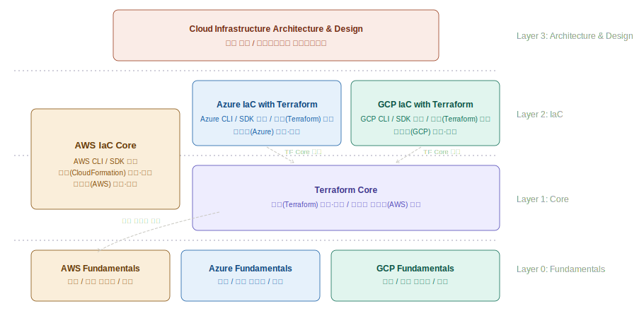
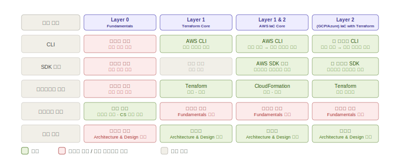

# Cloud Series

## 이 시리즈가 만들어진 배경

클라우드를 다루는 책과 강의는 많다. 그런데 두 가지 문제가 반복된다.

첫째, 입문 과정이 콘솔 화면 위주다. 업데이트가 느려 현재 화면과 맞지 않는 건 부차적인 문제다. 콘솔(GUI)은 코드로 숨어버리기 전에 리소스의 연결과 구조를 눈으로 확인할 수 있다는 분명한 장점이 있다. 문제는 그 장점을 살리지 못하고 "쉽게 보여주겠다"는 의도가 정작 중요한 것을 빠뜨린다는 점이다. 핵심 서비스들이 어떻게 연결되어 하나의 구조를 이루는지, 그리고 네트워킹, 보안, 고가용성 같은 CS 기초 개념들이 클라우드 서비스와 리소스로 어떻게 구현되는지 — 이것이 입문의 핵심이다. 이 기초가 잡히면 나머지 서비스는 스스로 익힐 수 있고, 다른 클라우드 플랫폼으로의 진입도 어렵지 않다.

둘째, IaC를 프로비저닝 도구와 동일시한다. CLI 운영, 애플리케이션과 클라우드 리소스의 연동, 프로비저닝 도구 — 이 세 가지가 함께 IaC의 실체다. 또한 Terraform 같은 멀티클라우드 도구가 "하나 배우면 다 된다"는 오해를 만든다. 각 클라우드 플랫폼의 설계 철학을 알고 그에 맞게 써야 도구가 제 역할을 한다.

이 시리즈는 그 공백을 채운다. 멀티클라우드 입문부터 코드(IaC), 그리고 인프라 설계까지 — 끊기지 않는 하나의 흐름으로 연결한다.

---

## 시리즈 철학

클라우드를 제대로 다룬다는 것은 콘솔을 넘어 코드로 다루는 것만을 의미하지 않는다. 플랫폼마다 다른 설계 철학을 이해하고, 그 위에서 인프라를 구조적으로 설계할 수 있는 것까지다. 이 시리즈는 입문부터 코드(IaC), 설계까지 — 그 전체 흐름을 하나로 잇는다.

---

## 레이어 구조

시리즈는 4개 레이어로 구성된다. 순서가 학습 선후 관계다.



**Layer 0 — Fundamentals**
가장 중요한 레이어다. 콘솔(GUI)에서 핵심 서비스를 직접 다루며 리소스 간 연결 구조와 CS 기초 개념이 클라우드에서 어떻게 구현되는지 눈으로 확인하고 이해한다. 여기서 잡은 기초가 위 레이어 전체를 받친다.

**Layer 1 — Core**
프로비저닝 도구 자체를 깊게 다룬다. CloudFormation과 Terraform — 각 도구의 메커니즘, 개념, 작동 방식에 집중한다. 클라우드 플랫폼 자체는 Fundamentals에서 알고 있다고 가정한다.

**Layer 2 — IaC**
각 클라우드 플랫폼에 집중한다. CLI·SDK를 베이스로, AWS는 CloudFormation으로, Azure·GCP는 Terraform으로 플랫폼 리소스를 코드로 다룬다. 플랫폼의 설계 철학을 이해하고 그에 맞게 다루는 것이 핵심이다. TF 심화는 Layer 1 Terraform Core를 참조한다.

**Layer 3 — Architecture & Design**
설계 철학과 트레이드오프를 다룬다. 왜 이렇게 구조화하는가 — 레이어링, 모듈화, HA/DR, 멀티클라우드 설계 패턴의 당위를 짚는다. 모든 레이어를 거친 후 이 시리즈의 마무리이자 핵심이다.

---

## 시리즈 목록 및 스코프 정의

```
Cloud/
├── README.md
├── Assets/
│   ├── cloud-series-hierarchy.svg
│   └── cloud-series-coverage-mapping.svg
├── AWS Fundamentals/
├── Azure Fundamentals/
├── GCP Fundamentals/
├── AWS IaC Core/ ← Layer 1(CloudFormation Core) + Layer 2(AWS IaC with CloudFormation)
├── Terraform Core/
├── Azure IaC with Terraform/
├── GCP IaC with Terraform/
└── Cloud Infrastructure Architecture & Design/
```

*AWS IaC Core: CloudFormation이 AWS 전용 도구라는 특성상 이 시리즈는 Layer1(CloudFormation Core)와 Layer2(AWS IaC with CloudFormation) 성격을 함께 가진다.*



### Layer 0 — Fundamentals

**공통 원칙:** 콘솔에서 직접 실습. 리소스 간 연결관계, HA/Scaling/Observability 등 클라우드 핵심 개념을 체득. Core/IaC 시리즈의 선수 과정.

| 시리즈 | 핵심 플랫폼 | 다루는 것 | 다루지 않는 것 |
| --- | --- | --- | --- |
| AWS Fundamentals | AWS | 콘솔 실습, Computing(VM·Container)·Storage·Database·Networking, 리소스 연결관계, HA/Auto Scaling/Observability, 인프라 테스트 인식 수준 | CLI, SDK, 프로비저닝 도구, 테스트 체계 |
| Azure Fundamentals | Azure | 동일 컨셉 | 동일 |
| GCP Fundamentals | GCP | 동일 컨셉 | 동일 |

인프라 테스트는 Fault Tolerance·Security·Scaling·Bottleneck이 무엇인지 인식하고 콘솔에서 작동을 눈으로 확인하는 수준에 한한다. 테스트 체계(Chaos Engineering·DevSecOps·Load Testing)는 다루지 않는다.

### Layer 1 — Core

**공통 원칙:** 프로비저닝 도구 자체를 깊게 다룬다. 클라우드는 실습 수단이며 클라우드 자체를 가르치지 않는다. 해당 클라우드의 Fundamentals를 이미 학습했다고 가정한다.

**AWS IaC Core**
- CloudFormation 도구 자체를 깊게 다룸
- CF 핵심 개념 - 템플릿 구조, 스택, 변경 세트, 드리프트 감지 등 메커니즘 중심
- 다루지 않는 것: 클라우드 개념(Fundamentals 가정), 설계 철학(Architecture 담당)

**Terraform Core**
- 멀티클라우드 도구로 Terraform 도구 자체를 깊게 다룸
- TF 핵심 개념 — provider, resource, state, variable, 모듈, 워크스페이스
- 실습 기반: AWS (보편적 기반)
- 다루지 않는 것: 클라우드 개념(Fundamentals 가정), 설계 철학(Architecture 담당)

### Layer 2 — IaC

**공통 원칙:** 각 클라우드 플랫폼에 집중한다. CLI는 별도 챕터에서 설치·기본 사용법을 다루고 실습 전반에 자연스럽게 녹인다. SDK는 유틸리티 수준으로 확인한다. AWS는 CloudFormation으로, Azure·GCP는 Terraform으로 플랫폼 리소스를 코드로 다룬다. TF 심화는 Terraform Core 참조. CI/CD는 IaC 자동화의 핵심으로 다룬다 — 코드 리뷰, plan 자동화, 배포 파이프라인 구현까지 포함한다. 파이프라인 설계 전략(멀티 환경·브랜치 전략·보안 게이트 등)은 Architecture & Design 담당.

**AWS IaC Core**
- AWS CLI — 별도 챕터에서 설치·기본 사용법 다루고, 실습 전반에 자연스럽게 녹임
- SDK 예제 — Workload와 리소스 연동을 유틸리티 수준으로 확인
- CloudFormation — AWS 플랫폼 핵심 리소스 배포. 플랫폼(AWS) 중심·심화
- 인프라 테스트 — 코드로 올린 인프라가 의도대로 작동하는지 브릿지 수준으로 확인. Scaling 트리거·보안 정책 적용·간단한 장애 시뮬레이션 정도. 테스트 체계(Chaos Engineering·DevSecOps·Load Testing)는 Architecture & Design 담당
- 다루지 않는 것: 클라우드 개념(Fundamentals 가정)

**Azure IaC with Terraform**
- Azure CLI — 별도 챕터에서 설치·기본 사용법 다루고, 실습 전반에 자연스럽게 녹임
- SDK 예제 — 유틸리티 수준으로 확인
- Terraform — Azure provider, 핵심 리소스 배포. 기본 수준
- 다루지 않는 것: Azure 클라우드 개념(Fundamentals 가정), TF 심화(Core 참조), Bicep

**GCP IaC with Terraform**
- GCP CLI (gcloud) — 별도 챕터에서 설치·기본 사용법 다루고, 실습 전반에 자연스럽게 녹임
- SDK 예제 — 유틸리티 수준으로 확인
- Terraform — GCP provider, 핵심 리소스 배포. 기본 수준
- 다루지 않는 것: GCP 클라우드 개념(Fundamentals 가정), TF 심화(Core 참조)

### Layer 3 — Architecture

**Cloud Infrastructure Architecture & Design**
- 설계 철학과 트레이드오프. 왜 이렇게 구조화하는가
- 전제: 모든 Fundamentals + 최소 하나 이상의 Core/IaC 시리즈 학습
- 다루는 것:
  - 멀티클라우드 설계 패턴, 레이어링·모듈화의 당위, HA/DR/Observability 설계, 트레이드오프 판단 기준
  - 인프라 테스트 체계 — Chaos Engineering(Fault Tolerance 전략·blast radius 설계) / DevSecOps(파이프라인 보안 내재화·shift-left) / Performance·Load Testing(부하 테스트 설계·병목 탐지 전략) / DR 검증(RTO/RPO 기준·복구 시나리오 구조화)
- 다루지 않는 것: 특정 도구 사용법(각 Core/IaC 시리즈 담당)

---

## 시리즈 간 경계 원칙

문서 작성 중 어떤 내용을 얼마나 깊게 다룰지 판단이 필요할 때 아래 원칙을 따른다.

**클라우드 개념 (HA, VPC, 리소스 연결 등)**
→ Fundamentals 담당. Core/IaC에서는 알고 있다고 가정하고 설명 없이 사용.

**CLI 사용**
→ Layer 2 IaC 시리즈에서 별도 챕터로 설치·기본 사용법을 다루고, 이후 실습 전반에 자연스럽게 녹임. Layer 1 Core에서는 CLI가 주제가 아님 — 프로비저닝 도구 메커니즘에 집중.

**SDK 코드 예제**
→ Layer 2 IaC 시리즈에서 유틸리티 수준으로만. 언어 문법 설명 없음. 리소스 연동 확인 수준.

**프로비저닝 도구 심화 (TF 모듈화 등)**
→ Terraform Core 담당. IaC 시리즈에서는 언급 후 Terraform Core 참조 처리.

**CloudFormation 심화**
→ AWS IaC Core(Layer 1 관점) 담당. AWS IaC with CloudFormation(Layer 2 관점)에서는 언급 후 AWS IaC Core 참조 처리.

**CI/CD**
→ IaC 자동화의 핵심으로 IaC 시리즈에서 다룬다. Git 기반 코드 관리, PR/리뷰, plan 자동화, 배포 파이프라인 구현까지 포함한다. 파이프라인 설계 전략(멀티 환경·브랜치 전략·보안 게이트 구조화 등)은 Architecture & Design 담당.

**인프라 테스트**
→ Fundamentals에서는 Fault Tolerance·Security·Scaling·Bottleneck이 무엇인지 인식하고 콘솔에서 작동을 눈으로 확인하는 수준. IaC 시리즈에서는 코드로 올린 인프라가 의도대로 작동하는지 브릿지 수준으로 확인. 테스트 체계(Chaos Engineering·DevSecOps·Performance/Load Testing·DR 검증)는 Architecture & Design 담당.

**설계 당위 ("왜 이렇게 나눠야 하는가")**
→ Architecture & Design 담당. Core/IaC에서는 메커니즘만 보여주고 당위 설명은 최소화.