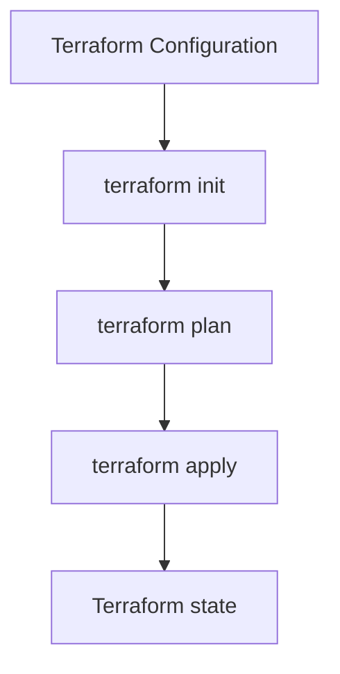

# **개요**

본 Section에서는 Terraform 학습의 출발점이 되는 기초 개념을 설명한다. DevOps와 자동화의 흐름 안에서 infrastructure as Code(IaC)가 왜 필요한지 정리하고, IaC를 구현하는 대표 도구인 Terraform이 어떤 방식으로 인프라를 관리하는지 단계적으로 살펴본다.

이 문서의 초점은 AWS 인프라 자체를 설명하는 데 있지 않다. 이미 AWS 기본 개념을 알고 있는 학습자를 전제로, Terraform이 인프라를 어떤 방식으로 모델링하고 변경을 관리하는지 이해하는 데 초점을 둔다.

# **핵심 포인트**

- Terraform은 infrastructure as Code(IaC)를 실현하는 대표적인 선언형(Declarative) 프로비전 도구이다.
- IaC의 핵심은 인프라 작업 절차를 나열하는 것이 아니라 원하는 상태를 코드로 정의하는 것이다.
- Terraform은 Configuration, Provider, State를 기준으로 변경 사항을 계산한다.
- Terraform의 핵심 workflow는 `terraform init`, `terraform plan`, `terraform apply`로 이어진다.
- CloudFormation과 비교할 수는 있지만, Terraform Basics의 중심축은 Terraform 자체의 실행 모델과 운영 방식이다.

# **DevOps와 자동화**

DevOps는 개발(Development)과 운영(Operations)을 분리된 조직 기능으로만 보지 않고, 소프트웨어 전달과 운영 품질을 함께 개선하는 방식으로 이해할 수 있다. 단순히 특정 도구를 도입하는 것이 아니라, 협업 구조와 배포 방식, 변경 관리 방식을 함께 바꾸는 접근이다.

DevOps의 핵심 가치로는 일반적으로 CLAMS가 자주 언급된다.

| 핵심 가치 | 설명 |
| --- | --- |
| Culture | 개발과 운영의 분리를 줄이고 협업 구조를 강화한다. |
| Lean | 작은 단위로 변경하고 낭비를 줄여 전달 속도를 높인다. |
| Automation | 반복 작업을 도구로 대체하여 속도와 일관성을 확보한다. |
| Measurement | 측정 가능한 지표를 기반으로 품질과 운영 상태를 판단한다. |
| Sharing | 지식과 운영 기준을 공유하여 반복 가능한 팀 구조를 만든다. |

Terraform 관점에서 중요한 것은 이 중 **Automation**과 **재현성**이다. 애플리케이션 배포를 자동화하더라도, 애플리케이션이 실행될 인프라 환경이 매번 다르면 자동화의 효과는 크게 줄어든다. 결국 코드 배포 자동화는 인프라 자동화와 함께 다루어져야 한다.

# 자동화와 인프라 관리

배포 자동화는 코드를 빌드하고 테스트하고 배포하는 흐름을 자동화하는 것이다. 그러나 실제 운영에서는 애플리케이션 코드만 자동화한다고 충분하지 않다. 네트워크, 컴퓨팅, 스토리지, 접근 제어 같은 실행 환경도 일관되게 준비되어야 한다.

이 지점에서 등장하는 개념이 infrastructure as Code(IaC)다.

> IaC는 인프라를 코드로 정의하고, 그 코드를 기준으로 인프라를 생성·변경·삭제하는 방식이다.

IaC가 필요한 이유는 인프라 변경을 수동 작업에서 코드 관리 대상으로 바꾸기 위해서다. 콘솔에서 클릭으로 리소스를 만들거나, 일회성 스크립트로 급하게 환경을 수정하는 방식은 재현성과 추적성을 확보하기 어렵다. 반면 IaC는 인프라를 명시적인 코드로 다루기 때문에 버전 관리, 리뷰, 자동화, 반복 실행이 가능하다.

# **IaC(Infrastructure as Code)**

Infrastructure as Code(IaC)는 서버, 네트워크, 스토리지 같은 인프라 자원을 코드로 정의하고, 그 코드를 실행해 인프라를 생성·변경·삭제하는 방식을 의미한다. 핵심은 인프라를 수동 작업의 대상이 아니라 소프트웨어처럼 관리 가능한 대상로 전환하는 데 있다.

IaC의 주요 이점은 다음과 같다.

### **① 일관성과 재현성**

동일한 코드를 같은 조건에서 실행하면 동일한 인프라 구성이 반복적으로 만들어진다. 이 특성은 개발, 테스트, 운영 환경 간 차이를 줄이는 데 중요하다.

### **② 버전 관리와 협업**

인프라 정의가 코드 형태이므로 Git 같은 버전 관리 시스템에 저장할 수 있다. 누가 어떤 변경을 했는지 추적할 수 있고, 코드 리뷰와 롤백 같은 소프트웨어 개발 방식이 인프라 변경에도 적용된다.

### **③ 자동화와 운영 속도**

반복 작업을 자동화할 수 있으므로 수동 프로비저닝보다 더 빠르고 일관되게 환경을 준비할 수 있다. 특히 대규모 환경일수록 수동 작업보다 자동화의 효과가 크다.

### **④ 문서화 효과**

IaC 코드는 단순한 실행 파일이 아니라 인프라 정의서 역할도 수행한다. 별도의 문서와 실제 인프라가 어긋나는 문제를 줄일 수 있다.

## IaC 도구의 유형

IaC는 단일 도구군이 아니라 여러 접근 방식으로 나뉜다. Terraform을 이해하려면 먼저 IaC 도구의 범주를 구분하는 것이 유용하다.

| 범주 | 설명 | 대표 예시 |
| --- | --- | --- |
| 애드혹 스크립트 | 특정 작업을 위해 작성된 일회성 스크립트 | Bash, PowerShell, AWS CLI 스크립트 |
| 구성 관리 도구 | 이미 존재하는 서버 내부 설정을 관리 | Ansible, Chef, Puppet |
| 서버 템플릿 도구 | 이미지 기반으로 환경을 재사용 | Packer, AMI, Docker 이미지 |
| 오케스트레이션 도구 | 컨테이너와 서비스 실행 환경을 제어 | Kubernetes, Docker Swarm, ECS |
| 프로비전 도구 | 클라우드 API를 호출해 인프라 자원을 생성·변경·삭제 | Terraform, CloudFormation, Pulumi |

Terraform은 이 중 **프로비전 도구** 범주에 속한다. 즉, Terraform의 중심 역할은 애플리케이션 실행 이후의 운영이 아니라, 그 애플리케이션이 동작할 인프라 자원을 선언적으로 만들고 변경하는 데 있다.

## IaC의 접근 방식 : Declarative vs Imperative

IaC 도구는 코드 작성 방식에 따라 선언형(Declarative)과 명령형(Imperative)으로 구분할 수 있다.

| 구분 | 설명 | 대표 도구 |
| --- | --- | --- |
| 선언형(Declarative) | 원하는 최종 상태를 기술하고, 도구가 현재 상태와 비교하여 필요한 변경을 계산한다. | Terraform, CloudFormation, Pulumi |
| 명령형(Imperative) | 어떤 순서로 무엇을 실행할지 단계별 절차를 기술한다. | Ansible, Chef, Puppet |

Terraform을 이해할 때 중요한 점은 “무엇을 만들고 싶은가”를 정의하는 도구라는 것이다. 예를 들어 사용자는 VPC를 만드는 세부 절차를 직접 순서대로 작성하기보다, 어떤 속성을 가진 VPC가 존재해야 하는지를 선언한다. Terraform은 그 정의를 읽고 현재 상태와 비교하여 필요한 작업만 수행한다.

# **Terraform**

Terraform은 HashiCorp가 개발한 오픈 소스 Infrastructure as Code(IaC) 도구다. 사용자는 인프라의 목표 상태(Desired State)를 HCL(HashiCorp Configuration Language)로 정의하고, Terraform은 이를 바탕으로 실제 인프라를 생성·변경·삭제한다.

Terraform의 핵심 특징은 특정 클라우드 전용 도구가 아니라는 점이다. AWS provider를 사용하면 AWS를 대상으로 동작하고, 다른 provider를 사용하면 Azure, GCP, SaaS 플랫폼, 온프레미스 시스템까지 같은 방식으로 다룰 수 있다.

이 점이 Terraform이 CloudFormation과 구분되는 중요한 출발점이다. CloudFormation은 AWS에 특화된 IaC 도구이고, Terraform은 provider 생태계를 통해 더 넓은 범위를 다룰 수 있는 범용 IaC 실행 엔진에 가깝다. 다만 이 Section에서는 비교를 깊게 확장하지 않고, Terraform이 어떤 구조로 동작하는지 이해하는 데 집중한다.

## **Terraform 전체 동작 흐름**

Terraform의 기본 실행 흐름은 다음과 같다.

1. 사용자가 `.tf` 파일에 원하는 인프라 구성을 정의한다.
2. `terraform init`을 실행하여 필요한 provider를 초기화한다.
3. `terraform plan`으로 현재 상태와 목표 상태의 차이를 계산한다.
4. `terraform apply`로 계산된 변경을 실제 환경에 적용한다.
5. 적용 결과는 `Terraform state`에 기록되고, 이후 실행의 기준이 된다.

이 흐름의 핵심은 “코드 작성 -> 계획 계산 -> 실제 적용 -> 상태 기록”의 구조다. Terraform은 단순히 선언된 순서대로 명령을 실행하는 것이 아니라, Configuration과 State를 기준으로 변경 사항을 계산한다.

Terraform workflow : Configuration, init, plan, apply, state의 기본 관계

## **Terraform의 핵심 구성 요소**

Terraform을 처음 이해할 때는 다음 다섯 가지를 먼저 구분하면 된다.

| 구성 요소 | 설명 |
| --- | --- |
| Configuration | HCL로 작성된 `.tf` 파일. 어떤 인프라가 존재해야 하는지 정의한다. |
| Provider | 대상 플랫폼과 통신하는 플러그인. AWS를 사용할 경우 AWS provider가 여기에 해당한다. |
| Resource | Terraform이 실제로 관리하는 인프라 객체. 예: `aws_vpc`, `aws_instance`, `aws_s3_bucket` |
| State | Terraform이 관리 중인 인프라의 현재 상태 정보 |
| Plan / Apply | 변경 예정 사항을 계산하는 단계와 실제 변경을 적용하는 단계 |

이 중 입문 단계에서 가장 중요한 것은 Configuration, Provider, Resource의 구분이다. 이후 Section에서 HCL 문법과 Terraform state를 더 자세히 다루게 된다.

## **동작 예시 : S3 bucket 생성**

예를 들어 `.tf` 파일에 S3 bucket 하나를 정의했다고 가정하면 Terraform은 다음과 같이 동작한다.

1. 현재 `Terraform state`에 동일한 resource가 있는지 확인한다.
2. 코드에 정의된 목표 상태와 현재 상태를 비교한다.
3. 리소스가 없다면 생성(Create), 설정이 다르면 수정(Update), 더 이상 필요 없으면 삭제(Delete) 계획을 만든다.
4. `terraform apply` 실행 시 실제 플랫폼 API를 호출해 변경을 수행한다.
5. 변경 결과를 state에 반영한다.

이 과정에서 중요한 점은 Terraform이 항상 **코드(목표 상태)** 와 **State(현재 상태)** 를 함께 기준으로 삼는다는 것이다. 따라서 수동으로 순서를 맞춘 스크립트를 작성하는 접근과는 다르다.

## **Terraform의 주요 특징**

### **① 선언형(Declarative) 접근**

Terraform은 “어떻게 만들 것인가”보다 “무엇이 존재해야 하는가”를 기술한다. 이 특성 덕분에 동일한 configuration을 여러 번 실행해도 일관된 상태를 유지하려고 시도할 수 있다.

### **② provider 기반 확장성**

Terraform은 provider를 통해 다양한 플랫폼과 통신한다. 이 구조 덕분에 특정 벤더에 한정되지 않는 IaC 학습과 운영 패턴을 만들 수 있다.

### **③ State 기반 변경 관리**

Terraform은 state를 기준으로 변경 사항을 계산한다. 따라서 변경 전에 `plan`을 검토하고, 이후 결과를 state에 반영하는 운영 모델을 가진다.

### **④ 모듈과 재사용**

Terraform은 module 구조를 통해 반복되는 인프라 구성을 재사용할 수 있다. 이는 실무에서 Terraform을 단순 예제 수준이 아니라 재사용 가능한 설계 도구로 확장하는 핵심 요소다.

# **정리**

이 Section에서는 DevOps와 자동화의 맥락 안에서 IaC가 왜 필요한지, 그리고 Terraform이 IaC 도구로서 어떤 위치를 가지는지 정리했다. Terraform은 선언형 방식으로 목표 상태를 정의하고, Configuration, Provider, State를 기준으로 변경 사항을 계산하는 도구다.

또한 Terraform 학습의 핵심은 단순히 AWS resource 이름을 외우는 것이 아니라, 인프라를 코드로 정의하고 `plan`과 `apply`를 통해 안전하게 변경을 관리하는 실행 모델을 이해하는 데 있다는 점을 확인했다.

다음 Section에서는 CloudFormation과 Terraform을 비교하면서 두 도구의 실행 모델, 상태 관리, 적용 범위가 어떤 차이를 만드는지 더 구체적으로 다룬다.

# **참고 자료**

- [Terraform 공식 문서 - Introduction](https://developer.hashicorp.com/terraform/intro)
- [HashiCorp - What is Infrastructure as Code?](https://www.hashicorp.com/resources/what-is-infrastructure-as-code)
