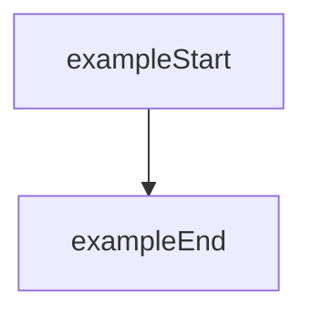

# {chapter}.{section} {section title}

이 템플릿은 **고정형 목차를 강제하지 않는 Section draft 템플릿**이다.

Section 문서는 chapter plan의 목표와 사용자가 원하는 최종 문서 수준에 따라 구조를 유연하게 선택한다.

---

# 문서 패턴 선택

Section 문서를 작성할 때는 먼저 다음 패턴 중 하나를 선택한다.

## 패턴 A. 개념 입문형

- `개요`
- `핵심 포인트`
- `배경 개념`
- `핵심 개념`
- `Terraform 관점의 의미`
- `참고 자료`

예:

- IaC와 Terraform
- Terraform 소개

## 패턴 B. 비교형

- `개요`
- `비교 목적`
- `비교 표`
- `차이점 정리`
- `Terraform 관점의 의미`
- `참고 자료`

예:

- CloudFormation vs Terraform
- Declarative vs Imperative

## 패턴 C. workflow형

- `개요`
- `핵심 포인트`
- `실행 흐름`
- `핵심 구성 요소`
- `동작 예시`
- `참고 자료`

예:

- init, plan, apply 워크플로우
- Terraform state 동작 흐름

## 패턴 D. 실습형

- `개요`
- `실습 목표`
- `핵심 포인트`
- `구성 요소`
- `실습 단계`
- `검증 포인트`

예:

- 첫 번째 Terraform 프로젝트
- state 검증 실습

## 패턴 E. 운영/설계형

- `개요`
- `문제 상황`
- `설계 기준`
- `trade-off`
- `권장 패턴`
- `참고 자료`

예:

- workspace와 환경 분리
- module 설계 원칙

실제 작성 시 위 패턴을 그대로 복사할 필요는 없다. 다만 section 목적에 맞는 패턴을 선택한 뒤 필요한 소제목만 사용한다.

---

# **개요**

이 Section에서 다루는 주제와 문서의 범위를 설명한다.

- 이 Section이 Series 전체 흐름에서 어떤 위치인지
- 어떤 배경 개념에서 출발하는지
- 어떤 핵심 질문에 답하는 문서인지

필요하면 다음처럼 더 넓은 맥락에서 시작할 수 있다.

- DevOps
- 자동화
- IaC
- Terraform workflow
- 운영 설계 배경

---

# **핵심 포인트**

이 Section의 핵심 메시지를 3~6개 bullet로 요약한다.

- 이 문서를 읽고 반드시 가져가야 하는 기술적 요점
- 실습형 문서라면 검증해야 하는 관찰 포인트
- 비교형 문서라면 차이를 판단하는 기준

필요하지 않으면 생략할 수 있지만, 입문형/실습형 문서에서는 우선 포함을 고려한다.

---

# {Main Topic 1}

문단 중심으로 설명한다.

필요 시 다음 형식을 사용할 수 있다.

- 배경 개념 설명
- 정의와 필요성
- 비교 설명
- 분류 표
- 단계 흐름

## {Sub Topic}

세부 개념을 설명한다.

표가 더 적합하면 표를 사용한다.

| 항목 | 설명 |
| --- | --- |
| {item} | {description} |

---

# {Main Topic 2}

Terraform 관점에서 핵심 개념을 설명한다.

예:

- Terraform의 역할
- Terraform의 동작 흐름
- 핵심 구성 요소
- Terraform과 다른 도구 비교
- 설계 또는 운영 관점의 trade-off

## {Sub Topic}

필요 시 다음 형식을 사용할 수 있다.

1. 단계 설명
2. 비교 설명
3. 예시 설명

AWS resource나 AWS 서비스 설명이 필요한 경우에도 **Terraform 개념 설명에 필요한 수준까지만** 다룬다.

예:

- VPC의 기초 개념을 길게 설명하지 않는다.
- EC2, S3, Subnet은 Terraform 예제의 맥락을 이해하는 수준으로만 짧게 정리한다.

---

# {Main Topic 3}

필요한 경우에만 추가한다.

다음 중 Section 성격에 맞는 요소만 포함한다.

- Terraform Configuration Example
- 동작 예시
- 비교 표
- Mermaid 다이어그램
- 이미지 placeholder



다이어그램이 필요 없으면 생략한다.

---

# {Optional Topic : Example or Practice}

이 Section이 실습 중심일 때만 포함한다.

실습이 필요하지 않은 Section이라면 이 전체 섹션을 생략할 수 있다.

## 예제 코드

코드가 필요한 경우에만 포함한다.

```hcl
# ./lab01/main.tf
resource "example" "sample" {
  name = "example"
}
```

## 실행 흐름

CLI 설명이 필요한 경우에만 포함한다.

```bash
terraform init
terraform plan
terraform apply
```

## 실습 포인트

- 무엇을 확인해야 하는지
- 어떤 개념과 연결되는지
- 어떤 결과를 검증해야 하는지

실습형 문서라면 다음 섹션을 추가로 사용할 수 있다.

## 구성 요소

- 어떤 Terraform resource 또는 개념을 검증하는지
- 어떤 입력값, 상태, 의존성을 보는지

## 검증 포인트

- 실행 결과에서 무엇을 확인해야 하는지
- 어떤 출력, state 변화, plan diff를 읽어야 하는지

---

# **참고 자료**

필요한 경우에만 포함한다.

- [공식 문서 또는 1차 자료 링크]
- [관련 참고 자료]

문서 성격상 참고 자료가 불필요하면 생략할 수 있다.
