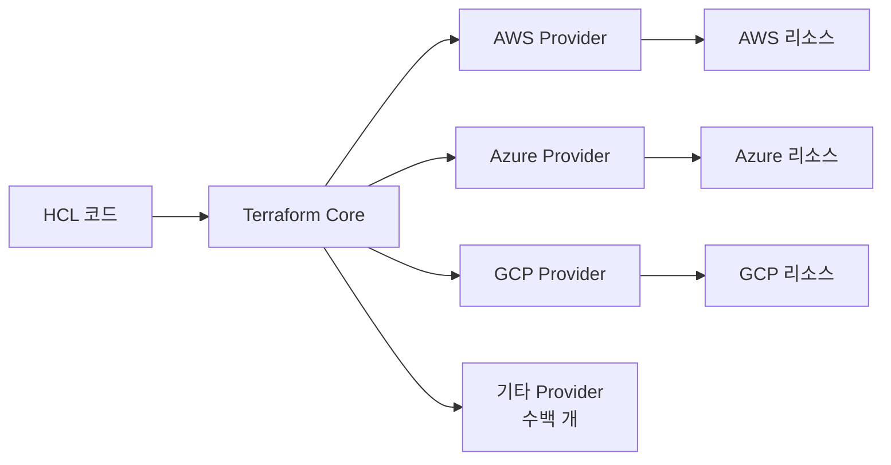
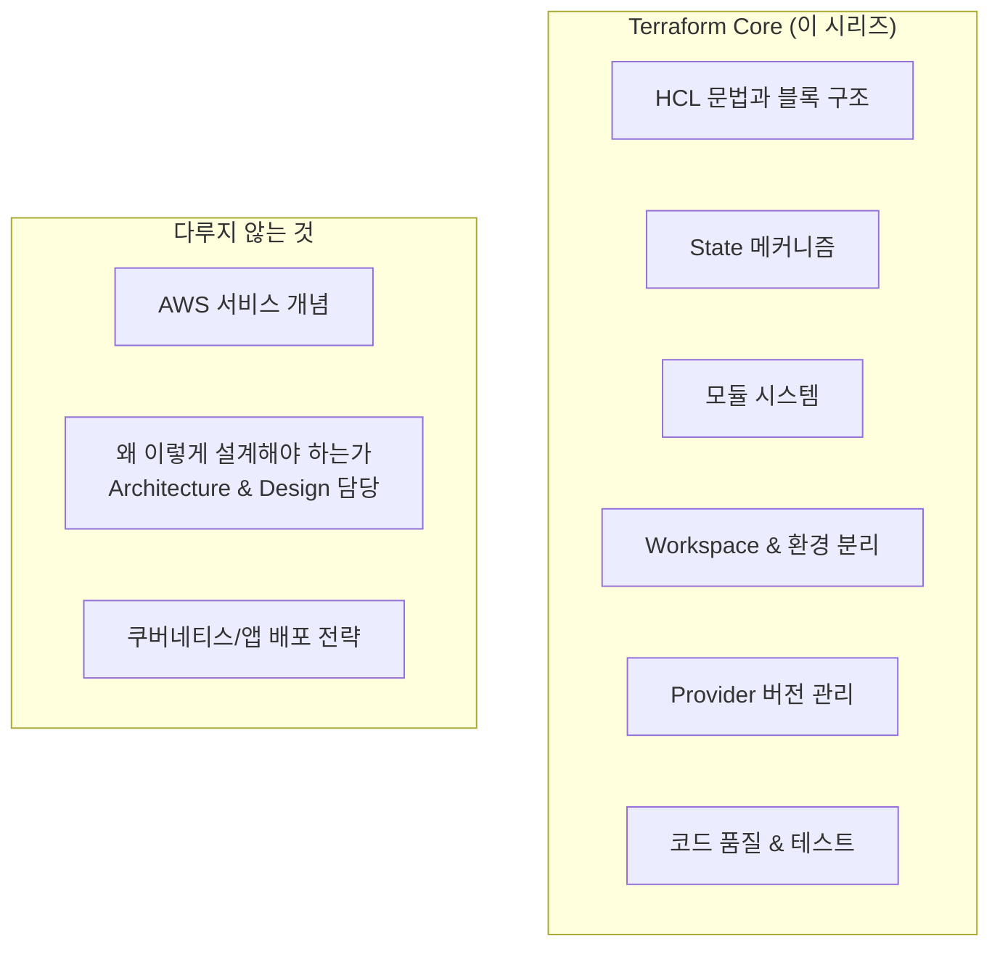

# Ch01. Terraform 시작하기 / Sec01. IaC와 Terraform 포지셔닝

인프라를 수동으로 구성하던 방식에서 코드로 정의하고 관리하는 방식으로의 전환을 다룬다. Terraform이 IaC 도구들 사이에서 어떤 위치를 차지하는지, 그리고 이 시리즈가 무엇에 집중하는지 짚는다.

---

## 1. IaC란 무엇인가

### ① 수동 인프라 관리의 문제

클라우드 이전 시대에는 서버를 직접 구입하고 운영체제를 설치하고 네트워크를 수동으로 설정했다. 클라우드 등장 이후에도 한동안 이 방식은 이어졌다 — 콘솔에서 클릭하고, 설정 값을 적어두고, 같은 환경을 재현하려면 그 과정을 처음부터 다시 반복했다.

이 방식의 문제는 크게 세 가지다.

- **재현 불가능**: 동일한 환경을 다시 만들 때 실수가 끼어든다.
- **추적 불가능**: 누가 언제 무엇을 바꿨는지 히스토리가 없다.
- **확장 비용**: 환경이 늘어날수록(dev/staging/prod) 관리 복잡도가 선형이 아닌 지수로 증가한다.

### ② 코드로 관리한다는 것

IaC(Infrastructure as Code)는 인프라 구성을 코드 파일로 정의하는 접근 방식이다. 코드로 정의하면 소프트웨어 개발에서 당연하게 여기는 것들을 인프라에도 적용할 수 있다.

- **버전 관리**: Git으로 변경 이력 추적
- **코드 리뷰**: 인프라 변경도 PR로 검토
- **자동화**: CI/CD 파이프라인에서 인프라 배포 실행
- **재현 가능**: 동일한 코드로 동일한 환경을 언제든 다시 생성

인프라가 코드가 되면, 인프라를 다루는 방식이 애플리케이션을 다루는 방식과 같아진다.

### ③ IaC 도구의 역할

IaC 도구는 코드 파일을 읽고 실제 인프라 리소스를 생성·수정·삭제하는 역할을 한다. 클라우드 API를 직접 호출하는 복잡함을 추상화하고, 현재 인프라 상태와 원하는 상태의 차이를 계산해서 필요한 변경만 적용한다.

---

## 2. 선언형 vs 절차형 IaC

IaC 도구는 접근 방식에 따라 두 가지로 나뉜다.

### ① 절차형 (Procedural)

**"어떻게 만들지"** 를 코드로 작성한다. 순서와 절차를 명시한다.

```yaml
# Ansible 예시 (절차형)
- name: EC2 인스턴스 생성
  amazon.aws.ec2_instance:
    name: web-server
    instance_type: t3.micro
    image_id: ami-0c02fb55956c7d316
    state: present

- name: 인스턴스가 running 상태가 될 때까지 대기
  amazon.aws.ec2_instance_info:
    ...
```

절차형은 유연하다. 복잡한 배포 로직, 조건 분기, 실행 순서 제어가 필요한 상황에 강하다. 단, 현재 상태를 파악하지 않고 코드를 그대로 실행하기 때문에 멱등성(idempotency) 보장이 어렵다.

### ② 선언형 (Declarative)

**"어떤 상태여야 하는지"** 를 코드로 작성한다. 절차는 도구가 결정한다.

```hcl
# Terraform 예시 (선언형)
resource "aws_instance" "web" {
  ami           = "ami-0c02fb55956c7d316"
  instance_type = "t3.micro"

  tags = {
    Name = "web-server"
  }
}
```

`aws_instance` 리소스가 이런 상태여야 한다고 선언할 뿐이다. 현재 인프라와 비교해서 무엇을 해야 하는지는 Terraform이 계산한다. 이미 존재하면 건드리지 않고, 없으면 생성하고, 설정이 달라졌으면 수정한다.

### ③ 비교

| 구분 | 절차형 | 선언형 |
|------|--------|--------|
| 대표 도구 | Ansible, Shell Script | Terraform, CloudFormation |
| 코드 내용 | 실행 절차와 순서 | 원하는 최종 상태 |
| 멱등성 | 직접 구현 필요 | 도구가 보장 |
| 강점 | 복잡한 배포 로직 | 인프라 프로비저닝 |
| 적합한 용도 | 구성 관리, 애플리케이션 배포 | 클라우드 리소스 생성/관리 |

절차형과 선언형은 경쟁 관계가 아니다. Terraform으로 인프라를 프로비저닝하고 Ansible로 서버를 구성하는 방식처럼 함께 사용하는 경우가 많다.

---

## 3. Terraform의 위치

### ① 멀티클라우드 프로비저닝 도구

Terraform은 HashiCorp가 개발한 오픈소스 IaC 도구다. 클라우드 인프라 리소스를 선언형으로 정의하고 프로비저닝한다.

Terraform의 핵심 특징은 **플랫폼 독립성**이다. 동일한 워크플로우(`init → plan → apply`)로 AWS, Azure, GCP, 그리고 수백 개의 서비스 API를 다룬다. 클라우드마다 다른 CLI나 콘솔 없이, HCL(HashiCorp Configuration Language)이라는 단일 언어로 인프라를 표현한다.



Terraform Core가 HCL 코드를 해석하고 각 Provider를 통해 클라우드 API를 호출한다. Provider는 클라우드별 API 연동 레이어로, Terraform Registry에서 공개된 수백 개의 Provider를 사용할 수 있다.

### ② Provider 생태계

Provider는 Terraform의 확장 메커니즘이다. AWS Provider가 `aws_instance`, `aws_s3_bucket` 같은 리소스를 제공하듯, 각 Provider는 해당 플랫폼의 리소스 타입을 정의한다.

```hcl
terraform {
  required_providers {
    aws = {
      source  = "hashicorp/aws"
      version = "~> 5.0"
    }
  }
}
```

`terraform init` 실행 시 `required_providers`에 선언된 Provider를 Terraform Registry에서 다운로드한다. Provider 버전은 `.terraform.lock.hcl`에 고정된다 — 이 메커니즘은 Ch07에서 자세히 다룬다.

### ③ OpenTofu와 라이선스 변경

2023년 HashiCorp가 Terraform의 라이선스를 BSL(Business Source License)로 변경하면서 커뮤니티 포크인 **OpenTofu**가 등장했다. OpenTofu는 MPL 2.0 라이선스의 오픈소스를 유지하며 CNCF 프로젝트로 운영된다.

두 도구의 HCL 문법과 핵심 워크플로우는 현시점에서 거의 동일하다. 이 시리즈는 Terraform 1.10.x 기준으로 진행하지만, 다루는 개념과 문법은 OpenTofu에도 대부분 적용된다.

---

## 4. CloudFormation과 Terraform 비교

### ① 공통점: 선언형 IaC

CloudFormation과 Terraform은 둘 다 선언형 IaC 도구다. 원하는 인프라 상태를 코드로 정의하고, 도구가 현재 상태와의 차이를 계산해서 변경을 적용한다는 접근 방식이 같다.

AWS를 다뤄본 독자라면 CloudFormation의 스택(Stack) 개념이 익숙할 것이다 — Terraform의 State가 비슷한 역할을 한다. 차이는 메커니즘에 있다. State 메커니즘은 Ch03에서 깊게 다룬다.

### ② 차이점: 플랫폼 독립성

| 구분 | CloudFormation | Terraform |
|------|---------------|-----------|
| 지원 플랫폼 | AWS 전용 | 멀티클라우드 |
| 언어 | JSON / YAML | HCL |
| State 관리 | AWS 서비스 내 관리 | 별도 Backend 설정 필요 |
| Provider | AWS 서비스만 | 수백 개 Provider |
| 비용 | 무료 (AWS 관리형) | 오픈소스 무료 (Terraform Cloud는 유료) |

CloudFormation이 AWS 환경에 깊게 통합된 관리형 서비스라면, Terraform은 클라우드에 종속되지 않는 독립 도구다. AWS만 사용한다면 CloudFormation도 충분한 선택이다. 멀티클라우드 환경이거나 AWS 외 서비스(Datadog, PagerDuty 등)도 코드로 관리하고 싶다면 Terraform이 자연스러운 선택이다.

---

## 5. 이 시리즈의 학습 범위

이 시리즈는 **Terraform 도구 자체**를 다룬다.



AWS EC2, S3, VPC 같은 리소스는 실습에서 사용하지만, 서비스 자체를 설명하지는 않는다. Cloud Fundamentals에서 이미 다룬 내용이다. 실습의 목적은 AWS 인프라 구성이 아니라 **Terraform이 어떻게 동작하는지** 직접 경험하는 것이다.

"왜 모듈로 나눠야 하는가", "어떤 환경 분리 전략이 맞는가" 같은 설계 판단은 Cloud Infrastructure Architecture & Design 시리즈에서 다룬다. 이 시리즈는 도구의 메커니즘과 동작 방식에 집중한다.

---

# 핵심 정리

- **IaC**는 인프라를 코드 파일로 정의해 버전 관리, 자동화, 재현 가능성을 확보하는 접근 방식이다.
- **선언형 IaC**는 원하는 최종 상태를 선언하면 도구가 현재 상태와의 차이를 계산해 적용한다.
- **Terraform**은 멀티클라우드 프로비저닝 도구로, HCL 단일 언어로 수백 개 Provider를 통해 다양한 플랫폼 리소스를 관리한다.
- CloudFormation과의 공통점은 선언형 IaC, 차이점은 플랫폼 독립성이다.
- 이 시리즈는 Terraform 도구 자체의 메커니즘에 집중한다 — 클라우드 서비스 설명, 설계 당위는 다루지 않는다.

다음 섹션에서는 Terraform을 직접 설치하고 AWS와 연결하는 환경을 구성한다.

---

# 참고 자료

- [Terraform 공식 문서](https://developer.hashicorp.com/terraform/docs)
- [What is Terraform? — HashiCorp](https://developer.hashicorp.com/terraform/intro)
- [Terraform Registry](https://registry.terraform.io)
