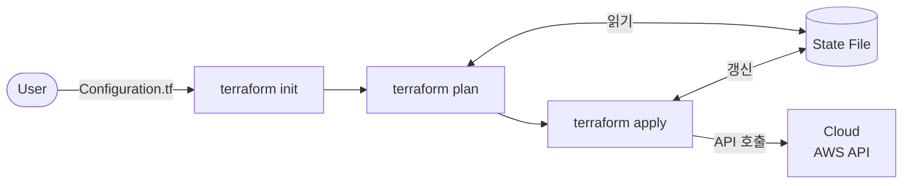

설치와 환경 구성을 마쳤다. 이번 섹션에서는 코드를 작성하기 전에 알아야 할 전체 그림을 짚는다. Terraform이 어떻게 동작하는지, 어떤 구성 요소로 이루어져 있는지, 작업 디렉터리를 어떻게 구성하는지 — 이후 모든 챕터의 좌표가 되는 개념들이다.

---

# Terraform 전체 동작 흐름

[이미지: Terraform 전체 동작 흐름 — User가 Configuration.tf 작성 → terraform init → terraform plan (State File 참조) → terraform apply (State File 갱신, AWS API 호출) → Cloud 인프라 생성]



Terraform은 사용자가 작성한 HCL 코드(.tf 파일)를 읽고 `init → plan → apply` 순서로 실행한다. 각 단계는 명확한 역할이 있다.

## 1. terraform init

작업 디렉터리를 초기화한다. 코드에 선언된 Provider를 Terraform Registry에서 다운로드하고 `.terraform/` 디렉터리에 설치한다. 새 프로젝트를 시작하거나 Provider가 변경될 때 실행한다.

## 2. terraform plan

현재 코드와 실제 인프라 상태를 비교해 **무엇을 할지** 미리 계산한다. 실제 인프라는 변경하지 않는다. 변경 예정 내용을 `+`(생성) / `-`(삭제) / `~`(수정) 기호로 출력한다.

## 3. terraform apply

plan을 실행해 실제 인프라를 생성·수정·삭제한다. 클라우드 API를 호출하고 결과를 State 파일에 기록한다.

## 4. terraform destroy

State 파일에 기록된 리소스를 모두 삭제한다. apply의 역방향 실행이다.

각 단계의 내부 동작은 **Ch03 Execution Model**에서 깊게 다룬다.

---

# 핵심 구성 요소

Terraform을 이루는 다섯 가지 핵심 요소다. 지금은 각 요소가 무엇인지 개략적으로 파악한다. 이후 챕터에서 하나씩 깊어진다.

## 1. Configuration

사용자가 작성하는 HCL 코드 파일 전체를 가리킨다. `main.tf`, `variables.tf` 등 `.tf` 확장자 파일들이 Configuration을 구성한다. "원하는 인프라 상태"를 선언하는 곳이다.

→ **Ch02 HCL & 핵심 블록**에서 블록 문법과 핵심 구성 요소를 작성한다.

## 2. Provider

Terraform이 특정 클라우드 또는 서비스의 API를 호출할 수 있도록 연결하는 플러그인이다. AWS Provider는 `aws_instance`, `aws_s3_bucket` 같은 리소스 타입을 제공한다. `terraform init` 시 다운로드된다.

→ **Ch08 Provider 심화**에서 버전 관리, alias, 멀티 리전 구성을 다룬다.

## 3. State

Terraform이 관리하는 인프라의 현재 상태를 기록한 파일(`terraform.tfstate`)이다. plan 시 실제 인프라와 비교하는 기준이 되고, apply 시 결과가 반영된다. 팀 환경에서는 원격 저장소(S3)에 보관한다.

→ **Ch04 State Management**에서 파일 구조, Remote Backend, State 명령어를 다룬다.

## 4. Plan

`terraform plan`이 생성하는 실행 계획이다. 현재 State와 코드를 비교해 어떤 리소스를 생성·수정·삭제할지 결정한다. apply 전에 검토하는 것이 핵심 워크플로우다.

→ **Ch03 Execution Model**에서 refresh → diff → plan 생성 내부 메커니즘을 다룬다.

## 5. Apply

plan을 실제로 실행하는 단계다. 리소스를 생성·수정·삭제하고 State를 업데이트한다. 의존 관계 그래프를 기반으로 실행 순서와 병렬성을 결정한다.

→ **Ch03 Execution Model**에서 의존 관계 그래프와 실행 순서를 다룬다.

---

# 작업 디렉터리와 파일 구성

## 1. 규격과 관례

Terraform은 작업 디렉터리 내 `.tf` 파일을 모두 읽어 하나의 Configuration으로 합친다. 파일명은 자유롭지만, 커뮤니티와 HashiCorp가 권장하는 **관례(Convention)**가 있다. 이 관례를 따르면 팀원 누구든 디렉터리 구조만 봐도 무엇이 어디에 있는지 알 수 있다.

## 2. 권장 파일 구조

이 시리즈의 모든 실습은 아래 구조를 기준으로 한다.

```text
lab01/
├── main.tf
├── providers.tf
├── variables.tf
├── outputs.tf
└── terraform.tfvars
```

## 3. 각 파일 역할

| 파일 | 역할 |
|------|------|
| `main.tf` | 핵심 리소스 블록. `resource`, `data`, `module` 블록을 작성한다 |
| `providers.tf` | `terraform` 블록과 `provider` 블록. Provider 선언과 버전 제약 |
| `variables.tf` | `variable` 블록. 외부에서 주입받는 입력값 정의 |
| `outputs.tf` | `output` 블록. apply 후 출력할 값 정의 |
| `terraform.tfvars` | 변수 값 파일. `variables.tf`에 선언된 변수의 실제 값을 여기에 작성 |

각 파일의 실제 작성 방법은 **Ch02**에서 블록별로 다룬다.

## 4. .gitignore 관례

Terraform 프로젝트에서 Git으로 관리하지 않는 파일들이 있다.

```text
# .gitignore
.terraform/               # Provider 바이너리 — terraform init으로 재생성 가능
*.tfstate                 # State 파일 — Remote Backend 사용 시 불필요
*.tfstate.backup          # State 백업 파일
*.tfvars                  # 환경별 변수값 — 민감정보 포함 가능
```

반대로 `.terraform.lock.hcl`은 **반드시 커밋**한다. 팀 전체가 동일한 Provider 버전을 사용하도록 고정하는 파일이다.

---

# 핵심 정리

- Terraform은 `init → plan → apply` 순서로 실행된다. 각 단계는 명확히 분리되어 있다.
- 핵심 구성 요소는 Configuration, Provider, State, Plan, Apply다 — 이후 챕터에서 하나씩 깊어진다.
- 작업 디렉터리는 `main.tf`, `providers.tf`, `variables.tf`, `outputs.tf`, `terraform.tfvars` 구조를 따른다.
- `.terraform/`과 `*.tfstate`는 `.gitignore`에 추가하고, `.terraform.lock.hcl`은 커밋한다.

다음 챕터(Ch02)부터 HCL 문법과 각 블록을 직접 작성하기 시작한다.

---

# 참고 자료

- [Terraform 공식 문서 — 핵심 워크플로우](https://developer.hashicorp.com/terraform/intro/core-workflow)
- [Terraform 언어 개요](https://developer.hashicorp.com/terraform/language)
- [Standard Module Structure — HashiCorp](https://developer.hashicorp.com/terraform/language/modules/develop/structure)
