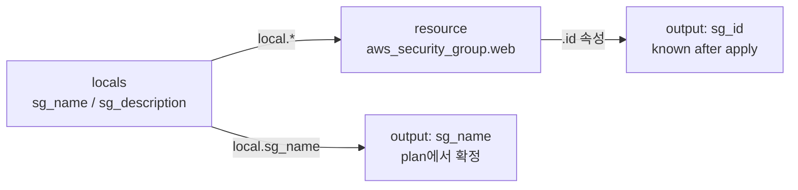
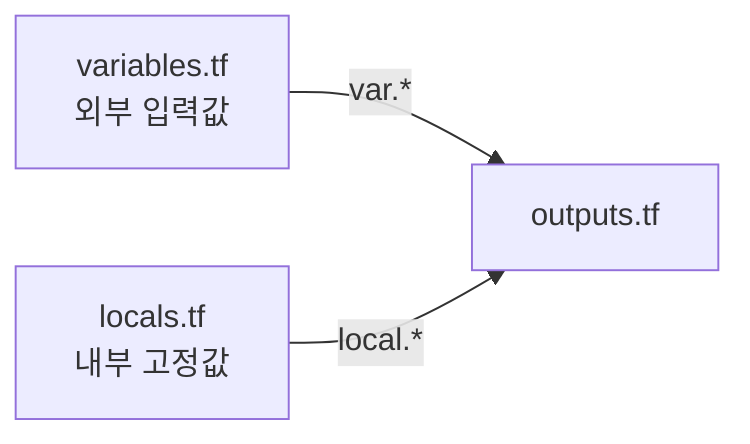
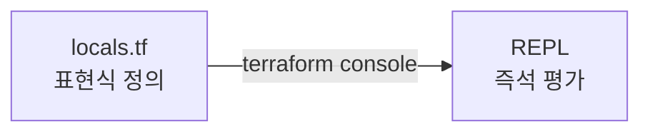

Ch01에서 Terraform 환경을 구성했다. Ch02부터는 HCL을 직접 작성한다. 코드를 작성하기 전에 HCL의 문법 체계를 먼저 잡는다 — 블록 구조, 타입 시스템, 표현식을 이해하면 이후 모든 블록이 같은 패턴으로 보인다.

---

# HCL이란

HCL(HashiCorp Configuration Language)은 Terraform의 설정 언어다. HashiCorp가 설계한 언어로, 사람이 읽고 쓰기 쉬우면서 기계가 파싱하기 쉽도록 설계됐다. `.tf` 확장자 파일에 작성한다.

JSON으로도 Terraform 설정을 표현할 수 있지만, 실무에서는 HCL을 사용한다. HCL은 주석, 표현식, 참조를 자연스럽게 지원하고 가독성이 훨씬 높다.

---

# 블록, 인수, 속성

HCL의 기본 단위는 **블록(block)**이다. 블록 안에 **인수(argument)**를 선언하고, Terraform이 생성한 리소스의 결과값을 **속성(attribute)**으로 참조한다.

## 1. 블록 구조

```text
블록_유형 "레이블1" "레이블2" {
  인수명 = 값
  인수명 = 값

  중첩_블록 {
    인수명 = 값
  }
}
```

블록 유형에 따라 레이블 개수가 다르다.

| 블록 유형 | 레이블 수 | 예 |
|-----------|-----------|-----|
| `resource` | 2 (리소스 타입, 이름) | `resource "aws_instance" "web"` |
| `data` | 2 (데이터 타입, 이름) | `data "aws_ami" "amazon_linux"` |
| `variable` | 1 (변수 이름) | `variable "instance_type"` |
| `output` | 1 (출력 이름) | `output "public_ip"` |
| `provider` | 1 (프로바이더 이름) | `provider "aws"` |
| `locals` | 0 | `locals` |
| `terraform` | 0 | `terraform` |

## 2. 인수(argument)

블록 안에서 사용자가 설정하는 값이다. `인수명 = 값` 형식으로 작성한다.

```hcl
resource "aws_instance" "web" {
  ami           = "ami-0c9c942bd7bf113a2"
  instance_type = "t3.micro"
}
```

`ami`와 `instance_type`은 `aws_instance` 리소스가 받는 인수다. 어떤 인수를 받는지는 Provider 문서에 정의되어 있다.

## 3. 속성(attribute)

리소스가 생성된 후 Terraform이 채우는 값이다. 리소스 주소로 참조한다.

```text
<리소스_타입>.<이름>.<속성명>
```

```hcl
output "instance_id" {
  value = aws_instance.web.id
}
```

`aws_instance.web.id`는 EC2 인스턴스가 생성된 후 AWS가 부여하는 `id` 속성이다. `apply` 전에는 아직 존재하지 않는 값이다. `terraform plan`에서는 `(known after apply)`로 표시된다.

인수와 속성의 차이를 정리하면:

| 구분 | 누가 정의하는가 | 언제 값이 있는가 | plan 출력 |
|------|----------------|----------------|----------|
| 인수 | 사용자 (코드) | 코드 작성 시 | 확정된 값으로 표시 |
| 속성 | Terraform / 클라우드 | apply 완료 후 | `(known after apply)` |

---

# 타입 시스템

HCL은 타입 시스템을 가진다. 변수(`variable`)와 인수에 타입을 명시하면 Terraform이 입력값을 검증한다.

## 1. 기본 타입

| 타입 | 설명 | 예 |
|------|------|----|
| `string` | 문자열 | `"t3.micro"`, `"ap-northeast-2"` |
| `number` | 숫자 (정수/소수 포함) | `1`, `3.14` |
| `bool` | 불리언 | `true`, `false` |

## 2. 컬렉션 타입

| 타입 | 설명 | 예 |
|------|------|----|
| `list(type)` | 순서 있는 동일 타입 목록 | `["a", "b", "c"]` |
| `map(type)` | 문자열 키 - 동일 타입 값 쌍 | `{env = "dev", team = "infra"}` |
| `set(type)` | 순서 없는 중복 없는 집합 | `toset(["ap-northeast-2a", "ap-northeast-2c"])` |
| `object({...})` | 다른 타입의 인수를 묶는 구조체 | `{name = string, port = number}` |
| `tuple([...])` | 다른 타입의 순서 있는 목록 | `[string, number, bool]` |

실무에서 가장 자주 쓰는 타입은 `string`, `number`, `bool`, `list(string)`, `map(string)`, `object`다.

---

# 표현식

표현식(expression)은 값을 계산하거나 다른 블록을 참조할 때 사용한다.

## 1. 참조 표현식

다른 블록의 값을 참조한다.

| 참조 대상 | 형식 | 예 |
|-----------|------|----|
| variable | `var.<이름>` | `var.instance_type` |
| locals | `local.<이름>` | `local.common_tags` |
| resource 속성 | `<타입>.<이름>.<속성>` | `aws_instance.web.id` |
| data source 속성 | `data.<타입>.<이름>.<속성>` | `data.aws_ami.amazon_linux.id` |

## 2. 연산자

| 종류 | 연산자 |
|------|--------|
| 산술 | `+`, `-`, `*`, `/`, `%` |
| 비교 | `==`, `!=`, `<`, `>`, `<=`, `>=` |
| 논리 | `&&`, `\|\|`, `!` |

## 3. 조건식

```text
조건 ? 참일 때 값 : 거짓일 때 값
```

```hcl
locals {
  instance_type = var.env == "prod" ? "t3.small" : "t3.micro"
}
```

## 4. 문자열 템플릿

`${}` 안에 표현식을 삽입한다.

```hcl
locals {
  name = "tf-core-${var.env}-ec2"
}
```

`var.env`가 `"dev"`이면 `name`은 `"tf-core-dev-ec2"`가 된다.

---

# 주석

```hcl
# 한 줄 주석 — 권장

// 한 줄 주석 — 사용 가능하지만 #을 더 자주 씀

/*
  여러 줄 주석
  코드 블록 임시 비활성화에 활용
*/
```

`terraform fmt`는 주석을 건드리지 않는다. 코드 설명보다는 **왜 이 값인지** 또는 **임시 비활성화** 목적으로 사용한다.

---

# 핵심 정리

- HCL의 기본 단위는 **블록**이다. 블록 유형마다 레이블 개수가 다르다 (`locals` 0개, `output` 1개, `resource` 2개).
- **인수**는 사용자가 코드에 작성하는 값, **속성**은 apply 후 Terraform이 채우는 값이다. plan에서 속성은 `(known after apply)`로 표시된다.
- 타입 시스템: 기본 타입(`string`, `number`, `bool`) + 컬렉션 타입(`list`, `map`, `set`, `object`).
- 참조 표현식으로 블록 간 값을 연결한다 — `var.*`, `local.*`, `<타입>.<이름>.<속성>`.
- 조건식과 문자열 템플릿으로 값을 동적으로 구성할 수 있다.
- `terraform console`로 HCL 표현식과 내장 함수를 즉석에서 평가할 수 있다.

---

# 리소스 네이밍 규칙

이번 섹션부터 AWS 리소스를 생성한다. 이 시리즈의 모든 실습에서 리소스 이름은 다음 패턴을 따른다.

```text
{namespace}-{capability}-{identity}
```

**namespace**는 리소스가 속한 프로젝트와 환경을 식별한다. 챕터가 진행되면서 점진적으로 확장된다.

| 시점 | namespace 구성 | 예시 |
|------|---------------|------|
| Ch02~04.02 | `{project}` | `tf-core-lab01` (org+project 하나로) |
| Ch04.03+ | `{org}-{project}` | `tf-core-lab02` |
| Ch07+ | `{org}-{project}-{env}` | `tf-core-gallery-dev` (완성형) |

**capability**는 리소스 종류를 나타낸다. 축약하지 않는 것이 원칙이고, AWS에서 관례적으로 사용하는 약어만 인정한다.

| Capability | 리소스 |
|-----------|--------|
| `vpc` | VPC |
| `subnet` | Subnet |
| `igw` | Internet Gateway |
| `natgw` | NAT Gateway |
| `sg` | Security Group |
| `rtb` | Route Table |
| `instance` | EC2 Instance |
| `iamrole` | IAM Role |
| `iamprofile` | IAM Instance Profile |
| `lb` | Load Balancer |
| `tg` | Target Group |
| `lt` | Launch Template |
| `asg` | Auto Scaling Group |

**identity**는 같은 capability 안에서 리소스를 구분하는 키워드다. 해당 capability가 하나뿐이면 생략할 수 있다. identity는 TF 리소스 레이블과 대응한다 (`-` → `_` 변환).

```text
AWS 이름:   tf-core-lab01-sg-instance-web
TF 레이블:  resource "aws_security_group" "instance_web"

AWS 이름:   tf-core-lab01-instance-minimal
TF 레이블:  resource "aws_instance" "minimal"
```

완성형: `tf-core-lab01-sg-instance-web` = namespace(`tf-core-lab01`) + capability(`sg`) + identity(`instance-web`)

다음 섹션에서는 HCL의 첫 번째 블록인 `provider`를 작성한다.

---

# 참고 자료

- [HCL 언어 레퍼런스 — HashiCorp](https://developer.hashicorp.com/terraform/language)
- [표현식 — Terraform 공식 문서](https://developer.hashicorp.com/terraform/language/expressions)
- [타입 시스템 — Terraform 공식 문서](https://developer.hashicorp.com/terraform/language/expressions/types)
- [내장 함수 — Terraform 공식 문서](https://developer.hashicorp.com/terraform/language/functions)

---

# [실습] lab01: 블록·인수·속성

`locals`, `output`, `resource` 블록을 직접 작성하고 `terraform plan`으로 실행한다. `locals`에서 정의한 값은 plan에서 즉시 확정되지만, 리소스 속성(`.id`)은 apply 후에야 확정된다는 것을 출력 차이로 눈으로 확인한다.

### 실습 목표

- 레이블 개수가 다른 세 블록(`locals`, `output`, `resource`)을 직접 작성한다
- `locals` 값을 `resource` 인수에 주입하고 `output`에서 참조한다
- `terraform plan` 출력에서 확정된 값과 `(known after apply)` 차이를 확인한다
- 이 실습은 `terraform plan`에서 멈춘다. apply와 destroy는 진행하지 않는다

---

# 1. 전체 아키텍처



`locals`에서 정의한 `sg_name`은 plan 시 이미 확정된 값이다. `aws_security_group.web.id`는 AWS가 리소스를 생성한 후 부여하는 속성이므로 plan 단계에서는 알 수 없다. 두 output의 plan 출력 차이가 이 lab의 핵심이다.

---

# 2. 사전 준비

```text
lab01/
├── providers.tf
├── locals.tf
├── main.tf
└── outputs.tf
```

**설정:**

- region: **`ap-northeast-2`**

---

# 3. 파일 작성

## providers.tf

```hcl
terraform {
  required_version = ">= 1.14.0"

  required_providers {
    aws = {
      source  = "hashicorp/aws"
      version = "~> 6.0"
    }
  }
}

provider "aws" {
  region = "ap-northeast-2"
}
```

`resource` 블록을 사용하므로 AWS Provider가 필요하다. plan을 실행하려면 init이 선행되어야 한다.

## locals.tf

```hcl
locals {
  sg_name        = "tf-core-lab01-sg-web"
  sg_description = "lab01 security group"
  port           = 8080
}
```

`locals` 블록은 레이블이 없다. 세 값을 정의한다. 이 값들은 코드가 실행되는 시점에 이미 확정된다.

## main.tf

```hcl
resource "aws_security_group" "web" {
  name        = local.sg_name
  description = local.sg_description
}
```

`resource` 블록은 레이블이 두 개다 — 리소스 타입 `"aws_security_group"`과 이름 `"web"`. `name`과 `description` 인수에 `local.*` 참조 표현식으로 `locals` 값을 주입한다. ingress/egress 규칙은 이 실습의 목적과 무관하므로 의도적으로 생략한다.

## outputs.tf

```hcl
output "sg_name" {
  description = "locals에서 정의한 SG 이름 — plan에서 확정"
  value       = local.sg_name
}

output "sg_id" {
  description = "AWS가 부여하는 SG ID — apply 후 확정"
  value       = aws_security_group.web.id
}
```

`output` 블록은 레이블이 하나다 — 출력 이름. `sg_name`은 `local.sg_name`을, `sg_id`는 `aws_security_group.web.id` 속성을 참조한다.

---

# 4. terraform init

```bash
$ terraform init
```

```text
Initializing provider plugins...
- Finding hashicorp/aws versions matching "~> 6.0"...
- Installing hashicorp/aws v6.x.x...

Terraform has been successfully initialized!
```

---

# 5. terraform plan

```bash
$ terraform plan
```

```text
Terraform will perform the following actions:

  # aws_security_group.web will be created
  + resource "aws_security_group" "web" {
      + description = "lab01 security group"
      + id          = (known after apply)
      + name        = "tf-core-lab01-sg-web"
      ...
    }

Plan: 1 to add, 0 to change, 0 to destroy.

Changes to Outputs:
  + sg_id   = (known after apply)
  + sg_name = "tf-core-lab01-sg-web"
```

두 output의 차이를 확인한다.

- `sg_name = "tf-core-lab01-sg-web"` — `local.sg_name`에서 왔다. 코드에 값이 있으므로 plan에서 즉시 확정된다.
- `sg_id = (known after apply)` — `aws_security_group.web.id` 속성이다. AWS가 리소스를 생성한 후 부여하는 값이므로 plan 단계에서는 알 수 없다.

리소스 블록 안에서도 동일하다. `name = "tf-core-lab01-sg-web"`는 인수라서 확정되어 있지만, `id = (known after apply)`는 속성이라서 아직 없다.

이 실습은 plan에서 멈춘다. apply와 destroy는 필요 없다.

---

# [실습] lab02: 타입 시스템

`variable`과 `locals`를 함께 사용해 HCL의 타입 시스템을 확인한다. 고정값은 `locals`로, 외부에서 받는 값은 `variable`로 정의하는 패턴을 경험한다. AWS 리소스를 사용하지 않으므로 credentials 없이 실행할 수 있다.

### 실습 목표

- `string` / `number` / `bool` / `list(string)` / `map(string)` / `object` 타입 변수 선언
- `variable`(외부 입력)과 `locals`(내부 고정값)의 역할 차이 확인
- `terraform plan -var`로 변수 값 주입
- 타입 불일치 시 오류 확인

---

# 1. 전체 아키텍처



`variables.tf`는 외부에서 주입받는 값을 선언하고, `locals.tf`는 코드 내부에서 계산하는 고정값을 정의한다. 두 블록 모두 `output`에서 참조해 plan 출력으로 확인한다. AWS 리소스 없이 plan만 실행한다.

---

# 2. 사전 준비

```text
lab02/
├── providers.tf
├── variables.tf
├── locals.tf
└── outputs.tf
```

---

# 3. 파일 작성

## providers.tf

```hcl
terraform {
  required_version = ">= 1.14.0"
}
```

AWS 리소스를 사용하지 않으므로 `required_providers` 선언이 없다. credentials도 필요 없다.

## variables.tf

```hcl
variable "env" {
  description = "배포 환경"
  type        = string
  default     = "dev"
}

variable "replica_count" {
  description = "복제본 수"
  type        = number
  default     = 1
}

variable "enable_https" {
  description = "HTTPS 활성화 여부"
  type        = bool
  default     = false
}

variable "allowed_cidrs" {
  description = "허용 CIDR 목록"
  type        = list(string)
  default     = ["0.0.0.0/0"]
}

variable "tags" {
  description = "공통 태그"
  type        = map(string)
  default = {
    project = "tf-core"
    managed = "terraform"
  }
}

variable "server_config" {
  description = "서버 설정"
  type = object({
    instance_type = string
    port          = number
    public        = bool
  })
  default = {
    instance_type = "t3.micro"
    port          = 8080
    public        = true
  }
}
```

각 `variable` 블록에 `type`을 명시한다. `default`가 있는 변수는 값을 전달하지 않아도 기본값이 사용된다.

## locals.tf

```hcl
locals {
  project     = "tf-core"
  name_prefix = "${local.project}-${var.env}"
}
```

`locals`는 코드 내부에서 계산하는 값이다. `name_prefix`는 `local.project`와 `var.env`를 조합한다. 외부에서 바꿀 수 없다.

## outputs.tf

```hcl
output "env" {
  value = var.env
}

output "name_prefix" {
  value = local.name_prefix
}

output "replica_count" {
  value = var.replica_count
}

output "enable_https" {
  value = var.enable_https
}

output "allowed_cidrs" {
  value = var.allowed_cidrs
}

output "tags" {
  value = var.tags
}

output "server_config" {
  value = var.server_config
}
```

---

# 4. terraform init

```bash
$ terraform init
```

```text
Terraform has been successfully initialized!
```

Provider 선언이 없으므로 플러그인 다운로드 없이 즉시 완료된다.

---

# 5. terraform plan

기본값으로 plan을 실행한다:

```bash
$ terraform plan
```

```text
Changes to Outputs:
  + allowed_cidrs  = [
      + "0.0.0.0/0",
    ]
  + enable_https   = false
  + env            = "dev"
  + name_prefix    = "tf-core-dev"
  + replica_count  = 1
  + server_config  = {
      + instance_type = "t3.micro"
      + port          = 8080
      + public        = true
    }
  + tags           = {
      + "managed" = "terraform"
      + "project" = "tf-core"
    }

Plan: 0 to add, 0 to change, 0 to destroy.
```

`-var` 플래그로 값을 재정의한다:

```bash
$ terraform plan -var="env=prod" -var="replica_count=3"
```

```text
Changes to Outputs:
  + env           = "prod"
  + name_prefix   = "tf-core-prod"
  + replica_count = 3
  ...
```

`env`가 `"prod"`로 바뀌면 `locals`의 `name_prefix`도 `"tf-core-prod"`로 함께 바뀐다.

---

# 6. 타입 불일치 오류 확인

`number` 타입 변수에 문자열을 전달한다:

```bash
$ terraform plan -var="replica_count=hello"
```

```text
╷
│ Error: Invalid value for input variable
│
│   on variables.tf line 7:
│    7: variable "replica_count" {
│
│ The given value is not suitable for var.replica_count declared at
│ variables.tf:7,1-24: a number is required.
╵
```

plan 단계에서 타입 검증이 실행된다. 타입 제약을 명시하면 잘못된 값이 apply되기 전에 차단된다.

---

# [실습] lab03: 표현식과 내장 함수

`locals`에서 다양한 표현식을 작성하고 `terraform console`로 즉석 평가한다. AWS 리소스도 credentials도 필요 없다.

### 실습 목표

- 리터럴, 참조, 연산식, 조건식, 문자열 템플릿을 `locals`로 작성한다
- `format()`, `join()`, `merge()`, `length()`, `toset()` 내장 함수를 실험한다
- `terraform console` REPL에서 표현식을 즉석으로 평가한다

---

# 1. 전체 아키텍처



`locals.tf`에 정의한 표현식을 `terraform console`로 참조·평가한다. 콘솔에서 직접 표현식을 입력해 결과를 확인할 수도 있다. 인프라 배포 없이 HCL 표현식을 실험하는 데 집중한다.

---

# 2. 사전 준비

```text
lab03/
├── providers.tf
└── locals.tf
```

---

# 3. 파일 작성

## providers.tf

```hcl
terraform {
  required_version = ">= 1.14.0"
}
```

## locals.tf

```hcl
locals {
  env      = "dev"
  app_name = "gallery"
  ports    = [22, 80, 443, 8080]

  name_prefix   = "tf-core-${local.env}"
  instance_type = local.env == "prod" ? "t3.small" : "t3.micro"
  port_count    = length(local.ports)

  base_tags = {
    project = "tf-core"
    env     = local.env
  }
  extra_tags = {
    app = local.app_name
  }
  all_tags = merge(local.base_tags, local.extra_tags)

  az_list     = ["ap-northeast-2a", "ap-northeast-2a", "ap-northeast-2c"]
  unique_azs  = toset(local.az_list)
  az_joined   = join(", ", ["ap-northeast-2a", "ap-northeast-2c"])
  bucket_name = format("tf-core-%s-assets", local.env)
}
```

표현식 종류별로 하나씩 정의한다:
- `name_prefix` — 문자열 템플릿
- `instance_type` — 조건식
- `port_count` — `length()` 함수
- `all_tags` — `merge()` 함수
- `unique_azs` — `toset()` 함수 (중복 제거)
- `az_joined` — `join()` 함수
- `bucket_name` — `format()` 함수

---

# 4. terraform init

```bash
$ terraform init
```

```text
Terraform has been successfully initialized!
```

---

# 5. terraform console

```bash
$ terraform console
```

프롬프트(`>`)가 뜨면 표현식을 입력하고 Enter로 평가한다. 종료는 `exit` 또는 `Ctrl+D`.

### ① 참조 표현식

```text
> local.name_prefix
"tf-core-dev"
> local.instance_type
"t3.micro"
> local.all_tags
{
  "app" = "gallery"
  "env" = "dev"
  "project" = "tf-core"
}
```

`local.instance_type`은 `env`가 `"dev"`이므로 조건식이 `"t3.micro"`를 반환한다.

### ② 내장 함수

```text
> local.port_count
4
> local.unique_azs
toset([
  "ap-northeast-2a",
  "ap-northeast-2c",
])
> local.az_joined
"ap-northeast-2a, ap-northeast-2c"
> local.bucket_name
"tf-core-dev-assets"
```

`toset()`은 중복을 제거한다. `az_list`에 `"ap-northeast-2a"`가 두 번 있었지만 `unique_azs`에는 하나만 남는다.

### ③ 콘솔에서 직접 실험

`locals`에 없는 표현식도 콘솔에서 바로 평가할 수 있다:

```text
> "prod" == "prod" ? "t3.small" : "t3.micro"
"t3.small"
> upper("dev")
"DEV"
> length({"a" = 1, "b" = 2, "c" = 3})
3
> format("hello, %s!", "terraform")
"hello, terraform!"
```

조건식, 문자열 함수, 컬렉션 함수를 즉석으로 실험하며 동작을 확인한다.
