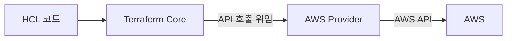
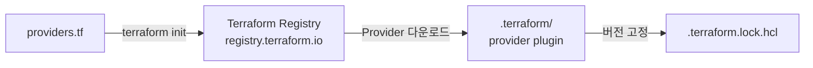

이전 섹션에서 HCL의 문법 체계를 잡았다. 이제 블록을 하나씩 다룬다. 첫 번째 주제는 Provider 설정이다. Provider를 선언하는 `terraform` 블록과 실제 설정을 구체화하는 `provider` 블록 — 두 블록이 짝을 이뤄 동작하므로 이 섹션에서 함께 다룬다.

---

# provider 블록의 역할

`provider`는 Terraform이 외부 시스템(AWS, Azure, GCP 등)과 통신하기 위한 플러그인이다. Terraform 코어는 리소스를 선언하는 언어만 제공하고, 실제 API 호출은 Provider가 담당한다.



Terraform Core와 Provider는 분리된 바이너리다. `terraform init` 시 Registry에서 Provider 플러그인을 다운로드해 `.terraform/` 디렉토리에 설치한다.

---

# terraform 블록과 required_providers

## 1. terraform 블록

`terraform` 블록은 Terraform 자체의 동작을 설정한다. 프로젝트에 하나만 존재한다.

```hcl
terraform {
  required_version = ">= 1.14.0"

  required_providers {
    aws = {
      source  = "hashicorp/aws"
      version = "~> 6.0"
    }
  }
}
```

## 2. required_providers

사용할 Provider와 버전을 선언한다.

| 인수 | 설명 | 예 |
|------|------|----|
| `source` | Registry 주소 (`{namespace}/{type}`) | `"hashicorp/aws"` |
| `version` | 버전 제약 표현식 | `"~> 6.0"` |

`source`를 생략하면 `"hashicorp/{type}"`으로 간주한다. 명시하는 것을 권장한다.

---

# provider 블록

`required_providers`에서 선언한 Provider의 설정을 구체화한다.

```hcl
provider "aws" {
  region = "ap-northeast-2"
}
```

| 인수 | 설명 |
|------|------|
| `region` | AWS 리전 |
| `profile` | AWS CLI 프로파일 |
| `access_key` / `secret_key` | 직접 키 입력 (권장하지 않음) |

인증 정보는 환경 변수(`AWS_ACCESS_KEY_ID`, `AWS_SECRET_ACCESS_KEY`) 또는 `~/.aws/credentials` 파일로 주입하는 것이 표준이다.

---

# default_tags

`provider` 블록의 `default_tags`에 선언한 태그는 이 Provider로 생성하는 **모든 리소스에 자동으로 적용**된다.

```hcl
provider "aws" {
  region = "ap-northeast-2"
  default_tags {
    tags = {
      Project   = "tf-core"
      ManagedBy = "Terraform"
    }
  }
}
```

리소스 블록에서 같은 키를 선언하면 리소스 값이 우선한다. 리소스별 태그는 리소스 고유 값만 선언하면 된다.

```hcl
resource "aws_instance" "web" {
  ami           = data.aws_ami.amazon_linux.id
  instance_type = "t3.micro"

  tags = {
    Name = "tf-core-lab01-instance-web"
  }
}
```

`Project`와 `ManagedBy`는 `default_tags`에서 자동으로 붙는다. plan 출력에서 이 태그들은 `tags_all` 속성으로 확인된다. 심화 내용(override 전략, 멀티 Provider 환경)은 Ch08에서 다룬다.

---

# version constraints 문법

## 1. 제약 표현식

| 표현식 | 의미 |
|--------|------|
| `= 6.1.0` | 정확히 이 버전만 |
| `>= 6.0` | 6.0 이상 |
| `~> 6.0` | 6.x 계열 (6.0 이상 7.0 미만) |
| `~> 6.1` | 6.1 이상 7.0 미만 (마이너 업데이트 허용) |
| `>= 6.0, < 7.0` | 범위 지정 (`~> 6.0`과 동일 효과) |

실무에서 가장 자주 쓰는 표현은 `~> 6.0`이다. 마이너 버전 업데이트는 허용하되 메이저 버전 변경은 차단한다.

## 2. required_version

Terraform CLI 자체의 버전을 제약한다.

```hcl
terraform {
  required_version = ">= 1.14.0"
}
```

팀 환경에서 Terraform 버전 불일치로 인한 오류를 방지한다.

---

# terraform init 흐름

`terraform init`을 실행하면:

1. `required_providers`에 선언된 Provider 목록 확인
2. Terraform Registry(`registry.terraform.io`)에서 version constraint에 맞는 최신 버전 탐색
3. `.terraform/` 디렉토리에 Provider 플러그인 바이너리 다운로드
4. `.terraform.lock.hcl`에 설치된 정확한 버전과 해시값 기록

```bash
$ terraform init
```

```text
Initializing the backend...
Initializing provider plugins...
- Finding hashicorp/aws versions matching "~> 6.0"...
- Installing hashicorp/aws v6.1.0...
- Installed hashicorp/aws v6.1.0 (signed by HashiCorp)

Terraform has created a lock file .terraform.lock.hcl to record the provider
selections made above. Include this file in your version control repository
so that Terraform can guarantee to make the same selections by default when
you run "terraform init" in the future.
```

---

# .terraform.lock.hcl

`terraform init` 이후 생성되는 lock 파일이다. Provider의 정확한 버전과 해시값을 기록한다.

```hcl
provider "registry.terraform.io/hashicorp/aws" {
  version     = "6.1.0"
  constraints = "~> 6.0"
  hashes = [
    "h1:...",
  ]
}
```

- **버전 고정**: lock 파일이 있으면 다음 `init`에서 같은 버전을 설치한다
- **버전 업그레이드**: `terraform init -upgrade`로 constraint 범위 내 최신 버전으로 갱신
- **VCS 포함**: lock 파일은 Git에 커밋한다. `.terraform/` 디렉토리는 `.gitignore`에 추가한다

심화 내용(멀티 플랫폼 해시, `terraform providers lock`)은 Ch08에서 다룬다.

---

# Provider alias

동일한 Provider를 여러 설정으로 사용할 때 `alias`를 지정한다. 멀티 리전 배포가 대표적인 사례다.

```hcl
provider "aws" {
  region = "ap-northeast-2"
}

provider "aws" {
  alias  = "us_east"
  region = "us-east-1"
}
```

alias가 없는 Provider가 기본값(default provider)이다. alias Provider를 사용하는 리소스는 `provider` 인수로 명시한다.

```hcl
resource "aws_instance" "web_us" {
  provider      = aws.us_east
  ami           = "ami-xxxxxxxxxxxxxxxxx"
  instance_type = "t3.micro"
}
```

심화 내용(멀티 Provider 조합, 모듈에서 alias 전달)은 Ch08에서 다룬다.

---

# 핵심 정리

- `terraform` 블록의 `required_providers`에서 Provider와 버전을 선언한다.
- `provider` 블록에서 region 등 Provider 설정을 구체화한다. 인증 정보는 환경 변수 또는 credential 파일로 주입한다.
- version constraints: `~> 6.0`은 6.x 계열 허용, 실무 표준.
- `terraform init` 시 Registry에서 Provider 플러그인을 다운로드하고 `.terraform.lock.hcl`에 버전을 고정한다.
- lock 파일은 Git에 커밋하고 `.terraform/` 디렉토리는 `.gitignore`에 추가한다.
- `default_tags`로 공통 태그를 provider 수준에서 선언한다. 이 Provider로 생성하는 모든 리소스에 자동 적용된다.
- `alias`로 동일 Provider를 여러 설정으로 사용할 수 있다 (심화: Ch08).

다음 섹션에서는 Terraform의 핵심 블록인 `resource`를 작성한다.

---

# 참고 자료

- [Provider 설정 — Terraform 공식 문서](https://developer.hashicorp.com/terraform/language/providers/configuration)
- [Version Constraints — Terraform 공식 문서](https://developer.hashicorp.com/terraform/language/expressions/version-constraints)
- [Dependency Lock File — Terraform 공식 문서](https://developer.hashicorp.com/terraform/language/files/dependency-lock)
- [AWS Provider — Terraform Registry](https://registry.terraform.io/providers/hashicorp/aws/latest/docs)
- [default_tags — AWS Provider 공식 문서](https://registry.terraform.io/providers/hashicorp/aws/latest/docs#default_tags-configuration-block)

---

# [실습] lab01: version constraints 실험

version constraint 표현식을 바꿔가며 `terraform init`의 동작을 확인한다. `.terraform.lock.hcl`이 어떻게 기록되는지, `-upgrade` 플래그가 무엇을 하는지 직접 확인한다.

### 실습 목표

- version constraint 표현식에 따른 `terraform init` 동작 차이 확인
- `.terraform.lock.hcl` 버전 기록 방식 이해
- `terraform init -upgrade`로 버전 갱신 경험
- 충돌하는 constraint 설정 시 오류 재현

# 1. 전체 아키텍처



`terraform init`은 `providers.tf`의 version constraint를 읽어 Registry에서 적합한 버전을 찾고 설치한다. 설치된 버전은 lock 파일에 고정된다. 이 lab은 AWS 리소스를 생성하지 않는다.

# 2. 사전 준비

작업 디렉토리 구조:

```text
lab01/
└── providers.tf
```

# 3. providers.tf 작성

```hcl
terraform {
  required_version = ">= 1.14.0"

  required_providers {
    aws = {
      source  = "hashicorp/aws"
      version = "~> 6.0"
    }
  }
}

provider "aws" {
  region = "ap-northeast-2"

  default_tags {
    tags = {
      Project   = "tf-core"
      ManagedBy = "Terraform"
    }
  }
}
```

**설정:**

- version constraint: **`~> 6.0`**
- region: **`ap-northeast-2`**
- default_tags: **`Project = "tf-core"`, `ManagedBy = "Terraform"`**

# 4. terraform init

```bash
$ terraform init
```

```text
Initializing the backend...
Initializing provider plugins...
- Finding hashicorp/aws versions matching "~> 6.0"...
- Installing hashicorp/aws v6.1.0...
- Installed hashicorp/aws v6.1.0 (signed by HashiCorp)

Terraform has created a lock file .terraform.lock.hcl ...
```

생성된 `.terraform.lock.hcl` 내용을 확인한다:

```bash
$ cat .terraform.lock.hcl
```

```text
provider "registry.terraform.io/hashicorp/aws" {
  version     = "6.1.0"
  constraints = "~> 6.0"
  hashes = [
    "h1:...",
  ]
}
```

constraint `~> 6.0` 범위 내 최신 버전이 설치됐다.

# 5. version constraint 변경 실험

### ① 정확한 버전 고정

`providers.tf`의 version을 수정한다:

```hcl
version = "= 6.0.0"
```

lock 파일이 이미 있으므로 `-upgrade` 없이 `init`을 실행하면 lock 파일의 버전(6.1.0)과 새 constraint(= 6.0.0)가 충돌해 오류가 발생한다:

```bash
$ terraform init
```

```text
Error: Failed to query available provider packages

Could not retrieve the list of available versions for provider hashicorp/aws:
locked provider registry.terraform.io/hashicorp/aws 6.1.0 does not match
configured version constraint = 6.0.0
```

`-upgrade`로 lock 파일을 새 constraint에 맞게 갱신한다:

```bash
$ terraform init -upgrade
```

```text
- Finding hashicorp/aws versions matching "= 6.0.0"...
- Installing hashicorp/aws v6.0.0...
- Installed hashicorp/aws v6.0.0 (signed by HashiCorp)
```

### ② 범위 constraint

```hcl
version = ">= 6.0, < 7.0"
```

```bash
$ terraform init -upgrade
```

`~> 6.0`과 동일한 효과다. constraint 범위 내 최신 버전이 설치된다.

### ③ 충돌하는 constraint (오류 재현)

```hcl
version = ">= 7.0"
```

```bash
$ terraform init -upgrade
```

```text
Error: Failed to query available provider packages

Could not retrieve the list of available versions for provider hashicorp/aws:
no available releases match the given constraints >= 7.0.0
```

constraint를 만족하는 버전이 없어 오류가 발생한다.

# 6. 정리

이 lab은 AWS 리소스를 생성하지 않았으므로 `terraform destroy`는 필요 없다. 로컬 파일만 정리한다:

```bash
$ rm -rf .terraform .terraform.lock.hcl
```

---

# [실습] lab02: default_tags와 tags_all 확인

`default_tags`가 리소스 태그와 어떻게 합쳐지는지 `terraform plan` 출력으로 확인한다. 리소스에는 `Name`만 선언하고 `Project`, `ManagedBy`는 provider가 자동 주입하는 것을 직접 본다.

### 실습 목표

- `default_tags`로 선언한 공통 태그가 리소스에 자동 적용되는 것을 확인
- plan 출력에서 `tags`와 `tags_all`의 차이를 이해
- 이후 실습에서 리소스 tags에 `Name`만 선언하는 패턴의 근거를 확보

---

# 1. 전체 아키텍처

```mermaid
flowchart LR
  provider[provider "aws"<br>default_tags:<br>Project, ManagedBy] -->|자동 주입| SG
  SG[aws_security_group<br>tags: Name만 선언] -->|plan 출력| tags_all[tags_all:<br>Name + Project + ManagedBy]
```

`default_tags`는 provider 수준에서 선언한 공통 태그다. 리소스의 `tags`에 선언한 값과 `default_tags`가 합쳐져 `tags_all`로 표시된다.

---

# 2. 사전 준비

```text
lab02/
├── locals.tf
├── providers.tf
└── main.tf
```

- `terraform plan`까지만 실행 (apply/destroy 없음)
- AWS credentials 필요

---

# 3. 파일 작성

## locals.tf

```hcl
locals {
  project = "tf-core-lab02"
}
```

`local.project`는 `default_tags`의 `Project` 태그 값의 단일 출처다.

## providers.tf

```hcl
terraform {
  required_version = ">= 1.14.0"

  required_providers {
    aws = {
      source  = "hashicorp/aws"
      version = "~> 6.0"
    }
  }
}

provider "aws" {
  region = "ap-northeast-2"

  default_tags {
    tags = {
      Project   = local.project
      ManagedBy = "Terraform"
    }
  }
}
```

## main.tf

```hcl
resource "aws_security_group" "web" {
  name        = "${local.project}-sg-web"
  description = "${local.project} default_tags test"

  tags = {
    Name = "${local.project}-sg-web"
  }
}
```

리소스 `tags`에는 `Name`만 선언했다. `Project`와 `ManagedBy`는 `default_tags`가 `local.project`를 참조해 자동 주입한다.

---

# 4. terraform init

```bash
$ terraform init
```

---

# 5. terraform plan

```bash
$ terraform plan
```

```text
Terraform will perform the following actions:

  # aws_security_group.web will be created
  + resource "aws_security_group" "web" {
      + name        = "tf-core-lab02-sg-web"
      + tags        = {
          + "Name" = "tf-core-lab02-sg-web"
        }
      + tags_all    = {
          + "ManagedBy" = "Terraform"
          + "Name"      = "tf-core-lab02-sg-web"
          + "Project"   = "tf-core-lab02"
        }
      ...
    }

Plan: 1 to add, 0 to change, 0 to destroy.
```

`tags`에는 리소스에서 직접 선언한 `Name`만 표시된다. `tags_all`에는 `default_tags`의 `Project`, `ManagedBy`가 자동으로 합쳐진 전체 태그가 표시된다. AWS 콘솔에서 리소스를 확인하면 `tags_all`의 태그가 모두 적용된다.

이 패턴 덕분에 이후 실습에서 리소스 `tags`에 `Name`만 선언하면 된다. 공통 태그 관리는 provider가 책임진다.
