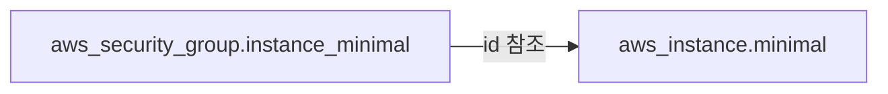
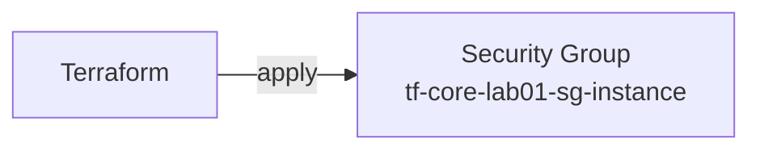
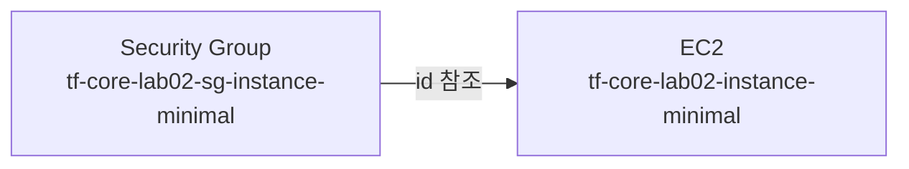
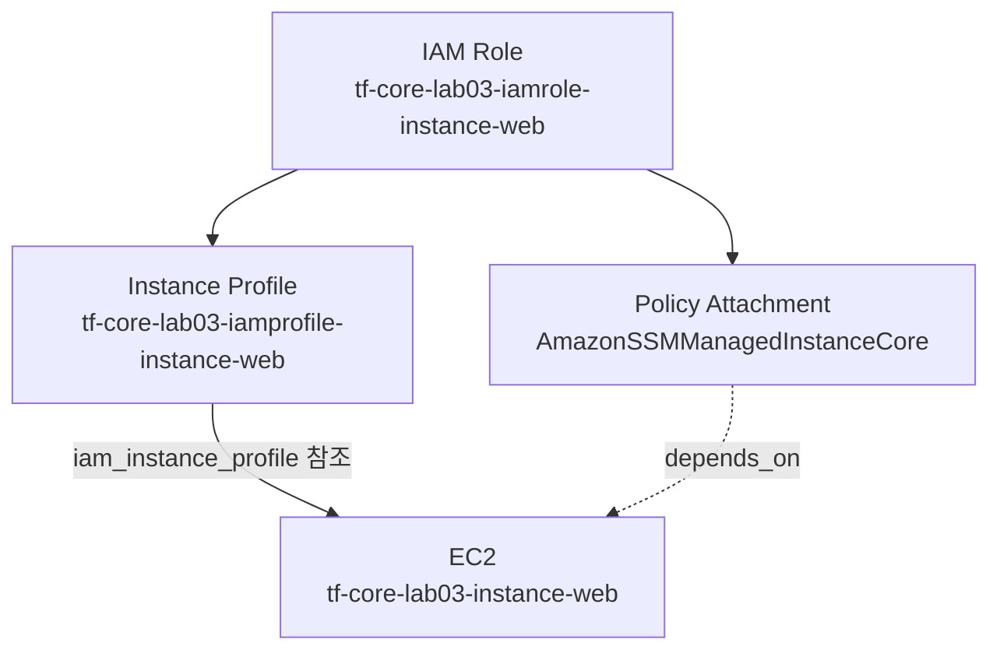

이전 섹션에서 `provider` 블록과 `default_tags` 패턴을 잡았다. 이번 섹션에서는 Terraform의 핵심인 `resource` 블록을 작성하고, 실제 AWS 리소스를 처음으로 프로비저닝한다. plan → apply → destroy 첫 사이클을 경험하고, 리소스 간 의존성이 어떻게 동작하는지 확인한다.

---

# resource 블록

## 1. 블록 구조

`resource` 블록은 Terraform이 관리할 인프라 리소스를 선언한다.

```text
resource "리소스_타입" "이름" {
  인수명 = 값
}
```

레이블은 두 개다: **리소스 타입**과 **이름**. 리소스 타입은 Provider가 정의하고, 이름은 같은 타입의 리소스를 구분하는 로컬 식별자다.

```hcl
resource "aws_security_group" "instance" {
  name        = "tf-core-lab01-sg-instance"
  description = "tf-core-lab01 security group for ec2 instance"
}
```

`aws_security_group`은 AWS Provider가 제공하는 리소스 타입이다. `instance`는 이 구성 파일 안에서만 쓰는 이름이다. 어떤 인수를 받는지는 Provider 문서에 정의되어 있다.

## 2. 리소스 주소

리소스 주소는 `<타입>.<이름>` 형식이다. Terraform은 이 주소로 리소스를 식별한다.

```text
aws_security_group.instance
aws_instance.minimal
```

`terraform plan` 출력, State 파일, `terraform destroy -target` 등 모든 곳에서 이 주소를 사용한다.

---

# 리소스 참조 표현식

다른 리소스의 속성을 참조할 때 `<타입>.<이름>.<속성명>` 형식을 사용한다.

```hcl
resource "aws_instance" "minimal" {
  ami                    = "ami-0ada8527e6dc686a3"
  instance_type          = "t3.micro"
  vpc_security_group_ids = [aws_security_group.instance_minimal.id]
}
```

`aws_security_group.instance_minimal.id`는 `aws_security_group` 리소스 `instance_minimal`의 `id` 속성을 참조한다. `id`는 apply 후 AWS가 부여하는 값이다. 참조 표현식을 사용하면 Terraform이 **리소스 간 의존성을 자동으로 파악**한다.

---

# 리소스 의존성

Terraform은 의존성이 없는 리소스를 병렬로 생성한다. 의존성이 있는 리소스는 순서를 지켜야 한다. 두 가지 방식으로 의존성을 처리한다.

## 1. 암묵적 의존성 (Implicit Dependency)

참조 표현식이 의존성을 자동으로 생성한다.

```hcl
resource "aws_security_group" "instance_minimal" {
  name = "${local.project}-sg-instance-minimal"
}

resource "aws_instance" "minimal" {
  ami                    = "ami-0ada8527e6dc686a3"
  instance_type          = "t3.micro"
  vpc_security_group_ids = [aws_security_group.instance_minimal.id]
}
```

`aws_instance.minimal`이 `aws_security_group.instance_minimal.id`를 참조하므로 Terraform은 SG가 먼저 생성되어야 한다는 것을 자동으로 파악한다.



참조 표현식이 의존성 정보를 담고 있기 때문에 별도로 선언하지 않아도 SG → EC2 순서로 생성 계획을 수립한다.

## 2. 명시적 의존성 -- depends_on

참조 표현식 없이 의존성을 선언해야 할 때 사용한다. 한 리소스가 다른 리소스의 **부수 효과(side effect)**에 의존하지만 HCL 코드에서 직접 참조하지 않는 경우다.

```hcl
resource "aws_instance" "web" {
  ami                  = "ami-0ada8527e6dc686a3"
  instance_type        = "t3.micro"
  iam_instance_profile = aws_iam_instance_profile.instance_web.name

  depends_on = [aws_iam_role_policy_attachment.instance_web_ssm]
}
```

`aws_instance.web`은 `aws_iam_instance_profile.instance_web`은 참조하지만, `aws_iam_role_policy_attachment.instance_web_ssm`은 참조하지 않는다. IAM 정책이 Role에 부착되어야 인스턴스가 SSM으로 접근 가능한데, 참조 표현식이 없으니 Terraform은 이 의존성을 알 수 없다. `depends_on`으로 명시한다.

`depends_on`은 최후의 수단이다. 참조 표현식으로 해결할 수 있으면 그쪽을 사용한다.

---

# meta-argument 개요

meta-argument는 모든 `resource` 블록에서 사용할 수 있는 특수 인수다. Provider가 정의하는 인수와 달리 Terraform 코어가 처리한다.

| meta-argument | 역할 | 심화 챕터 |
|---------------|------|----------|
| `depends_on` | 명시적 의존성 선언 | 이번 섹션 |
| `count` | 동일 리소스 N개 생성 | Ch05 |
| `for_each` | 키-값 기반 반복 생성 | Ch05 |
| `provider` | 특정 Provider 설정 지정 | Ch08 |
| `lifecycle` | 리소스 생명주기 동작 제어 | Ch03 |

`lifecycle` 블록의 주요 옵션:

```hcl
resource "aws_instance" "web" {
  ami           = "ami-0ada8527e6dc686a3"
  instance_type = "t3.micro"

  lifecycle {
    create_before_destroy = true
    ignore_changes        = [ami]
    prevent_destroy       = false
  }
}
```

| 옵션 | 설명 |
|------|------|
| `create_before_destroy` | 교체 시 새 리소스를 먼저 생성하고 기존 리소스를 삭제 |
| `ignore_changes` | 지정한 인수의 외부 변경을 Terraform이 무시 |
| `prevent_destroy` | `terraform destroy` 시 이 리소스 삭제를 차단 |

---

# 핵심 정리

- `resource "타입" "이름" {}` 구조로 인프라 리소스를 선언한다.
- 리소스 주소는 `<타입>.<이름>` 형식이다.
- 참조 표현식(`<타입>.<이름>.<속성>`)이 암묵적 의존성을 자동으로 생성한다.
- 참조 없이 의존성이 필요한 경우에만 `depends_on`을 사용한다.
- meta-argument(`depends_on`, `count`, `for_each`, `provider`, `lifecycle`)는 모든 resource 블록에 사용할 수 있다.

다음 섹션에서는 `variable`과 `output` 블록으로 코드를 파라미터화한다.

---

# 참고 자료

- [resource 블록 -- Terraform 공식 문서](https://developer.hashicorp.com/terraform/language/resources/syntax)
- [리소스 의존성 -- Terraform 공식 문서](https://developer.hashicorp.com/terraform/language/resources/behavior#resource-dependencies)
- [depends_on -- Terraform 공식 문서](https://developer.hashicorp.com/terraform/language/meta-arguments/depends_on)
- [lifecycle -- Terraform 공식 문서](https://developer.hashicorp.com/terraform/language/meta-arguments/lifecycle)

---

# [실습] lab01: Security Group 생성

`resource` 블록으로 첫 번째 AWS 리소스를 선언한다. Security Group을 생성하고 plan → apply → destroy 첫 사이클을 경험한다. `terraform.tfstate` 파일이 어떻게 생성되는지 확인한다.

### 실습 목표

- `aws_security_group` 리소스 블록 작성
- `terraform plan` 출력에서 리소스 변경 계획 읽기
- `terraform apply`로 첫 AWS 리소스 생성
- `terraform.tfstate` 파일 생성 확인
- `terraform destroy`로 리소스 정리

---

# 1. 전체 아키텍처



Security Group 하나를 생성하는 최소 구성이다. VPC나 EC2 연결 없이 단일 리소스로 plan → apply → destroy 전체 사이클을 경험한다. apply 후 `terraform.tfstate`가 생성되는 것을 확인하는 것이 이 lab의 핵심이다.

---

# 2. 사전 준비

```text
lab01/
├── locals.tf
├── providers.tf
├── main.tf
└── outputs.tf
```

**설정:**

- region: **`ap-northeast-2`**
- SG 이름: **`tf-core-lab01-sg-instance`**

---

# 3. 파일 작성

## locals.tf

```hcl
locals {
  project = "tf-core-lab01"
}
```

`local.project`는 `default_tags`의 `Project` 태그 값과 리소스 이름의 단일 출처다.

## providers.tf

```hcl
terraform {
  required_version = ">=1.14.0"

  required_providers {
    aws = {
      source  = "hashicorp/aws"
      version = ">= 6.0"
    }
  }
}

provider "aws" {
  region = "ap-northeast-2"

  default_tags {
    tags = {
      Project   = local.project
      ManagedBy = "Terraform"
    }
  }
}
```

## main.tf

```hcl
resource "aws_security_group" "instance" {
  name        = "${local.project}-sg-instance"
  description = "${local.project} security group for ec2 instance"

  ingress {
    from_port   = 22
    to_port     = 22
    protocol    = "tcp"
    cidr_blocks = ["0.0.0.0/0"]
  }

  egress {
    from_port   = 0
    to_port     = 0
    protocol    = "-1"
    cidr_blocks = ["0.0.0.0/0"]
  }

  tags = {
    Name = "${local.project}-sg-instance"
  }
}
```

`ingress` / `egress`는 `aws_security_group`의 중첩 블록이다. 인바운드 SSH(22) 포트, 아웃바운드 전체 허용으로 설정한다. TF 리소스 레이블 `instance`가 리소스 이름의 identity(`-instance`)와 일치한다.

## outputs.tf

```hcl
output "sg_instance_id" {
  value = aws_security_group.instance.id
}

output "sg_instance_name" {
  value = aws_security_group.instance.name
}
```

output을 속성별로 개별 선언한다. apply 후 Security Group의 id와 name을 각각 확인할 수 있다.

---

# 4. terraform init

```bash
$ terraform init
```

```text
Initializing provider plugins...
- Finding hashicorp/aws versions matching ">= 6.0"...
- Installing hashicorp/aws v6.x.x...

Terraform has been successfully initialized!
```

플러그인 캐시를 설정했다면 다운로드 없이 즉시 완료된다.

---

# 5. terraform plan

```bash
$ terraform plan
```

```text
Terraform will perform the following actions:

  # aws_security_group.instance will be created
  + resource "aws_security_group" "instance" {
      + arn         = (known after apply)
      + description = "tf-core-lab01 security group for ec2 instance"
      + id          = (known after apply)
      + name        = "tf-core-lab01-sg-instance"
      + owner_id    = (known after apply)
      + tags        = {
          + "Name" = "tf-core-lab01-sg-instance"
        }
      + tags_all    = {
          + "ManagedBy" = "Terraform"
          + "Name"      = "tf-core-lab01-sg-instance"
          + "Project"   = "tf-core-lab01"
        }
      + vpc_id      = (known after apply)

      + egress {
          + cidr_blocks = ["0.0.0.0/0"]
          + from_port   = 0
          + protocol    = "-1"
          + to_port     = 0
        }

      + ingress {
          + cidr_blocks = ["0.0.0.0/0"]
          + from_port   = 22
          + protocol    = "tcp"
          + to_port     = 22
        }
    }

Plan: 1 to add, 0 to change, 0 to destroy.

Changes to Outputs:
  + sg_instance_id   = (known after apply)
  + sg_instance_name = "tf-core-lab01-sg-instance"
```

`+`는 새로 생성되는 리소스를 의미한다. `(known after apply)`는 apply 전에는 알 수 없는 속성 -- AWS가 부여하는 값이다. `tags`에는 리소스에 직접 선언한 `Name`만 표시되고, `tags_all`에는 `default_tags`에서 자동으로 합쳐진 `Project`와 `ManagedBy`가 함께 표시된다.

---

# 6. terraform apply

```bash
$ terraform apply
```

```text
Do you want to perform these actions?
  Only 'yes' will be accepted to approve.

  Enter a value: yes

aws_security_group.instance: Creating...
aws_security_group.instance: Creation complete after 2s [id=sg-0abc1234567890def]

Apply complete! Resources: 1 added, 0 changed, 0 destroyed.

Outputs:

sg_instance_id   = "sg-0abc1234567890def"
sg_instance_name = "tf-core-lab01-sg-instance"
```

apply 완료 후 `terraform.tfstate` 파일이 생성된다.

```bash
$ ls -la
```

```text
.terraform/
.terraform.lock.hcl
locals.tf
main.tf
outputs.tf
providers.tf
terraform.tfstate
```

`terraform.tfstate`는 JSON 형식으로 apply 후 확정된 속성값을 기록한다. State 파일의 구조와 역할은 Ch04에서 자세히 다룬다.

[콘솔화면: AWS Console > EC2 > Security Groups > tf-core-lab01-sg-instance 생성 확인]

---

# 7. terraform destroy

```bash
$ terraform destroy
```

```text
Do you really want to destroy all resources?
  Only 'yes' will be accepted to confirm.

  Enter a value: yes

aws_security_group.instance: Destroying... [id=sg-0abc1234567890def]
aws_security_group.instance: Destruction complete after 1s

Destroy complete! Resources: 1 destroyed.
```

destroy 후 `terraform.tfstate`는 빈 상태로 남는다.

[콘솔화면: AWS Console > EC2 > Security Groups > tf-core-lab01-sg-instance 삭제 확인]

---

# [실습] lab02: EC2 인스턴스 생성

Security Group과 EC2 인스턴스를 함께 선언한다. 참조 표현식으로 두 리소스를 연결하고, Terraform이 암묵적 의존성을 처리하는 과정을 `terraform plan` 출력에서 확인한다.

### 실습 목표

- `aws_instance` 리소스 블록 작성
- 참조 표현식(`aws_security_group.instance_minimal.id`)으로 SG와 EC2 연결
- plan 출력에서 암묵적 의존성 확인
- apply → destroy 전체 사이클 경험

---

# 1. 전체 아키텍처



`aws_instance.minimal`의 `vpc_security_group_ids`가 `aws_security_group.instance_minimal.id`를 참조한다. 이 참조 표현식이 암묵적 의존성을 만들어 Terraform은 SG → EC2 순서로 생성한다. plan 출력에서 이 순서가 어떻게 표현되는지 확인하는 것이 이 lab의 핵심이다.

---

# 2. 사전 준비

```text
lab02/
├── locals.tf
├── providers.tf
├── main.tf
└── outputs.tf
```

`providers.tf`는 lab01과 동일한 구조다 (`local.project` 참조 `default_tags` 포함). `locals.tf`는 `project = "tf-core-lab02"`로 설정한다.

**설정:**

- instance_type: **`t3.micro`**
- region: **`ap-northeast-2`**
- ami: **`ami-0ada8527e6dc686a3`** (Amazon Linux 2023)

---

# 3. 파일 작성

## locals.tf

```hcl
locals {
  project = "tf-core-lab02"
}
```

## providers.tf

```hcl
terraform {
  required_version = ">=1.14.0"

  required_providers {
    aws = {
      source  = "hashicorp/aws"
      version = ">= 6.0"
    }
  }
}

provider "aws" {
  region = "ap-northeast-2"

  default_tags {
    tags = {
      Project   = local.project
      ManagedBy = "Terraform"
    }
  }
}
```

## main.tf

```hcl
resource "aws_security_group" "instance_minimal" {
  name = "${local.project}-sg-instance-minimal"

  ingress {
    from_port   = 22
    to_port     = 22
    protocol    = "tcp"
    cidr_blocks = ["0.0.0.0/0"]
  }

  egress {
    from_port   = 0
    to_port     = 0
    protocol    = "-1"
    cidr_blocks = ["0.0.0.0/0"]
  }

  tags = {
    Name = "${local.project}-sg-instance-minimal"
  }
}

resource "aws_instance" "minimal" {
  ami                         = "ami-0ada8527e6dc686a3"
  instance_type               = "t3.micro"
  key_name                    = "key-tf-core"
  associate_public_ip_address = true
  vpc_security_group_ids      = [aws_security_group.instance_minimal.id]

  tags = {
    Name = "${local.project}-instance-minimal"
  }
}
```

`aws_instance.minimal`의 `vpc_security_group_ids`에 `aws_security_group.instance_minimal.id`를 참조한다. 이 참조 표현식이 암묵적 의존성을 만든다. `key_name`은 SSH 접속을 위한 키 페어 이름이다. `associate_public_ip_address = true`로 퍼블릭 IP를 할당한다. TF 리소스 레이블 `instance_minimal`은 리소스 이름의 identity(`-instance-minimal`)에서 `-`를 `_`로 바꾼 것과 같다.

## outputs.tf

```hcl
output "sg_instance_minimal_id" {
  value = aws_security_group.instance_minimal.id
}

output "instance_minimal_id" {
  value = aws_instance.minimal.id
}

output "instance_minimal_public_ip" {
  value = aws_instance.minimal.public_ip
}

output "How_to_Connect" {
  value = aws_instance.minimal.public_ip != "" ? "ssh -i <your_key_pair>.pem ec2-user@${aws_instance.minimal.public_ip}" : "No public IP assigned"
}
```

`How_to_Connect` output은 조건식을 사용해 SSH 접속 명령을 자동 생성한다.

---

# 4. terraform init

```bash
$ terraform init
```

---

# 5. terraform plan

```bash
$ terraform plan
```

```text
Terraform will perform the following actions:

  # aws_security_group.instance_minimal will be created
  + resource "aws_security_group" "instance_minimal" {
      + id       = (known after apply)
      + name     = "tf-core-lab02-sg-instance-minimal"
      + tags     = {
          + "Name" = "tf-core-lab02-sg-instance-minimal"
        }
      + tags_all = {
          + "ManagedBy" = "Terraform"
          + "Name"      = "tf-core-lab02-sg-instance-minimal"
          + "Project"   = "tf-core-lab02"
        }
      ...
    }

  # aws_instance.minimal will be created
  + resource "aws_instance" "minimal" {
      + ami                         = "ami-0ada8527e6dc686a3"
      + associate_public_ip_address = true
      + id                          = (known after apply)
      + instance_type               = "t3.micro"
      + key_name                    = "key-tf-core"
      + public_ip                   = (known after apply)
      + tags                        = {
          + "Name" = "tf-core-lab02-instance-minimal"
        }
      + tags_all                    = {
          + "ManagedBy" = "Terraform"
          + "Name"      = "tf-core-lab02-instance-minimal"
          + "Project"   = "tf-core-lab02"
        }
      + vpc_security_group_ids      = (known after apply)
      ...
    }

Plan: 2 to add, 0 to change, 0 to destroy.

Changes to Outputs:
  + How_to_Connect             = (known after apply)
  + instance_minimal_id        = (known after apply)
  + instance_minimal_public_ip = (known after apply)
  + sg_instance_minimal_id     = (known after apply)
```

`vpc_security_group_ids = (known after apply)`는 SG의 `id`가 apply 전에는 아직 없기 때문이다. Terraform은 내부적으로 SG → EC2 순서로 생성한다.

---

# 6. terraform apply

```bash
$ terraform apply
```

```text
aws_security_group.instance_minimal: Creating...
aws_security_group.instance_minimal: Creation complete after 2s [id=sg-xxxxxxxxxxxxxxxxx]
aws_instance.minimal: Creating...
aws_instance.minimal: Still creating... [10s elapsed]
aws_instance.minimal: Still creating... [20s elapsed]
aws_instance.minimal: Creation complete after 23s [id=i-xxxxxxxxxxxxxxxxx]

Apply complete! Resources: 2 added, 0 changed, 0 destroyed.

Outputs:

How_to_Connect             = "ssh -i <your_key_pair>.pem ec2-user@13.xxx.xxx.xxx"
instance_minimal_id        = "i-xxxxxxxxxxxxxxxxx"
instance_minimal_public_ip = "13.xxx.xxx.xxx"
sg_instance_minimal_id     = "sg-xxxxxxxxxxxxxxxxx"
```

SG가 먼저 생성되고 EC2가 이어서 생성된다. 참조 표현식이 순서를 보장한 결과다.

[콘솔화면: AWS Console > EC2 > Instances > tf-core-lab02-instance-minimal Running 상태 확인]

---

# 7. terraform destroy

```bash
$ terraform destroy
```

```text
aws_instance.minimal: Destroying...
aws_instance.minimal: Destruction complete after 32s
aws_security_group.instance_minimal: Destroying...
aws_security_group.instance_minimal: Destruction complete after 1s

Destroy complete! Resources: 2 destroyed.
```

destroy는 생성의 역순이다. EC2가 먼저 삭제되고 SG가 이어서 삭제된다.

---

# [실습] lab03: depends_on 명시적 의존성

참조 표현식만으로는 의존성을 선언할 수 없는 상황을 재현한다. IAM Role에 SSM(Systems Manager) 정책을 붙이고 EC2 인스턴스가 그 Role을 사용하는 시나리오다. `depends_on`으로 생성 순서를 명시한다.

SSM Session Manager는 SSH 포트(22)를 열지 않고도 인스턴스에 접속할 수 있는 AWS 관리형 서비스다. 이 lab에서는 Security Group에 SSH ingress를 열지 않고, EC2에 키 페어도 설정하지 않는다. 대신 `AmazonSSMManagedInstanceCore` 정책을 IAM Role에 부여하고, EC2가 그 Role을 사용하도록 구성한다. apply 후 AWS 콘솔의 Session Manager로 인스턴스에 접속해 확인한다.

### 실습 목표

- 암묵적 의존성이 누락되는 상황을 이해한다
- `depends_on`으로 명시적 의존성을 선언한다
- IAM Role + Policy Attachment + EC2 구성을 경험한다
- SSH 없이 SSM Session Manager로 인스턴스 접속을 확인한다

---

# 1. 전체 아키텍처



`aws_instance.web`은 `aws_iam_instance_profile.instance_web`을 참조하지만, `aws_iam_role_policy_attachment.instance_web_ssm`은 참조하지 않는다. 정책 부착이 완료되기 전에 EC2가 생성되면 SSM이 즉시 동작하지 않을 수 있다. `depends_on`으로 순서를 보장한다.

---

# 2. 사전 준비

```text
lab03/
├── locals.tf
├── providers.tf
├── main.tf
└── outputs.tf
```

`providers.tf`는 lab01과 동일한 구조다 (`local.project` 참조 `default_tags` 포함). `locals.tf`는 `project = "tf-core-lab03"`으로 설정한다.

**설정:**

- instance_type: **`t3.micro`**
- IAM Role 이름: **`tf-core-lab03-iamrole-instance-web`**

---

# 3. 파일 작성

## locals.tf

```hcl
locals {
  project = "tf-core-lab03"
}
```

## providers.tf

```hcl
terraform {
  required_version = ">=1.14.0"

  required_providers {
    aws = {
      source  = "hashicorp/aws"
      version = ">= 6.0"
    }
  }
}

provider "aws" {
  region = "ap-northeast-2"

  default_tags {
    tags = {
      Project   = local.project
      ManagedBy = "Terraform"
    }
  }
}
```

## main.tf

```hcl
resource "aws_iam_role" "instance_web" {
  name = "${local.project}-iamrole-instance-web"

  assume_role_policy = jsonencode({
    Version = "2012-10-17"
    Statement = [{
      Action    = "sts:AssumeRole"
      Effect    = "Allow"
      Principal = { Service = "ec2.amazonaws.com" }
    }]
  })

  tags = {
    Name = "${local.project}-iamrole-instance-web"
  }
}

resource "aws_iam_role_policy_attachment" "instance_web_ssm" {
  role       = aws_iam_role.instance_web.name
  policy_arn = "arn:aws:iam::aws:policy/AmazonSSMManagedInstanceCore"
}

resource "aws_iam_instance_profile" "instance_web" {
  name = "${local.project}-iamprofile-instance-web"
  role = aws_iam_role.instance_web.name

  tags = {
    Name = "${local.project}-iamprofile-instance-web"
  }
}

resource "aws_security_group" "instance_web" {
  name        = "${local.project}-sg-instance-web"
  description = "${local.project} security group"

  egress {
    from_port   = 0
    to_port     = 0
    protocol    = "-1"
    cidr_blocks = ["0.0.0.0/0"]
  }

  tags = {
    Name = "${local.project}-sg-instance-web"
  }
}

resource "aws_instance" "web" {
  ami                    = "ami-0ada8527e6dc686a3"
  instance_type          = "t3.micro"
  iam_instance_profile   = aws_iam_instance_profile.instance_web.name
  vpc_security_group_ids = [aws_security_group.instance_web.id]

  depends_on = [aws_iam_role_policy_attachment.instance_web_ssm]

  tags = {
    Name = "${local.project}-instance-web"
  }
}
```

Security Group에 SSH ingress 규칙이 없다. 키 페어(`key_name`)도 설정하지 않았다. SSH로 접속할 수 없는 구성이다. 대신 IAM Role에 `AmazonSSMManagedInstanceCore` 정책을 부착해 SSM Session Manager로 접속한다.

`aws_instance.web`은 `aws_iam_instance_profile.instance_web`을 참조한다 — IAM Role에 대한 암묵적 의존성이 생긴다. 하지만 `aws_iam_role_policy_attachment.instance_web_ssm`은 참조하지 않는다. `depends_on = [aws_iam_role_policy_attachment.instance_web_ssm]`으로 정책 부착이 완료된 후 EC2가 생성되도록 순서를 명시한다.

## outputs.tf

```hcl
output "instance_web_id" {
  value = aws_instance.web.id
}

output "instance_web_public_ip" {
  value = aws_instance.web.public_ip
}

output "iam_role_instance_web_name" {
  value = aws_iam_role.instance_web.name
}

output "iam_role_instance_web_arn" {
  value = aws_iam_role.instance_web.arn
}
```

---

# 4. terraform init

```bash
$ terraform init
```

---

# 5. terraform plan

```bash
$ terraform plan
```

```text
Terraform will perform the following actions:

  # aws_iam_role.instance_web will be created
  + resource "aws_iam_role" "instance_web" {
      + arn  = (known after apply)
      + name = "tf-core-lab03-iamrole-instance-web"
      + tags = {
          + "Name" = "tf-core-lab03-iamrole-instance-web"
        }
      + tags_all = {
          + "ManagedBy" = "Terraform"
          + "Name"      = "tf-core-lab03-iamrole-instance-web"
          + "Project"   = "tf-core-lab03"
        }
      ...
    }

  # aws_iam_role_policy_attachment.instance_web_ssm will be created
  + resource "aws_iam_role_policy_attachment" "instance_web_ssm" {
      + policy_arn = "arn:aws:iam::aws:policy/AmazonSSMManagedInstanceCore"
      + role       = "tf-core-lab03-iamrole-instance-web"
    }

  # aws_iam_instance_profile.instance_web will be created
  + resource "aws_iam_instance_profile" "instance_web" {
      + name     = "tf-core-lab03-iamprofile-instance-web"
      + tags     = {
          + "Name" = "tf-core-lab03-iamprofile-instance-web"
        }
      + tags_all = {
          + "ManagedBy" = "Terraform"
          + "Name"      = "tf-core-lab03-iamprofile-instance-web"
          + "Project"   = "tf-core-lab03"
        }
      ...
    }

  # aws_security_group.instance_web will be created
  + resource "aws_security_group" "instance_web" {
      + name     = "tf-core-lab03-sg-instance-web"
      + tags     = {
          + "Name" = "tf-core-lab03-sg-instance-web"
        }
      + tags_all = {
          + "ManagedBy" = "Terraform"
          + "Name"      = "tf-core-lab03-sg-instance-web"
          + "Project"   = "tf-core-lab03"
        }
      ...
    }

  # aws_instance.web will be created
  + resource "aws_instance" "web" {
      + ami                    = "ami-xxxxxxxxxxxxxxxxx"
      + iam_instance_profile   = "tf-core-lab03-iamprofile-instance-web"
      + instance_type          = "t3.micro"
      + public_ip              = (known after apply)
      + tags                   = {
          + "Name" = "tf-core-lab03-instance-web"
        }
      + tags_all               = {
          + "ManagedBy" = "Terraform"
          + "Name"      = "tf-core-lab03-instance-web"
          + "Project"   = "tf-core-lab03"
        }
      + vpc_security_group_ids = (known after apply)
      ...
    }

Plan: 5 to add, 0 to change, 0 to destroy.

Changes to Outputs:
  + iam_role_instance_web_arn  = (known after apply)
  + iam_role_instance_web_name = "tf-core-lab03-iamrole-instance-web"
  + instance_web_id            = (known after apply)
  + instance_web_public_ip     = (known after apply)
```

5개 리소스가 생성된다. plan 출력만으로는 `depends_on` 의존성이 직접 표시되지 않지만, apply 시 실행 순서에서 확인할 수 있다.

---

# 6. terraform apply

```bash
$ terraform apply
```

```text
aws_iam_role.instance_web: Creating...
aws_iam_role.instance_web: Creation complete after 1s [id=tf-core-lab03-iamrole-instance-web]
aws_iam_role_policy_attachment.instance_web_ssm: Creating...
aws_iam_instance_profile.instance_web: Creating...
aws_security_group.instance_web: Creating...
aws_iam_role_policy_attachment.instance_web_ssm: Creation complete after 1s
aws_iam_instance_profile.instance_web: Creation complete after 1s [id=tf-core-lab03-iamprofile-instance-web]
aws_security_group.instance_web: Creation complete after 2s [id=sg-xxxxxxxxxxxxxxxxx]
aws_instance.web: Creating...
aws_instance.web: Still creating... [10s elapsed]
aws_instance.web: Creation complete after 23s [id=i-xxxxxxxxxxxxxxxxx]

Apply complete! Resources: 5 added, 0 changed, 0 destroyed.
```

`aws_iam_role_policy_attachment.instance_web_ssm`이 완료된 후 `aws_instance.web`이 생성된다. `depends_on`이 순서를 보장한 결과다.

---

# 7. SSM Session Manager 접속 확인

EC2 생성 후 SSM Agent가 준비되기까지 약 1~2분이 소요된다.

[콘솔화면: AWS Console > EC2 > Instances > tf-core-lab03-instance-web 선택 > Connect > Session Manager 탭 > Connect 버튼]

SSH 포트를 열지 않았고 키 페어도 없지만 Session Manager로 인스턴스에 접속할 수 있다. IAM Role에 부착한 `AmazonSSMManagedInstanceCore` 정책이 이를 가능하게 한다.

---

# 8. terraform destroy

```bash
$ terraform destroy
```

```text
aws_instance.web: Destroying...
aws_instance.web: Destruction complete after 32s
aws_security_group.instance_web: Destroying...
aws_iam_instance_profile.instance_web: Destroying...
aws_security_group.instance_web: Destruction complete after 1s
aws_iam_instance_profile.instance_web: Destruction complete after 2s
aws_iam_role_policy_attachment.instance_web_ssm: Destroying...
aws_iam_role_policy_attachment.instance_web_ssm: Destruction complete after 0s
aws_iam_role.instance_web: Destroying...
aws_iam_role.instance_web: Destruction complete after 1s

Destroy complete! Resources: 5 destroyed.
```
