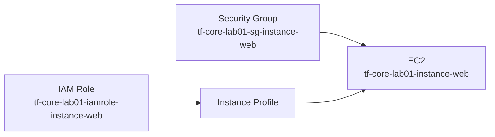
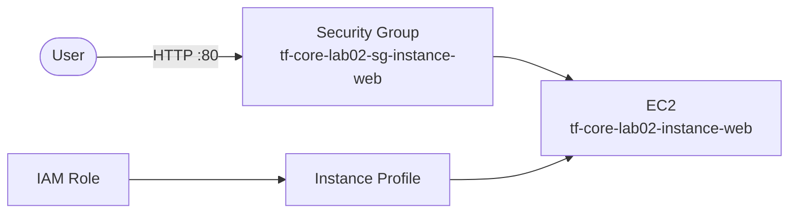

이전 섹션에서 `resource` 블록으로 리소스를 생성하고 참조하는 방법을 다뤘다. 이번 섹션에서는 리소스에 하드코딩된 값을 한 곳에서 관리하는 `locals` 블록과, 배포 결과를 구조적으로 출력하는 `output` 블록을 다룬다.

---

# locals 블록

## 1. 블록 구조

`locals` 블록은 코드 내부에서 사용할 값을 선언한다. 레이블이 없다.

```text
locals {
  이름 = 값
  이름 = 표현식
}
```

`locals`(복수)로 선언하고, 코드에서 `local.이름`(단수)으로 참조한다. 하나의 파일에 `locals` 블록을 여러 개 선언할 수도 있지만, 일반적으로 `locals.tf` 파일 하나에 모아 관리한다.

```hcl
locals {
  project = "tf-core-lab01"
}

resource "aws_security_group" "instance_web" {
  name = "${local.project}-sg-instance-web"
}
```

`local.project`를 한 곳에 선언하고, 리소스 이름에서 참조한다. 값이 바뀌면 `locals` 블록 한 곳만 수정하면 된다.

## 2. 특징

locals는 코드 내부에서 값을 정의한다. 외부에서 재정의할 수 없다. `-var` 플래그나 `.tfvars` 파일로 값을 바꾸는 것은 불가능하다. 값을 바꾸려면 코드를 직접 수정해야 한다. 외부에서 값을 주입받는 `variable` 블록과의 역할 차이는 다음 섹션(02.05)에서 다룬다.

## 3. 단일 출처

`local.project`를 한 곳에 정의하고 여러 곳에서 참조한다.

```hcl
locals {
  project = "tf-core-lab01"
}

provider "aws" {
  default_tags {
    tags = {
      Project = local.project
    }
  }
}

resource "aws_security_group" "instance_web" {
  name = "${local.project}-sg-instance-web"
}
```

값을 바꿀 곳이 하나뿐이다. `local.project`를 `"tf-core-lab02"`로 바꾸면 태그와 리소스 이름이 모두 따라 변한다.

## 4. locals object 패턴

리소스에 흩어진 설정값을 하나의 object로 구조화할 수 있다.

```hcl
# 리소스에 값이 흩어져 있는 상태
resource "aws_instance" "web" {
  ami           = "ami-0c003e98ceffee43e"
  instance_type = "t3.micro"
}

resource "aws_security_group" "instance_web" {
  ingress {
    from_port = 80
    to_port   = 80
  }
}
```

```hcl
# locals object로 구조화
locals {
  instance = {
    instance_type = "t3.micro"
    allow_access = {
      port        = 80
      cidr_blocks = ["0.0.0.0/0"]
    }
  }
}

resource "aws_instance" "web" {
  instance_type = local.instance.instance_type
}

resource "aws_security_group" "instance_web" {
  ingress {
    from_port   = local.instance.allow_access.port
    to_port     = local.instance.allow_access.port
    cidr_blocks = local.instance.allow_access.cidr_blocks
  }
}
```

`local.instance` 하나를 보면 인스턴스 관련 설정 전체가 보인다. 리소스 블록에서는 `local.instance.*`로만 참조한다. 이 패턴은 Ch05 모듈에서 "모듈 구성(module configuration)"으로 발전한다.

---

# output 블록

## 1. 기본 구조

`output` 블록은 배포 결과를 외부에 공개한다.

```hcl
output "instance_id" {
  value = aws_instance.web.id
}

output "public_ip" {
  value = aws_instance.web.public_ip
}
```

`terraform apply` 후 `terraform output`으로 값을 확인한다.

```bash
$ terraform output

# 출력 예
instance_id = "i-0abc1234567890def"
public_ip = "13.125.xxx.xxx"
```

## 2. output object 구조화

flat output은 값이 많아지면 어떤 리소스의 정보인지 구분이 어렵다. object로 구조화하면 리소스 개념별로 그룹핑할 수 있다.

```hcl
# flat output
output "instance_web_id" {
  value = aws_instance.web.id
}
output "instance_web_public_ip" {
  value = aws_instance.web.public_ip
}
output "sg_instance_web_id" {
  value = aws_security_group.instance_web.id
}
```

```hcl
# object로 구조화
output "instance_web" {
  value = {
    id        = aws_instance.web.id
    public_ip = aws_instance.web.public_ip
  }
}

output "sg_instance_web" {
  value = {
    id   = aws_security_group.instance_web.id
    name = aws_security_group.instance_web.name
  }
}
```

`terraform output -json`과 `jq`를 조합하면 특정 값만 추출할 수 있다.

```bash
$ terraform output -json | jq '.instance_web.value.public_ip'

# 출력 예
"13.125.xxx.xxx"
```

## 3. sensitive output

`sensitive = true`를 설정하면 `terraform output` 출력에서 값이 마스킹된다.

```hcl
output "db_password" {
  value     = "my-secret-password"
  sensitive = true
}
```

```bash
$ terraform output db_password

# 출력 예
db_password = <sensitive>
```

`terraform output -json`이나 `-raw`로는 실제 값이 노출된다. State 파일에도 평문으로 저장된다.

---

# [실습] lab01: locals로 리소스 설정 구조화

02.03 lab03에서 리소스에 하드코딩된 값들을 `locals` 블록으로 구조화한다.

### 실습 목표

- 리소스의 하드코딩 값을 locals object(`local.instance`, `local.iamrole`)로 구조화
- 리소스 레이블을 `this`로 통일
- resource에서 `local.*`로만 참조

---

# 1. 전체 아키텍처



02.03 lab03과 동일한 리소스 구성이다. 달라지는 것은 리소스에 하드코딩된 값이 locals object로 구조화되는 것이다.

---

# 2. 사전 준비

```text
lab01/
├── main.tf
├── locals.tf
├── providers.tf
└── outputs.tf
```

---

# 3. main.tf

```hcl
# resource "aws_iam_role" "instance_minimal" {
#   name = "tf-core-lab03-iamrole-instance-minimal"
#   assume_role_policy = jsonencode({
#     Version = "2012-10-17"
#     Statement = [{
#       Action = "sts:AssumeRole", Effect = "Allow",
#       Principal = { Service = "ec2.amazonaws.com" }
#     }]
#   })
# }
resource "aws_iam_role" "this" {
  name               = "${local.project}-iamrole-${local.iamrole.name}"
  assume_role_policy = local.iamrole.assume_role_policy

  tags = {
    Name = "${local.project}-iamrole-${local.iamrole.name}"
  }
}

# resource "aws_iam_instance_profile" "instance_minimal" {
#   name = "tf-core-lab03-iamprofile-instance-minimal"
#   role = aws_iam_role.instance_minimal.name
# }
resource "aws_iam_instance_profile" "this" {
  name = "${local.project}-iamprofile-${local.iamrole.name}"
  role = aws_iam_role.this.name

  tags = {
    Name = "${local.project}-iamprofile-${local.iamrole.name}"
  }
}

# resource "aws_iam_role_policy_attachment" "instance_minimal_ssm" {
#   role       = aws_iam_role.instance_minimal.name
#   policy_arn = "arn:aws:iam::aws:policy/AmazonSSMManagedInstanceCore"
# }
resource "aws_iam_role_policy_attachment" "this" {
  role       = aws_iam_role.this.name
  policy_arn = local.iamrole.policy_arn
}

# resource "aws_security_group" "instance_minimal" {
#   name = "tf-core-lab03-sg-instance-minimal"
#   egress { from_port = 0, to_port = 0, protocol = "-1", cidr_blocks = ["0.0.0.0/0"] }
# }
resource "aws_security_group" "this" {
  name = "${local.project}-sg-instance-${local.instance.name}"

  ingress {
    from_port   = local.instance.allow_access.port
    to_port     = local.instance.allow_access.port
    protocol    = "tcp"
    cidr_blocks = local.instance.allow_access.cidr_blocks
  }
  egress {
    from_port   = 0
    to_port     = 0
    protocol    = "-1"
    cidr_blocks = ["0.0.0.0/0"]
  }

  tags = {
    Name = "${local.project}-sg-instance-${local.instance.name}"
  }
}

# resource "aws_instance" "minimal" {
#   ami           = "ami-0c003e98ceffee43e"
#   instance_type = "t3.micro"
#   vpc_security_group_ids = [aws_security_group.instance_minimal.id]
#   iam_instance_profile   = aws_iam_instance_profile.instance_minimal.name
# }
resource "aws_instance" "this" {
  ami                         = local.instance.ami
  instance_type               = local.instance.instance_type
  associate_public_ip_address = local.instance.associate_public_ip_address

  vpc_security_group_ids = [aws_security_group.this.id]
  iam_instance_profile   = aws_iam_instance_profile.this.name

  depends_on = [aws_iam_role_policy_attachment.this]

  tags = {
    Name = "${local.project}-instance-${local.instance.name}"
  }
}
```

주석은 02.03 lab03의 리소스 원형이다. 하드코딩된 값이 `local.*`로 대체된 것을 비교할 수 있다.

두 가지가 달라졌다.

**모든 설정값이 `local.*`에서 온다.** `local.instance.instance_type`, `local.iamrole.assume_role_policy`처럼 설정 object를 참조한다. 리소스 블록에 하드코딩된 값이 없다.

**리소스 레이블이 `this`로 통일되었다.** Terraform 커뮤니티에서 같은 타입 리소스가 하나뿐일 때 `this`를 사용하는 관례를 따른다. HashiCorp 공식 모듈(terraform-aws-vpc 등)도 이 패턴을 쓴다. 리소스의 identity(`web`, `instance-web`)는 Name 태그에서 locals의 `name` 값으로 표현한다.

---

# 4. locals.tf

```hcl
locals {
  project = "tf-core-lab01"

  instance = {
    name = "web"

    ami                         = "ami-0c003e98ceffee43e"
    instance_type               = "t3.micro"
    associate_public_ip_address = true

    allow_access = {
      port        = 80
      cidr_blocks = ["0.0.0.0/0"]
    }
  }

  iamrole = {
    name = "instance-web"

    assume_role_policy = jsonencode({
      Version = "2012-10-17"

      Statement = [{
        Action    = "sts:AssumeRole"
        Effect    = "Allow"
        Principal = { Service = "ec2.amazonaws.com" }
      }]
    })

    policy_arn = "arn:aws:iam::aws:policy/AmazonSSMManagedInstanceCore"
  }
}
```

02.03 lab03에서 리소스에 흩어져 있던 값이 두 개의 object로 구조화된다.

- `local.instance`: EC2 + SG 관련 설정
- `local.iamrole`: IAM Role + Instance Profile + Policy 관련 설정

object 이름은 리소스 네이밍 규칙의 **capability**를 따른다. `instance`는 EC2 Instance, `iamrole`은 IAM Role이다.

object의 `name`은 리소스의 identity다. Name 태그에서 `${local.project}-instance-${local.instance.name}` 형태로 사용되고, output에서는 computed key로도 사용된다. 앞으로 리소스를 정의할 때는 locals object에 `name`을 가급적 포함하겠다.

locals.tf 하나를 보면 이 코드가 만드는 리소스의 전체 설정이 보인다. 모든 값이 하드코딩이다. 외부에서 받는 값은 없다.

---

# 5. outputs.tf

```hcl
output "instance_web_id" {
  value = aws_instance.this.id
}

output "instance_web_public_ip" {
  value = aws_instance.this.public_ip
}

output "sg_instance_web_id" {
  value = aws_security_group.this.id
}

output "sg_instance_web_name" {
  value = aws_security_group.this.name
}
```

output은 아직 flat이다. lab02에서 object 구조로 전환한다.

---

# 6. providers.tf

```hcl
terraform {
  required_version = ">=1.14.0"

  required_providers {
    aws = {
      source  = "hashicorp/aws"
      version = "~> 6.0"
    }
  }
}

provider "aws" {
  region = "ap-northeast-2"

  default_tags {
    tags = {
      Project   = local.project
      ManagedBy = "Terraform"
    }
  }
}
```

---

# 7. terraform apply

```bash
$ terraform init && terraform apply
```

```text
...(생략)...

Apply complete! Resources: 5 added, 0 changed, 0 destroyed.
```

---

# 8. terraform destroy

```bash
$ terraform destroy
```

---

# [실습] lab02: output object 구조화 + 접속 확인

lab01의 배포 결과를 object 구조로 출력하고, output 값으로 실제 접속을 확인한다.

### 실습 목표

- flat output을 리소스 개념별 object로 전환
- `web_endpoint` output으로 실제 접속 확인
- SSM Session Manager로 httpd 설치 → 브라우저 접속
- `terraform output -json | jq` 패턴 체험

---

# 1. 전체 아키텍처



lab01과 동일한 인프라다. output 구조를 변경하고, `web_endpoint` output을 추가해서 실제 접속까지 확인한다.

---

# 2. 사전 준비

lab01의 코드를 기반으로 `outputs.tf`를 수정한다.

```text
lab02/
├── main.tf
├── locals.tf
├── providers.tf
└── outputs.tf
```

---

# 3. main.tf

lab01과 동일하다. 변경 없음.

---

# 4. locals.tf

lab01과 동일하다. `local.project`만 `"tf-core-lab02"`로 변경한다.

---

# 5. outputs.tf

```hcl
output "instance" {
  value = {
    (local.instance.name) = {
      id        = aws_instance.this.id
      public_ip = aws_instance.this.public_ip
    }
  }
}

output "iamrole" {
  value = {
    (local.iamrole.name) = {
      arn = aws_iam_role.this.arn
    }
  }
}

output "iamprofile" {
  value = {
    (local.iamrole.name) = {
      name = aws_iam_instance_profile.this.name
    }
  }
}

output "sg" {
  value = {
    id   = aws_security_group.this.id
    name = aws_security_group.this.name

    ingress = [for v in aws_security_group.this.ingress : {
      from_port   = v.from_port
      to_port     = v.to_port
      protocol    = v.protocol
      cidr_blocks = v.cidr_blocks
    }]
  }
}

output "web_endpoint" {
  value = "http://${aws_instance.this.public_ip}:${local.instance.allow_access.port}"
}
```

lab01의 flat output이 **capability별 object**로 전환되었다. output 이름이 locals object 이름과 대응한다.

**computed key** `(local.instance.name)`으로 리소스의 identity가 output에 드러난다. 리소스 레이블이 `this`라서 레이블만으로는 "이게 뭔지" 모르지만, output에서 `"web" = { id = ..., public_ip = ... }` 형태로 표시된다. `iamprofile`은 role에 종속되는 리소스이므로 `(local.iamrole.name)`을 key로 쓴다.

`sg`는 computed key를 적용하지 않았다. locals에서 이름을 직접 설정하지 않는 리소스이기 때문이다. 이런 리소스는 모듈에서는 output 대상이 되지 않는다. 여기서는 ingress 규칙 확인용으로 출력한다. computed key가 왜 중요한지는 Ch05 모듈에서 다시 다룬다.

`sg` output의 `ingress`에 `for` expression이 사용된다. SG의 ingress 규칙을 읽기 좋은 구조로 변환한다. `for` expression의 본격적인 활용은 Ch06에서 다룬다.

`web_endpoint`는 public IP와 port를 조합한 접속 URL이다. `terraform output web_endpoint`로 바로 확인할 수 있다.

---

# 6. terraform apply

```bash
$ terraform init && terraform apply
```

```text
...(생략)...

Apply complete! Resources: 5 added, 0 changed, 0 destroyed.
```

---

# 7. terraform output

```bash
$ terraform output

# 출력 예
iamprofile = {
  "instance-web" = {
    "name" = "tf-core-lab02-iamprofile-instance-web"
  }
}
iamrole = {
  "instance-web" = {
    "arn" = "arn:aws:iam::xxxxxxxxxxxx:role/tf-core-lab02-iamrole-instance-web"
  }
}
instance = {
  "web" = {
    "id" = "i-0abc1234567890def"
    "public_ip" = "13.xxx.xxx.xxx"
  }
}
sg = {
  "id" = "sg-0abc1234567890def"
  "ingress" = [
    {
      "cidr_blocks" = ["0.0.0.0/0"]
      "from_port" = 80
      "protocol" = "tcp"
      "to_port" = 80
    }
  ]
  "name" = "tf-core-lab02-sg-instance-web"
}
web_endpoint = "http://13.xxx.xxx.xxx:80"
```

```bash
$ terraform output -json | jq '.instance.value.web.public_ip'

# 출력 예
"13.xxx.xxx.xxx"
```

`-json` 출력에서 `jq`로 특정 값만 추출할 수 있다.

---

# 8. SSM 접속 + httpd 설치

02.03 lab03에서 SSM 접속을 확인했다. 이번에는 httpd를 설치해서 `web_endpoint`로 실제 접속한다.

EC2 생성 후 SSM Agent가 준비되기까지 약 1~2분이 소요된다.

[콘솔화면: AWS Console > EC2 > Instances > tf-core-lab02-instance-web 선택 > Connect > Session Manager 탭 > Connect 버튼]

Session Manager로 접속한 후 httpd를 설치하고 시작한다.

```bash
$ sudo dnf install -y httpd
$ sudo systemctl start httpd
```

localhost에서 응답을 확인한다.

```bash
$ curl localhost
```

```text
<!DOCTYPE html>
<html>
  ...(생략)...
  <title>Test Page for the HTTP Server on Amazon Linux</title>
  ...(생략)...
</html>
```

---

# 9. 브라우저 접속

`terraform output`에서 확인한 `web_endpoint`로 브라우저에서 접속한다.

```bash
$ terraform output web_endpoint

# 출력 예
"http://13.xxx.xxx.xxx:80"
```

[콘솔화면: 브라우저 > http://13.xxx.xxx.xxx > Apache 테스트 페이지]

Apache 테스트 페이지가 표시된다. SG ingress가 port 80 + `["0.0.0.0/0"]`을 허용하고 있으므로 외부 접속이 가능하다. output이 단순히 값을 보여주는 것이 아니라 실제 접속에 사용된다.

---

# 10. terraform destroy

```bash
$ terraform destroy
```

---

# 핵심 정리

- `locals` 블록은 코드 내부에서 값을 정의한다. 외부에서 재정의할 수 없다
- `locals`는 단일 출처 역할을 한다. 값을 한 곳에 정의하고 여러 곳에서 참조하면 변경 지점이 하나로 줄어든다
- `local.instance` object 패턴으로 리소스 설정을 구조화할 수 있다. `locals.tf` 하나를 보면 전체 설정이 보인다
- resource에서 `local.*`로 참조하면 값의 출처가 통일된다
- `output`은 flat보다 리소스 개념별 object로 구조화하면 읽기 좋다
- `terraform output -json | jq`로 특정 값을 추출할 수 있다

다음 섹션에서 `variable`과 `data source`를 다룬다. locals에 하드코딩된 값 중 외부에서 바꿀 필요가 있는 것을 variable로 추출하고, AWS에서 동적으로 조회해야 하는 값을 data source로 대체한다.

---

# 참고 자료

- [Local Values — Terraform 공식 문서](https://developer.hashicorp.com/terraform/language/values/locals)
- [Output Values — Terraform 공식 문서](https://developer.hashicorp.com/terraform/language/values/outputs)
