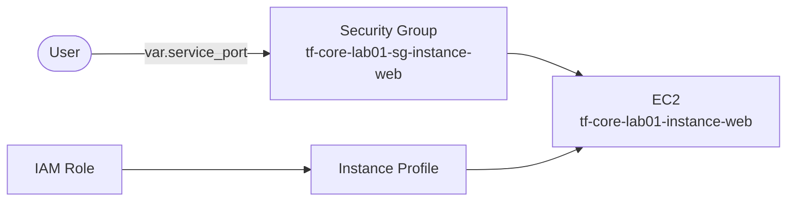
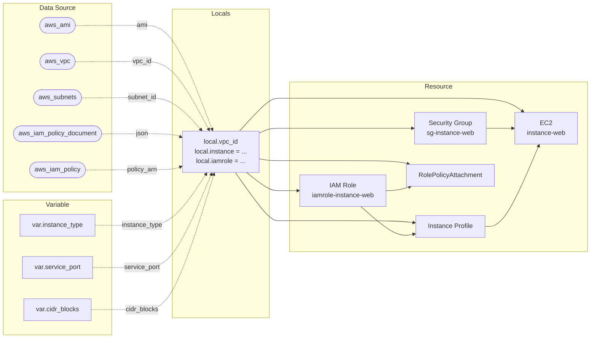

이전 섹션에서 `locals` 블록으로 리소스 설정을 구조화했다. locals에 하드코딩된 값 중에는 배포 시 바꿔야 하는 것과 AWS에서 동적으로 조회해야 하는 것이 있다. 이번 섹션에서는 외부 입력을 받는 `variable` 블록과 기존 인프라를 조회하는 `data source`를 다룬다. 둘 다 locals로 흡수되어 `local → resource` 흐름이 유지된다.

---

# variable 블록

## 1. locals vs variable

02.04에서 locals는 코드 내부에서 값을 정의하고 외부에서 재정의할 수 없다고 했다. `variable`은 반대다. 외부에서 값을 주입받는 입력 파라미터를 선언한다.

| 구분 | `locals` | `variable` |
|------|----------|-----------|
| 값의 출처 | 내부 정의 — 코드가 값을 만든다 | 외부 주입 — 사용자가 값을 준다 |
| 선언 | `locals { 이름 = 값 }` | `variable "이름" { }` |
| 참조 | `local.이름` | `var.이름` |
| 재정의 | 불가 — 코드 안에서만 정의 | `-var`, `.tfvars`, 환경 변수 |
| 용도 | 프로젝트명, 설정 구조화, 값 조합 | 배포 시 달라지는 값 |

`locals`는 "이 값은 안에서 만들겠다"는 선언이고, `variable`은 "이 값은 밖에서 받겠다"는 선언이다. locals에 하드코딩된 값 중 외부에서 바꿀 필요가 있는 것을 variable로 추출한다.

## 2. 블록 구조

```text
variable "이름" {
  type        = 타입
  default     = 기본값
  description = "설명"
}
```

레이블은 하나다. 같은 모듈 안에서 고유해야 하며, `var.이름` 형식으로 참조한다.

```hcl
variable "instance_type" {
  type        = string
  default     = "t3.micro"
  description = "EC2 Instance Type"
}
```

`type`은 변수가 받아들이는 값의 타입을 제한한다. `default`를 선언하면 값을 전달하지 않아도 기본값이 적용된다. `default`가 없으면 apply 시 반드시 값을 전달해야 한다.

## 3. 타입 제약

### ① 기본 타입

| 타입 | 설명 | 예시 |
|------|------|------|
| `string` | 문자열 | `"t3.micro"` |
| `number` | 숫자 | `80` |
| `bool` | 참/거짓 | `true` |

### ② 컬렉션 타입

| 타입 | 설명 | 예시 |
|------|------|------|
| `list(타입)` | 순서 있는 동일 타입 목록 | `["10.0.0.0/16", "192.168.0.0/16"]` |
| `map(타입)` | 키-값 쌍 | `{ web = "t3.micro", api = "t3.small" }` |
| `set(타입)` | 순서 없는 고유 값 목록 | `toset(["a", "b"])` |
| `object({...})` | 속성별 타입 지정 구조체 | `{ name = string, port = number }` |
| `tuple([...])` | 위치별 타입 지정 목록 | `[string, number]` |

`list(string)`은 문자열만 허용하는 목록이다. 타입이 맞지 않으면 plan 전에 오류가 발생한다.

## 4. 값 전달 방법

variable에 값을 전달하는 방법은 여러 가지다. 같은 변수에 여러 곳에서 값이 전달되면 우선순위가 높은 쪽이 적용된다.

| 우선순위 | 방법 | 예시 |
|---------|------|------|
| 1 (최고) | `-var` / `-var-file` 플래그 | `terraform apply -var='instance_type="t3.small"'` |
| 2 | `*.auto.tfvars` 파일 | 자동 로드 (파일명 알파벳순) |
| 3 | `terraform.tfvars` 파일 | 자동 로드 |
| 4 | 환경 변수 | `TF_VAR_instance_type=t3.small` |
| 5 (최저) | `default` 값 | `default = "t3.micro"` |

`-var`와 `-var-file`은 동일 우선순위다. 명령줄에 나열된 순서대로 처리되며, 같은 변수를 여러 번 지정하면 마지막 값이 적용된다. 변수 입력 전략의 심화는 Ch07에서 다룬다.

## 5. validation

`validation` 블록으로 변수의 허용 값을 제한한다. `condition`이 `false`를 반환하면 plan 전에 오류가 발생한다.

```hcl
variable "instance_type" {
  type    = string
  default = "t3.micro"

  validation {
    condition     = contains(["t3.micro", "t3.small", "t3.medium"], var.instance_type)
    error_message = "instance_type은 t3.micro, t3.small, t3.medium 중 하나여야 한다."
  }
}
```

`condition`은 `bool` 표현식이다. 잘못된 값이 인프라에 도달하기 전에 차단하는 것이 목적이다. validation 고급 패턴(`can()`, `regex()`)은 Ch09에서 다룬다.

## 6. 어떤 값을 variable로 추출하는가

locals에 하드코딩된 값 중 모든 것을 variable로 빼는 것이 아니다.

| 기준 | variable로 추출 | locals에 유지 |
|------|----------------|-------------|
| 배포 시 달라질 수 있는 값 | `instance_type`, `service_port`, `cidr_blocks` | |
| 프로젝트 구조를 결정하는 값 | | `name = "web"`, `associate_public_ip_address = true` |
| AWS에서 동적으로 조회할 값 | | → data source로 (이번 섹션 후반) |

`instance_type`은 dev에서 `t3.micro`, prod에서 `t3.small`로 바뀔 수 있다. `service_port`는 앱마다 다르다. 이런 값이 variable 대상이다. `name = "web"`이나 `associate_public_ip_address = true`는 프로젝트 구조를 결정하는 값이므로 locals에 남긴다.

---

# data source 블록

## 1. 개념

data source는 기존 인프라 또는 외부 정보를 읽기 전용으로 조회한다. `resource` 블록이 인프라를 **생성**한다면, `data` 블록은 이미 존재하는 정보를 **읽어온다**.

## 2. 블록 구조

```text
data "타입" "이름" {
  필터/조건 인수
}
```

`data` 키워드 뒤에 타입과 이름을 지정한다. 조회 결과는 `data.타입.이름.속성` 형식으로 참조한다.

```hcl
data "aws_ami" "amazon_linux" {
  most_recent = true

  filter {
    name   = "name"
    values = ["al2023-ami-2023.*-x86_64"]
  }

  owners = ["amazon"]
}

resource "aws_instance" "this" {
  ami = data.aws_ami.amazon_linux.id
}
```

`data.aws_ami.amazon_linux.id`로 조회된 AMI ID를 참조한다.

## 3. plan 시점 확정

data source의 값은 `terraform plan` 시점에 확정된다. resource의 `id`가 `(known after apply)`로 표시되는 것과 달리, data source의 속성은 plan 출력에서 실제 값이 바로 표시된다.

```text
  + resource "aws_instance" "this" {
      + ami           = "ami-0c55b159cbfafe1f0"    ← plan에서 확정
      + id            = (known after apply)         ← apply 후 확정
    }
```

## 4. 자주 쓰는 data source

| Data Source | 용도 | 참조 예시 |
|-------------|------|----------|
| `aws_ami` | AMI ID 조회 | `data.aws_ami.amazon_linux.id` |
| `aws_vpc` | 기존 VPC 정보 조회 | `data.aws_vpc.default.id` |
| `aws_availability_zones` | 가용 영역 목록 조회 | `data.aws_availability_zones.available.names` |
| `aws_subnets` | 조건에 맞는 Subnet 목록 | `data.aws_subnets.default.ids` |
| `aws_iam_policy_document` | IAM 정책 JSON 구조화 작성 | `data.aws_iam_policy_document.assume.json` |
| `aws_iam_policy` | AWS 관리형 정책 조회 | `data.aws_iam_policy.ssm_core.arn` |

## 5. 어떤 값을 data source로 대체하는가

locals에 하드코딩된 값 중 AWS에서 동적으로 조회해야 하는 것을 data source로 대체한다.

| 하드코딩 | data source | 이유 |
|---------|-------------|------|
| `ami = "ami-0c003e98ceffee43e"` | `data.aws_ami.amazon_linux.id` | AMI ID는 리전·시점에 따라 바뀐다 |
| `jsonencode({...assume_role...})` | `data.aws_iam_policy_document` | 정책 JSON을 HCL 구조로 작성 |
| `"arn:aws:iam::aws:policy/..."` | `data.aws_iam_policy` | 관리형 정책의 ARN을 코드에 하드코딩하지 않는다 |

## 6. data source → locals 통합

data source로 조회한 값을 locals object에 통합하면 resource에서의 참조 경로가 통일된다.

```hcl
locals {
  instance = {
    ami           = data.aws_ami.amazon_linux.id   # data source에서
    instance_type = var.instance_type                # variable에서
    vpc_id        = data.aws_vpc.default.id          # data source에서
  }
}

resource "aws_instance" "this" {
  ami           = local.instance.ami
  instance_type = local.instance.instance_type
}
```

resource는 출처를 구분하지 않고 `local.instance.*`로만 접근한다. 이 패턴은 Ch05 모듈에서 그대로 사용된다.

---

# [실습] lab01: variable 추출 및 타입 정의 + `-var` 체험

02.04 lab02의 locals에서 배포 시 달라질 수 있는 값을 variable로 추출한다. string, number, list(string) 세 가지 타입으로 변수를 정의하고, `-var` 플래그로 값을 재정의하면서 SG 규칙이 인프라에 미치는 영향을 체험한다.

### 실습 목표

- locals 하드코딩 값을 variable로 추출 (`instance_type`, `service_port`, `cidr_blocks`)
- string / number / list(string) 타입 정의
- `-var` 플래그로 SG CIDR 변경 → 외부 접속 허용/차단 체험
- `-var` 플래그로 port 변경 → 포트 불일치 체험

---

# 1. 전체 아키텍처



02.04 lab02와 동일한 구성이다. SG ingress의 port와 cidr_blocks가 variable로 외부화된다. `-var` 플래그로 값을 변경하면 SG 규칙이 즉시 반영된다.

---

# 2. 사전 준비

```text
lab01/
├── main.tf
├── locals.tf
├── variables.tf
├── providers.tf
└── outputs.tf
```

**설정:**

- instance_type: **`t3.micro`**
- service_port: **`80`**
- cidr_blocks: **`["127.0.0.0/32"]`** (기본값은 loopback만 허용)

---

# 3. main.tf

02.04 lab02와 동일하다. 리소스는 `local.*`만 참조한다.

---

# 4. locals.tf

```hcl
locals {
  project = "tf-core-lab01"

  instance = {
    name = "web"

    ami                         = "ami-0c003e98ceffee43e"
    instance_type               = var.instance_type
    associate_public_ip_address = true

    allow_access = {
      port        = var.service_port
      cidr_blocks = var.cidr_blocks
    }
  }

  iamrole = {
    name = "instance-web"

    assume_role_policy = jsonencode({
      Version = "2012-10-17"

      Statement = [{
        Action    = "sts:AssumeRole"
        Effect    = "Allow"
        Principal = { Service = "ec2.amazonaws.com" }
      }]
    })

    policy_arn = "arn:aws:iam::aws:policy/AmazonSSMManagedInstanceCore"
  }
}
```

02.04 lab01과 비교하면 `local.instance` object 구조는 유지된다. `instance_type`, `allow_access.port`, `allow_access.cidr_blocks`가 하드코딩에서 `var.*`로 대체된 것뿐이다. resource는 여전히 `local.instance.*`로만 참조한다. `name`, `associate_public_ip_address`, `iamrole` 설정은 프로젝트 구조를 결정하는 값이므로 locals에 남긴다.

---

# 5. variables.tf

```hcl
variable "instance_type" {
  type        = string
  default     = "t3.micro"
  description = "EC2 Instance Type"
}

variable "service_port" {
  type        = number
  default     = 80
  description = "Service Port"
}

variable "cidr_blocks" {
  type        = list(string)
  default     = ["127.0.0.0/32"]
  description = "Security Group Allowed CIDR Blocks"
}
```

세 가지 기본 타입을 사용한다. `instance_type`은 `string`(문자열 하나), `service_port`는 `number`(숫자값), `cidr_blocks`는 `list(string)`(여러 CIDR을 목록으로)이다. 타입이 맞지 않으면 plan 전에 오류가 발생한다.

`cidr_blocks`의 기본값은 loopback 주소만 허용한다. 외부에서 접속할 수 없는 상태로 시작한다.

---

# 6. terraform apply

```bash
$ terraform init && terraform apply
```

```text
...(생략)...

Apply complete! Resources: 5 added, 0 changed, 0 destroyed.
```

---

# 7. SSM 접속 + httpd 설치

02.04 lab02에서 한 것과 같은 방법으로 SSM 접속 후 httpd를 설치한다.

```bash
$ sudo dnf install -y httpd
$ sudo systemctl start httpd
$ curl localhost
```

```text
<!DOCTYPE html>
<html>
  ...(생략)...
  <title>Test Page for the HTTP Server on Amazon Linux</title>
  ...(생략)...
</html>
```

localhost에서는 응답한다. loopback 트래픽은 Security Group을 거치지 않는다.

---

# 8. 외부 접속 확인

```bash
$ terraform output web_endpoint
```

브라우저에서 접속한다. 접속이 되지 않는다. SG ingress가 `127.0.0.0/32`만 허용하기 때문이다. 외부 트래픽은 SG에서 차단된다.

---

# 9. -var로 CIDR 변경

`-var` 플래그로 `cidr_blocks`를 `0.0.0.0/0`으로 변경한다.

```bash
$ terraform apply -var='cidr_blocks=["0.0.0.0/0"]'
```

```text
Terraform will perform the following actions:

  # aws_security_group.this will be updated in-place
  ~ resource "aws_security_group" "this" {
        id   = "sg-xxxxxxxxxxxxxxxxx"
        name = "tf-core-lab01-sg-instance-web"

      ~ ingress {
          ~ cidr_blocks = [
              - "127.0.0.0/32",
              + "0.0.0.0/0",
            ]
            from_port   = 80
            protocol    = "tcp"
            to_port     = 80
        }
    }

Plan: 0 to add, 1 to change, 0 to destroy.
```

`~`는 in-place 업데이트를 의미한다. `cidr_blocks`만 변경되고 나머지 리소스는 그대로 유지된다. `-var` 플래그가 `default` 값(`["127.0.0.0/32"]`)을 재정의한 결과다.

브라우저에서 다시 접속한다. Apache 테스트 페이지가 표시된다.

---

# 10. port 변경 → 포트 불일치

```bash
$ terraform apply -var='cidr_blocks=["0.0.0.0/0"]' -var='service_port=8080'
```

```text
  # aws_security_group.this will be updated in-place
  ~ resource "aws_security_group" "this" {

      ~ ingress {
            cidr_blocks = ["0.0.0.0/0"]
          ~ from_port   = 80 -> 8080
            protocol    = "tcp"
          ~ to_port     = 80 -> 8080
        }
    }

Plan: 0 to add, 1 to change, 0 to destroy.
```

SG ingress 포트가 8080으로 변경된다. 브라우저에서 `http://13.xxx.xxx.xxx:8080`으로 접속한다. 접속이 되지 않는다. httpd는 80 포트에서 리스닝하지만 SG는 8080만 허용한다. SG가 허용하는 포트와 앱이 리스닝하는 포트가 일치해야 트래픽이 도달한다.

---

# 11. terraform destroy

```bash
$ terraform destroy
```

---

# [실습] lab02: variable validation

lab01에 validation을 추가해서 잘못된 값이 인프라에 도달하기 전에 차단한다.

### 실습 목표

- `contains()`로 허용 목록 검사
- 비교 연산자로 범위 검사
- 잘못된 값 입력 시 plan 전 오류 차단 재현

---

# 1. 전체 아키텍처

lab01과 동일한 인프라다. variable에 validation을 추가한다.

---

# 2. 사전 준비

```text
lab02/
├── main.tf
├── locals.tf
├── variables.tf
├── providers.tf
└── outputs.tf
```

---

# 3. main.tf

lab01과 동일하다.

---

# 4. locals.tf

lab01과 동일하다. `local.project`만 `"tf-core-lab02"`로 변경한다.

---

# 5. variables.tf

```hcl
variable "instance_type" {
  type        = string
  default     = "t3.micro"
  description = "EC2 Instance Type (t3.micro, t3.small, t3.medium)"

  validation {
    condition     = contains(["t3.micro", "t3.small", "t3.medium"], var.instance_type)
    error_message = "instance_type은 t3.micro, t3.small, t3.medium 중 하나여야 한다."
  }
}

variable "service_port" {
  type        = number
  default     = 80
  description = "Service Port (1~65535)"

  validation {
    condition     = 1 <= var.service_port && var.service_port <= 65535
    error_message = "service_port는 1~65535 범위여야 한다."
  }
}

variable "cidr_blocks" {
  type        = list(string)
  default     = ["0.0.0.0/0"]
  description = "Security Group Allowed CIDR Blocks"

  validation {
    condition     = length(var.cidr_blocks) > 0
    error_message = "cidr_blocks는 최소 1개 이상의 CIDR을 포함해야 한다."
  }
}
```

`contains()`는 허용 목록에서 값을 검사한다. 비교 연산자(`<=`, `>=`)로 범위를 검사한다. `length()`로 빈 목록을 차단한다.

---

# 6. validation 오류 재현

```bash
$ terraform apply -var='instance_type="t3.xxxlarge"'

# 출력 예
╷
│ Error: Invalid value for variable
│
│ instance_type은 t3.micro, t3.small, t3.medium 중 하나여야 한다.
╵
```

plan조차 실행되지 않는다. 잘못된 값이 인프라에 도달하기 전에 차단된다.

---

# 7. terraform destroy

```bash
$ terraform destroy
```

---

# [실습] lab03: data source + locals 통합

하드코딩된 AMI ID와 IAM 정책 ARN을 data source로 대체하고, 조회 결과를 locals object에 통합한다.

### 실습 목표

- `aws_ami` data source로 최신 Amazon Linux 2023 AMI 조회
- `aws_vpc`, `aws_subnets`로 기존 인프라 조회
- `aws_iam_policy_document`로 IAM assume role policy 구조화
- data source 결과를 locals object에 통합
- resource의 참조 경로가 `local.*`로 통일됨을 확인

---

# 1. 전체 아키텍처



variable과 data source가 locals object에 통합된다. resource는 출처를 구분하지 않고 `local.*`로만 참조한다. 4개 영역(Variable, Data Source, Locals, Resource)이 명확히 분리되어 있다.

---

# 2. 사전 준비

```text
lab03/
├── main.tf
├── locals.tf
├── variables.tf
├── datasources.tf
├── providers.tf
└── outputs.tf
```

`datasources.tf`가 추가된다.

---

# 3. main.tf

lab02와 비교하면 두 줄만 추가되었다:

- SG에 `vpc_id = local.vpc_id` 추가 (default VPC 명시 참조)
- instance에 `subnet_id = local.instance.subnet_id` 추가

나머지 resource 구조는 동일하다. locals가 변경을 흡수하고 resource는 안정적으로 유지된다.

---

# 4. locals.tf

```hcl
locals {
  project = "tf-core-lab03"

  vpc_id = data.aws_vpc.default.id

  instance = {
    name = "web"

    ami                         = data.aws_ami.amazon_linux.id
    instance_type               = var.instance_type
    associate_public_ip_address = true
    subnet_id                   = data.aws_subnets.default.ids[0]

    allow_access = {
      port        = var.service_port
      cidr_blocks = var.cidr_blocks
    }
  }

  iamrole = {
    name = "instance-web"

    assume_role_policy = data.aws_iam_policy_document.ec2_assume_role_policy.json
    policy_arn         = data.aws_iam_policy.aws_ssm_core_policy.arn
  }
}
```

lab02와 비교하면 하드코딩이 data source 참조로 대체된 것뿐이다. `local.instance`와 `local.iamrole` object 구조는 유지된다.

`local.vpc_id`가 concept object 바깥에 독립적으로 존재한다. SG와 instance 양쪽이 vpc_id를 참조하므로, 특정 concept에 넣지 않고 module-level에 둔다. 이 패턴은 Ch05 모듈에서 여러 리소스가 공유하는 값을 module-level variable로 받는 것과 같은 원리다.

data source 결과도 variable과 마찬가지로 locals를 경유한다. resource는 출처를 구분하지 않고 `local.*`로만 접근한다.

---

# 5. variables.tf + datasources.tf

```hcl
# variables.tf
variable "instance_type" {
  type        = string
  default     = "t3.micro"
  description = "EC2 Instance Type (t3.micro, t3.small, t3.medium)"

  validation {
    condition     = contains(["t3.micro", "t3.small", "t3.medium"], var.instance_type)
    error_message = "instance_type은 t3.micro, t3.small, t3.medium 중 하나여야 한다."
  }
}

variable "service_port" {
  type        = number
  default     = 80
  description = "Service Port (1~65535)"

  validation {
    condition     = 1 <= var.service_port && var.service_port <= 65535
    error_message = "service_port는 1~65535 범위여야 한다."
  }
}

variable "cidr_blocks" {
  type        = list(string)
  default     = ["0.0.0.0/0"]
  description = "Security Group Allowed CIDR Blocks"

  validation {
    condition     = length(var.cidr_blocks) > 0
    error_message = "cidr_blocks는 최소 1개 이상의 CIDR을 포함해야 한다."
  }
}
```

```hcl
# datasources.tf
data "aws_ami" "amazon_linux" {
  most_recent = true

  filter {
    name   = "name"
    values = ["al2023-ami-2023.*-x86_64"]
  }

  owners = ["amazon"]
}

data "aws_vpc" "default" {
  default = true
}

data "aws_subnets" "default" {
  filter {
    name   = "vpc-id"
    values = [data.aws_vpc.default.id]
  }
}

data "aws_iam_policy_document" "ec2_assume_role_policy" {
  statement {
    actions = ["sts:AssumeRole"]
    effect  = "Allow"

    principals {
      type        = "Service"
      identifiers = ["ec2.amazonaws.com"]
    }
  }
}

data "aws_iam_policy" "aws_ssm_core_policy" {
  name = "AmazonSSMManagedInstanceCore"
}
```

variable은 lab02에서 확립한 validation을 유지한다. data source는 이전 lab에서 하드코딩되어 있던 값들을 동적 조회로 대체한다. AMI ID를 하드코딩하지 않으면 리전이나 시점이 바뀌어도 최신 AMI를 자동으로 가져온다.

---

# 6. outputs.tf

lab02와 동일한 capability별 object 구조를 유지한다.

---

# 7. terraform apply

```bash
$ terraform init && terraform apply
```

```text
...(생략)...

Apply complete! Resources: 5 added, 0 changed, 0 destroyed.
```

---

# 8. terraform destroy

```bash
$ terraform destroy
```

---

# 핵심 정리

- `variable` 블록으로 외부 입력 파라미터를 선언한다. `var.이름`으로 참조한다
- 값 전달 우선순위: `-var` > `*.auto.tfvars` > `terraform.tfvars` > 환경 변수 > `default`
- `validation` 블록으로 허용 값을 제한하면 plan 전에 잘못된 값을 차단한다
- `data source`는 기존 인프라 정보를 읽기 전용으로 조회한다. plan 시점에 값이 확정된다
- variable과 data source 결과를 locals object에 통합하면 resource의 참조 경로가 `local.*`로 통일된다
- variable로 추출하는 기준: "배포 시 달라질 수 있는 값". data source로 대체하는 기준: "AWS에서 동적으로 조회해야 하는 값"
- 이 `var → local → resource` 흐름은 Ch05 모듈에서 그대로 사용된다

다음 섹션은 Gallery 실습으로, 이번까지 배운 블록을 모두 활용해 EC2에 Gallery 앱을 배포한다.

---

# 참고 자료

- [Input Variables — Terraform 공식 문서](https://developer.hashicorp.com/terraform/language/values/variables)
- [Custom Validation Rules — Terraform 공식 문서](https://developer.hashicorp.com/terraform/language/values/variables#custom-validation-rules)
- [Data Sources — Terraform 공식 문서](https://developer.hashicorp.com/terraform/language/data-sources)
- [aws_ami Data Source — Terraform Registry](https://registry.terraform.io/providers/hashicorp/aws/latest/docs/data-sources/ami)
