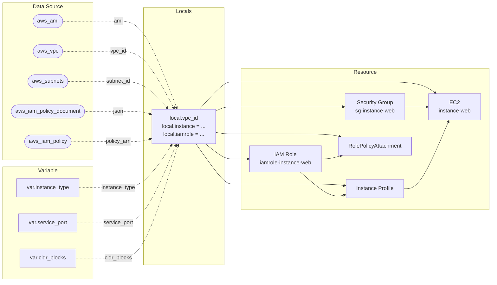

Ch02에서 학습한 HCL 블록을 모두 조합해 EC2에 Gallery 앱을 배포한다. 이번 Gallery에서는 SSM으로 접속해 JDK 설치, 소스 빌드, 앱 실행을 직접 수행한다.

이후 Gallery는 이 코드를 기반으로 챕터마다 누적 발전한다.

| Chapter | Gallery 실습 | 핵심 변화 |
|---------|------------|----------|
| **Ch02** | **EC2에 Gallery 앱 배포** | **최초 배포. EC2 + SG, 수동 설치** |
| Ch04 | user_data 자동화 + Remote Backend | user_data + templatefile + systemd. S3 Remote State |
| Ch05 | ALB + ASG | 3-Layer 모듈, Launch Template + ASG. `ALB:80` |

### 실습 목표

- Ch02에서 학습한 패턴을 하나의 코드베이스에서 종합한다
- SSM Session Manager로 접속해 Gallery 앱을 수동 설치한다
- `web_endpoint` output으로 브라우저 접속을 확인한다

### Ch02 패턴 종합

이 Gallery 코드에 Ch02에서 학습한 패턴이 모두 적용되어 있다.

| 패턴 | 도입 섹션 | 이 코드에서 |
|------|----------|-----------|
| locals object 구조화 | 02.04 | `local.instance`, `local.iamrole` |
| capability 기반 object 이름 | 02.04 | `instance`, `iamrole` |
| `this` 레이블 | 02.04 | 모든 리소스 `aws_*.this` |
| output object 구조화 | 02.04 | `output "instance" { id, public_ip }` |
| module-level local | 02.05 | `local.vpc_id` |
| variable validation | 02.05 | `instance_type`, `service_port`, `cidr_blocks` |
| data source → locals 통합 | 02.05 | AMI, VPC, Subnet, IAM policy |
| `default_tags` | 02.02 | Project, ManagedBy |
| SSM 접속 패턴 | 02.03 | IAM Role + SSM, SSH ingress 없음 |

---

# 1. 전체 아키텍처



02.05 lab03과 동일한 4영역 구조다. variable과 data source가 locals에 통합되고, resource는 `local.*`로만 참조한다. `local.project`(`tf-core-gallery`)가 모든 리소스 이름의 접두어가 된다.

---

# 2. 사전 준비

- Ch02 Sec02~05 완료
- AWS credentials 설정 완료

```text
Gallery/
├── main.tf
├── locals.tf
├── variables.tf
├── datasources.tf
├── providers.tf
└── outputs.tf
```

**설정:**

- region: **`ap-northeast-2`**
- instance_type: **`t3.small`** (Maven 빌드 메모리 여유)
- service_port: **`8080`** (Gallery 앱 포트)

---

# 3. main.tf

```hcl
resource "aws_iam_role" "this" {
  name               = "${local.project}-iamrole-${local.iamrole.name}"
  assume_role_policy = local.iamrole.assume_role_policy

  tags = {
    Name = "${local.project}-iamrole-${local.iamrole.name}"
  }
}

resource "aws_iam_instance_profile" "this" {
  name = "${local.project}-iamprofile-${local.iamrole.name}"
  role = aws_iam_role.this.name

  tags = {
    Name = "${local.project}-iamprofile-${local.iamrole.name}"
  }
}

resource "aws_iam_role_policy_attachment" "this" {
  role       = aws_iam_role.this.name
  policy_arn = local.iamrole.policy_arn
}

resource "aws_security_group" "this" {
  name   = "${local.project}-sg-instance-${local.instance.name}"
  vpc_id = local.vpc_id

  ingress {
    from_port   = local.instance.allow_access.port
    to_port     = local.instance.allow_access.port
    protocol    = "tcp"
    cidr_blocks = local.instance.allow_access.cidr_blocks
  }
  egress {
    from_port   = 0
    to_port     = 0
    protocol    = "-1"
    cidr_blocks = ["0.0.0.0/0"]
  }

  tags = {
    Name = "${local.project}-sg-instance-${local.instance.name}"
  }
}

resource "aws_instance" "this" {
  ami                         = local.instance.ami
  instance_type               = local.instance.instance_type
  associate_public_ip_address = local.instance.associate_public_ip_address
  subnet_id                   = local.instance.subnet_id

  vpc_security_group_ids = [aws_security_group.this.id]
  iam_instance_profile   = aws_iam_instance_profile.this.name

  depends_on = [aws_iam_role_policy_attachment.this]

  tags = {
    Name = "${local.project}-instance-${local.instance.name}"
  }
}
```

02.05 lab03과 동일한 구조다. 모든 리소스 레이블이 `this`이고, 설정값은 `local.*`에서만 온다. `user_data`가 없다. 이번 Gallery에서는 SSM으로 접속해 수동으로 앱을 설치한다.

---

# 4. locals.tf

```hcl
locals {
  project = "tf-core-gallery"

  vpc_id = data.aws_vpc.default.id

  instance = {
    name = "web"

    ami                         = data.aws_ami.amazon_linux.id
    instance_type               = var.instance_type
    associate_public_ip_address = true
    subnet_id                   = data.aws_subnets.default.ids[0]

    allow_access = {
      port        = var.service_port
      cidr_blocks = var.cidr_blocks
    }
  }

  iamrole = {
    name = "instance-web"

    assume_role_policy = data.aws_iam_policy_document.ec2_assume_role_policy.json
    policy_arn         = data.aws_iam_policy.aws_ssm_core_policy.arn
  }
}
```

02.05 lab03과 동일한 패턴이다. `local.vpc_id`가 module-level, `local.instance`와 `local.iamrole`이 capability별 object. variable 값과 data source 값이 하나의 object에 통합된다. `local.project`는 `"tf-core-gallery"`로 Gallery 전용 식별자다.

---

# 5. variables.tf + datasources.tf

```hcl
# variables.tf
variable "instance_type" {
  type        = string
  default     = "t3.micro"
  description = "EC2 Instance Type (t3.micro, t3.small, t3.medium)"

  validation {
    condition     = contains(["t3.micro", "t3.small", "t3.medium"], var.instance_type)
    error_message = "instance_type은 t3.micro, t3.small, t3.medium 중 하나여야 한다."
  }
}

variable "service_port" {
  type        = number
  default     = 8080
  description = "Service Port (1~65535)"

  validation {
    condition     = 1 <= var.service_port && var.service_port <= 65535
    error_message = "service_port는 1~65535 범위여야 한다."
  }
}

variable "cidr_blocks" {
  type        = list(string)
  default     = ["0.0.0.0/0"]
  description = "Security Group Allowed CIDR Blocks"

  validation {
    condition     = length(var.cidr_blocks) > 0
    error_message = "cidr_blocks는 최소 1개 이상의 CIDR을 포함해야 한다."
  }
}
```

```hcl
# datasources.tf
data "aws_vpc" "default" {
  default = true
}

data "aws_subnets" "default" {
  filter {
    name   = "vpc-id"
    values = [data.aws_vpc.default.id]
  }
}

data "aws_iam_policy_document" "ec2_assume_role_policy" {
  statement {
    actions = ["sts:AssumeRole"]
    effect  = "Allow"

    principals {
      type        = "Service"
      identifiers = ["ec2.amazonaws.com"]
    }
  }
}

data "aws_iam_policy" "aws_ssm_core_policy" {
  name = "AmazonSSMManagedInstanceCore"
}

data "aws_ami" "amazon_linux" {
  most_recent = true

  filter {
    name   = "name"
    values = ["al2023-ami-2023.*-x86_64"]
  }

  owners = ["amazon"]
}
```

variable 3개에 모두 validation이 적용된다. `service_port`의 기본값이 `8080`이다. Gallery 앱이 8080에서 리스닝하기 때문이다. data source 5개가 AMI, VPC, Subnet, IAM trust policy, SSM 관리형 정책을 동적으로 조회한다.

---

# 6. outputs.tf

```hcl
output "instance" {
  value = {
    id        = aws_instance.this.id
    public_ip = aws_instance.this.public_ip
  }
}

output "web_endpoint" {
  value = "http://${aws_instance.this.public_ip}:${local.instance.allow_access.port}"
}
```

`web_endpoint`가 Gallery 앱 접속 URL이다. apply 후 이 값으로 브라우저에서 바로 접속한다.

---

# 7. providers.tf

```hcl
terraform {
  required_version = ">=1.14.0"

  required_providers {
    aws = {
      source  = "hashicorp/aws"
      version = "~> 6.0"
    }
  }
}

provider "aws" {
  region = "ap-northeast-2"

  default_tags {
    tags = {
      Project   = local.project
      ManagedBy = "Terraform"
    }
  }
}
```

---

# 8. terraform apply

```bash
$ terraform init && terraform apply
```

```text
...(생략)...

Apply complete! Resources: 5 added, 0 changed, 0 destroyed.

Outputs:

instance = {
  "id" = "i-0abc1234567890def"
  "public_ip" = "13.xxx.xxx.xxx"
}
web_endpoint = "http://13.xxx.xxx.xxx:8080"
```

5개 리소스가 생성된다. `user_data`가 없으므로 EC2는 빈 Amazon Linux 상태로 시작된다.

---

# 9. Gallery 앱 수동 설치

Terraform이 인프라를 생성했지만 앱은 아직 설치되지 않았다. SSM Session Manager로 접속해 직접 설치한다.

## 인스턴스 접속

[콘솔화면: AWS Console > EC2 > Instances > tf-core-gallery-instance-web 선택 > Connect > Session Manager 탭 > Connect 버튼]

SSM Agent가 준비되기까지 약 1~2분 소요된다. Connect 버튼이 비활성 상태라면 잠시 기다린 후 새로고침한다.

## JDK 21 + git 설치

```bash
$ sudo dnf install -y java-21-amazon-corretto-headless git
```

## 소스 클론

```bash
$ git clone --filter=blob:none --sparse https://github.com/kickscar/learning-series.git ~/workspace
$ cd ~/workspace
$ git sparse-checkout init --no-cone
$ git sparse-checkout set Cloud/Workloads/gallery-spring-boot
```

`--filter=blob:none --sparse`로 파일 내용을 즉시 다운로드하지 않고, `git sparse-checkout set`으로 Gallery 앱 디렉토리만 가져온다.

## Maven 빌드

```bash
$ cd Cloud/Workloads/gallery-spring-boot
$ chmod +x ./mvnw
$ ./mvnw clean package -DskipTests -Dbuild.finalName=gallery
```

```text
...(생략)...
[INFO] BUILD SUCCESS
```

`instance_type`을 `t3.small`로 설정한 이유가 이 단계에 있다. Maven 빌드는 메모리를 상당히 사용하므로 `t3.micro`(1 GiB)로는 부족하다.

## 앱 실행

```bash
$ java -jar target/gallery.jar --server.port=8080
```

```text
...(생략)...
Tomcat started on port 8080 (http)
Started GalleryApplication in x.xxx seconds
```

기본 프로파일로 실행된다. H2 인메모리 DB, 로컬 파일 스토리지를 사용한다. foreground 실행이므로 터미널을 닫거나 Ctrl+C를 누르면 앱이 종료된다.

---

# 10. 결과 확인

```bash
$ terraform output web_endpoint
```

```text
"http://13.xxx.xxx.xxx:8080"
```

브라우저에서 해당 주소로 접속한다.

[콘솔화면: 브라우저 > http://{public_ip}:8080 > Gallery 앱 메인 화면]

Gallery 메인 화면이 표시되면 배포가 성공한 것이다.

---

# 11. 정리

SSM 터미널에서 Ctrl+C로 앱을 종료한다. Terraform으로 인프라를 정리한다.

```bash
$ terraform destroy
```

```text
...(생략)...

Destroy complete! Resources: 5 destroyed.
```

다음 Gallery(Ch04)에서는 이 코드를 기반으로 `user_data` + `templatefile`로 설치를 자동화하고, systemd 서비스로 앱을 등록하며, S3 Remote Backend를 추가한다.

---

# 핵심 정리

- Ch02의 모든 HCL 블록(`provider`, `variable`, `locals`, `data`, `resource`, `output`)을 하나의 코드베이스에서 조합했다
- `local.instance` + `local.iamrole` object로 설정을 구조화하고, `local.vpc_id`를 module-level에 뒀다
- resource는 `local.*`로만 참조한다. variable이든 data source든 출처를 구분하지 않는다
- `default_tags`로 Project, ManagedBy 태그를 자동 주입하고 리소스 태그에는 Name만 선언했다
- `variable validation`으로 모든 변수의 허용 값을 제한했다
- IAM Role + SSM 패턴으로 SSH ingress 없이 인스턴스에 접속했다
- `web_endpoint` output으로 브라우저 접속 URL을 바로 확인했다

---

# 참고 자료

- [aws_ami Data Source — Terraform Registry](https://registry.terraform.io/providers/hashicorp/aws/latest/docs/data-sources/ami)
- [aws_instance Resource — Terraform Registry](https://registry.terraform.io/providers/hashicorp/aws/latest/docs/resources/instance)
- [AWS Systems Manager Session Manager](https://docs.aws.amazon.com/systems-manager/latest/userguide/session-manager.html)
