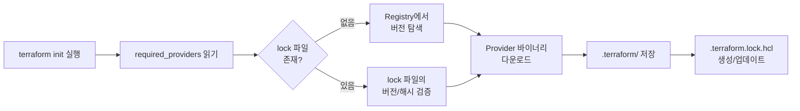
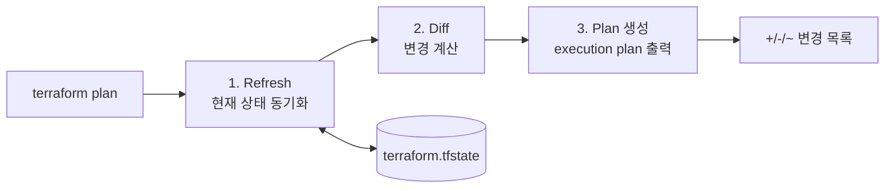
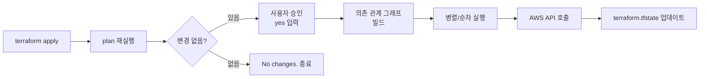
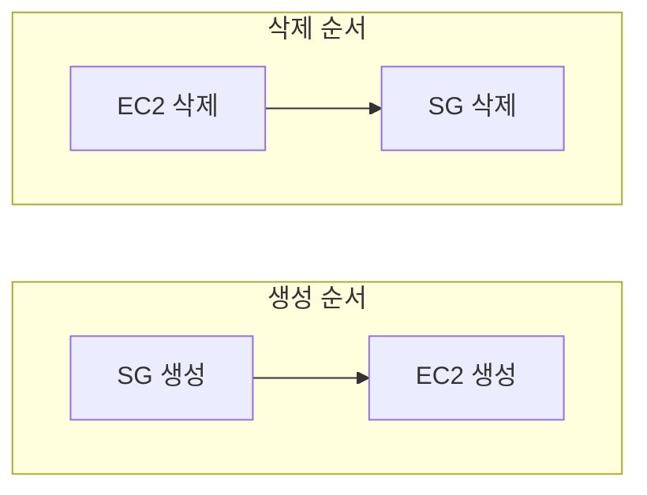

Ch02에서 HCL 블록을 작성하고 plan → apply → destroy를 반복적으로 실행했다. 이번 챕터에서는 각 명령이 내부적으로 무슨 일을 하는지 들여다본다. 동작 원리를 이해하면 오류가 발생했을 때 무엇이 잘못됐는지 진단할 수 있다.

---

# terraform init

`terraform init`은 작업 디렉터리를 초기화한다. `.tf` 파일을 읽고 `required_providers`에 선언된 Provider를 Terraform Registry에서 다운로드한다.

## 1. 초기화 흐름



lock 파일이 이미 있으면 Registry 탐색 없이 고정된 버전을 다운로드한다. 버전 제약(`>= 6.0`)은 최초 init 시 최신 호환 버전을 선택하는 데만 사용되고, 이후에는 lock 파일의 버전이 우선한다.

Ch02에서 매 lab마다 `terraform init`을 실행했지만, 전역 플러그인 캐시(`plugin_cache_dir`)를 설정해두었기 때문에 Provider를 반복 다운로드하지 않았다. 캐시 설정은 Ch01 Sec02에서 다뤘다.

## 2. .terraform/ 디렉토리 구조

```text
.terraform/
└── providers/
    └── registry.terraform.io/
        └── hashicorp/
            └── aws/
                └── 6.x.x/
                    └── darwin_arm64/
                        └── terraform-provider-aws_v6.x.x_x5
```

Provider 바이너리는 `registry.terraform.io/{네임스페이스}/{이름}/{버전}/{OS_아키텍처}/` 경로에 저장된다. 같은 머신에서 여러 프로젝트가 같은 Provider 버전을 사용해도 `.terraform/`은 프로젝트마다 별도로 유지한다.

`.terraform/` 디렉토리는 `.gitignore`에 추가한다. 바이너리 파일이므로 Git으로 관리하지 않는다.

## 3. .terraform.lock.hcl

```hcl
provider "registry.terraform.io/hashicorp/aws" {
  version     = "6.1.0"
  constraints = ">= 6.0"
  hashes = [
    "h1:abc123...",
    "zh:def456...",
  ]
}
```

lock 파일은 세 가지 정보를 고정한다.

| 항목 | 역할 |
|------|------|
| `version` | 실제 선택된 정확한 버전 |
| `constraints` | `required_providers`에 선언한 버전 제약 (기록용) |
| `hashes` | 바이너리 무결성 검증 해시 |

### ① 버전 고정

lock 파일이 있으면 다음 `init`에서 같은 버전을 설치한다. 팀 전원이 동일한 Provider 버전을 사용하게 된다. Ch02 Sec02 lab01에서 `terraform init -upgrade` 없이 version constraint를 변경하면 lock 파일과 충돌해 오류가 발생하는 것을 확인했다.

### ② 해시 검증

`hashes`는 Provider 바이너리의 무결성을 검증한다. 다운로드한 바이너리의 해시가 lock 파일에 기록된 값과 일치하지 않으면 init이 실패한다. 공급망 공격(supply chain attack)을 방지하는 메커니즘이다.

### ③ VCS 관리

`.terraform.lock.hcl`은 **Git에 커밋**한다. `.terraform/` 디렉토리는 `.gitignore`에 추가한다.

| 파일/디렉토리 | Git 관리 | 이유 |
|-------------|---------|------|
| `.terraform.lock.hcl` | 커밋 | 팀 전원 동일 버전 보장, 해시 무결성 |
| `.terraform/` | `.gitignore` | 바이너리 파일, `init`으로 재생성 가능 |

## 4. init이 필요한 시점

| 상황 | 이유 |
|------|------|
| 새 프로젝트 시작 | `.terraform/`이 없다 |
| `required_providers` 변경 | 새 Provider 또는 버전 변경 |
| Backend 설정 변경 | Remote Backend 전환 시 (Ch04) |
| 모듈 추가/변경 | 모듈 소스 다운로드 필요 (Ch06) |

이미 초기화된 디렉터리에서 `init`을 다시 실행해도 안전하다 — 기존 설정을 덮어쓰지 않고 필요한 부분만 업데이트한다.

## 5. -upgrade 플래그

```bash
$ terraform init -upgrade
```

lock 파일의 버전을 무시하고 version constraint 범위 내 최신 버전으로 갱신한다. Provider 버전을 올릴 때 사용한다. `-upgrade` 없이 constraint만 변경하면 lock 파일과 충돌해 오류가 발생한다.

---

# terraform plan

`terraform plan`은 코드와 현재 인프라 상태를 비교해 **무엇을 할지** 미리 계산한다. 실제 인프라는 변경하지 않는다.

## 1. 세 단계 흐름



plan은 내부적으로 Refresh → Diff → Plan 생성의 세 단계를 거친다. 각 단계는 명확한 역할이 있다.

### ① Refresh — 현재 상태 동기화

Terraform은 `terraform.tfstate`에 기록된 리소스를 실제 클라우드에 조회해 현재 상태를 확인한다. 콘솔에서 수동으로 변경한 값이 있으면 이 단계에서 반영된다.

State에 없는 리소스(직접 콘솔에서 생성한 것)는 이 단계에서 조회 대상이 아니다 — Terraform이 관리하는 리소스만 확인한다.

### ② Diff — 변경 계산

refresh로 확인한 현재 상태와 `.tf` 파일에 선언한 원하는 상태를 비교한다. 차이가 있는 리소스를 분류한다.

| 기호 | 의미 | 설명 |
|------|------|------|
| `+` | 생성 | 코드에 있고 State에 없는 리소스 |
| `-` | 삭제 | State에 있고 코드에 없는 리소스 |
| `~` | 수정 (in-place) | 코드와 State의 인수 값이 다른 리소스 |
| `-/+` | 삭제 후 재생성 | 변경 불가 인수가 바뀐 리소스 |

Ch02 Sec04 lab01에서 `-var`로 `allowed_cidrs`를 변경했을 때 `~`(in-place 수정)가 출력된 것을 떠올리면 된다. 반면 `ami` 같은 인수는 변경 시 기존 EC2를 수정할 수 없어 삭제 후 재생성(`-/+`)이 발생한다.

### ③ Plan 생성

변경 목록을 사람이 읽기 좋은 형태로 출력하고, 내부적으로 실행 순서를 담은 execution plan을 생성한다.

## 2. -refresh=false

```bash
$ terraform plan -refresh=false
```

Refresh 단계를 건너뛴다. 클라우드 API 호출 없이 State 파일과 코드만 비교한다. 리소스가 많을 때 속도가 빠르지만, 콘솔에서 수동 변경한 내용이 반영되지 않는다.

## 3. plan 파일 저장

```bash
# plan 결과를 바이너리 파일로 저장
$ terraform plan -out=tfplan
```

실행 계획을 파일로 저장한다. 저장된 plan은 이후 `terraform apply`에 전달해 동일한 계획을 재실행할 수 있다. plan을 검토한 뒤 정확히 같은 변경을 apply하는 패턴이다 — CI/CD 파이프라인에서 자주 사용한다.

---

# terraform apply

`terraform apply`는 plan을 실행해 실제 인프라를 생성·수정·삭제한다.

## 1. 실행 흐름



`terraform apply`를 실행하면 내부적으로 plan을 다시 계산한다. 변경이 있으면 사용자 승인을 요청하고, 승인 후 실제 인프라를 변경한다.

## 2. 저장된 plan 적용

```bash
# plan 결과를 파일로 저장
$ terraform plan -out=tfplan

# 저장된 plan을 그대로 적용 (승인 불필요)
$ terraform apply tfplan
```

저장된 plan 파일을 전달하면 plan을 다시 계산하지 않고 파일에 기록된 변경을 바로 실행한다. 승인 프롬프트도 없다. CI/CD에서 "plan 검토 → 승인 → apply" 파이프라인을 구성할 때 이 방식을 사용한다.

## 3. 의존 관계 그래프와 병렬 실행

Terraform은 리소스 간 참조 표현식을 분석해 의존 관계 그래프(DAG, Directed Acyclic Graph)를 빌드한다. 서로 의존하지 않는 리소스는 병렬로 생성해 실행 시간을 줄인다.

```hcl
resource "aws_security_group" "instance_web" { ... }      # 독립

resource "aws_instance" "web" {
  vpc_security_group_ids = [aws_security_group.instance_web.id]  # SG에 의존
}
```

`aws_security_group.instance_web`이 완료된 후에야 `aws_instance.web`을 생성한다. Ch02 Sec03 lab02에서 apply 출력을 보면 SG가 먼저 생성되고 EC2가 뒤따르는 것을 확인할 수 있었다.

반대로 Ch02 Sec03 lab03에서 IAM Role, Security Group, IAM Role Policy Attachment는 서로 독립적이므로 동시에 생성되었다. 독립적인 리소스가 많을수록 병렬 처리로 전체 apply 시간이 줄어든다.

의존 관계 그래프의 구조와 시각화(`terraform graph`)는 다음 섹션(Sec02)에서 다룬다.

## 4. State 기록

apply 완료 후 `terraform.tfstate`가 업데이트된다. 각 리소스의 실제 ID(`i-0abc...`, `sg-0xyz...`)와 속성이 기록된다. 다음 plan/apply 시 이 State를 기준으로 Refresh를 수행한다.

---

# terraform destroy

`terraform destroy`는 State에 기록된 리소스를 모두 삭제한다. apply의 역방향 실행이다.

## 1. State 기반 삭제

내부적으로 destroy는 모든 리소스에 `-` 변경을 적용하는 특수한 plan이다. plan과 동일하게 삭제 목록을 먼저 보여주고 승인을 요청한다.

```bash
$ terraform destroy
# 또는 특정 리소스만 삭제
$ terraform destroy -target=aws_instance.web
```

State에 없는 리소스(직접 콘솔에서 생성한 것)는 건드리지 않는다. `-target`은 특정 리소스만 삭제할 때 사용하지만, 의존 관계를 무시할 수 있어 주의가 필요하다.

## 2. 의존 관계 역순 삭제

생성의 역순으로 삭제한다. `aws_instance.web`이 `aws_security_group.instance_web`을 참조한다면, EC2를 먼저 삭제한 뒤 Security Group을 삭제한다. SG가 EC2에 연결된 상태에서 SG를 먼저 삭제하면 AWS API 오류가 발생하기 때문이다.



Terraform이 의존 관계 그래프를 역전(reverse)해 삭제 순서를 결정한다. Ch02 Sec03 lab03의 destroy 출력에서 EC2 → Instance Profile → SG → Policy Attachment → IAM Role 순으로 삭제된 것이 이 메커니즘의 결과다.

---

# terraform.tfstate와 실제 인프라

## 1. State의 역할

`terraform.tfstate`는 Terraform이 관리하는 인프라의 현재 상태를 JSON 형식으로 기록한 파일이다.

```json
{
  "version": 4,
  "resources": [
    {
      "type": "aws_instance",
      "name": "web",
      "instances": [
        {
          "attributes": {
            "id": "i-0abc1234567890def",
            "ami": "ami-024ea438ab0376a47",
            "instance_type": "t3.micro",
            "public_ip": "13.125.xxx.xxx"
          }
        }
      ]
    }
  ]
}
```

State는 세 가지 역할을 한다.

| 역할 | 설명 |
|------|------|
| 변경 감지 기준 | plan 시 현재 상태와 비교해 diff를 계산 |
| 리소스 추적 | AWS 리소스 ID와 Terraform 코드의 리소스 블록을 연결 |
| 의존 관계 기록 | 리소스 간 참조 관계를 State에도 유지 |

Ch02 Sec03 lab01에서 `terraform apply` 후 `terraform.tfstate` 파일이 생성된 것을 확인했다. 그 파일에 Security Group의 `id`와 `name`이 기록되어 있었다.

## 2. State 불일치 문제

State와 실제 인프라가 일치하지 않으면 Terraform은 잘못된 판단을 한다.

| 불일치 상황 | Terraform의 반응 |
|------------|-----------------|
| 콘솔에서 리소스 수동 삭제 | plan 시 재생성 시도 |
| 콘솔에서 속성 수동 변경 | plan 시 코드 값으로 되돌리려 시도 |
| State 파일 분실 | 기존 리소스를 모르고 중복 생성 시도 |

Ch02 실습에서는 `terraform destroy`로 매번 리소스를 정리했기 때문에 State 불일치가 발생하지 않았다. 팀 환경에서 State가 어떻게 저장되고 공유되는지, 불일치를 어떻게 해결하는지는 **Ch04 State Management**에서 깊게 다룬다.

---

# 핵심 정리

- `terraform init`은 lock 파일 기반으로 Provider를 다운로드하고 `.terraform/`에 저장한다. `.terraform.lock.hcl`은 Git에 커밋한다.
- `terraform plan`은 Refresh → Diff → Plan 생성의 세 단계를 거친다. Refresh에서 실제 인프라 상태를 확인하고, Diff에서 코드와 비교한다.
- plan 결과를 파일로 저장(`-out=tfplan`)해 apply에 전달하면 동일한 계획을 재실행할 수 있다 — CI/CD 표준 패턴이다.
- `terraform apply`는 의존 관계 그래프를 빌드해 순서와 병렬성을 결정하고, 완료 후 State를 업데이트한다.
- `terraform destroy`는 State 기반으로 의존 관계의 역순으로 삭제한다.
- `terraform.tfstate`는 Terraform이 관리하는 인프라의 현재 상태다 — State와 실제 인프라의 불일치는 예상치 못한 동작을 유발한다.

다음 섹션에서는 의존 관계 그래프의 구조를 시각화하고, 병렬 실행과 `-target` 옵션을 다룬다.

---

# 참고 자료

- [terraform init — Terraform 공식 문서](https://developer.hashicorp.com/terraform/cli/commands/init)
- [terraform plan — Terraform 공식 문서](https://developer.hashicorp.com/terraform/cli/commands/plan)
- [terraform apply — Terraform 공식 문서](https://developer.hashicorp.com/terraform/cli/commands/apply)
- [terraform destroy — Terraform 공식 문서](https://developer.hashicorp.com/terraform/cli/commands/destroy)
- [Dependency Lock File — Terraform 공식 문서](https://developer.hashicorp.com/terraform/language/files/dependency-lock)
- [State — Terraform 공식 문서](https://developer.hashicorp.com/terraform/language/state)
