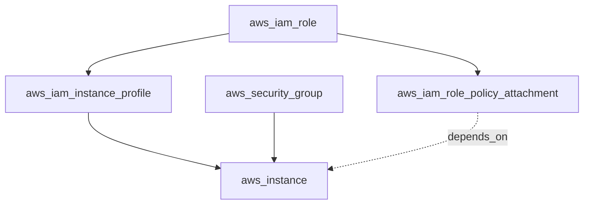
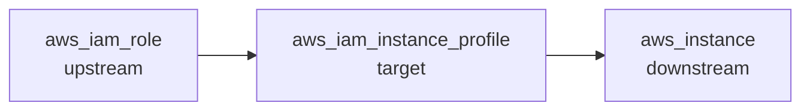
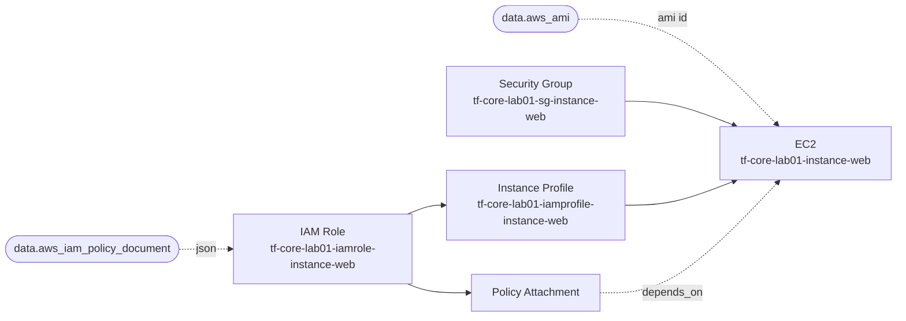

이전 섹션에서 `init → plan → apply → destroy` 각 단계의 내부 동작을 살펴봤다. 이번 섹션에서는 Terraform이 리소스 간 의존 관계를 어떻게 파악하고, 이를 기반으로 실행 순서와 병렬성을 결정하는지 다룬다.

---

# 의존 관계 그래프

## 1. DAG

Terraform은 리소스 간 의존 관계를 **DAG(Directed Acyclic Graph)** — 방향이 있고 순환이 없는 그래프 — 로 표현한다. 각 리소스가 노드이고, 의존 관계가 엣지(edge)다.



실선 화살표는 참조 표현식에 의한 암묵적 의존성이다. 점선은 `depends_on`으로 선언한 명시적 의존성이다. IAM Role이 완료되어야 Policy Attachment와 Instance Profile이 생성되고, 이 모두가 완료된 후 EC2가 생성된다. SG는 IAM 체인과 독립적이므로 병렬로 생성된다.

순환(cycle)이 있으면 실행 순서를 결정할 수 없다. Terraform은 그래프 빌드 시 순환을 감지하면 오류를 발생시킨다.

## 2. 그래프 빌드 과정

Terraform은 내부적으로 다음 순서로 그래프를 빌드한다.

### ① 노드 생성

`.tf` 파일의 `resource`, `data`, `module` 블록을 각각 노드로 추가한다. State에 있지만 코드에서 제거된 리소스(orphan)도 포함한다.

### ② 의존성 엣지 생성

- **암묵적 의존성**: 참조 표현식(`aws_iam_role.this.name` 등)을 파싱해 자동으로 엣지를 생성한다.
- **명시적 의존성**: `depends_on`에 선언된 리소스에 대한 엣지를 추가한다.

### ③ 검증

그래프가 비순환(acyclic) 구조인지 확인한다. 순환이 발견되면 plan이 실패한다.

## 3. 암묵적 의존성과 명시적 의존성

Ch02 Sec03에서 두 의존성을 다뤘다. 여기서는 성능 관점을 보강한다.

`depends_on`을 사용하면 Terraform은 보수적인 실행 계획을 생성한다. 의존 대상의 값이 `(known after apply)`로 처리되어 불필요한 리소스 교체가 발생할 수 있다. 참조 표현식으로 해결할 수 있으면 항상 암묵적 의존성을 우선 사용한다.

| 의존성 유형 | 생성 방식 | 성능 영향 |
|------------|----------|----------|
| 암묵적 | 참조 표현식 파싱 | 최적 — 필요한 값만 추적 |
| 명시적 (`depends_on`) | 수동 선언 | 보수적 — 불필요한 교체 가능 |

`depends_on`이 필요한 상황은 Ch02 Sec03 lab03에서 다룬 IAM Policy Attachment처럼, 참조 표현식으로 표현할 수 없는 부수 효과(side effect) 의존성뿐이다.

---

# terraform graph

`terraform graph`는 의존 관계 그래프를 DOT 형식으로 출력한다. Graphviz로 시각화할 수 있다.

## 1. 기본 사용

```bash
$ terraform graph
```

```text
digraph G {
  rankdir = "RL"
  "aws_iam_instance_profile.this" -> "aws_iam_role.this"
  "aws_iam_role.this" -> "data.aws_iam_policy_document.ec2_assume_role"
  "aws_iam_role_policy_attachment.this" -> "aws_iam_role.this"
  "aws_iam_role_policy_attachment.this" -> "data.aws_iam_policy.aws_ssm_core_policy"
  "aws_instance.this" -> "aws_iam_instance_profile.this"
  "aws_instance.this" -> "aws_iam_role_policy_attachment.this"
  "aws_instance.this" -> "aws_security_group.this"
  "aws_instance.this" -> "data.aws_ami.amazon_linux"
}
```

타입을 지정하지 않으면 리소스와 data source의 의존 관계만 보여주는 단순화된 그래프가 출력된다. `->` 화살표가 의존 관계 방향이다. `aws_instance.this -> aws_security_group.this`은 EC2가 SG에 의존한다는 뜻이다.

## 2. -type 옵션

```bash
$ terraform graph -type=plan
```

| 타입 | 설명 |
|------|------|
| (미지정) | 리소스·data source 의존 관계만 (단순) |
| `plan` | plan 단계의 상세 그래프 (Provider 노드 포함) |
| `apply` | apply 단계의 상세 그래프 |
| `plan-destroy` | destroy plan의 그래프 |

`-type`을 지정하면 Provider Configuration 노드 등 내부 구현 세부사항이 함께 출력된다. 학습 단계에서는 기본 그래프(타입 미지정)로 충분하다.

## 3. Graphviz 시각화

DOT 출력을 Graphviz의 `dot` 명령으로 이미지로 변환한다.

```bash
# SVG 파일로 변환
$ terraform graph | dot -Tsvg > graph.svg

# PNG 파일로 변환
$ terraform graph | dot -Tpng > graph.png
```

Graphviz가 설치되어 있어야 한다.

```bash
# macOS
$ brew install graphviz

# Linux (apt)
$ sudo apt install graphviz
```

---

# 병렬 실행

## 1. 독립 리소스 동시 처리

Terraform은 DAG에서 서로 의존하지 않는 리소스를 병렬로 처리한다. 앞 섹션의 예시에서 `aws_security_group.this`과 `aws_iam_role.this`은 서로 독립적이므로 동시에 생성된다.

```text
aws_iam_role.this: Creating...
aws_security_group.this: Creating...          ← 동시 시작
aws_iam_role.this: Creation complete after 1s
aws_iam_role_policy_attachment.this: Creating...  ← Role 완료 후
aws_iam_instance_profile.this: Creating...            ← Role 완료 후
aws_security_group.this: Creation complete after 2s
aws_iam_role_policy_attachment.this: Creation complete after 1s
aws_iam_instance_profile.this: Creation complete after 1s
aws_instance.this: Creating...                         ← 모든 의존성 완료 후
aws_instance.this: Creation complete after 23s
```

Ch02 Sec03 lab03의 apply 출력과 같은 패턴이다. Role과 SG가 동시에 시작되고, 모든 의존성이 완료된 후 EC2가 생성된다.

## 2. -parallelism

```bash
$ terraform apply -parallelism=5
```

동시에 실행할 수 있는 최대 작업 수를 지정한다. 기본값은 **10**이다. `plan`, `apply`, `destroy` 모두에 사용할 수 있다.

리소스가 수십~수백 개인 대규모 환경에서 API rate limit에 걸릴 때 값을 낮추거나, 독립 리소스가 많을 때 값을 높여 apply 속도를 조절한다.

---

# -target

## 1. 특정 리소스 대상 실행

```bash
$ terraform plan -target=aws_security_group.this
$ terraform apply -target=aws_security_group.this
```

`-target`은 지정한 리소스와 그 **upstream 의존성**(대상이 의존하는 리소스)만 처리한다.

## 2. upstream과 downstream



`-target=aws_iam_instance_profile.this`을 지정하면:

- **upstream** (`aws_iam_role`): 함께 처리된다 — target이 의존하는 리소스이므로 먼저 생성해야 한다.
- **downstream** (`aws_instance`): 처리되지 않는다 — target에 의존하는 리소스는 건너뛴다.

downstream이 처리되지 않으므로 인프라 불일치가 발생할 수 있다. Terraform은 `-target` 사용 시 경고를 출력한다.

```text
Warning: Resource targeting is in effect
...
Applied changes may be incomplete
```

`-target`은 디버깅이나 긴급 수정 같은 예외적 상황에서만 사용한다. 일상적인 워크플로우에서는 전체 리소스를 대상으로 plan/apply를 실행하는 것이 원칙이다.

---

# 핵심 정리

- Terraform은 리소스 의존 관계를 **DAG**(방향 비순환 그래프)로 표현한다. 순환이 있으면 plan이 실패한다.
- 참조 표현식이 **암묵적 의존성**을, `depends_on`이 **명시적 의존성**을 생성한다. 암묵적 의존성이 성능 면에서 우월하다.
- `terraform graph`로 DOT 형식의 의존 관계 그래프를 출력하고, Graphviz로 시각화한다.
- 독립적인 리소스는 병렬로 처리한다. `-parallelism` 기본값은 10이다.
- `-target`은 대상과 upstream만 처리하고 downstream은 건너뛴다 — 예외적 상황에서만 사용한다.

다음 섹션에서는 `terraform destroy`의 역순 삭제 원리와 `lifecycle` 블록을 다룬다.

---

# 참고 자료

- [terraform graph — Terraform 공식 문서](https://developer.hashicorp.com/terraform/cli/commands/graph)
- [Resource Graph — Terraform Internals](https://developer.hashicorp.com/terraform/internals/graph)
- [depends_on — Terraform 공식 문서](https://developer.hashicorp.com/terraform/language/meta-arguments/depends_on)
- [Resource Targeting — Terraform Tutorial](https://developer.hashicorp.com/terraform/tutorials/state/resource-targeting)

---

# [실습] lab01: terraform graph 시각화

여러 리소스의 의존 관계 그래프를 `terraform graph`로 출력하고 Graphviz로 시각화한다. apply 출력에서 병렬 실행 순서를 확인한다.

### 실습 목표

- `terraform graph`로 DOT 형식 그래프 출력
- Graphviz로 SVG 파일 생성 후 의존 관계 구조 확인
- apply 출력에서 병렬 실행 순서 관찰
- 암묵적 의존성(참조)과 명시적 의존성(`depends_on`)이 그래프에 어떻게 표현되는지 확인

---

# 1. 전체 아키텍처



5개의 resource와 2개의 data source로 구성된다. SG와 IAM Role은 서로 독립적이다. EC2는 SG, Instance Profile, Policy Attachment에 모두 의존한다. 이 구조가 `terraform graph`에 어떻게 표현되는지 직접 확인하는 것이 이 lab의 핵심이다.

---

# 2. 사전 준비

- Graphviz 설치 완료 (`dot -V` 확인)
- AWS credentials 설정 완료

```text
lab01/
├── locals.tf
├── providers.tf
├── datasources.tf
├── main.tf
└── outputs.tf
```

**설정:**

- region: **`ap-northeast-2`**
- instance_type: **`t3.micro`**

---

# 3. 파일 작성

## locals.tf

```hcl
locals {
  project = "tf-core-lab01"
}
```

## providers.tf

```hcl
terraform {
  required_version = ">= 1.14.0"

  required_providers {
    aws = {
      source  = "hashicorp/aws"
      version = ">= 6.0"
    }
  }
}

provider "aws" {
  region = "ap-northeast-2"

  default_tags {
    tags = {
      Project   = local.project
      ManagedBy = "Terraform"
    }
  }
}
```

## datasources.tf

```hcl
data "aws_ami" "amazon_linux" {
  most_recent = true
  owners      = ["amazon"]

  filter {
    name   = "name"
    values = ["al2023-ami-*-x86_64"]
  }
}

data "aws_iam_policy_document" "ec2_assume_role" {
  statement {
    actions = ["sts:AssumeRole"]
    effect  = "Allow"

    principals {
      type        = "Service"
      identifiers = ["ec2.amazonaws.com"]
    }
  }
}

data "aws_iam_policy" "aws_ssm_core_policy" {
  name = "AmazonSSMManagedInstanceCore"
}
```

## main.tf

```hcl
resource "aws_security_group" "instance_web" {
  name        = "${local.project}-sg-instance-web"
  description = "${local.project} security group"

  egress {
    from_port   = 0
    to_port     = 0
    protocol    = "-1"
    cidr_blocks = ["0.0.0.0/0"]
  }

  tags = {
    Name = "${local.project}-sg-instance-web"
  }
}

resource "aws_iam_role" "instance_web" {
  name               = "${local.project}-iamrole-instance-web"
  assume_role_policy = data.aws_iam_policy_document.ec2_assume_role.json

  tags = {
    Name = "${local.project}-iamrole-instance-web"
  }
}

resource "aws_iam_role_policy_attachment" "instance_web_ssm" {
  role       = aws_iam_role.this.name
  policy_arn = data.aws_iam_policy.aws_ssm_core_policy.arn
}

resource "aws_iam_instance_profile" "instance_web" {
  name = "${local.project}-iamprofile-instance-web"
  role = aws_iam_role.this.name

  tags = {
    Name = "${local.project}-iamprofile-instance-web"
  }
}

resource "aws_instance" "web" {
  ami                    = data.aws_ami.amazon_linux.id
  instance_type          = "t3.micro"
  iam_instance_profile   = aws_iam_instance_profile.this.name
  vpc_security_group_ids = [aws_security_group.this.id]

  depends_on = [aws_iam_role_policy_attachment.this]

  tags = {
    Name = "${local.project}-instance-web"
  }
}
```

SG는 IAM 리소스 체인과 독립적이다. EC2는 SG와 Instance Profile을 참조(암묵적 의존성)하고, Policy Attachment에는 `depends_on`(명시적 의존성)을 선언한다. 이 두 의존성 유형이 그래프에 어떻게 나타나는지 확인한다.

## outputs.tf

```hcl
output "instance_web" {
  value = {
    id = aws_instance.this.id
  }
}
```

---

# 4. terraform init

```bash
$ terraform init
```

```text
Initializing provider plugins...
- Finding hashicorp/aws versions matching ">= 6.0"...
- Installing hashicorp/aws v6.x.x...

Terraform has been successfully initialized!
```

---

# 5. terraform graph

```bash
$ terraform graph
```

```text
digraph G {
  rankdir = "RL"
  "aws_iam_instance_profile.this" -> "aws_iam_role.this"
  "aws_iam_role.this" -> "data.aws_iam_policy_document.ec2_assume_role"
  "aws_iam_role_policy_attachment.this" -> "aws_iam_role.this"
  "aws_iam_role_policy_attachment.this" -> "data.aws_iam_policy.aws_ssm_core_policy"
  "aws_instance.this" -> "aws_iam_instance_profile.this"
  "aws_instance.this" -> "aws_iam_role_policy_attachment.this"
  "aws_instance.this" -> "aws_security_group.this"
  "aws_instance.this" -> "data.aws_ami.amazon_linux"
}
```

DOT 형식 출력이다. 각 줄의 `A -> B`는 "A가 B에 의존한다"를 의미한다. `aws_instance.this`이 4개 노드에 의존하는 것을 확인할 수 있다.

---

# 6. Graphviz 시각화

```bash
$ terraform graph | dot -Tsvg > graph.svg
```

생성된 `graph.svg`를 브라우저에서 열면 의존 관계 구조가 시각적으로 표현된다.

[이미지: graph.svg — 리소스 노드와 의존 관계 화살표. aws_instance.this이 중심에서 SG, Instance Profile, Policy Attachment, AMI data source로 향하는 구조]

그래프에서 확인할 수 있는 구조:

- `aws_security_group.this`과 `aws_iam_role.this`은 서로 연결이 없다 — 독립적이므로 병렬 처리 가능
- `aws_instance.this`에서 4개의 노드로 화살표가 향한다 — EC2 생성 전에 4개 모두 완료되어야 한다
- `aws_iam_role.this` → `data.aws_iam_policy_document.ec2_assume_role` — data source도 그래프에 포함된다

---

# 7. terraform apply

```bash
$ terraform apply
```

```text
data.aws_iam_policy_document.ec2_assume_role: Reading...
data.aws_ami.amazon_linux: Reading...
data.aws_iam_policy_document.ec2_assume_role: Read complete after 0s
data.aws_ami.amazon_linux: Read complete after 1s

aws_iam_role.this: Creating...
aws_security_group.this: Creating...
aws_iam_role.this: Creation complete after 1s
aws_iam_role_policy_attachment.this: Creating...
aws_iam_instance_profile.this: Creating...
aws_security_group.this: Creation complete after 2s
aws_iam_role_policy_attachment.this: Creation complete after 1s
aws_iam_instance_profile.this: Creation complete after 1s
aws_instance.this: Creating...
aws_instance.this: Still creating... [10s elapsed]
aws_instance.this: Creation complete after 23s

Apply complete! Resources: 5 added, 0 changed, 0 destroyed.
```

apply 출력에서 그래프 구조가 실행 순서로 드러난다:

1. **data source 2개** — plan 시점에 즉시 조회 (동시)
2. **IAM Role + SG** — 서로 독립, 동시 생성 시작
3. **Policy Attachment + Instance Profile** — IAM Role 완료 후 동시 생성
4. **EC2** — 모든 의존성 완료 후 마지막에 생성

그래프의 독립 노드가 실제로 병렬 처리되는 것을 확인할 수 있다.

---

# 8. terraform destroy

```bash
$ terraform destroy
```

```text
aws_instance.this: Destroying...
aws_instance.this: Destruction complete after 32s
aws_iam_instance_profile.this: Destroying...
aws_security_group.this: Destroying...
aws_iam_instance_profile.this: Destruction complete after 2s
aws_iam_role_policy_attachment.this: Destroying...
aws_security_group.this: Destruction complete after 1s
aws_iam_role_policy_attachment.this: Destruction complete after 0s
aws_iam_role.this: Destroying...
aws_iam_role.this: Destruction complete after 1s

Destroy complete! Resources: 5 destroyed.
```

destroy는 생성의 역순이다. EC2가 먼저 삭제되고, 의존 관계 그래프를 역전한 순서로 나머지 리소스가 삭제된다.
