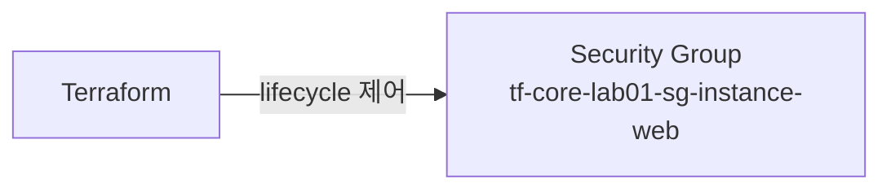

이전 섹션에서 의존 관계 그래프의 구조와 병렬 실행을 다뤘다. 이번 섹션에서는 리소스의 삭제와 교체를 제어하는 `lifecycle` 블록을 다룬다. 리소스가 생성되고 변경되고 삭제되는 전체 생명주기를 Terraform이 어떻게 관리하는지 이해한다.

---

# destroy 역순 삭제

Sec01과 Sec02에서 다룬 내용을 정리한다. `terraform destroy`는 의존 관계 그래프를 역전해 삭제 순서를 결정한다. EC2가 SG를 참조한다면 EC2를 먼저 삭제하고 SG를 삭제한다.

```bash
# 특정 리소스만 삭제
$ terraform destroy -target=aws_instance.web
```

`-target`은 대상과 upstream만 처리하고 downstream은 건너뛴다. 인프라 불일치가 발생할 수 있으므로 예외적 상황에서만 사용한다.

---

# lifecycle 블록

`lifecycle`은 리소스의 생성·변경·삭제 동작을 제어하는 meta-argument다. `resource` 블록 안에 중첩 블록으로 선언한다.

```hcl
resource "aws_instance" "web" {
  ami           = data.aws_ami.amazon_linux.id
  instance_type = "t3.micro"

  lifecycle {
    create_before_destroy = true
    prevent_destroy       = false
    ignore_changes        = [tags]
  }
}
```

## 1. create_before_destroy

리소스를 교체할 때 기본 동작은 **삭제 후 생성**(`-/+`)이다. `create_before_destroy = true`를 설정하면 **생성 후 삭제**(`+/-`)로 변경된다.

```hcl
lifecycle {
  create_before_destroy = true
}
```

| 설정 | 교체 순서 | plan 기호 |
|------|---------|----------|
| 미설정 (기본) | 기존 삭제 → 새로 생성 | `-/+` |
| `true` | 새로 생성 → 기존 삭제 | `+/-` |

### ① 사용 시점

서비스 중단 없이 리소스를 교체해야 할 때 사용한다. 기본 동작(`-/+`)은 기존 리소스가 삭제된 후 새 리소스가 생성되므로 그 사이에 다운타임이 발생한다.

### ② 고유 이름 제약

`create_before_destroy`는 기본 동작이 아닌 opt-in이다. 이유는 많은 리소스가 고유 이름 제약을 가지기 때문이다. `aws_security_group`에 `name`을 지정하면 같은 이름의 SG가 동시에 존재할 수 없어 새 리소스 생성이 실패한다. `aws_instance`는 `Name` 태그만 사용하므로 이 제약이 없다.

### ③ 의존 전파

`create_before_destroy = true`를 설정한 리소스에 의존하는 다른 리소스에도 이 설정이 암묵적으로 전파된다.

## 2. prevent_destroy

`prevent_destroy = true`를 설정하면 이 리소스를 삭제하는 plan을 Terraform이 거부한다.

```hcl
lifecycle {
  prevent_destroy = true
}
```

`terraform destroy`를 실행해도 이 리소스에서 오류가 발생해 **전체 destroy가 실패**한다. 해당 리소스만 건너뛰는 것이 아니다. 프로덕션 데이터베이스처럼 실수로 삭제되면 안 되는 리소스에 사용한다.

### ① 해제 방법

삭제가 필요해지면:

1. `prevent_destroy = false`로 변경 후 `terraform destroy` 실행
2. 또는 `resource` 블록 자체를 코드에서 제거 — 코드가 없으면 `prevent_destroy`도 함께 사라지므로 삭제가 진행된다

## 3. ignore_changes

`ignore_changes`에 지정한 인수의 외부 변경을 Terraform이 무시한다. AWS 콘솔에서 수동으로 변경해도 다음 plan에서 되돌리려 하지 않는다.

```hcl
lifecycle {
  ignore_changes = [tags, ami]
}
```

속성명 목록으로 지정한다. 중첩 속성도 참조할 수 있다 — `tags["Name"]`, `list[0]`.

```hcl
# 모든 인수 변경 무시 — 생성과 삭제만 가능
lifecycle {
  ignore_changes = all
}
```

`all`을 지정하면 어떤 인수가 변경되어도 update plan을 생성하지 않는다.

### ① 사용 시점

- Auto Scaling Group이 외부에서 인스턴스 수를 조정하는 경우 (`desired_capacity` 무시)
- 다른 시스템이 태그를 자동으로 추가하는 경우 (`tags` 무시)

## 4. replace_triggered_by

참조한 리소스가 변경되면 이 리소스를 강제 교체한다.

```hcl
resource "aws_instance" "web" {
  ami           = data.aws_ami.amazon_linux.id
  instance_type = "t3.micro"

  lifecycle {
    replace_triggered_by = [aws_iam_instance_profile.instance_web]
  }
}
```

`aws_iam_instance_profile.instance_web`이 교체되면 `aws_instance.web`도 함께 교체된다. 리소스 참조, 인스턴스 참조(`aws_instance.web[0]`), 속성 참조(`aws_ecs_service.svc.id`)를 사용할 수 있다.

`var.*`, `local.*`, `data.*`는 직접 사용할 수 없다. plain value의 변경으로 교체를 트리거하려면 `terraform_data` 리소스로 감싼다.

```hcl
resource "terraform_data" "replacement" {
  triggers_replace = var.revision
}

resource "aws_instance" "web" {
  # ...
  lifecycle {
    replace_triggered_by = [terraform_data.replacement]
  }
}
```

---

# terraform apply -replace

특정 리소스를 강제로 교체한다. 인수 변경 없이도 리소스를 새로 만들고 싶을 때 사용한다.

```bash
$ terraform apply -replace=aws_instance.web
```

plan 출력에서 `-/+` (또는 `create_before_destroy` 시 `+/-`)로 표시된다. 복수 리소스를 한 번에 교체할 수 있다.

```bash
$ terraform apply -replace=aws_instance.web -replace=aws_security_group.this
```

## 1. terraform taint와의 관계

`terraform taint`는 State에서 리소스를 "오염됨"으로 표시해 다음 apply 시 교체되게 하는 명령이었다. TF 0.15.2에서 deprecated되었고, `-replace`로 대체되었다.

| 방식 | 동작 시점 | 리스크 |
|------|---------|--------|
| `taint` (deprecated) | State를 즉시 수정 | 다른 팀원이 tainted 상태의 리소스로 plan 실행 가능 |
| `-replace` | plan에 교체 의도 포함 | 리뷰 후 apply 가능, 안전 |

`-replace`는 plan 파일에 교체 의도를 포함하므로 CI/CD 파이프라인에서 리뷰 후 apply할 수 있다. `taint`는 1.14.x에서 여전히 동작하지만 사용하지 않는다.

---

# lifecycle 인수 정리

| 인수 | 역할 | 기본값 |
|------|------|--------|
| `create_before_destroy` | 교체 시 생성 후 삭제 (`+/-`) | `false` |
| `prevent_destroy` | 삭제 plan 거부 | `false` |
| `ignore_changes` | 지정 인수 외부 변경 무시 | `[]` (없음) |
| `replace_triggered_by` | 참조 리소스 변경 시 강제 교체 | `[]` (없음) |

`precondition`과 `postcondition`도 `lifecycle` 블록 안에 선언하지만, 생명주기 제어가 아닌 검증(validation) 목적이다. Ch09 Sec02에서 다룬다.

---

# 핵심 정리

- `terraform destroy`는 의존 관계 그래프를 역전해 삭제 순서를 결정한다.
- `create_before_destroy`는 교체 시 다운타임을 줄이지만, 고유 이름 제약이 있는 리소스에서는 주의해야 한다.
- `prevent_destroy`는 해당 리소스를 포함하는 **전체 destroy plan을 거부**한다 — 리소스 하나만 건너뛰는 것이 아니다.
- `ignore_changes`는 외부 시스템이 관리하는 인수의 변경을 Terraform이 무시하게 한다.
- `replace_triggered_by`는 참조 리소스 변경 시 강제 교체를 트리거한다. plain value는 `terraform_data`로 감싼다.
- `terraform apply -replace`는 deprecated된 `taint`를 대체한다 — plan에 교체 의도를 포함해 리뷰 가능하다.

---

# 참고 자료

- [lifecycle — Terraform 공식 문서](https://developer.hashicorp.com/terraform/language/meta-arguments/lifecycle)
- [Resource Behavior — Terraform 공식 문서](https://developer.hashicorp.com/terraform/language/resources/behavior)
- [terraform apply -replace — Terraform 공식 문서](https://developer.hashicorp.com/terraform/cli/commands/apply)
- [terraform destroy — Terraform 공식 문서](https://developer.hashicorp.com/terraform/cli/commands/destroy)
- [terraform_data Resource — Terraform 공식 문서](https://developer.hashicorp.com/terraform/language/resources/terraform-data)

---

# [실습] lab01: lifecycle 블록 실습

`lifecycle` 블록의 세 가지 옵션(`prevent_destroy`, `create_before_destroy`, `ignore_changes`)을 직접 설정하고 동작을 확인한다.

### 실습 목표

- `prevent_destroy = true`로 destroy 차단 확인
- `create_before_destroy = true`로 교체 순서 변경 확인 (`+/-` plan 기호)
- `ignore_changes`로 콘솔에서 변경한 태그가 plan에 반영되지 않는 것을 확인
- `terraform apply -replace`로 리소스 강제 교체

---

# 1. 전체 아키텍처



Security Group 하나로 lifecycle 옵션의 동작을 확인한다. 최소 구성으로 lifecycle 동작에 집중한다.

---

# 2. 사전 준비

```text
lab01/
├── locals.tf
├── providers.tf
├── main.tf
└── outputs.tf
```

**설정:**

- region: **`ap-northeast-2`**
- SG 이름: **`tf-core-lab01-sg-instance-web`**

---

# 3. 파일 작성

## locals.tf

```hcl
locals {
  project = "tf-core-lab01"
}
```

## providers.tf

```hcl
terraform {
  required_version = ">= 1.14.0"

  required_providers {
    aws = {
      source  = "hashicorp/aws"
      version = "~> 6.0"
    }
  }
}

provider "aws" {
  region = "ap-northeast-2"

  default_tags {
    tags = {
      Project   = local.project
      ManagedBy = "Terraform"
    }
  }
}
```

## main.tf

```hcl
resource "aws_security_group" "instance_web" {
  name        = "${local.project}-sg-instance-web"
  description = "${local.project} lifecycle test"

  egress {
    from_port   = 0
    to_port     = 0
    protocol    = "-1"
    cidr_blocks = ["0.0.0.0/0"]
  }

  lifecycle {
    prevent_destroy = true
  }

  tags = {
    Name = "${local.project}-sg-instance-web"
  }
}
```

`prevent_destroy = true`로 시작한다. 이후 단계에서 lifecycle 옵션을 변경하며 동작을 확인한다.

## outputs.tf

```hcl
output "sg_instance_web" {
  value = {
    id   = aws_security_group.this.id
    name = aws_security_group.this.name
  }
}
```

---

# 4. terraform init & apply

```bash
$ terraform init && terraform apply
```

```text
Apply complete! Resources: 1 added, 0 changed, 0 destroyed.
```

---

# 5. prevent_destroy 확인

```bash
$ terraform destroy
```

```text
╷
│ Error: Instance cannot be destroyed
│
│   on main.tf line 1:
│    1: resource "aws_security_group" "instance_web" {
│
│ Resource aws_security_group.this has lifecycle.prevent_destroy
│ set, but the plan calls for this resource to be destroyed.
╵
```

destroy 전체가 실패한다. 리소스가 하나뿐이지만 여러 개라도 마찬가지다 — `prevent_destroy`가 설정된 리소스가 하나라도 있으면 전체 destroy plan이 거부된다.

---

# 6. prevent_destroy 해제 → ignore_changes 테스트

`main.tf`의 lifecycle을 변경한다:

```hcl
lifecycle {
  ignore_changes = [tags]
}
```

```bash
$ terraform apply
```

적용 후 AWS 콘솔에서 Security Group의 태그를 수동으로 변경한다.

[콘솔화면: AWS Console > EC2 > Security Groups > tf-core-lab01-sg-instance-web > Tags > Edit > 태그 값 변경]

```bash
$ terraform plan
```

```text
No changes. Your infrastructure matches the configuration.
```

콘솔에서 태그를 변경했지만 Terraform은 변경을 감지하지 않는다. `ignore_changes = [tags]`가 태그 변경을 무시하기 때문이다.

---

# 7. create_before_destroy 테스트

`main.tf`의 lifecycle을 변경한다:

```hcl
lifecycle {
  create_before_destroy = true
}
```

SG의 `description`을 변경해 교체를 유발한다:

```hcl
description = "${local.project} lifecycle cbd test"
```

```bash
$ terraform plan
```

```text
  # aws_security_group.this will be updated in-place
  ~ resource "aws_security_group" "instance_web" {
      ~ description = "tf-core-lab01 lifecycle test" -> "tf-core-lab01 lifecycle cbd test"
        ...
    }
```

SG의 `description` 변경은 in-place update다. `create_before_destroy`의 효과를 보려면 **교체가 필요한 변경**(예: `name` 변경)이 필요하다. SG의 `name`을 변경한다:

```hcl
name = "${local.project}-sg-instance-web-v2"
```

```bash
$ terraform plan
```

```text
  # aws_security_group.this must be replaced
+/- resource "aws_security_group" "instance_web" {
      ~ name = "tf-core-lab01-sg-instance-web" -> "tf-core-lab01-sg-instance-web-v2"
      ...
    }

Plan: 1 to add, 0 to change, 1 to destroy.
```

`+/-` 기호가 표시된다 — 새 SG를 먼저 생성한 뒤 기존 SG를 삭제한다는 뜻이다. 단, SG는 고유 이름 제약이 있어 이름이 다르므로 동시 존재가 가능하다. 같은 이름으로 교체하면 생성 단계에서 실패한다.

---

# 8. terraform apply -replace

lifecycle을 제거하고 원래 이름으로 되돌린다:

```hcl
resource "aws_security_group" "instance_web" {
  name        = "${local.project}-sg-instance-web"
  description = "${local.project} lifecycle test"

  egress {
    from_port   = 0
    to_port     = 0
    protocol    = "-1"
    cidr_blocks = ["0.0.0.0/0"]
  }

  tags = {
    Name = "${local.project}-sg-instance-web"
  }
}
```

```bash
$ terraform apply
```

적용 후 `-replace`로 강제 교체한다:

```bash
$ terraform apply -replace=aws_security_group.this
```

```text
  # aws_security_group.this will be replaced, as requested
-/+ resource "aws_security_group" "instance_web" {
      ~ id   = "sg-xxxxxxxxxxxxxxxxx" -> (known after apply)
        name = "tf-core-lab01-sg-instance-web"
      ...
    }

Plan: 1 to add, 0 to change, 1 to destroy.
```

인수 변경이 없는데도 `-/+`(삭제 후 재생성)가 표시된다. `-replace`가 강제 교체를 요청했기 때문이다.

---

# 9. terraform destroy

```bash
$ terraform destroy
```

```text
Destroy complete! Resources: 1 destroyed.
```
