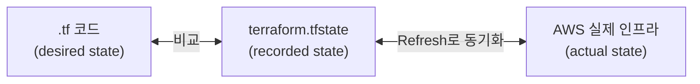
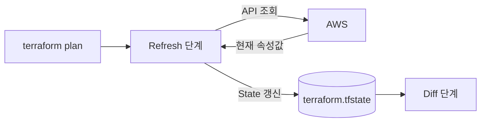
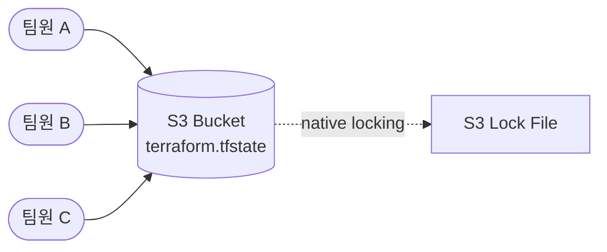

Ch03에서 Terraform의 실행 모델 — 의존 관계 그래프, 병렬 실행, 리소스 생명주기를 다뤘다. 이번 챕터에서는 그 실행 모델의 중심에 있는 **State**를 깊게 파고든다. State가 무엇이고, 왜 필수적이며, 어떤 한계를 가지는지 이해한다.

---

# State란 무엇인가

## 1. 코드와 실제 인프라의 매핑

Terraform은 `.tf` 파일에 선언한 **원하는 상태(desired state)**와 클라우드에 실제 존재하는 **현재 상태(actual state)**를 비교해 변경을 결정한다. 이 비교의 기준이 되는 것이 **State**다.



State는 코드의 리소스 블록과 실제 클라우드 리소스를 연결하는 매핑 정보다. `aws_instance.web`이라는 코드가 실제로 `i-0abc1234567890def`라는 EC2 인스턴스에 대응한다는 것을 State가 기록한다.

## 2. State 없이 동작할 수 없는 이유

State가 없으면 Terraform은 세 가지 핵심 작업을 수행할 수 없다.

### ① 매핑

코드의 `aws_instance.web`이 어떤 실제 리소스에 대응하는지 알 수 없다. 클라우드 API만으로는 리소스 이름과 코드 블록을 연결할 방법이 없다 — AWS는 `aws_instance.web`이라는 이름을 알지 못한다.

### ② 메타데이터

리소스 간 의존 관계, Provider 정보, 리소스 버전 등 메타데이터를 State에 저장한다. Ch03 Sec02에서 다룬 의존 관계 그래프도 State의 메타데이터에 기반한다. 코드에서 리소스를 삭제하면 참조 표현식이 사라지지만, State에 기록된 의존 관계로 올바른 삭제 순서를 결정할 수 있다.

### ③ 성능

대규모 인프라에서 매번 모든 리소스를 클라우드 API로 조회하면 plan이 느려진다. State에 마지막으로 확인한 속성 값을 캐싱해두면 변경된 리소스만 선택적으로 조회할 수 있다. `-refresh=false` 옵션은 이 캐시만 사용해 API 호출을 완전히 건너뛴다.

---

# State와 Refresh

## 1. Refresh 동작

Ch03 Sec01에서 plan의 첫 단계가 Refresh라고 다뤘다. Refresh는 State에 기록된 리소스를 실제 클라우드에 조회해 현재 상태를 동기화한다.



`terraform plan`은 기본적으로 Refresh를 포함한다 (`-refresh=true`가 기본). Refresh 결과와 코드를 비교해 diff를 계산한다.

## 2. terraform apply -refresh-only

```bash
$ terraform apply -refresh-only
```

Refresh만 수행하고 인프라를 변경하지 않는다. State를 실제 인프라 상태로 갱신할 뿐이다. 외부에서 변경된 인프라를 State에 반영하고 싶을 때 사용한다.

`terraform refresh` 명령도 동일한 기능이지만 deprecated 상태다. `terraform refresh`는 내부적으로 `terraform apply -refresh-only -auto-approve`와 같아서, credential 설정 오류 시 모든 리소스가 삭제된 것으로 오인해 State에서 전부 제거할 위험이 있다. `-refresh-only`는 승인 프롬프트를 거치므로 더 안전하다.

---

# State Drift

## 1. Drift란

코드를 거치지 않고 인프라가 변경되면 State와 실제 인프라가 불일치한다. 이를 **drift**라고 한다.

| 원인 | 예시 |
|------|------|
| 콘솔에서 수동 변경 | AWS 콘솔에서 SG ingress 규칙 추가 |
| 다른 도구로 변경 | AWS CLI로 태그 수정 |
| AWS 자동 동작 | Auto Scaling이 인스턴스 수 조정 |

## 2. Drift 감지

`terraform plan` 실행 시 Refresh 단계에서 자동으로 감지된다. 콘솔에서 SG 규칙을 변경했다면 plan 출력에서 차이가 표시된다.

```text
  # aws_security_group.instance_web has changed
  ~ resource "aws_security_group" "instance_web" {
        id   = "sg-xxxxxxxxxxxxxxxxx"
      ~ ingress {
          + cidr_blocks = ["10.0.0.0/8"]
          + from_port   = 443
          + protocol    = "tcp"
          + to_port     = 443
        }
    }

Note: Objects have changed outside of Terraform
```

Terraform은 "Objects have changed outside of Terraform"이라는 메시지로 drift를 알려준다.

## 3. Drift 해소

| 방법 | 명령 | 결과 |
|------|------|------|
| 코드 기준으로 되돌리기 | `terraform apply` | 외부 변경을 코드 상태로 복원 |
| 코드를 현재 인프라에 맞추기 | 코드 수정 → `terraform apply` | 코드가 현실을 반영 |
| 외부 변경 수용 | `terraform apply -refresh-only` | State만 갱신, 인프라는 그대로 |

Ch02 실습에서는 `terraform destroy`로 매번 정리했기 때문에 drift가 발생하지 않았다. 실무에서는 팀원이 콘솔에서 수동 변경하거나 다른 도구가 인프라를 수정하는 상황이 빈번하다.

---

# Local State의 한계

Ch02~Ch03에서 사용한 State는 로컬 파일(`terraform.tfstate`)이다. 개인 학습에는 충분하지만 팀 환경에서는 네 가지 한계가 있다.

## 1. 협업 불가

State 파일이 개인 머신에 있으므로 팀원이 같은 인프라를 관리할 수 없다. 파일을 공유 드라이브에 놓는 것은 동시 수정 문제가 발생한다.

## 2. 팀 단위 Locking 불가

Local backend는 같은 머신에서의 동시 실행은 OS 수준 파일 잠금으로 방지한다. 하지만 팀원 각자의 머신에서 동시에 `terraform apply`를 실행하면 서로의 잠금을 인식할 수 없어 State가 손상될 수 있다.

## 3. 백업 없음

로컬 디스크의 단일 파일이다. `terraform apply` 시 `.tfstate.backup`이 생성되지만 한 세대뿐이다. 디스크 장애나 실수로 삭제하면 복구할 수 없다.

## 4. 민감 데이터 노출

State 파일은 plaintext JSON이다. 데이터베이스 비밀번호, API 키 등 민감한 값이 리소스 속성에 그대로 기록된다. 암호화 옵션이 없다.

---

# Remote Backend로의 전환

Local State의 한계를 해결하는 것이 **Remote Backend**다. State를 원격 저장소(S3 등)에 보관하고, 팀 전원이 동일한 State를 공유한다.



Remote Backend는 Local State의 네 가지 한계를 모두 해결한다.

| Local State 한계 | Remote Backend 해결 |
|-----------------|-------------------|
| 협업 불가 | S3에 State 공유 |
| 팀 Locking 불가 | S3 native locking (`use_lockfile`) |
| 백업 없음 | S3 versioning으로 이력 보관 |
| 민감 데이터 노출 | S3 서버 사이드 암호화 (`encrypt = true`) |

Remote Backend의 구성과 마이그레이션은 Sec03에서 실습한다.

---

# 핵심 정리

- **State**는 코드의 리소스 블록과 실제 클라우드 리소스를 연결하는 매핑 정보다. Terraform은 State 없이 동작할 수 없다.
- State의 세 가지 목적: **매핑**(코드 ↔ 리소스 ID), **메타데이터**(의존 관계, Provider 정보), **성능**(API 호출 최소화).
- `terraform plan`의 Refresh 단계에서 State와 실제 인프라를 동기화한다. 외부 변경(drift)은 이 단계에서 감지된다.
- `terraform apply -refresh-only`로 State만 갱신할 수 있다. deprecated된 `terraform refresh`보다 안전하다.
- Local State는 협업, 팀 Locking, 백업, 보안에서 한계가 있다. Remote Backend(S3)가 이를 해결한다.

다음 섹션에서는 `terraform.tfstate` 파일의 JSON 구조를 분석한다.

---

# 참고 자료

- [State — Terraform 공식 문서](https://developer.hashicorp.com/terraform/language/state)
- [Purpose of Terraform State — Terraform 공식 문서](https://developer.hashicorp.com/terraform/language/state/purpose)
- [Sensitive Data in State — Terraform 공식 문서](https://developer.hashicorp.com/terraform/language/state/sensitive-data)
- [State Locking — Terraform 공식 문서](https://developer.hashicorp.com/terraform/language/state/locking)
- [terraform apply -refresh-only — Terraform 공식 문서](https://developer.hashicorp.com/terraform/cli/commands/apply)
