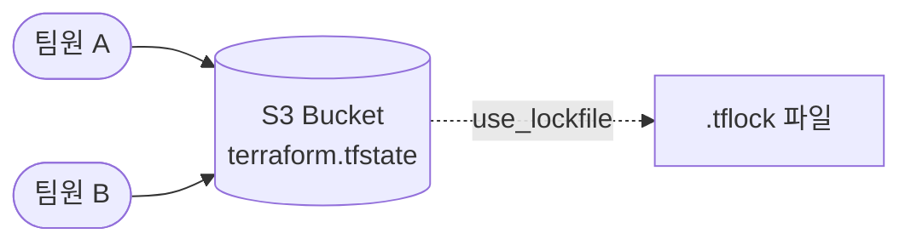
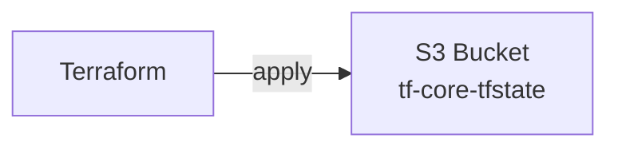
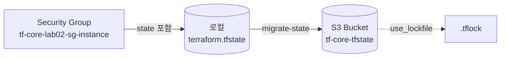

이전 섹션에서 State 파일의 JSON 구조를 분석했다. 이번 섹션에서는 Local State의 한계를 해결하는 **Remote Backend**를 구성한다. S3에 State를 저장하고, S3 native locking으로 팀 환경에서의 동시 수정을 방지한다.

---

# Remote Backend 개념

## 1. 왜 Remote Backend인가

Sec01에서 다룬 Local State의 네 가지 한계 — 협업 불가, 팀 Locking 불가, 백업 없음, 민감 데이터 노출 — 를 해결한다. State를 원격 저장소에 보관하면 팀 전원이 동일한 State를 공유한다.

## 2. S3 Backend

AWS 환경에서 가장 널리 사용하는 Remote Backend다.



S3 버킷에 State 파일을 저장하고, S3 native locking으로 동시 수정을 방지한다. S3 versioning을 활성화하면 State 변경 이력도 보관된다.

---

# backend "s3" 설정

## 1. 기본 구성

```hcl
terraform {
  backend "s3" {
    bucket       = "my-terraform-state-bucket"
    key          = "project/terraform.tfstate"
    region       = "ap-northeast-2"
    encrypt      = true
    use_lockfile = true
  }
}
```

| 인수 | 필수 | 설명 |
|------|------|------|
| `bucket` | ✓ | S3 버킷 이름 |
| `key` | ✓ | State 파일 경로 (버킷 내 객체 키) |
| `region` | ✓ | S3 버킷 리전 |
| `encrypt` | — | 서버 사이드 암호화. 기본값 `false` — **`true` 권장** |
| `use_lockfile` | — | S3 native locking 활성화. 기본값 `false` |

`encrypt = true`는 SSE-S3(AES-256)를 사용한다. SSE-KMS가 필요하면 `kms_key_id`를 추가한다.

## 2. 변수 사용 불가

`backend` 블록은 `var.*`, `local.*`을 참조할 수 없다. Terraform이 backend를 초기화하는 시점에는 변수가 아직 평가되지 않기 때문이다. 모든 값을 리터럴로 작성하거나, partial config를 사용한다.

## 3. partial config

민감한 값이나 환경별로 달라지는 값을 별도 파일로 분리한다.

```hcl
# providers.tf — backend 골격만 선언
terraform {
  backend "s3" {}
}
```

```hcl
# backend.hcl — 실제 값
bucket       = "my-terraform-state-bucket"
key          = "project/terraform.tfstate"
region       = "ap-northeast-2"
encrypt      = true
use_lockfile = true
```

```bash
$ terraform init -backend-config=backend.hcl
```

`-backend-config` 플래그로 파일을 지정한다. CLI에서 개별 키-값으로 전달할 수도 있다.

```bash
$ terraform init -backend-config="bucket=my-terraform-state-bucket" -backend-config="key=project/terraform.tfstate"
```

---

# S3 Native Locking

## 1. 동작 원리

`use_lockfile = true`를 설정하면 Terraform은 State 파일 옆에 `.tflock` 파일을 생성해 잠금을 관리한다.

```text
s3://my-terraform-state-bucket/
├── project/terraform.tfstate        ← State 파일
└── project/terraform.tfstate.tflock ← Lock 파일
```

S3의 조건부 쓰기(`PutObject` + `If-None-Match` 헤더)를 이용한다. lock 파일이 이미 존재하면(다른 사용자가 apply 중) S3가 HTTP 409 오류를 반환해 두 번째 apply를 차단한다.

## 2. 동시 apply 시 오류

```text
Error: Error acquiring the state lock

Error message: operation error S3: PutObject, https response error
StatusCode: 409, api error ConditionalRequestConflict:
The conditional request cannot succeed due to a conflicting operation
against this resource.
```

Lock이 해제될 때까지 대기하거나, 비정상 종료로 lock이 남아있으면 `terraform force-unlock`으로 해제한다.

## 3. DynamoDB Locking과의 관계

이전 Terraform 버전에서는 DynamoDB 테이블로 state locking을 구현했다. TF 1.10에서 S3 native locking이 실험적으로 도입되고, TF 1.11에서 GA가 되면서 `dynamodb_table` 인수는 deprecated 상태다. 이 시리즈는 TF 1.14.x 기준이므로 S3 native locking을 사용한다.

---

# terraform init — Backend 마이그레이션

## 1. -migrate-state

```bash
$ terraform init -migrate-state
```

기존 State를 새 backend로 **복사**한다. lineage가 유지되므로 동일한 인프라의 연속이다. Local State → S3로 이전할 때 사용한다.

```text
Initializing the backend...
Do you want to copy existing state to the new backend?

  Enter a value: yes

Successfully configured the backend "s3"!
```

## 2. -reconfigure

```bash
$ terraform init -reconfigure
```

Backend 설정만 교체하고 State는 이전하지 않는다. 새로운 빈 State로 시작한다. 기존 인프라 추적을 포기하는 것이므로 주의한다.

| 옵션 | State 이전 | lineage | 용도 |
|------|-----------|---------|------|
| `-migrate-state` | ✓ | 유지 | 기존 인프라 유지하며 backend 이전 |
| `-reconfigure` | ✗ | 새로 생성 | backend 설정만 변경 |

---

# .terraform/terraform.tfstate — Backend 메타데이터

`terraform init`으로 backend를 설정하면 `.terraform/terraform.tfstate` 파일이 생성된다. 이 파일은 **현재 어떤 backend를 사용 중인지** 기록한다.

```json
{
  "version": 3,
  "backend": {
    "type": "s3",
    "config": {
      "bucket": "tf-core-tfstate",
      "key": "lab02/terraform.tfstate",
      "region": "ap-northeast-2",
      "encrypt": true,
      "use_lockfile": true
    }
  }
}
```

루트의 `terraform.tfstate`(실제 State 데이터)와는 다른 파일이다. 이 파일이 있어야 Terraform이 "S3에서 State를 읽어야 한다"는 것을 안다.

`.terraform/` 디렉토리는 `.gitignore` 대상이므로 Git에 커밋되지 않는다. 팀원은 각자 `terraform init`을 실행해 `.terraform/terraform.tfstate`를 생성한다. 이것이 CLI 명령어(`state mv`, `state rm`)가 **실행한 사람의 환경에만 영향**을 미치고 팀원에게 전파되지 않는 이유다. 선언형 블록(`moved`, `removed`)은 코드에 남아 있으므로 팀원이 `terraform apply`를 실행하면 자동으로 적용된다.

---

# Remote Backend 시작 패턴

Remote Backend를 사용하는 방법은 두 가지다.

## 1. Migration — Local에서 Remote로 이전

기존 Local State가 있는 프로젝트에 `backend "s3"`를 추가하고 `terraform init -migrate-state`를 실행한다. State가 S3로 복사된다.

이 방식의 부수효과: migration 후 로컬 `terraform.tfstate`가 **빈 상태로 남는다** (삭제되지 않는다). `terraform.tfstate.backup`에는 migration 전 상태가 보존된다. backend 설정이 코드에서 실수로 빠지면 빈 local state로 init되어 기존 리소스를 모르는 상태가 될 수 있다.

## 2. 처음부터 Remote

`backend "s3"`가 설정된 상태에서 `terraform init`을 실행한다. State가 처음부터 S3에 생성된다. 로컬 잔여 파일이 없어 깔끔하다. 단, S3 버킷이 **먼저 존재**해야 한다.

실무에서는 인프라팀이 tfstate 버킷을 먼저 만들어놓고, 프로젝트들이 `backend "s3"`에 설정해서 바로 사용하는 패턴이 일반적이다. 이 시리즈에서도 lab01에서 tfstate 버킷을 만든 후, Gallery(04.04~)는 처음부터 Remote로 시작한다.

---

# S3 버킷 설정 권장사항

State용 S3 버킷을 생성할 때 다음을 설정한다.

| 설정 | 이유 |
|------|------|
| Versioning 활성화 | State 변경 이력 보관. 실수로 덮어쓴 State 복구 가능 |
| 퍼블릭 액세스 차단 | State에 민감 데이터가 포함될 수 있음 |
| 서버 사이드 암호화 | 저장 시 암호화 (`encrypt = true`) |

Versioning은 필수가 아니라 **강력 권장**이다. 프로덕션 환경에서는 반드시 활성화한다.

---

# 핵심 정리

- Remote Backend는 Local State의 한계(협업, Locking, 백업, 보안)를 해결한다.
- S3 backend의 필수 인수는 `bucket`, `key`, `region` 세 가지다. `encrypt = true`와 `use_lockfile = true`를 함께 설정한다.
- `backend` 블록은 변수를 참조할 수 없다. 환경별 값은 partial config(`-backend-config`)로 분리한다.
- S3 native locking(`use_lockfile`)은 `.tflock` 파일로 동시 수정을 방지한다. DynamoDB locking은 deprecated다.
- `terraform init -migrate-state`로 Local State를 S3로 이전한다. lineage가 유지되어 동일한 인프라로 인식된다. migration 후 로컬 `terraform.tfstate`가 빈 상태로 남는 점에 주의한다.
- 처음부터 Remote로 시작하면 로컬 잔여 파일 없이 깔끔하다. 실무에서는 tfstate 버킷이 미리 존재하는 환경에서 이 패턴을 사용한다.
- State용 S3 버킷에는 versioning 활성화, 퍼블릭 액세스 차단, 서버 사이드 암호화를 설정한다.

다음 섹션은 Gallery 실습으로, user_data 자동화를 추가하고 처음부터 S3 Remote Backend로 시작한다.

---

# 참고 자료

- [S3 Backend — Terraform 공식 문서](https://developer.hashicorp.com/terraform/language/settings/backends/s3)
- [Backend Configuration — Terraform 공식 문서](https://developer.hashicorp.com/terraform/language/settings/backends/configuration)
- [State Locking — Terraform 공식 문서](https://developer.hashicorp.com/terraform/language/state/locking)
- [terraform init — Terraform 공식 문서](https://developer.hashicorp.com/terraform/cli/commands/init)

---

# [실습] lab01: S3 백엔드 인프라 생성

이 시리즈 전체에서 사용할 State 백엔드 S3 버킷을 생성한다. 여기서 `local.org`와 `local.project`를 분리하고 `local.namespace`를 처음 도입한다.

### 실습 목표

- `local.org` / `local.project` 분리 + `local.namespace` 도입
- `local.s3bucket` object로 S3 설정 구조화 (Ch02 패턴 적용)
- S3 버킷 생성 (versioning 활성화, 퍼블릭 액세스 차단)
- 이후 모든 실습의 State를 이 버킷에 저장

---

# 1. 전체 아키텍처



시리즈 전체에서 공유하는 State 백엔드 S3 버킷을 생성한다. 이후 실습에서는 `key`로 State 파일을 구분한다 (`lab02/terraform.tfstate`, `gallery/terraform.tfstate` 등). 이 lab의 State는 로컬에 저장된다. S3 backend 설정은 lab02에서 진행한다.

> S3 버킷 이름은 글로벌 고유해야 한다. `tf-core-tfstate`가 이미 사용 중이라면 `-{account_id}` 등 suffix를 붙여 고유한 이름을 만든다.

---

# 2. 사전 준비

```text
lab01/
├── main.tf
├── locals.tf
├── variables.tf
├── providers.tf
└── outputs.tf
```

**설정:**

- region: **`ap-northeast-2`**
- 버킷 이름: **`tf-core-tfstate`**

---

# 3. main.tf

```hcl
# resource "aws_s3_bucket" "tfstate" {
#   bucket = "tf-core-tfstate"
# }
# resource "aws_s3_bucket_versioning" "tfstate" {
#   bucket = aws_s3_bucket.tfstate.id
#   versioning_configuration { status = "Enabled" }
# }
# resource "aws_s3_bucket_public_access_block" "tfstate" {
#   bucket = aws_s3_bucket.tfstate.id
#   block_public_acls = true
#   block_public_policy = true
#   ignore_public_acls = true
#   restrict_public_buckets = true
# }
resource "aws_s3_bucket" "this" {
  bucket = local.s3bucket.bucket

  tags = {
    Name = "${local.namespace}-s3bucket-${local.s3bucket.name}"
  }

  lifecycle {
    prevent_destroy = true
  }
}

resource "aws_s3_bucket_versioning" "this" {
  bucket = aws_s3_bucket.this.id

  versioning_configuration {
    status = local.s3bucket.versioning_configuration.status
  }
}

resource "aws_s3_bucket_public_access_block" "this" {
  bucket = aws_s3_bucket.this.id

  block_public_acls       = local.s3bucket.public_access_block.block_public_acls
  block_public_policy     = local.s3bucket.public_access_block.block_public_policy
  ignore_public_acls      = local.s3bucket.public_access_block.ignore_public_acls
  restrict_public_buckets = local.s3bucket.public_access_block.restrict_public_buckets
}
```

주석은 S3 리소스 원형이다. `this` 레이블, `local.s3bucket.*` 참조만 사용한다. Ch02에서 확립한 패턴이 S3 버킷에도 예외 없이 적용된다. `versioning_configuration`과 `public_access_block`의 설정 이름이 AWS 리소스의 nested block 이름과 1:1 대응한다.

`prevent_destroy = true`로 실수로 State 버킷이 삭제되는 것을 방지한다.

---

# 4. locals.tf

```hcl
locals {
  org     = "tf-core"
  project = "lab01"

  namespace = "${local.org}-${local.project}"

  s3bucket = {
    name   = "tfstate"
    bucket = "${local.org}-tfstate"

    versioning_configuration = {
      status = "Enabled"
    }

    public_access_block = {
      block_public_acls       = true
      block_public_policy     = true
      ignore_public_acls      = true
      restrict_public_buckets = true
    }
  }
}
```

Ch02~03에서는 `local.project = "tf-core-lab01"`을 통째로 사용했다. 여기서 `local.org`와 `local.project`를 분리하고 `local.namespace`를 조합한다. 현업에서는 organization이나 team 식별자가 `local.org` 역할을 한다.

`local.s3bucket` object가 S3 버킷의 전체 설정을 담는다. capability 이름(`s3bucket`), `name`(`"tfstate"`)이 Ch02에서 확립한 패턴을 따른다. `bucket = "${local.org}-tfstate"`는 S3 버킷의 글로벌 고유 이름이다. 이름이 이미 사용 중이라면 `-{account_id}` suffix를 붙인다.

---

# 5. providers.tf

```hcl
terraform {
  required_version = ">=1.14.0"

  required_providers {
    aws = {
      source  = "hashicorp/aws"
      version = "~> 6.0"
    }
  }
}

provider "aws" {
  region = "ap-northeast-2"

  default_tags {
    tags = {
      Organization = local.org
      Project      = local.project
      ManagedBy    = "Terraform"
    }
  }
}
```

`local.org` 분리에 맞춰 `default_tags`에 `Organization` 태그가 추가된다.

---

# 6. outputs.tf

```hcl
output "s3bucket" {
  value = {
    (local.s3bucket.name) = {
      bucket = aws_s3_bucket.this.bucket
      arn    = aws_s3_bucket.this.arn
    }
  }
}
```

computed key `(local.s3bucket.name)`으로 `"tfstate" = { bucket, arn }` 형태로 출력된다.

---

# 7. terraform init & apply

```bash
$ terraform init && terraform apply
```

```text
Apply complete! Resources: 3 added, 0 changed, 0 destroyed.

Outputs:

s3_bucket_tfstate = {
  "arn"    = "arn:aws:s3:::tf-core-tfstate"
  "bucket" = "tf-core-tfstate"
  "region" = "ap-northeast-2"
}
```

[콘솔화면: AWS Console > S3 > tf-core-tfstate > Properties > Versioning: Enabled 확인]

출력된 `bucket` 값을 lab02의 backend 설정에서 사용한다.

---

# [실습] lab02: Remote Backend 설정 및 state 이전

리소스를 로컬 State로 생성한 뒤, S3 backend로 State를 이전한다.

### 실습 목표

- Security Group 리소스 생성 (state 이전 대상)
- `backend "s3"` 설정 + `terraform init -migrate-state`로 State 이전
- AWS 콘솔에서 S3에 저장된 State 파일 확인

---

# 1. 전체 아키텍처



먼저 SG를 로컬 State로 생성한 뒤, backend "s3" 설정을 추가하고 `terraform init -migrate-state`로 State를 S3로 이전한다.

---

# 2. 사전 준비

lab01에서 생성한 S3 버킷 이름을 확인한다.

```bash
$ terraform output -json s3_bucket_tfstate | jq -r '.bucket'

# 출력 예
tf-core-tfstate
```

```text
lab02/
├── locals.tf
├── providers.tf
├── main.tf
└── outputs.tf
```

**설정:**

- region: **`ap-northeast-2`**

---

# 3. 파일 작성 (Phase 1: 로컬 State로 리소스 생성)

## locals.tf

```hcl
locals {
  org       = "tf-core"
  project   = "lab02"
  namespace = "${local.org}-${local.project}"
}
```

lab01에서 도입한 `local.org`/`local.project`/`local.namespace` 구조를 그대로 사용한다.

## providers.tf

```hcl
terraform {
  required_version = ">= 1.14.0"

  required_providers {
    aws = {
      source  = "hashicorp/aws"
      version = "~> 6.0"
    }
  }
}

provider "aws" {
  region = "ap-northeast-2"

  default_tags {
    tags = {
      Organization = local.org
      Project      = local.project
      ManagedBy    = "Terraform"
    }
  }
}
```

## main.tf

```hcl
resource "aws_security_group" "instance" {
  name        = "${local.namespace}-sg-instance"
  description = "${local.namespace} security group"

  egress {
    from_port   = 0
    to_port     = 0
    protocol    = "-1"
    cidr_blocks = ["0.0.0.0/0"]
  }

  tags = {
    Name = "${local.namespace}-sg-instance"
  }
}
```

## outputs.tf

```hcl
output "sg_instance" {
  value = {
    id   = aws_security_group.instance.id
    name = aws_security_group.instance.name
  }
}
```

---

# 4. terraform init & apply (로컬 State)

```bash
$ terraform init && terraform apply
```

```text
Apply complete! Resources: 1 added, 0 changed, 0 destroyed.

Outputs:

sg_instance = {
  "id"   = "sg-xxxxxxxxxxxxxxxxx"
  "name" = "tf-core-lab02-sg-instance"
}
```

이 시점에서 State는 로컬 `terraform.tfstate`에 저장되어 있다.

---

# 5. Phase 2: backend 설정 추가

`providers.tf`의 `terraform` 블록에 `backend "s3"`를 추가한다:

```hcl
terraform {
  required_version = ">= 1.14.0"

  required_providers {
    aws = {
      source  = "hashicorp/aws"
      version = "~> 6.0"
    }
  }

  backend "s3" {
    bucket       = "tf-core-tfstate"
    key          = "04.03/lab02/terraform.tfstate"
    region       = "ap-northeast-2"
    encrypt      = true
    use_lockfile = true
  }
}
```

`key`에 `04.03/lab02/` prefix를 붙인다. Section Lab은 챕터.섹션 번호로 구분한다. Gallery는 `gallery/terraform.tfstate`처럼 프로젝트명만 사용한다.

---

# 6. terraform init -migrate-state

```bash
$ terraform init -migrate-state
```

```text
Initializing the backend...
Do you want to copy existing state to the new backend?
  Pre-existing state was found while migrating the previous "local" backend to the
  newly configured "s3" backend.

  Enter a value: yes

Successfully configured the backend "s3"! Terraform will automatically
use this backend unless the backend configuration changes.
```

`yes`를 입력하면 로컬 State가 S3로 복사된다.

---

# 7. 결과 확인

```bash
$ terraform plan
```

```text
No changes. Your infrastructure matches the configuration.
```

State가 S3로 이전되었지만 인프라는 변경되지 않았다. plan에서 "No changes"가 출력되면 이전이 성공한 것이다.

[콘솔화면: AWS Console > S3 > tf-core-tfstate > lab02/terraform.tfstate 파일 존재 확인]

로컬 `terraform.tfstate`를 확인한다:

```bash
$ cat terraform.tfstate
```

```json
{
  "version": 4,
  "terraform_version": "1.14.7",
  "serial": 0,
  "lineage": "...",
  "outputs": {},
  "resources": []
}
```

로컬 State는 빈 상태다. 이제 모든 State 조회와 변경은 S3를 통해 이루어진다.

`.terraform/terraform.tfstate`를 확인한다 — backend 메타데이터 파일이다:

```bash
$ cat .terraform/terraform.tfstate
```

```json
{
  "version": 3,
  "backend": {
    "type": "s3",
    "config": {
      "bucket": "tf-core-tfstate",
      "key": "lab02/terraform.tfstate",
      "region": "ap-northeast-2",
      "encrypt": true,
      "use_lockfile": true
    }
  }
}
```

이 파일이 "S3에서 State를 읽어야 한다"는 정보를 담고 있다. `.terraform/` 디렉토리에 있으므로 Git에 커밋되지 않는다. 팀원은 각자 `terraform init`으로 이 파일을 생성한다.

migration 후 로컬에 남는 파일을 확인한다:

```bash
$ ls *.tfstate*
```

```text
terraform.tfstate          ← 빈 상태 (resources: [])
terraform.tfstate.backup   ← migration 전 상태 보존
```

`terraform.tfstate`는 삭제되지 않고 빈 상태로 남는다. `terraform.tfstate.backup`에는 migration 전의 원본 State가 보존된다. 이 파일들은 `.gitignore`에 포함되어 있으므로 Git에는 영향 없다. 단, `backend "s3"` 설정이 코드에서 실수로 빠지면 빈 local state로 init되어 기존 리소스를 인식하지 못하게 되므로 주의한다.

이후 Gallery(04.04~)에서는 tfstate 버킷이 이미 존재하므로 처음부터 `backend "s3"`를 설정하고 시작한다. migration 없이 바로 Remote State를 사용하는 패턴이다.

---

# 8. 정리

```bash
$ terraform destroy
```

```text
Destroy complete! Resources: 1 destroyed.
```

Security Group이 삭제된다. S3 버킷은 lab01에서 `prevent_destroy`로 보호되어 있으므로 이후 실습에서 계속 사용한다.
