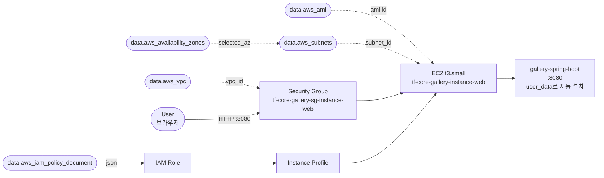

Ch02 Gallery에서 EC2에 Gallery 앱을 수동으로 설치했다. 이번 Gallery에서는 두 가지를 개선한다: `user_data` + `templatefile` + `systemd`로 설치를 자동화하고, State를 S3 Remote Backend에서 관리한다.

| Chapter | Gallery 실습 | 핵심 변화 |
|---------|------------|----------|
| Ch02 | EC2 기본 배포 | 수동 설치 (SSM 접속). Local State |
| **Ch04** | **user_data 자동화 + Remote Backend** | **user_data + systemd. S3 Remote State (처음부터)** |
| Ch06 | 모듈화 + 3-tier 완성 | vpc / sg / ec2 / s3 / rds 모듈. MariaDB + S3 스토리지 |
| Ch07 | 환경 분리 | dev / prod 환경 분리 |
| Ch09 | 검증 추가 | check 블록으로 HTTP 응답 상시 검증 |

### 실습 목표

- `user_data` + `templatefile`로 JDK 설치, 소스 빌드, systemd 서비스 등록을 자동화한다
- 처음부터 S3 Remote Backend로 시작한다 — 04.03 lab01에서 생성한 tfstate 버킷 활용
- `local.org` / `local.project` / `local.namespace` 패턴을 Gallery에 적용한다
- Ch02 Gallery에서 누적한 패턴(data source, SSM, validation, output 객체화)을 자연스럽게 유지한다

---

# 1. 전체 아키텍처



Ch02 Gallery와 동일한 리소스 구성이다. 차이점은 EC2에 `user_data`가 추가되어 SSM으로 접속해 수동 설치할 필요가 없다는 것이다. State는 S3 Remote Backend에 저장된다.

---

# 2. 사전 준비

- Ch02 Sec02~05, Ch04 Sec03 완료
- 04.03 lab01에서 생성한 S3 tfstate 버킷 존재 (`tf-core-tfstate`)
- AWS credentials 설정 완료

```text
Gallery/
├── locals.tf
├── providers.tf
├── variables.tf
├── datasources.tf
├── main.tf
├── outputs.tf
└── templates/
    └── user_data.sh.tpl
```

**설정:**

- region: **`ap-northeast-2`**
- instance_type: **`t3.small`** (Maven 빌드 메모리 여유)
- web_port: **`8080`**
- env: **`dev`**

---

# 3. 파일 작성

## locals.tf

```hcl
locals {
  org         = "tf-core"
  project     = "gallery"
  namespace   = "${local.org}-${local.project}"
  selected_az = data.aws_availability_zones.available.names[var.az_num - 1]
}
```

Ch04부터 `local.org`와 `local.project`를 분리한다. `local.namespace`는 `tf-core-gallery`가 된다.

## providers.tf

```hcl
terraform {
  required_version = ">= 1.14.0"

  required_providers {
    aws = {
      source  = "hashicorp/aws"
      version = "~> 6.0"
    }
  }

  backend "s3" {
    bucket       = "tf-core-tfstate"
    key          = "gallery/terraform.tfstate"
    region       = "ap-northeast-2"
    encrypt      = true
    use_lockfile = true
  }
}

provider "aws" {
  region = var.aws_region

  default_tags {
    tags = {
      Organization = local.org
      Project      = local.project
      Environment  = var.env
      ManagedBy    = "Terraform"
    }
  }
}
```

처음부터 `backend "s3"`를 설정한다. 04.03 lab01에서 생성한 `tf-core-tfstate` 버킷을 사용하고, `key = "gallery/terraform.tfstate"`로 Gallery 전용 State 경로를 지정한다. migration 없이 `terraform init`으로 바로 시작한다.

## variables.tf

```hcl
variable "aws_region" {
  description = "AWS 리전"
  type        = string
  default     = "ap-northeast-2"

  validation {
    condition     = can(regex("^[a-z]{2}-[a-z]+-[0-9]$", var.aws_region))
    error_message = "올바른 AWS 리전 형식이어야 한다 (예: ap-northeast-2)."
  }
}

variable "instance_type" {
  description = "EC2 인스턴스 타입"
  type        = string
  default     = "t3.small"

  validation {
    condition     = contains(["t3.small", "t3.medium"], var.instance_type)
    error_message = "instance_type은 t3.small, t3.medium 중 하나여야 한다."
  }
}

variable "web_port" {
  description = "Gallery 앱 포트"
  type        = number
  default     = 8080

  validation {
    condition     = var.web_port >= 1024 && var.web_port <= 65535
    error_message = "web_port는 1024~65535 범위여야 한다."
  }
}

variable "env" {
  description = "배포 환경"
  type        = string
  default     = "dev"

  validation {
    condition     = contains(["dev", "stg", "prod"], var.env)
    error_message = "env는 dev, stg, prod 중 하나여야 한다."
  }
}

variable "az_num" {
  description = "사용할 가용 영역 번호 (1부터 시작)"
  type        = number
  default     = 1
}
```

## datasources.tf

```hcl
data "aws_ami" "amazon_linux" {
  most_recent = true
  owners      = ["amazon"]

  filter {
    name   = "name"
    values = ["al2023-ami-*-x86_64"]
  }
}

data "aws_availability_zones" "available" {
  state = "available"
}

data "aws_vpc" "default" {
  default = true
}

data "aws_subnets" "default" {
  filter {
    name   = "vpc-id"
    values = [data.aws_vpc.default.id]
  }

  filter {
    name   = "availability-zone"
    values = [local.selected_az]
  }
}

data "aws_iam_policy_document" "ec2_assume_role" {
  statement {
    actions = ["sts:AssumeRole"]
    effect  = "Allow"

    principals {
      type        = "Service"
      identifiers = ["ec2.amazonaws.com"]
    }
  }
}

data "aws_iam_policy" "aws_ssm_core_policy" {
  name = "AmazonSSMManagedInstanceCore"
}
```

## templates/user_data.sh.tpl

```bash
#!/bin/bash
set -euo pipefail

# 1. JDK 21 + git 설치
dnf install -y java-21-amazon-corretto-headless git

# 2. 디렉토리 준비
APP_DIR=/opt/gallery
REPO_DIR=/home/ec2-user/workspace
mkdir -p "$${APP_DIR}"
chown -R ec2-user:ec2-user "$${APP_DIR}"

# 3. 소스 클론 + 빌드
sudo -u ec2-user bash -lc "
set -euo pipefail
cd /home/ec2-user
rm -rf workspace
git clone --filter=blob:none --sparse https://github.com/kickscar/learning-series.git workspace
cd workspace
git sparse-checkout init --no-cone
git sparse-checkout set Cloud/Workloads/gallery-spring-boot
cd Cloud/Workloads/gallery-spring-boot
chmod +x ./mvnw
./mvnw clean package -DskipTests -Dbuild.finalName=gallery
"

# 4. JAR 복사
cp "$${REPO_DIR}/Cloud/Workloads/gallery-spring-boot/target/gallery.jar" "$${APP_DIR}/gallery.jar"
chown ec2-user:ec2-user "$${APP_DIR}/gallery.jar"

# 5. systemd 서비스 등록
cat >/etc/systemd/system/gallery.service <<EOF
[Unit]
Description=Gallery Spring Boot
After=network.target

[Service]
Type=simple
User=ec2-user
WorkingDirectory=/opt/gallery
ExecStart=/usr/bin/java -jar /opt/gallery/gallery.jar --spring.profiles.active=${profile} --server.port=${server_port}
Restart=always
RestartSec=5
SuccessExitStatus=143

[Install]
WantedBy=multi-user.target
EOF

systemctl daemon-reload
systemctl enable --now gallery.service
```

`${profile}`과 `${server_port}`는 `templatefile`이 Terraform 변수 값으로 치환한다. `$$`는 templatefile에서 리터럴 `$`를 출력하기 위한 이스케이프다.

## main.tf

```hcl
resource "aws_security_group" "instance_web" {
  name        = "${local.namespace}-sg-instance-web"
  description = "${local.namespace} instance web Security Group"
  vpc_id      = data.aws_vpc.default.id

  ingress {
    from_port   = var.web_port
    to_port     = var.web_port
    protocol    = "tcp"
    cidr_blocks = ["0.0.0.0/0"]
  }

  egress {
    from_port   = 0
    to_port     = 0
    protocol    = "-1"
    cidr_blocks = ["0.0.0.0/0"]
  }

  tags = {
    Name = "${local.namespace}-sg-instance-web"
  }
}

resource "aws_iam_role" "instance_web" {
  name               = "${local.namespace}-iamrole-instance-web"
  assume_role_policy = data.aws_iam_policy_document.ec2_assume_role.json

  tags = {
    Name = "${local.namespace}-iamrole-instance-web"
  }
}

resource "aws_iam_role_policy_attachment" "instance_web_ssm" {
  role       = aws_iam_role.instance_web.name
  policy_arn = data.aws_iam_policy.aws_ssm_core_policy.arn
}

resource "aws_iam_instance_profile" "instance_web" {
  name = "${local.namespace}-iamprofile-instance-web"
  role = aws_iam_role.instance_web.name

  tags = {
    Name = "${local.namespace}-iamprofile-instance-web"
  }
}

resource "aws_instance" "web" {
  ami                         = data.aws_ami.amazon_linux.id
  instance_type               = var.instance_type
  subnet_id                   = data.aws_subnets.default.ids[0]
  associate_public_ip_address = true
  vpc_security_group_ids      = [aws_security_group.instance_web.id]
  iam_instance_profile        = aws_iam_instance_profile.instance_web.name

  user_data = templatefile("${path.module}/templates/user_data.sh.tpl", {
    profile     = var.env
    server_port = var.web_port
  })

  depends_on = [aws_iam_role_policy_attachment.instance_web_ssm]

  tags = {
    Name = "${local.namespace}-instance-web"
  }
}
```

Ch02 Gallery와의 차이점은 `user_data` 블록이다. `templatefile`로 `user_data.sh.tpl` 파일을 읽고, `${profile}`에 `var.env`, `${server_port}`에 `var.web_port` 값을 주입한다. SSM 접속해서 수동으로 설치할 필요가 없다.

## outputs.tf

```hcl
output "instance_web" {
  description = "Gallery EC2 인스턴스 정보"
  value = {
    id            = aws_instance.web.id
    public_ip     = aws_instance.web.public_ip
    http_endpoint = "http://${aws_instance.web.public_ip}:${var.web_port}"
  }
}

output "sg_instance_web" {
  description = "Gallery Security Group 정보"
  value = {
    id   = aws_security_group.instance_web.id
    name = aws_security_group.instance_web.name
  }
}
```

---

# 4. terraform init

```bash
$ terraform init
```

```text
Initializing the backend...

Successfully configured the backend "s3"! Terraform will automatically
use this backend unless the backend configuration changes.

Initializing provider plugins...
- Finding hashicorp/aws versions matching "~> 6.0"...
- Installing hashicorp/aws v6.x.x...

Terraform has been successfully initialized!
```

처음부터 `backend "s3"`가 설정되어 있으므로 migration 없이 바로 S3 backend로 초기화된다. State가 `tf-core-tfstate` 버킷의 `gallery/terraform.tfstate`에 생성된다.

---

# 5. terraform apply

```bash
$ terraform apply
```

```text
data.aws_ami.amazon_linux: Reading...
data.aws_availability_zones.available: Reading...
data.aws_vpc.default: Reading...
data.aws_iam_policy_document.ec2_assume_role: Reading...
...(생략)...

aws_iam_role.instance_web: Creating...
aws_security_group.instance_web: Creating...
aws_iam_role.instance_web: Creation complete after 1s
aws_iam_role_policy_attachment.instance_web_ssm: Creating...
aws_iam_instance_profile.instance_web: Creating...
aws_security_group.instance_web: Creation complete after 2s
aws_iam_role_policy_attachment.instance_web_ssm: Creation complete after 1s
aws_iam_instance_profile.instance_web: Creation complete after 1s
aws_instance.web: Creating...
aws_instance.web: Still creating... [10s elapsed]
aws_instance.web: Still creating... [20s elapsed]
aws_instance.web: Creation complete after 32s

Apply complete! Resources: 5 added, 0 changed, 0 destroyed.

Outputs:

instance_web = {
  "http_endpoint" = "http://13.125.xxx.xxx:8080"
  "id"            = "i-xxxxxxxxxxxxxxxxx"
  "public_ip"     = "13.125.xxx.xxx"
}
sg_instance_web = {
  "id"   = "sg-xxxxxxxxxxxxxxxxx"
  "name" = "tf-core-gallery-sg-instance-web"
}
```

---

# 6. 결과 확인

EC2가 시작되면 `user_data` 스크립트가 자동으로 실행된다. JDK 설치, 소스 빌드, systemd 서비스 등록까지 약 3~5분 소요된다.

```bash
$ terraform output -json instance_web | jq -r '.http_endpoint'
```

```text
http://13.125.xxx.xxx:8080
```

브라우저에서 해당 주소로 접속한다.

[콘솔화면: 브라우저 > http://{public_ip}:8080 > Gallery 앱 메인 화면]

Gallery 메인 화면이 표시되면 자동 배포가 성공한 것이다. Ch02 Gallery에서는 SSM으로 접속해 JDK 설치, 소스 빌드, 앱 실행을 직접 수행했다. 이제는 `terraform apply` 한 번으로 앱이 실행 상태가 된다.

S3에서 State 파일을 확인한다.

[콘솔화면: AWS Console > S3 > tf-core-tfstate > gallery/terraform.tfstate 파일 존재 확인]

---

# 7. 실험: var.web_port 변경

Ch02 Gallery에서는 `-var "web_port=80"`을 줘도 SG ingress 규칙만 변경되고 앱은 여전히 8080에서 리스닝했다 — user_data가 없어서 앱 포트를 제어할 수 없었다. 이제 `templatefile`로 `var.web_port`가 SG와 user_data 양쪽에 주입되므로 같은 실험을 다시 해본다.

```bash
$ terraform plan -var="web_port=9090"
```

```text
  # aws_security_group.instance_web will be updated in-place
  ~ resource "aws_security_group" "instance_web" {
      ~ ingress {
          ~ from_port = 8080 -> 9090
          ~ to_port   = 8080 -> 9090
        }
    }

  # aws_instance.web must be replaced
-/+ resource "aws_instance" "web" {
      ~ user_data = "..." -> "..."     # forces replacement
      ...
    }

Plan: 1 to add, 1 to change, 1 to destroy.
```

SG는 in-place 수정(`~`)이지만, EC2는 **재생성**(`-/+`)이다. `user_data` 값이 바뀌면 EC2를 교체해야 하기 때문이다. `var.web_port` 하나로 SG 포트와 앱 포트가 동기화되지만, 대가는 EC2 재생성이다.

EC2 재생성의 부수효과는 **퍼블릭 IP 변경**이다. 이를 완화하는 방법은 클라우드 공통으로 존재한다:

- `create_before_destroy`로 `-/+` → `+/-` 전환 — 다운타임 최소화 (Ch03 Sec03에서 다룸)
- 고정 IP 할당 (AWS EIP 등) — EC2가 교체되어도 IP 유지
- 로드밸런서 (AWS ALB 등) — 엔드포인트를 인스턴스가 아닌 LB로 고정

이 시리즈에서는 다루지 않지만, 인프라 설계 시 EC2 재생성을 전제로 엔드포인트를 분리하는 것이 일반적이다.

이 실험은 plan 확인만 하고 apply하지 않는다. 기본값(8080)을 유지한다.

---

# 8. user_data 디버깅 참고

user_data 스크립트가 실패하면 앱이 시작되지 않는다. cloud-init 로그로 확인한다.

```bash
# SSM Session Manager로 접속 후
$ sudo cat /var/log/cloud-init-output.log | tail -50
```

자주 발생하는 문제:

| 증상 | 원인 | 확인 |
|------|------|------|
| 앱 접속 안 됨 | user_data 실행 중 (3~5분 소요) | `systemctl status gallery` |
| BUILD FAILURE | Maven 빌드 메모리 부족 | `t3.small` 이상 확인 |
| Service not found | systemd 등록 실패 | cloud-init-output.log 확인 |

---

# 9. 정리

이 Gallery 인프라는 **Ch06 Gallery에서 모듈화할 때 기반**이 된다. `terraform destroy`를 실행하지 않는다.

실습 후 비용이 부담된다면 EC2 인스턴스만 삭제할 수 있다:

```bash
$ terraform destroy -target=aws_instance.web
```

SG, IAM Role 등 나머지 리소스는 비용이 발생하지 않으므로 State에 유지한다. 다시 실습할 때 `terraform apply`를 실행하면 EC2만 재생성된다. Ch03 Sec02에서 다룬 `-target`의 실제 활용 사례다.

시리즈를 완전히 중단하고 전체 인프라를 정리해야 할 경우:

```bash
$ terraform destroy
```

```text
Destroy complete! Resources: 5 destroyed.
```

---

# 핵심 정리

- Ch02 Gallery의 수동 설치를 `user_data` + `templatefile` + `systemd`로 자동화했다
- `templatefile`로 Terraform 변수(`var.env`)를 shell 스크립트에 주입한다
- 04.03 lab01에서 생성한 S3 tfstate 버킷을 활용해 **처음부터 Remote Backend**로 시작했다 — migration 불필요
- `local.org` / `local.project` / `local.namespace` 패턴과 `Organization` / `Project` 태그 분리를 적용했다
- 이 Gallery 인프라는 Ch06에서 모듈화할 때 기반이 된다

---

# 참고 자료

- [templatefile — Terraform 공식 문서](https://developer.hashicorp.com/terraform/language/functions/templatefile)
- [user_data — aws_instance Resource](https://registry.terraform.io/providers/hashicorp/aws/latest/docs/resources/instance#user_data)
- [S3 Backend — Terraform 공식 문서](https://developer.hashicorp.com/terraform/language/settings/backends/s3)
- [cloud-init — AWS 공식 문서](https://docs.aws.amazon.com/AWSEC2/latest/UserGuide/user-data.html)
