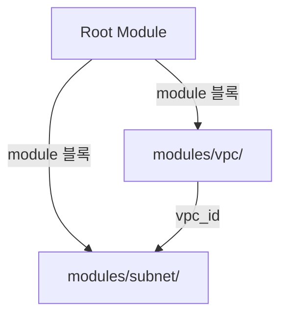
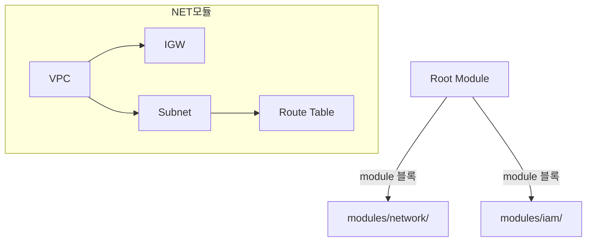
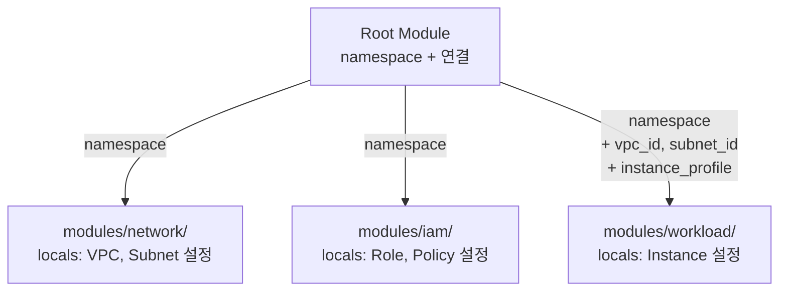

Ch04까지 Terraform 도구를 학습했다. 이번 챕터부터 코드를 구조화한다. 모듈의 개념과 입출력을 이해하고, 점진적으로 모듈을 만들어 EC2 인스턴스를 배포한다. 이 챕터에서는 동적 구성 없이 하드코딩으로 모듈 구조에 집중한다.

---

# 모듈이란

## 1. 디렉토리가 모듈이다

`.tf` 파일이 있는 디렉토리 하나가 모듈 하나다. 지금까지 `terraform apply`를 실행하던 디렉토리가 **root module**이다. root module에서 `module` 블록으로 호출하는 디렉토리가 **child module**이다.

```text
lab01/                    ← root module
├── main.tf
├── ...
└── modules/
    ├── vpc/              ← child module
    │   ├── variables.tf
    │   ├── main.tf
    │   └── outputs.tf
    └── subnet/           ← child module
        ├── variables.tf
        ├── main.tf
        └── outputs.tf
```

디렉토리 안에 `.tf` 파일이 있으면 그것이 모듈이다. 특별한 선언이 필요하지 않다.

## 2. Console에서 Module로

AWS Console에서 VPC를 생성할 때를 떠올려보자.

| 항목 | Console | Terraform Module |
|------|---------|-----------------|
| 이름 | Name 태그 | `variable "name"` |
| CIDR | IPv4 CIDR block | `variable "cidr_block"` |
| 결과 | VPC ID | `output "id"` |

Subnet도 동일하다.

| 항목 | Console | Terraform Module |
|------|---------|-----------------|
| 이름 | Name 태그 | `variable "name"` |
| VPC | VPC 드롭다운 | `variable "vpc_id"` |
| CIDR | IPv4 CIDR block | `variable "cidr_block"` |
| 가용 영역 | Availability Zone | `variable "availability_zone"` |
| 결과 | Subnet ID | `output "id"` |

**Console의 입력 폼이 `variables.tf`이고, 결과 화면이 `outputs.tf`다.** 모듈은 Console의 리소스 생성 화면을 코드로 옮긴 것이라고 생각하면 된다.

## 3. module 블록

root module에서 child module을 호출하는 블록이다.

```hcl
module "vpc" {
  source    = "./modules/vpc"

  namespace  = local.namespace
  name       = "main"
  cidr_block = "10.0.0.0/16"
}
```

| 요소 | 설명 |
|------|------|
| `"vpc"` | 모듈 호출 이름. `module.vpc`로 참조 |
| `source` | 모듈 디렉토리 경로. 로컬 모듈은 `./` 필수 |
| 나머지 인수 | child module의 `variable`에 대응 |

`source`에 `./`가 없으면 Terraform은 Registry 모듈로 해석한다. 로컬 모듈은 반드시 `./` 또는 `../`로 시작해야 한다.

## 4. 리소스 설정값의 variable화

VPC를 만들려면 세 가지를 설정해야 한다.

```hcl
resource "aws_vpc" "this" {
  cidr_block           = "10.0.0.0/16"
  enable_dns_support   = true
  enable_dns_hostnames = true
}
```

이걸 모듈로 만들면 세 값을 variable로 노출한다. 리소스 블록의 설정값이 모듈 내부에 하드코딩되면 호출자가 제어할 수 없다. **가급적 모든 설정값을 variable로 노출하되**, 합리적인 default가 있는 값은 기본값을 제공한다.

```hcl
# modules/vpc/variables.tf
variable "cidr_block" {
  type        = string
  description = "VPC CIDR Block"
}

variable "enable_dns_support" {
  type        = bool
  default     = true
  description = "DNS Support"
}

variable "enable_dns_hostnames" {
  type        = bool
  default     = true
  description = "DNS Hostnames"
}
```

`cidr_block`은 필수다 — 호출자가 반드시 지정해야 한다. `enable_dns_support`와 `enable_dns_hostnames`는 `default = true`이므로 생략하면 기본값이 적용되고, 필요하면 override할 수 있다.

```hcl
# 호출 — enable_dns_* 생략, default 적용
module "vpc" {
  source     = "./modules/vpc"
  cidr_block = "10.0.0.0/16"
}
```

variable 이름은 **Terraform 리소스 블록의 인수 이름과 일치**시킨다. `aws_vpc`의 인수가 `cidr_block`이면 variable도 `cidr_block`, `aws_subnet`의 인수가 `availability_zone`이면 variable도 `availability_zone`이다.

| 이점 | 설명 |
|------|------|
| 혼동 방지 | `cidr`인지 `cidr_block`인지 고민할 필요 없다 — Provider 문서와 이름이 같다 |
| 코드 가독성 | 리소스 블록에서 `cidr_block = var.vpc.cidr_block` — 인수와 변수가 1:1 매핑 |
| 검색 용이 | Provider 문서에서 인수 이름으로 검색하면 variable도 바로 찾을 수 있다 |

이 원칙은 이후 모든 모듈에 동일하게 적용한다.

## 5. 모듈 output과 참조

모듈의 output은 child module이 외부에 공개하는 값이다.

```hcl
# modules/vpc/outputs.tf
output "id" {
  value = aws_vpc.this.id
}
```

호출한 쪽에서는 `module.<호출이름>.<output명>`으로 참조한다.

```hcl
module.vpc.id
```

이 참조를 다른 모듈의 input으로 전달하면 모듈 간 연결이 된다.

## 6. Provider 상속

child module에 `provider` 블록을 정의하지 않는다. root module의 Provider 설정이 자동으로 상속된다.

```text
root module (provider "aws" 정의)
  └── modules/vpc/    ← provider 블록 없음, root에서 상속
  └── modules/subnet/ ← provider 블록 없음, root에서 상속
```

child module에 `provider` 블록을 정의하면 legacy module이 되어 `count`, `for_each`, `depends_on`을 사용할 수 없다. 이유가 있어서 금지하는 것이다.

## 7. 독립 scope

각 module은 독립된 scope를 갖는다. 형제 module이나 부모 module의 리소스를 직접 참조할 수 없다.

```text
module "vpc"     → module "subnet"에 직접 접근 불가
module "subnet"  → module "vpc"에 직접 접근 불가
```

모듈 간 데이터 전달은 반드시 **output → variable** 경로를 따른다. root module이 중개자 역할을 한다.

```hcl
# root module의 main.tf
module "subnet" {
  source = "./modules/subnet"
  vpc_id = module.vpc.id    # vpc output → subnet variable
}
```

이 참조가 Terraform에게 "vpc를 먼저 만들어야 한다"는 암묵적 의존성을 알려준다 — Ch03에서 배운 Dependency Graph의 모듈 버전이다.

---

# 핵심 정리

- 디렉토리 = 모듈. root module에서 `module` 블록으로 child module을 호출한다.
- Console의 입력 필드가 variable, 결과가 output이다.
- source에 `./` 필수. Provider는 root에서 자동 상속한다.
- output 참조: `module.<호출이름>.<output명>`. 이 참조가 모듈 간 의존성을 만든다.
- 모듈은 독립 scope. 데이터 전달은 output → variable만 가능하다.

다음 섹션에서 모듈화의 경계와 인프라 계층을 다룬다.

---

# 참고 자료

- [Modules Overview — Terraform 공식 문서](https://developer.hashicorp.com/terraform/language/modules)
- [Module Sources — Terraform 공식 문서](https://developer.hashicorp.com/terraform/language/modules/sources)
- [Standard Module Structure — Terraform 공식 문서](https://developer.hashicorp.com/terraform/language/modules/develop/structure)
- [Providers Within Modules — Terraform 공식 문서](https://developer.hashicorp.com/terraform/language/modules/develop/providers)

---

# [실습] lab01: VPC + Subnet 모듈 — 모듈 기초

VPC와 Subnet을 각각 독립 모듈로 만들고, root module에서 호출해 연결한다. 모듈의 input/output과 모듈 간 참조를 실습한다.

### 실습 목표

- vpc/, subnet/ 두 개 단일 리소스 모듈 작성
- variable(입력)과 output(출력) 설계
- `module.<이름>.<output명>` 참조로 모듈 간 연결
- `terraform output`으로 결과 확인

---

# 1. 전체 아키텍처



root module이 vpc와 subnet 두 child module을 호출한다. subnet module은 vpc module의 output(`id`)을 입력으로 받는다. 이 참조가 암묵적 의존성을 만든다.

---

# 2. 사전 준비

```text
lab01/
├── variables.tf
├── locals.tf
├── providers.tf
├── main.tf
├── outputs.tf
└── modules/
    ├── vpc/
    │   ├── variables.tf
    │   ├── main.tf
    │   └── outputs.tf
    └── subnet/
        ├── variables.tf
        ├── main.tf
        └── outputs.tf
```

---

# 3. modules/vpc/ 작성

## main.tf

```hcl
# resource "aws_vpc" "this" {
#   cidr_block           = "10.0.0.0/16"
#   enable_dns_support   = true
#   enable_dns_hostnames = true
# }

resource "aws_vpc" "this" {
  cidr_block           = var.cidr_block
  enable_dns_support   = var.enable_dns_support
  enable_dns_hostnames = var.enable_dns_hostnames

  tags = {
    Name = "${var.namespace}-vpc-${var.name}"
  }
}
```

주석은 VPC 리소스 원형이다. 모듈에서는 세 설정값을 모두 variable로 노출한다. 02.04에서 도입한 `this` 레이블을 모듈에서도 사용한다. Name 태그의 `namespace`와 `name`은 모듈 외부에서 결정하고, `vpc`(capability)는 모듈 내부에서 결정한다.

## variables.tf

```hcl
variable "namespace" {
  type        = string
  description = "Resource Naming Prefix"
}

variable "name" {
  type        = string
  description = "VPC Name Tag"
}

variable "cidr_block" {
  type        = string
  description = "VPC CIDR Block"
}

variable "enable_dns_support" {
  type        = bool
  default     = true
  description = "VPC DNS Resolution Identifier"
}

variable "enable_dns_hostnames" {
  type        = bool
  default     = true
  description = "VPC Resource Hostname Assignment"
}
```

`namespace`는 02.04에서 도입한 리소스 네이밍 접두어다. `name`은 02.04에서 도입한 identity다. 모듈에서는 이 두 값을 variable로 받아서 Name 태그를 조립한다.

`cidr_block`은 필수, `enable_dns_support`와 `enable_dns_hostnames`는 `default = true`로 합리적인 기본값을 제공한다. 호출자가 생략하면 기본값이 적용되고, 필요하면 override할 수 있다.

## outputs.tf

```hcl
output "id" {
  value = aws_vpc.this.id
}
```

단일 리소스 모듈이므로 output도 단순하다. `module.vpc.id`로 참조한다.

---

# 4. modules/subnet/ 작성

## main.tf

```hcl
# resource "aws_subnet" "this" {
#   vpc_id                  = "vpc-0abc1234567890def"
#   cidr_block              = "10.0.1.0/24"
#   availability_zone       = "ap-northeast-2a"
#   map_public_ip_on_launch = true
# }

resource "aws_subnet" "this" {
  vpc_id                  = var.vpc_id
  cidr_block              = var.cidr_block
  availability_zone       = var.availability_zone
  map_public_ip_on_launch = var.map_public_ip_on_launch

  tags = {
    Name = "${var.namespace}-subnet-${var.name}"
  }
}
```

Subnet 리소스 원형과 모듈화된 코드. Console에서 Subnet 생성 시 VPC를 선택하고 CIDR과 AZ를 입력하는 것과 같다. `map_public_ip_on_launch`도 variable로 노출한다.

## variables.tf

```hcl
variable "namespace" {
  type        = string
  description = "Resource Naming Prefix"
}

variable "name" {
  type        = string
  description = "Subnet Name Tag"
}

variable "vpc_id" {
  type        = string
  description = "Target VPC ID"
}

variable "availability_zone" {
  type        = string
  description = "Target Availability Zone"
}

variable "cidr_block" {
  type        = string
  description = "Subnet CIDR Block"
}

variable "map_public_ip_on_launch" {
  type        = bool
  default     = true
  description = "Public IP Auto-assignment Policy"
}
```

`vpc_id`, `cidr_block`, `availability_zone`은 필수. `map_public_ip_on_launch`는 `default = true`로 기본값 제공. variable 이름이 AWS 리소스 argument와 일치한다.

## outputs.tf

```hcl
output "id" {
  value = aws_subnet.this.id
}
```

---

# 5. root module 작성

## main.tf

```hcl
module "vpc" {
  source    = "./modules/vpc"
  namespace = local.namespace
  name      = "main"
  cidr_block = "10.0.0.0/16"
}

module "subnet" {
  source    = "./modules/subnet"
  namespace = local.namespace
  name      = "public-a"
  vpc_id            = module.vpc.id
  cidr_block        = "10.0.1.0/24"
  availability_zone = "ap-northeast-2a"
}
```

`module.vpc.id` — vpc module의 output `id`를 subnet module의 `vpc_id` variable에 전달한다. 이 참조가 암묵적 의존성을 만든다.

## locals.tf

```hcl
locals {
  org     = "tf-core"
  project = "lab01"

  namespace = "${local.org}-${local.project}"
}
```

## providers.tf

```hcl
terraform {
  required_version = ">=1.14.0"

  required_providers {
    aws = {
      source  = "hashicorp/aws"
      version = "~> 6.0"
    }
  }
}

provider "aws" {
  region = "ap-northeast-2"

  default_tags {
    tags = {
      Organization = local.org
      Project      = local.project
      ManagedBy    = "Terraform"
    }
  }
}
```

## outputs.tf

```hcl
output "vpc" {
  value = {
    id = module.vpc.id
  }
}

output "subnet" {
  value = {
    id = module.subnet.id
  }
}
```

output을 단순 값이 아니라 **속성을 명시한 object**로 구성한다. `id`가 무엇의 id인지 output 이름(`vpc`, `subnet`)이 구분해준다.

---

# 6. terraform init

```bash
$ terraform init
```

```text
Initializing modules...
- vpc in modules/vpc
- subnet in modules/subnet

Initializing provider plugins...
- Finding hashicorp/aws versions matching "~> 6.0"...
- Installing hashicorp/aws v6.x.x...

Terraform has been successfully initialized!
```

`terraform init`이 모듈 디렉토리를 인식한다. 로컬 모듈은 파일 복사 없이 경로만 기록한다.

---

# 7. terraform apply

```bash
$ terraform apply
```

```text
Terraform will perform the following actions:

  # module.vpc.aws_vpc.this will be created
  + resource "aws_vpc" "this" {
      + cidr_block           = "10.0.0.0/16"
      + enable_dns_hostnames = true
      + enable_dns_support   = true
      + id                   = (known after apply)
      + tags                 = {
          + "Name" = "tf-core-lab01-vpc-main"
        }
      + tags_all             = {
          + "ManagedBy"    = "Terraform"
          + "Name"         = "tf-core-lab01-vpc-main"
          + "Organization" = "tf-core"
          + "Project"      = "lab01"
        }
      ...
    }

  # module.subnet.aws_subnet.this will be created
  + resource "aws_subnet" "this" {
      + availability_zone       = "ap-northeast-2a"
      + cidr_block              = "10.0.1.0/24"
      + id                      = (known after apply)
      + tags                    = {
          + "Name" = "tf-core-lab01-subnet-public-a"
        }
      + vpc_id                  = (known after apply)
      ...
    }

Plan: 2 to add, 0 to change, 0 to destroy.

...(생략)...

Apply complete! Resources: 2 added, 0 changed, 0 destroyed.
```

리소스 주소가 `module.vpc.aws_vpc.this`, `module.subnet.aws_subnet.this`로 표시된다. 모듈 안의 리소스는 `module.<호출이름>.<타입>.<이름>` 형식이다.

---

# 8. terraform output

```bash
$ terraform output
```

```text
subnet = {
  "id" = "subnet-0abc1234567890def"
}
vpc = {
  "id" = "vpc-0abc1234567890def"
}
```

각 output이 속성명(`id`)을 포함한 object로 표시된다.

---

# 9. terraform destroy

```bash
$ terraform destroy
```

```text
Destroy complete! Resources: 2 destroyed.
```

---

# [실습] lab02: Network + IAM 모듈 — 모듈 합치기

lab01의 vpc/, subnet/ 모듈을 하나의 network/ 모듈로 합치고, IAM 모듈을 추가한다. 모듈을 합치는 판단과 모듈 내부에 `datasources.tf`를 분리하는 구성을 경험한다.

### 실습 목표

- lab01의 vpc + subnet → network 모듈로 합치기
- VPC + IGW + Subnet + Route Table을 한 모듈에 구성
- IAM 모듈 작성 (`datasources.tf` 분리)
- 여러 리소스의 name을 구분하는 variable 설계

---

# 1. 전체 아키텍처



lab01에서 VPC와 Subnet이 항상 함께 만들어졌다. Subnet은 VPC 없이 존재할 수 없고, IGW와 Route Table은 Subnet이 인터넷에 접근하려면 필요하다. 따로 관리할 이유가 없으면 하나의 모듈로 합친다.

---

# 2. 사전 준비

```text
lab02/
├── variables.tf
├── locals.tf
├── providers.tf
├── datasources.tf
├── main.tf
├── outputs.tf
└── modules/
    ├── network/
    │   ├── variables.tf
    │   ├── main.tf
    │   └── outputs.tf
    └── iam/
        ├── variables.tf
        ├── main.tf
        ├── datasources.tf
        └── outputs.tf
```

IAM 모듈에 `datasources.tf`가 있다. 모듈의 파일 구성은 자유롭다. `main.tf` 하나일 수도 있고, 역할별로 분리할 수도 있다.

---

# 3. modules/network/ 작성

## main.tf

```hcl
resource "aws_vpc" "this" {
  cidr_block           = var.vpc_cidr
  enable_dns_support   = var.vpc_enable_dns_support
  enable_dns_hostnames = var.vpc_enable_dns_hostnames

  tags = {
    Name = "${var.namespace}-vpc-${var.vpc_name}"
  }
}

resource "aws_internet_gateway" "this" {
  vpc_id = aws_vpc.this.id

  tags = {
    Name = "${var.namespace}-igw"
  }
}

resource "aws_subnet" "this" {
  vpc_id                  = aws_vpc.this.id
  cidr_block              = var.subnet_cidr_block
  availability_zone       = var.subnet_availability_zone
  map_public_ip_on_launch = var.subnet_map_public_ip_on_launch

  tags = {
    Name = "${var.namespace}-subnet-${var.subnet_name}"
  }
}

resource "aws_route_table" "this" {
  vpc_id = aws_vpc.this.id

  route {
    cidr_block = "0.0.0.0/0"
    gateway_id = aws_internet_gateway.this.id
  }

  tags = {
    Name = "${var.namespace}-rtb-${var.subnet_name}"
  }
}

resource "aws_route_table_association" "main" {
  subnet_id      = aws_subnet.this.id
  route_table_id = aws_route_table.this.id
}
```

lab01의 vpc/와 subnet/을 하나의 모듈로 합쳤다. 같은 모듈 안이므로 `aws_vpc.this.id`를 모든 리소스에서 자유롭게 참조할 수 있다. lab01에서 root module이 중개하던 VPC ID를 이제 모듈 내부에서 바로 쓴다.

여러 리소스가 한 모듈에 들어가면서 variable에 `vpc_`, `subnet_` 접두어가 붙는다. 어떤 리소스의 설정인지 구분하기 위해서다.

## variables.tf

```hcl
variable "namespace" {
  type        = string
  description = "Resource Naming Prefix"
}

variable "vpc_name" {
  type        = string
  description = "VPC Name Tag"
}

variable "vpc_cidr" {
  type        = string
  description = "VPC CIDR"
}

variable "vpc_enable_dns_support" {
  type        = bool
  default     = true
  description = "VPC DNS Resolution Identifier"
}

variable "vpc_enable_dns_hostnames" {
  type        = bool
  default     = true
  description = "VPC Resource Hostname Assignment"
}

variable "subnet_name" {
  type        = string
  description = "Subnet Name Tag"
}

variable "subnet_availability_zone" {
  type        = string
  description = "Target Availability Zone"
}

variable "subnet_cidr_block" {
  type        = string
  description = "Subnet CIDR Block"
}

variable "subnet_map_public_ip_on_launch" {
  type        = bool
  default     = true
  description = "Public IP Auto-assignment Policy"
}
```

lab01에서는 단일 리소스 모듈이라 `name` 하나로 충분했다. 여러 리소스를 담는 모듈에서는 접두어로 구분한다. `vpc_name`, `subnet_name`처럼 어떤 리소스의 설정인지 이름에 드러난다.

## outputs.tf

```hcl
output "vpc" {
  value = {
    id = aws_vpc.this.id
  }
}

output "subnet" {
  value = {
    id = aws_subnet.this.id
  }
}
```

여러 리소스를 담는 모듈은 output을 리소스별 object로 구분한다. 한 개 값이라도 `{ id = ... }`처럼 **속성명을 명시**한다. 호출 측에서 `module.network.vpc.id`, `module.network.subnet.id`로 접근한다. output 이름(`vpc`, `subnet`)이 네임스페이스 역할을 하므로 속성명이 충돌하지 않는다.

---

# 4. modules/iam/ 작성

이 모듈은 EC2 인스턴스가 AWS 서비스에 접근하기 위한 IAM Role과 Instance Profile을 생성한다. 호출자가 정책 ARN을 전달하면, 모듈이 Role 생성 → 정책 부착 → Instance Profile 생성을 내부에서 처리하고, Instance Profile name만 외부에 내보낸다.

## main.tf

```hcl
# resource "aws_iam_role" "this" {
#   name               = "tf-core-lab02-iamrole-instance-web"
#   assume_role_policy = jsonencode({
#     Version = "2012-10-17"
#     Statement = [{
#       Action    = "sts:AssumeRole"
#       Effect    = "Allow"
#       Principal = { Service = "ec2.amazonaws.com" }
#     }]
#   })
# }
#
# resource "aws_iam_role_policy_attachment" "this" {
#   role       = aws_iam_role.this.name
#   policy_arn = "arn:aws:iam::aws:policy/AmazonSSMManagedInstanceCore"
# }
#
# resource "aws_iam_instance_profile" "this" {
#   name = "tf-core-lab02-iamprofile-instance-web"
#   role = aws_iam_role.this.name
# }

resource "aws_iam_role" "this" {
  name = "${var.namespace}-iamrole-${var.role_name}"

  assume_role_policy = data.aws_iam_policy_document.ec2_assume_role_policy.json

  tags = {
    Name = "${var.namespace}-iamrole-${var.role_name}"
  }
}

resource "aws_iam_role_policy_attachment" "this" {
  role       = aws_iam_role.this.name
  policy_arn = var.policy_arn
}

resource "aws_iam_instance_profile" "this" {
  name = "${var.namespace}-iamprofile-${var.role_name}"
  role = aws_iam_role.this.name

  tags = {
    Name = "${var.namespace}-iamprofile-${var.role_name}"
  }
}
```

주석은 IAM 리소스 원형이다. Role은 trust policy(assume role)로 EC2 서비스를 지정하고, 정책을 부착하고, Instance Profile을 생성한다. 모듈에서는 `role_name`과 `policy_arn`을 variable로 노출한다. 어떤 정책을 붙일지는 호출자가 결정한다.

## variables.tf

```hcl
variable "namespace" {
  type        = string
  description = "Resource Naming Prefix"
}

variable "role_name" {
  type        = string
  description = "IAM Role Name Tag"
}

variable "policy_arn" {
  type        = string
  description = "IAM Policy ARN"
}
```

`role_name = "instance-web"`. 이 Role이 누구를 위한 것인지(instance)와 무엇을 하는 인스턴스인지(web)를 담는다.

## datasources.tf

```hcl
data "aws_iam_policy_document" "ec2_assume_role_policy" {
  statement {
    actions = ["sts:AssumeRole"]
    effect  = "Allow"

    principals {
      type        = "Service"
      identifiers = ["ec2.amazonaws.com"]
    }
  }
}
```

assume role policy는 모듈 내부에서 정의한다. EC2용 trust policy는 이 모듈의 고유 로직이다.

## outputs.tf

```hcl
output "instance_profile" {
  value = {
    name = aws_iam_instance_profile.this.name
  }
}
```

Instance Profile name만 내보낸다. Role은 모듈 내부 구현이므로 외부에 노출하지 않는다.

---

# 5. root module

## locals.tf

```hcl
locals {
  org     = "tf-core"
  project = "lab02"

  namespace = "${local.org}-${local.project}"
}
```

## providers.tf

lab01과 동일하다.

## datasources.tf

```hcl
data "aws_iam_policy" "aws_ssm_core_policy" {
  name = "AmazonSSMManagedInstanceCore"
}
```

SSM 정책의 ARN을 root module에서 조회하고, IAM 모듈에 전달한다. 어떤 정책을 붙일지는 모듈 호출자가 결정한다.

## main.tf

```hcl
module "network" {
  source = "./modules/network"

  namespace   = local.namespace
  vpc_name    = "main"
  vpc_cidr    = "10.0.0.0/16"
  subnet_name              = "public-a"
  subnet_availability_zone = "ap-northeast-2a"
  subnet_cidr_block        = "10.0.1.0/24"
}

module "iam" {
  source = "./modules/iam"

  namespace  = local.namespace
  role_name  = "instance-web"
  policy_arn = data.aws_iam_policy.aws_ssm_core_policy.arn
}
```

## outputs.tf

```hcl
output "module_output" {
  value = {
    network = module.network
    iam     = module.iam
  }
}
```

root module의 output은 세 가지 용도가 있다.

| 용도 | 예시 | 소비자 |
|------|------|--------|
| 디버깅/개발 | `module.network` 전체 노출 | 개발자 (`terraform output`) |
| 사용자 접근 정보 | 접속 URL, IP 등 | 최종 사용자 (브라우저) |
| State 간 연동 | 특정 id/arn 선별 노출 | 다른 프로젝트 (`terraform_remote_state`) |

여기서는 디버깅/개발 용도로 모듈 output 전체를 `terraform output`으로 확인한다. `module.network`과 `module.iam`을 그대로 출력하면 모듈이 내보내는 모든 값을 한눈에 볼 수 있다.

---

# 6. terraform init & apply

```bash
$ terraform init && terraform apply
```

```text
Initializing modules...
- network in modules/network
- iam in modules/iam

...(생략)...

Apply complete! Resources: 8 added, 0 changed, 0 destroyed.
```

network(VPC, IGW, Subnet, Route Table, Association) 5개 + iam(Role, Policy Attachment, Instance Profile) 3개 = 8개 리소스가 생성된다.

---

# 7. terraform output

```bash
$ terraform output
```

```text
module_output = {
  "iam" = {
    "instance_profile" = {
      "name" = "tf-core-lab02-iamprofile-instance-web"
    }
  }
  "network" = {
    "subnet" = {
      "id" = "subnet-0abc1234567890def"
    }
    "vpc" = {
      "id" = "vpc-0abc1234567890def"
    }
  }
}
```

두 모듈의 output이 `module_output`에 그대로 표시된다. IAM 모듈은 `instance_profile.name`만 노출한다. Role은 모듈 내부에서 완결되므로 외부에 나오지 않는다.

network 모듈의 variable을 다시 보자. `namespace`를 제외하면 8개다. 여기에 workload 모듈을 추가하면? EC2의 `ami`, `instance_type`, `subnet_id`, SG의 `vpc_id`, `port`… variable이 리소스 수에 비례해서 늘어난다.

---

# 8. terraform destroy

```bash
$ terraform destroy
```

```text
Destroy complete! Resources: 8 destroyed.
```

---

# [실습] lab03: Network + IAM + Workload — EC2 실행

lab02에서 variable이 리소스 수에 비례해서 늘어나는 문제를 확인했다. 리소스 설정을 모듈 `locals.tf`에서 정의하면 variable을 대폭 줄일 수 있다. 이것을 **모듈 구성(module configuration)**이라 한다.

### 실습 목표

- **모듈 구성** 도입: 리소스 설정을 모듈 `locals.tf`에서 소유한다
- variable은 namespace + cross-module 의존만 받는다
- workload 모듈이 network, iam의 output을 소비한다 (모듈 간 의존성)
- 세 모듈 조합으로 인스턴스 배포

---

# 1. 전체 아키텍처



각 모듈이 자기 리소스의 설정을 locals에서 소유한다. root module은 namespace를 전달하고, 모듈 간 output을 연결하는 역할만 한다.

---

# 2. 사전 준비

```text
lab03/
├── main.tf
├── locals.tf
├── variables.tf
├── providers.tf
├── outputs.tf
└── modules/
    ├── network/
    │   ├── main.tf
    │   ├── locals.tf       ← 모듈 구성 (VPC, Subnet 설정)
    │   ├── variables.tf    ← namespace만
    │   └── outputs.tf
    ├── iam/
    │   ├── main.tf
    │   ├── locals.tf       ← 모듈 구성 (Role 설정)
    │   ├── datasources.tf  ← assume role policy + SSM policy 조회
    │   ├── variables.tf    ← namespace만
    │   └── outputs.tf
    └── workload/
        ├── main.tf
        ├── locals.tf       ← 모듈 구성 (Instance 설정)
        ├── datasources.tf  ← AMI 조회
        ├── variables.tf    ← namespace + cross-module 참조
        └── outputs.tf
```

lab02와 비교: 각 모듈에 `locals.tf`가 추가되고, 모듈이 필요한 data source를 직접 조회한다. root의 `datasources.tf`가 비워진다.

---

# 3. modules/network/

## main.tf

```hcl
resource "aws_vpc" "this" {
  cidr_block           = local.vpc.cidr_block
  enable_dns_support   = local.vpc.enable_dns_support
  enable_dns_hostnames = local.vpc.enable_dns_hostnames

  tags = {
    Name = "${local.namespace}-vpc-${local.vpc.name}"
  }
}

resource "aws_internet_gateway" "this" {
  vpc_id = aws_vpc.this.id

  tags = {
    Name = "${local.namespace}-igw"
  }
}

resource "aws_subnet" "this" {
  vpc_id                  = aws_vpc.this.id
  cidr_block              = local.subnet.cidr_block
  availability_zone       = local.subnet.availability_zone
  map_public_ip_on_launch = local.subnet.map_public_ip_on_launch

  tags = {
    Name = "${local.namespace}-subnet-${local.subnet.name}"
  }
}

resource "aws_route_table" "this" {
  vpc_id = aws_vpc.this.id

  route {
    cidr_block = "0.0.0.0/0"
    gateway_id = aws_internet_gateway.this.id
  }

  tags = {
    Name = "${local.namespace}-rtb-${local.subnet.name}"
  }
}

resource "aws_route_table_association" "this" {
  subnet_id      = aws_subnet.this.id
  route_table_id = aws_route_table.this.id
}
```

main.tf의 모든 참조가 `local.*`로 통일된다. `var.namespace`조차 locals.tf에서 `local.namespace = var.namespace`로 받아서 사용한다. main.tf에 `var.*` 참조는 없다.

## locals.tf — 모듈 구성

```hcl
locals {
  namespace = var.namespace

  vpc = {
    name                 = "main"
    cidr_block           = "10.0.0.0/16"
    enable_dns_support   = true
    enable_dns_hostnames = true
  }

  subnet = {
    name                    = "public-a"
    availability_zone       = "ap-northeast-2a"
    cidr_block              = "10.0.1.0/24"
    map_public_ip_on_launch = true
  }
}
```

lab02에서 8개 flat variable이었던 것이 locals 구조체로 정리된다. `local.vpc.cidr_block`, `local.subnet.availability_zone`으로 접근한다. 설정 인수의 이름은 Terraform 리소스의 인수 이름과 맞춘다. 리소스 원형의 `cidr_block`이 locals에서도 `cidr_block`이다.

02.04에서 `local → resource` 흐름을 학습했다. 모듈에서도 같은 원칙이다. locals가 설정의 단일 출처가 되고, resource는 `local.*`만 참조한다.

## variables.tf

```hcl
variable "namespace" {
  type = string
}
```

lab02에서 8개였던 variable이 1개로 줄었다. `namespace`는 모듈이 스스로 알 수 없는 유일한 정보다.

## outputs.tf

```hcl
output "vpc" {
  value = {
    (local.vpc.name) = {
      id = aws_vpc.this.id
    }
  }
}

output "subnet" {
  value = {
    (local.subnet.name) = {
      id = aws_subnet.this.id
    }
  }
}
```

02.04에서 도입한 computed key `(local.vpc.name)`을 모듈 output에 적용한다. `"main" = { id = ... }` 형태로 출력된다. 리소스가 하나일 때는 다소 과해 보일 수 있지만, 이 패턴에 익숙해지면 Ch06에서 같은 모듈로 여러 리소스를 생성할 때 자연스럽게 확장된다.

## 모듈 구성 패턴

network 모듈에서 확인한 패턴을 정리한다. 이후 모든 모듈에 동일하게 적용된다.

| 파일 | 역할 | 규칙 |
|------|------|------|
| `locals.tf` | 리소스 설정의 단일 출처 | 설정 이름은 리소스 인수명을 따른다 |
| `variables.tf` | 모듈이 스스로 알 수 없는 것만 | namespace + cross-module 의존 |
| `main.tf` | 리소스 생성 | `local.*`만 참조한다 |
| `outputs.tf` | 소비자가 필요한 것 | 리소스 개념별 object |

locals.tf가 모듈의 전체 설정을 담는다. 하드코딩 값(`"10.0.0.0/16"`), data source 참조, 외부 variable 모두 하나의 object에 모인다.

---

# 4. modules/iam/

## main.tf

```hcl
resource "aws_iam_role" "this" {
  name = "${local.namespace}-iamrole-${local.role.name}"

  assume_role_policy = data.aws_iam_policy_document.ec2_assume_role_policy.json

  tags = {
    Name = "${local.namespace}-iamrole-${local.role.name}"
  }
}

resource "aws_iam_role_policy_attachment" "this" {
  role       = aws_iam_role.this.name
  policy_arn = local.role.policy_arn
}

resource "aws_iam_instance_profile" "this" {
  name = "${local.namespace}-iamprofile-${local.role.name}"
  role = aws_iam_role.this.name

  tags = {
    Name = "${local.namespace}-iamprofile-${local.role.name}"
  }
}
```

network와 같은 구조다. `local.role.name`, `local.role.policy_arn` 모두 모듈 내부에서 해결한다.

## locals.tf — 모듈 구성

```hcl
locals {
  namespace = var.namespace

  role = {
    name       = "instance-web"
    policy_arn = data.aws_iam_policy.aws_ssm_core_policy.arn
  }
}
```

`local.role` object가 role 이름과 정책 ARN을 담는다.

## datasources.tf

```hcl
data "aws_iam_policy_document" "ec2_assume_role_policy" {
  statement {
    actions = ["sts:AssumeRole"]
    effect  = "Allow"

    principals {
      type        = "Service"
      identifiers = ["ec2.amazonaws.com"]
    }
  }
}

data "aws_iam_policy" "aws_ssm_core_policy" {
  name = "AmazonSSMManagedInstanceCore"
}
```

lab02에서 root `datasources.tf`에 있던 SSM 정책 조회가 모듈 안으로 이동했다. 어떤 정책을 붙일지는 IAM 모듈의 관심사다.

## variables.tf

```hcl
variable "namespace" {
  type = string
}
```

network와 마찬가지로 `namespace` 하나뿐이다. lab02에서 `role_name`, `policy_arn`으로 받던 것이 locals와 datasources로 모듈 안에 들어갔다.

## outputs.tf

```hcl
output "iamprofile" {
  value = {
    (local.iamrole.name) = {
      name = aws_iam_instance_profile.this.name
    }
  }
}
```

output 이름이 `instance_profile`에서 `iamprofile`(capability 약어)로 변경되었다. computed key `(local.iamrole.name)`으로 `"instance-web" = { name = ... }` 형태로 출력된다.

---

# 5. modules/workload/

workload 모듈은 같은 구조에 **cross-module 의존**이 추가된다. SG의 `vpc_id`, EC2의 `subnet_id`, `iam_instance_profile`은 다른 모듈이 만든 리소스를 참조한다. 이 값들은 모듈이 스스로 알 수 없으므로 variable로 받아야 한다.

## main.tf

```hcl
# resource "aws_security_group" "instance_web" {
#   name        = "tf-core-lab03-sg-instance-web"
#   vpc_id      = "vpc-0abc1234567890def"
#   ingress {
#     from_port   = 80
#     to_port     = 80
#     protocol    = "tcp"
#     cidr_blocks = ["0.0.0.0/0"]
#   }
# }
#
# resource "aws_instance" "web" {
#   ami                         = "ami-0ada8527e6dc686a3"
#   instance_type               = "t3.small"
#   subnet_id                   = "subnet-0abc1234567890def"
#   associate_public_ip_address = true
#   vpc_security_group_ids      = [aws_security_group.instance_web.id]
#   iam_instance_profile        = "tf-core-lab03-iamprofile-instance-web"
# }

resource "aws_security_group" "this" {
  name   = "${local.namespace}-sg-instance-${local.instance.name}"
  vpc_id = local.instance.vpc_id

  ingress {
    from_port   = local.instance.allow_access.port
    to_port     = local.instance.allow_access.port
    protocol    = "tcp"
    cidr_blocks = local.instance.allow_access.cidr_blocks
  }

  egress {
    from_port   = 0
    to_port     = 0
    protocol    = "-1"
    cidr_blocks = ["0.0.0.0/0"]
  }

  tags = {
    Name = "${local.namespace}-sg-instance-${local.instance.name}"
  }
}

resource "aws_instance" "this" {
  ami           = local.instance.ami
  instance_type = local.instance.instance_type

  subnet_id                   = local.instance.subnet_id
  associate_public_ip_address = local.instance.associate_public_ip_address

  iam_instance_profile = local.instance.iam_instance_profile

  vpc_security_group_ids = [aws_security_group.this.id]

  tags = {
    Name = "${local.namespace}-instance-${local.instance.name}"
  }
}
```

주석은 SG와 EC2의 리소스 원형이다. network, iam과 같은 구조로, 모든 참조가 `local.*`로 통일된다.

## locals.tf — 모듈 구성

```hcl
locals {
  namespace = var.namespace

  instance = {
    name = "web"

    instance_type = "t3.small"
    ami           = data.aws_ami.amazon_linux.id

    associate_public_ip_address = true
    vpc_id                      = var.instance_vpc_id
    subnet_id                   = var.instance_subnet_id

    iam_instance_profile = var.instance_iam_instance_profile

    allow_access = {
      port        = 80
      cidr_blocks = ["0.0.0.0/0"]
    }
  }
}
```

locals.tf에 세 종류의 값이 하나의 `instance` object로 합쳐진다:

- `instance_type = "t3.small"` — 모듈이 직접 설정한 값
- `ami = data.aws_ami.amazon_linux.id` — 모듈이 조회한 값 (data source)
- `vpc_id = var.instance_vpc_id` — 외부에서 받는 값 (다른 모듈의 output)

출처가 다른 값들이 하나의 object에 모인다. main.tf는 출처를 구분하지 않고 `local.instance.*`로만 접근한다. `allow_access`처럼 여러 인수가 하나의 의미 단위를 이루는 경우만 하위 object로 묶는다.

## datasources.tf

```hcl
data "aws_ami" "amazon_linux" {
  most_recent = true

  filter {
    name   = "name"
    values = ["al2023-ami-*-x86_64"]
  }

  owners = ["amazon"]
}
```

AMI 조회는 workload의 관심사다. root에서 조회해서 전달하는 것보다 모듈이 직접 조회하는 것이 자연스럽다.

## variables.tf

```hcl
variable "namespace" {
  type = string
}

variable "instance_vpc_id" {
  type = string
}

variable "instance_subnet_id" {
  type = string
}

variable "instance_iam_instance_profile" {
  type = string
}
```

4개 flat variable. cross-module variable의 이름이 locals에서의 위치를 결정한다:

```text
variable             → locals
instance_vpc_id      → local.instance.vpc_id
instance_subnet_id   → local.instance.subnet_id
```

`instance_` prefix가 concept object 이름이고, 나머지(`vpc_id`)가 object 안의 키다. instance_type이나 port 같은 설정은 variable에 없다. 모듈 구성(locals)에서 정의한다.

## outputs.tf

```hcl
output "instance" {
  value = {
    (local.instance.name) = {
      id        = aws_instance.this.id
      public_ip = aws_instance.this.public_ip

      allow_access = [
        for v in aws_security_group.this.ingress : {
          from_port   = v.from_port
          to_port     = v.to_port
          protocol    = v.protocol
          cidr_blocks = v.cidr_blocks
        }
      ]
    }
  }
}
```

network, iam과 마찬가지로 computed key `(local.instance.name)`을 적용한다. `"web" = { id, public_ip, allow_access }` 형태로 출력된다. output 구조는 누가 소비하느냐에 맞춘다. workload의 소비자는 사용자(개발자)다. SG의 `id`가 아니라 "어떤 포트가 접근 가능한지"(`allow_access`)와 "어디로 접속하는지"(`public_ip`)를 내보낸다. `for` expression의 본격적인 활용은 Ch06에서 다룬다.

---

# 6. root module

## main.tf

```hcl
module "network" {
  source = "./modules/network"

  namespace = local.namespace
}

module "iam" {
  source = "./modules/iam"

  namespace = local.namespace
}

module "workload" {
  source = "./modules/workload"

  namespace = local.namespace

  instance_vpc_id               = module.network.vpc["main"].id
  instance_subnet_id            = module.network.subnet["public-a"].id
  instance_iam_instance_profile = module.iam.iamprofile["instance-web"].name
}
```

root module의 역할은 namespace 전달과 모듈 간 연결이다. 모듈 output에 computed key를 적용했으므로 `module.network.vpc["main"].id`처럼 **이름으로 리소스에 접근**한다. `["main"]`은 network 모듈의 `local.vpc.name`, `["public-a"]`는 `local.subnet.name`, `["instance-web"]`은 iam 모듈의 `local.iamrole.name`이다. 이 참조가 workload → network, workload → iam 의존성을 만든다. Ch03에서 배운 Dependency Graph의 모듈 버전이다.

## locals.tf

```hcl
locals {
  org     = "tf-core"
  project = "lab03"

  namespace = "${local.org}-${local.project}"
}
```

namespace 정의만 남았다. 모듈별 설정이 각 모듈 locals로 이동했기 때문이다.

## outputs.tf

```hcl
output "module_output" {
  value = {
    network  = module.network
    iam      = module.iam
    workload = module.workload
  }
}
```

---

# 7. terraform init & apply

```bash
$ terraform init && terraform apply
```

```text
Initializing modules...
- network in modules/network
- iam in modules/iam
- workload in modules/workload

...(생략)...

Plan: 10 to add, 0 to change, 0 to destroy.

...(생략)...

module.network.aws_vpc.this: Creating...
module.iam.aws_iam_role.this: Creating...
module.network.aws_vpc.this: Creation complete after 2s
module.network.aws_internet_gateway.this: Creating...
module.network.aws_subnet.this: Creating...
module.iam.aws_iam_role.this: Creation complete after 1s
module.iam.aws_iam_role_policy_attachment.this: Creating...
module.iam.aws_iam_instance_profile.this: Creating...
...(생략)...
module.workload.aws_security_group.this: Creating...
module.workload.aws_security_group.this: Creation complete after 2s
module.workload.aws_instance.this: Creating...
module.workload.aws_instance.this: Creation complete after 23s

Apply complete! Resources: 10 added, 0 changed, 0 destroyed.
```

network(5) + iam(3) + workload(2) = 10개 리소스. network와 iam이 병렬로 시작되고, 둘 다 완료된 후 workload가 생성된다.

---

# 8. terraform output

```bash
$ terraform output
```

```text
module_output = {
  "iam" = {
    "instance_profile" = {
      "name" = "tf-core-lab03-iamprofile-instance-web"
    }
  }
  "network" = {
    "subnet" = {
      "id" = "subnet-0abc1234567890def"
    }
    "vpc" = {
      "id" = "vpc-0abc1234567890def"
    }
  }
  "workload" = {
    "instance" = {
      "web" = {
        "id"        = "i-0abc1234567890def"
        "public_ip" = "13.xxx.xxx.xxx"
      }
    }
  }
}
```

[콘솔화면: AWS Console > EC2 > Instances > tf-core-lab03-instance-web Running 상태 확인]

[콘솔화면: AWS Console > EC2 > tf-core-lab03-instance-web > Connect > Session Manager 탭으로 접속 확인]

IAM 모듈이 `AmazonSSMManagedInstanceCore` 정책을 부여했으므로 SSH 포트 없이 Session Manager로 접속할 수 있다.

---

# 9. terraform destroy

```bash
$ terraform destroy
```

```text
Destroy complete! Resources: 10 destroyed.
```
