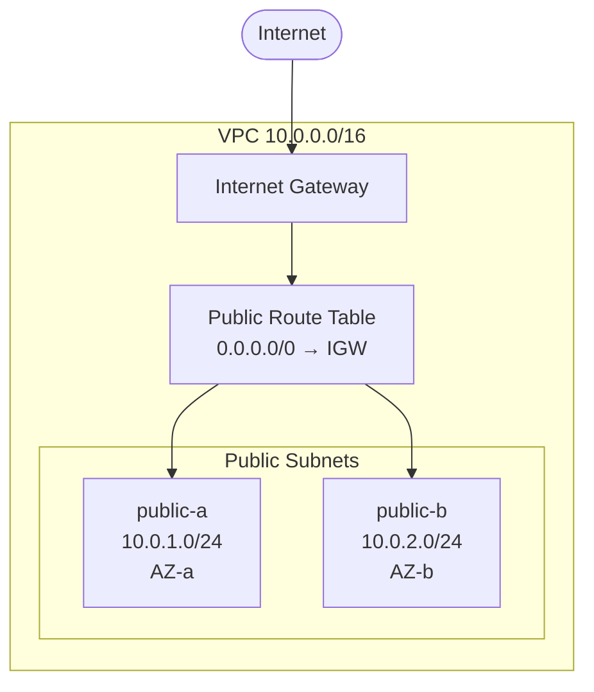
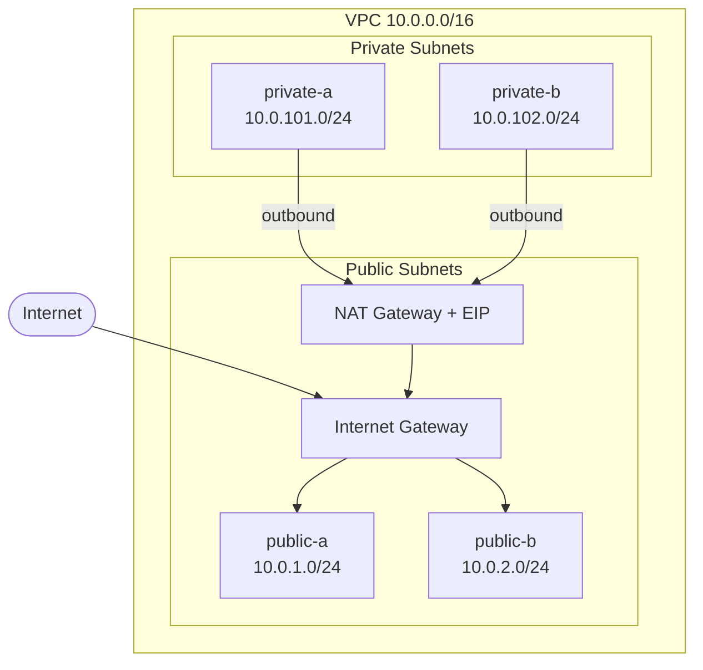
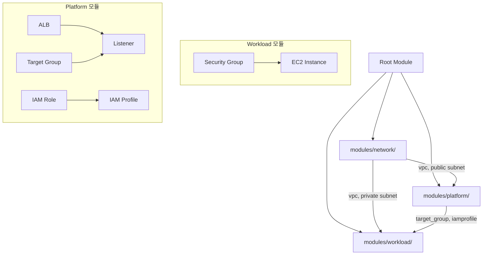

이전 섹션에서 vpc, subnet, network, iam, workload 모듈을 만들고 EC2 인스턴스를 배포했다. 이번 섹션에서는 "어디까지 모듈로 분리할 것인가"의 기준을 잡고, 3-Layer 모듈을 실무 수준으로 확장한다. 하나의 프로젝트에서 network → platform → workload 순서로 인프라를 점진적으로 구축한다.

---

# 모듈화의 경계

## 1. 기본 원칙

| 기준 | 분리하는 경우 | 분리하지 않는 경우 |
|------|------------|----------------|
| 재사용 | dev/prod에서 같은 네트워크 구조 사용 | 프로젝트 전용 일회성 리소스 |
| 크기 | 리소스 3개 이상이 하나의 역할 | 리소스 1~2개 |
| 변경 빈도 | 독립적으로 변경 가능한 단위 | 항상 함께 변경되는 리소스 |

모듈화가 과도하면 오히려 복잡해진다. 시작은 단순하게, 필요에 따라 점진적으로 분리한다.

## 2. 3-Layer 모듈 구조

인프라를 세 계층으로 나누고, 각 계층을 하나의 모듈로 구성한다.

```text
modules/
├── network/       ← 연결 기반. 가장 안정적
├── platform/      ← 보안·접근·운영 공통 기반
└── workload/      ← 실제 서비스. 변경이 가장 잦음
```

현장에서 레이어 이름은 다를 수 있지만, 이런 계층 분리는 클라우드 인프라에서 흔히 사용되는 패턴이다.

| Layer | AWS (이 시리즈) | Azure | GCP |
|-------|---------------|-------|-----|
| network | VPC, Subnet, IGW, NAT GW | VNet, Subnet, NSG | VPC, Subnet, Firewall |
| platform | SG, ALB, IAM Role | App Gateway, Key Vault | Cloud Armor, IAM |
| workload | EC2, RDS, S3 | VM, Azure SQL, Blob | GCE, Cloud SQL, GCS |

각 계층은 변경 빈도와 책임이 다르다. network는 한 번 구성하면 거의 바뀌지 않고, workload는 배포·확장·변경이 빈번하다. 이 차이를 인정하고 분리하면 한 계층의 변경이 다른 계층에 영향을 주지 않는다.

의존 방향에는 하나의 규칙만 있다: **역방향 의존 금지.** network는 platform과 workload를 모르고, platform은 workload를 모른다. 반대로, 상위 layer는 필요한 하위 layer를 자유롭게 참조한다 — workload가 network를 직접 참조해도 되고, platform을 경유할 필요도 없다. 이 "역방향 금지 + 자유로운 하위 참조" 패턴은 클라우드 인프라에서 널리 사용되는 구조다.

## 3. 모듈 내부 파일 분리

Sec01에서 작성한 network 모듈은 `main.tf` 하나에 VPC, Subnet, IGW, Route Table을 모두 담았다. 리소스가 적을 때는 충분하지만, 모듈이 커지면 `main.tf`가 비대해진다.

HashiCorp Style Guide는 모듈이 커지면 **리소스를 논리적 그룹으로 분리**할 것을 권장한다.

```text
# Sec01의 network 모듈 (main.tf 하나)
modules/network/
├── variables.tf
├── outputs.tf
└── main.tf          ← VPC + Subnet + IGW + Route Table 모두

# 논리적 그룹으로 분리
modules/network/
├── variables.tf
├── outputs.tf
├── vpc.tf           ← VPC + IGW
├── subnet.tf        ← Subnet ×4 + Route Table
└── natgw.tf         ← NAT Gateway + EIP
```

Terraform은 디렉토리 내 모든 `.tf` 파일을 하나의 모듈로 합친다. **파일을 분리해도 인프라는 변하지 않는다** — 코드 조직의 문제이지 인프라 변경이 아니다.

## 4. 이번 실습의 패턴

02.04에서 확립한 `local → resource → output` 흐름과 capability 기반 locals object 구조화가 모듈 안에서도 동일하게 적용된다. 05.01 lab03에서 이 패턴을 모듈 안으로 가져왔고, 이번 섹션에서는 3-Layer로 확장한다.

각 모듈의 데이터 흐름은 동일하다:

```text
(variable + datasource) → local → resource → output
```

- 모듈은 자기 계층의 설정을 locals에서 소유한다 (모듈 구성)
- variable은 namespace와 cross-module 의존값만 받는다
- output은 02.04 lab02에서 도입한 computed key 패턴으로 리소스 identity를 노출한다
- root module은 namespace를 전달하고 모듈 간 output을 연결하는 역할만 한다

## 5. 이번 실습에서 구축하는 인프라

4개의 실습으로 3-Layer 모듈을 완성한다. 각 lab은 **독립 디렉토리**로, 그 시점의 완전한 코드를 갖는다. lab 간 코드를 비교하면 Layer가 추가되고 의존 관계가 확장되는 과정을 볼 수 있다.

| Lab | Layer | 구축 내용 | 의존 | 검증 |
|-----|-------|----------|------|------|
| lab01 | network (public) | VPC, IGW, Public Subnet ×2, RTB | — | VPC + 2 subnets |
| lab02 | network (full) | + NAT GW, EIP, Private Subnet ×2, RTBs | — | 4 subnets + NAT GW |
| lab03 | + platform | + ALB, TG, IAM, SG | network | ALB endpoint 확인 |
| lab04 | + workload + 전체 연결 | + EC2, SG + IAM·TG 연결 | network, platform | TG target, SSM 접속 |

```text
05.02-lab/
├── lab01/              ← network (public만)
│   └── modules/network/
├── lab02/              ← network (public + private + natgw)
│   └── modules/network/
├── lab03/              ← + platform (network에 의존)
│   └── modules/network/, platform/
└── lab04/              ← + workload + 전체 연결 (3-Layer 완성)
    └── modules/network/, platform/, workload/
```

lab01 → lab02: network 모듈이 확장된다.
lab02 → lab03: platform 모듈이 추가되고, network를 참조한다.
lab03 → lab04: workload 모듈이 추가되고, network와 platform 두 하위 layer를 자유롭게 참조한다. 역방향 의존 없이 상위 layer가 필요한 하위 layer를 참조하는 구조를 체험한다.

lab04에서 3-Layer가 완성되면 간단한 HTTP 서버로 전체 인프라 동작을 확인한다. SSM으로 인스턴스에 접속하고, HTTP 서버를 실행하고, ALB endpoint로 접근해 네트워크 경로가 올바르게 연결되었는지 검증한다. Gallery 앱 배포는 Gallery(05.03)에서 한다.

---

# 핵심 정리

- 모듈화 경계는 재사용성, 크기, 변경 빈도로 판단한다. 과도한 분리는 복잡도만 높인다.
- 이 시리즈에서는 3-Layer 모듈 구조(network/platform/workload)를 사용한다. 이 계층 분리는 클라우드 중립적이다.
- 각 계층은 변경 빈도와 책임이 다르다. 역방향 의존만 금지하고, 상위 layer는 하위 layer를 자유롭게 참조한다.
- 02.04에서 확립한 `local → resource → output` 흐름이 각 모듈 안에서도 동일하게 적용된다. locals가 설정의 주인이고, resource는 `local.*`만 참조한다.
- 모듈 내부 파일 분리는 HashiCorp Style Guide 권장 사항이다. 파일을 분리해도 인프라는 변하지 않는다.

---

# 참고 자료

- [Standard Module Structure — Terraform 공식 문서](https://developer.hashicorp.com/terraform/language/modules/develop/structure)
- [Terraform Style Guide — Terraform 공식 문서](https://developer.hashicorp.com/terraform/language/style)
- [Module Composition — Terraform 공식 문서](https://developer.hashicorp.com/terraform/language/modules/develop/composition)

---

# [실습] lab01: network — Public 인프라

Custom VPC에 Public Subnet 2개를 배치한다. Internet Gateway와 Route Table로 인터넷 접근을 구성한다.

### 실습 목표

- Custom VPC + IGW 생성
- Public Subnet ×2 (AZ-a, AZ-b) + Public Route Table
- 모듈 내부 파일 분리: `vpc.tf`, `subnet.tf`
- `terraform apply` → 콘솔에서 VPC + Subnet 확인

---

# 1. 전체 아키텍처



Public Subnet 2개가 각각의 Route Table을 갖고, 0.0.0.0/0 트래픽을 IGW로 보낸다.

---

# 2. 사전 준비

```text
lab01/
├── main.tf
├── locals.tf
├── providers.tf
├── outputs.tf
└── modules/
    └── network/
        ├── vpc.tf
        ├── subnet.tf
        ├── locals.tf
        ├── variables.tf
        └── outputs.tf
```

---

# 3. modules/network/ 작성

## vpc.tf

```hcl
resource "aws_vpc" "this" {
  cidr_block           = local.vpc.cidr_block
  enable_dns_support   = local.vpc.enable_dns_support
  enable_dns_hostnames = local.vpc.enable_dns_hostnames

  tags = {
    Name = "${local.namespace}-vpc-${local.vpc.name}"
  }
}

resource "aws_internet_gateway" "this" {
  vpc_id = aws_vpc.this.id

  tags = {
    Name = "${local.namespace}-igw"
  }
}
```

02.04에서 확립한 패턴과 동일하다. resource는 `local.*`만 참조한다. `local.vpc`의 필드 이름이 resource argument 이름과 대응한다.

## subnet.tf

```hcl
# public subnet_0
resource "aws_subnet" "public_0" {
  vpc_id                  = aws_vpc.this.id
  cidr_block              = local.subnet_public[0].cidr_block
  availability_zone       = local.subnet_public[0].availability_zone
  map_public_ip_on_launch = local.subnet_public[0].map_public_ip_on_launch

  tags = {
    Name = "${local.namespace}-subnet-${local.subnet_public[0].name}"
  }
}

resource "aws_route_table" "public_0" {
  vpc_id = aws_vpc.this.id

  route {
    cidr_block = "0.0.0.0/0"
    gateway_id = aws_internet_gateway.this.id
  }

  tags = {
    Name = "${local.namespace}-rtb-${local.subnet_public[0].name}"
  }
}

resource "aws_route_table_association" "subnet_0" {
  subnet_id      = aws_subnet.public_0.id
  route_table_id = aws_route_table.public_0.id
}

# public subnet_1
resource "aws_subnet" "public_1" {
  vpc_id                  = aws_vpc.this.id
  cidr_block              = local.subnet_public[1].cidr_block
  availability_zone       = local.subnet_public[1].availability_zone
  map_public_ip_on_launch = local.subnet_public[1].map_public_ip_on_launch

  tags = {
    Name = "${local.namespace}-subnet-${local.subnet_public[1].name}"
  }
}

resource "aws_route_table" "public_1" {
  vpc_id = aws_vpc.this.id

  route {
    cidr_block = "0.0.0.0/0"
    gateway_id = aws_internet_gateway.this.id
  }

  tags = {
    Name = "${local.namespace}-rtb-${local.subnet_public[1].name}"
  }
}

resource "aws_route_table_association" "subnet_1" {
  subnet_id      = aws_subnet.public_1.id
  route_table_id = aws_route_table.public_1.id
}
```

TF 리소스 레이블은 `public_0`, `public_1` — 인덱스 기반이다. `local.subnet_public[0].name`으로 태그에만 이름을 사용한다.

코드가 반복된다. `public_0`과 `public_1`은 인덱스만 다르고 구조가 동일하다. subnet을 추가하려면 코드를 복사하고 인덱스를 바꿔야 한다. 복사할 때 인덱스를 잘못 쓰면 `terraform plan`은 성공하지만 인프라가 원하는 대로 배포되지 않는다. 이 문제는 Ch06에서 `for_each`로 해결한다.

## locals.tf — 모듈 구성

```hcl
locals {
  namespace = var.namespace

  vpc = {
    name = "main"

    cidr_block           = "10.0.0.0/16"
    enable_dns_support   = true
    enable_dns_hostnames = true
  }

  subnet_public = [
    {
      name = "public-a"

      availability_zone       = "ap-northeast-2a"
      cidr_block              = "10.0.1.0/24"
      map_public_ip_on_launch = true
    },
    {
      name = "public-b"

      availability_zone       = "ap-northeast-2b"
      cidr_block              = "10.0.2.0/24"
      map_public_ip_on_launch = true
    }
  ]
}
```

02.04의 `local.instance`, `local.iamrole`이 capability별 object였듯이, `local.vpc`와 `local.subnet_public`도 capability별로 구조화된다. object의 필드 이름이 resource argument 이름과 대응하는 것도 같은 원칙이다. subnet 설정은 list로 구성하여 인덱스(`[0]`, `[1]`)로 각 subnet에 접근한다.

## variables.tf

```hcl
variable "namespace" {
  type = string
}
```

variable은 `namespace` 하나뿐이다. VPC CIDR, Subnet AZ 같은 설정은 모듈 구성(locals)에서 정의한다. 02.05에서 "모든 것을 variable로 빼지 않는다"고 했던 원칙이 모듈에서도 동일하다.

## outputs.tf

```hcl
output "vpc" {
  value = {
    (local.vpc.name) = {
      id = aws_vpc.this.id
    }
  }
}

output "subnet" {
  value = {
    (local.subnet_public[0].name) = {
      id = aws_subnet.public_0.id
    }

    (local.subnet_public[1].name) = {
      id = aws_subnet.public_1.id
    }
  }
}
```

02.04 lab02에서 도입한 computed key 패턴이다. `(local.vpc.name)`은 `"main"`, `(local.subnet_public[0].name)`은 `"public-a"`로 평가된다. root module에서 `module.network.vpc["main"].id`, `module.network.subnet["public-a"].id`로 접근할 수 있다. 같은 타입 여러 개를 이름으로 구분해야 하므로 이 패턴이 자연스럽게 필요하다.

---

# 4. root module

## main.tf

```hcl
module "network" {
  source = "./modules/network"

  namespace = local.namespace
}
```

root module의 역할은 namespace를 전달하고 모듈 간 output을 연결하는 것이다. lab01은 모듈이 하나뿐이라 연결할 것이 없다 — namespace만 전달한다.

## locals.tf

```hcl
locals {
  org       = "tf-core"
  project   = "lab01"
  namespace = "${local.org}-${local.project}"
}
```

Ch04에서 도입한 `org`/`project` 분리 구조다. namespace 정의만 있고, network 설정은 network 모듈의 locals에서 정의한다.

## providers.tf

```hcl
terraform {
  required_version = ">=1.14.0"

  required_providers {
    aws = {
      source  = "hashicorp/aws"
      version = "~> 6.0"
    }
  }
}

provider "aws" {
  region = "ap-northeast-2"

  default_tags {
    tags = {
      Organization = local.org
      Project      = local.project
      ManagedBy    = "Terraform"
    }
  }
}
```

## outputs.tf

```hcl
output "module" {
  value = {
    network = module.network
  }
}
```

---

# 5. terraform init & apply

```bash
$ terraform init && terraform apply
```

```text
Initializing modules...
- network in modules/network

...(생략)...

Plan: 7 to add, 0 to change, 0 to destroy.

...(생략)...

Apply complete! Resources: 7 added, 0 changed, 0 destroyed.
```

[콘솔화면: AWS Console > VPC > Subnets > tf-core-lab01-subnet-public-a, tf-core-lab01-subnet-public-b 확인]

---

# 6. terraform destroy

```bash
$ terraform destroy
```

```text
Destroy complete! Resources: 7 destroyed.
```

---

# [실습] lab02: network — Private 인프라 확장

lab01의 network 모듈에 Private Subnet 2개 + NAT Gateway + EIP를 추가한다. 모듈 확장은 파일 추가로 한다. `natgw.tf`를 새로 만들고, `subnet.tf`에 private subnet을 추가한다. 기존 `vpc.tf`는 변경하지 않는다.

NAT Gateway는 Private Subnet의 인스턴스가 인터넷에 접근할 수 있게 해주는 리소스다. Public Subnet에 배치되며, EIP(고정 공인 IP)를 할당받는다. Private Subnet의 Route Table은 0.0.0.0/0 트래픽을 NAT Gateway로 보낸다.

### 실습 목표

- `natgw.tf` 추가: NAT Gateway + EIP
- `subnet.tf`에 Private Subnet ×2 + Private RTBs 추가
- 기존 리소스는 "No changes", 새 리소스만 추가 확인

---

# 1. 전체 아키텍처



---

# 2. 파일 변경

```text
modules/network/
├── vpc.tf           ← 유지
├── subnet.tf        ← 업데이트 (private subnet 추가)
├── natgw.tf         ← 신규
├── locals.tf        ← 업데이트 (subnet_private, natgw 추가)
├── variables.tf     ← 유지 (namespace만)
└── outputs.tf       ← 업데이트 (private subnet 추가)
```

## natgw.tf

```hcl
resource "aws_eip" "this" {
  domain = "vpc"

  tags = {
    Name = "${local.namespace}-eip-natgw-${local.natgw.name}"
  }
}

resource "aws_nat_gateway" "this" {
  allocation_id = aws_eip.this.id
  subnet_id     = aws_subnet.public_0.id

  tags = {
    Name = "${local.namespace}-natgw-${local.natgw.name}"
  }
}
```

NAT Gateway는 `public_0`(첫 번째 public subnet)에 하드코딩으로 배치한다. 같은 모듈의 `aws_subnet.public_0.id`를 직접 참조한다 — variable로 빼면 순환 참조가 발생하기 때문이다. 실제로는 어떤 public subnet에 배치할 것인지, 몇 개 만들 것인지, 어떤 private subnet이 라우팅할 것인지 설정이 필요하지만, 이를 동적으로 처리하려면 Ch06의 동적 구성이 필요하다. 지금은 모듈 내부에 하드코딩할 수밖에 없고, 수정이 발생하면 모듈 코드를 직접 고쳐야 한다. 그래도 이 모듈은 Layer 경계를 잡는 목적으로 가치가 있다.

## subnet.tf (private subnet 추가)

lab01의 public subnet 코드 아래에 private subnet을 추가한다. `subnet_private`은 `subnet_public`과 동일한 `list(object({...}))` 구조다. 같은 구조인데 왜 하나의 list로 합치지 않는가? — public과 private은 Route Table 대상이 다르다(IGW vs NAT GW). 모듈 내부에서 "이 subnet은 public이니까 IGW로, 저 subnet은 private이니까 NAT GW로" 분기하려면 동적 구성이 필요하다. 하드코딩 모듈에서는 list를 분리하는 것이 가장 단순한 방법이다.

코드를 복사하고 `public` → `private`, 인덱스를 맞춘다. 복사할 때 `local.subnet_private[0]`을 `local.subnet_public[0]`으로 잘못 쓰면 private subnet이 public subnet과 같은 CIDR을 갖게 되어 에러가 발생한다. 같은 구조의 코드를 복사-붙여넣기해야 하는 이 번거로움도 Ch06에서 `for_each`로 해결한다.

```hcl
# private subnet_0
resource "aws_subnet" "private_0" {
  vpc_id                  = aws_vpc.this.id
  cidr_block              = local.subnet_private[0].cidr_block
  availability_zone       = local.subnet_private[0].availability_zone
  map_public_ip_on_launch = local.subnet_private[0].map_public_ip_on_launch

  tags = {
    Name = "${local.namespace}-subnet-${local.subnet_private[0].name}"
  }
}

resource "aws_route_table" "private_0" {
  vpc_id = aws_vpc.this.id

  route {
    cidr_block     = "0.0.0.0/0"
    nat_gateway_id = aws_nat_gateway.this.id
  }

  tags = {
    Name = "${local.namespace}-rtb-${local.subnet_private[0].name}"
  }
}

resource "aws_route_table_association" "private_0" {
  subnet_id      = aws_subnet.private_0.id
  route_table_id = aws_route_table.private_0.id
}

# private subnet_1
resource "aws_subnet" "private_1" {
  vpc_id                  = aws_vpc.this.id
  cidr_block              = local.subnet_private[1].cidr_block
  availability_zone       = local.subnet_private[1].availability_zone
  map_public_ip_on_launch = local.subnet_private[1].map_public_ip_on_launch

  tags = {
    Name = "${local.namespace}-subnet-${local.subnet_private[1].name}"
  }
}

resource "aws_route_table" "private_1" {
  vpc_id = aws_vpc.this.id

  route {
    cidr_block     = "0.0.0.0/0"
    nat_gateway_id = aws_nat_gateway.this.id
  }

  tags = {
    Name = "${local.namespace}-rtb-${local.subnet_private[1].name}"
  }
}

resource "aws_route_table_association" "private_1" {
  subnet_id      = aws_subnet.private_1.id
  route_table_id = aws_route_table.private_1.id
}
```

## locals.tf (subnet_private, natgw 추가)

lab01의 locals에 private subnet과 NAT Gateway 설정을 추가한다.

```hcl
locals {
  namespace = var.namespace

  vpc = {
    name = "main"

    cidr_block           = "10.0.0.0/16"
    enable_dns_support   = true
    enable_dns_hostnames = true
  }

  subnet_public = [
    {
      name = "public-a"

      availability_zone       = "ap-northeast-2a"
      cidr_block              = "10.0.1.0/24"
      map_public_ip_on_launch = true
    },
    {
      name = "public-b"

      availability_zone       = "ap-northeast-2b"
      cidr_block              = "10.0.2.0/24"
      map_public_ip_on_launch = true
    }
  ]

  subnet_private = [
    {
      name = "private-a"

      availability_zone       = "ap-northeast-2a"
      cidr_block              = "10.0.101.0/24"
      map_public_ip_on_launch = false
    },
    {
      name = "private-b"

      availability_zone       = "ap-northeast-2b"
      cidr_block              = "10.0.102.0/24"
      map_public_ip_on_launch = false
    }
  ]

  natgw = {
    name = "main"
  }
}
```

private subnet의 AZ가 public subnet과 일치한다 — `public-a`와 `private-a`가 AZ-a, `public-b`와 `private-b`가 AZ-b. private subnet에서는 `map_public_ip_on_launch = false`를 명시한다.

variables.tf는 lab01과 동일 — `namespace`만.

## outputs.tf (private subnet 추가)

```hcl
output "vpc" {
  value = {
    (local.vpc.name) = {
      id = aws_vpc.this.id
    }
  }
}

output "subnet" {
  value = {
    (local.subnet_public[0].name) = {
      id = aws_subnet.public_0.id
    }

    (local.subnet_public[1].name) = {
      id = aws_subnet.public_1.id
    }

    (local.subnet_private[0].name) = {
      id = aws_subnet.private_0.id
    }

    (local.subnet_private[1].name) = {
      id = aws_subnet.private_1.id
    }
  }
}
```

NAT Gateway는 모듈 외부에서 참조할 일이 없으므로 output에 포함하지 않는다. subnet output에 `cidr_block`은 아직 없다 — lab04에서 workload SG가 ALB subnet의 CIDR을 참조할 때 추가한다.

---

# 3. root module 업데이트

root module의 변경은 없다 — `main.tf`에서 namespace만 전달하고, network 설정은 모듈 locals에서 정의한다. `locals.tf`의 `project`만 `"lab02"`로 바뀐다.

---

# 4. terraform apply

```bash
$ terraform apply
```

```text
Plan: 14 to add, 0 to change, 0 to destroy.
```

[콘솔화면: AWS Console > VPC > Subnets > 4개 subnet 확인 (public-a, public-b, private-a, private-b)]
[콘솔화면: AWS Console > VPC > NAT Gateways > tf-core-lab02-natgw-main 확인]

---

# 5. terraform destroy

```bash
$ terraform destroy
```

```text
Destroy complete! Resources: 14 destroyed.
```

---

# [실습] lab03: platform — ALB + IAM

network 모듈 위에 platform 모듈을 추가한다. ALB로 트래픽을 분산할 준비를 하고, IAM Role + Instance Profile로 EC2에 부여할 권한을 생성한다.

### 실습 목표

- modules/platform/ 추가: ALB + TG + Listener + SG, IAM (Role+Profile)
- network에 의존 (VPC, public subnet) — 모듈 간 의존의 첫 등장
- `terraform apply` → ALB endpoint 확인

---

# 1. 전체 아키텍처

```mermaid
flowchart TB
  Root[Root Module]
  Root --> NET[modules/network/]
  Root --> PLT[modules/platform/]
  NET -->|vpc["main"].id<br>subnet["public-a"].id<br>subnet["public-b"].id| PLT

  subgraph Platform[Platform 모듈]
    SG[SG] --> ALB[ALB]
    ALB --> Listener
    TG[Target Group] --> Listener
    Role[IAM Role] --> Profile[IAM Profile]
  end
```

platform이 network의 VPC와 public subnet을 참조한다. computed key로 `module.network.vpc["main"].id`처럼 이름 기반으로 접근한다.

---

# 2. 사전 준비

lab02의 코드를 기반으로 platform 모듈을 추가한다.

```text
lab03/
├── main.tf          ← 업데이트 (platform module 추가)
├── locals.tf
├── providers.tf
├── outputs.tf       ← 업데이트
└── modules/
    ├── network/     ← 유지
    └── platform/    ← 신규
        ├── lb.tf
        ├── iam.tf
        ├── locals.tf
        ├── datasources.tf
        ├── variables.tf
        └── outputs.tf
```

---

# 3. modules/platform/ 작성

## lb.tf

```hcl
resource "aws_lb" "this" {
  name = "${local.namespace}-lb-${local.lb.name}"

  internal                   = local.lb.internal
  load_balancer_type         = local.lb.load_balancer_type
  enable_deletion_protection = local.lb.enable_deletion_protection
  subnets                    = local.lb.subnets

  security_groups = [aws_security_group.this.id]

  tags = {
    Name = "${local.namespace}-lb-${local.lb.name}"
  }
}

resource "aws_security_group" "this" {
  name = "${local.namespace}-sg-lb-${local.lb.name}"

  vpc_id = local.vpc_id

  ingress {
    to_port     = local.lb.listener.port
    from_port   = local.lb.listener.port
    cidr_blocks = local.lb.listener.cidr_blocks
    protocol    = "tcp"
  }

  egress {
    to_port     = 0
    from_port   = 0
    cidr_blocks = ["0.0.0.0/0"]
    protocol    = "-1"
  }

  tags = {
    Name = "${local.namespace}-sg-lb-${local.lb.name}"
  }
}

resource "aws_lb_target_group" "this" {
  name = "${local.namespace}-tg-${local.lb.name}"

  vpc_id = local.vpc_id

  port        = local.lb.target_group.port
  protocol    = local.lb.target_group.protocol
  target_type = local.lb.target_group.target_type

  health_check {
    enabled             = local.lb.target_group.health_check.enabled
    port                = local.lb.target_group.health_check.port
    path                = local.lb.target_group.health_check.path
    healthy_threshold   = local.lb.target_group.health_check.healthy_threshold
    unhealthy_threshold = local.lb.target_group.health_check.unhealthy_threshold
    timeout             = local.lb.target_group.health_check.timeout
    interval            = local.lb.target_group.health_check.interval
  }

  tags = {
    Name = "${local.namespace}-tg-${local.lb.name}"
  }
}

resource "aws_lb_listener" "this" {
  port     = local.lb.listener.port
  protocol = local.lb.listener.protocol

  load_balancer_arn = aws_lb.this.arn

  default_action {
    type             = "forward"
    target_group_arn = aws_lb_target_group.this.arn
  }
}
```

SG + ALB + TG + Listener를 하나의 `lb.tf`에 구성한다. locals의 `target_group`과 `listener`가 하위 object로 남아있는 건 각각 별도 AWS 리소스(`aws_lb_target_group`, `aws_lb_listener`)이기 때문이다. resource argument 구조를 locals가 반영하는 원칙이 여기서도 적용된다.

## iam.tf

```hcl
resource "aws_iam_role" "this" {
  name = "${local.namespace}-iamrole-${local.iamrole.name}"

  assume_role_policy = data.aws_iam_policy_document.ec2_assume_role_policy.json

  tags = {
    Name = "${local.namespace}-iamrole-${local.iamrole.name}"
  }
}

resource "aws_iam_role_policy_attachment" "this" {
  role       = aws_iam_role.this.name
  policy_arn = local.iamrole.policy_arn
}

resource "aws_iam_instance_profile" "this" {
  name = "${local.namespace}-iamprofile-${local.iamrole.name}"

  role = aws_iam_role.this.name

  tags = {
    Name = "${local.namespace}-iamprofile-${local.iamrole.name}"
  }
}
```

02.04 lab01에서 `local.iamrole`로 구조화한 것과 동일한 패턴이다. capability 이름 `iamrole`이 그대로 사용된다.

## locals.tf — 모듈 구성

```hcl
locals {
  namespace = var.namespace

  vpc_id = var.vpc_id

  lb = {
    name = "main"

    load_balancer_type         = "application"
    internal                   = false
    enable_deletion_protection = false
    subnets                    = var.lb_subnets

    target_group = {
      port        = 80
      protocol    = "HTTP"
      target_type = "instance"

      health_check = {
        enabled             = true
        protocol            = "HTTP"
        path                = "/"
        port                = 80
        healthy_threshold   = 3
        unhealthy_threshold = 3
        timeout             = 5
        interval            = 30
      }
    }

    listener = {
      port        = 80
      cidr_blocks = ["0.0.0.0/0"]
      protocol    = "HTTP"
    }
  }

  iamrole = {
    name       = "instance-web"
    policy_arn = data.aws_iam_policy.aws_ssm_core_policy.arn
  }
}
```

`local.vpc_id`가 `lb` 바깥에 독립적으로 존재한다. SG와 Target Group 모두 `vpc_id`를 참조하므로, 특정 capability object에 넣지 않고 모듈 레벨에 둔다.

| 조건 | variable 이름 | locals 위치 |
|------|--------------|------------|
| capability 전용 | `lb_subnets` | `local.lb.subnets` |
| 모듈 전체 공유 | `vpc_id` | `local.vpc_id` (모듈 레벨) |

prefix가 없으면 모듈 레벨, 있으면 capability object 안이다.

`lb` 안에서도 같은 원칙이다. `load_balancer_type`, `internal` 같은 리소스 인수가 flat으로 온다. `target_group`과 `listener`만 하위 object로 유지한다. 별도 AWS 리소스(`aws_lb_target_group`, `aws_lb_listener`)에 대응하기 때문이다.

## datasources.tf

```hcl
data "aws_iam_policy_document" "ec2_assume_role_policy" {
  statement {
    actions = ["sts:AssumeRole"]
    effect  = "Allow"

    principals {
      type        = "Service"
      identifiers = ["ec2.amazonaws.com"]
    }
  }
}

data "aws_iam_policy" "aws_ssm_core_policy" {
  name = "AmazonSSMManagedInstanceCore"
}
```

02.05 lab03에서 data source가 locals로 통합되는 패턴을 학습했다. `data.aws_iam_policy.aws_ssm_core_policy.arn`이 `local.iamrole.policy_arn`으로 들어간다.

## variables.tf

```hcl
variable "namespace" {
  type = string
}

variable "vpc_id" {
  type = string
}

variable "lb_subnets" {
  type = list(string)
}
```

3개 flat variable. `vpc_id`는 모듈 레벨, `lb_subnets`는 `local.lb.subnets`에 들어간다.

## outputs.tf

```hcl
output "iamprofile" {
  value = {
    (local.iamrole.name) = {
      name = aws_iam_instance_profile.this.name
    }
  }
}

output "lb" {
  value = {
    (local.lb.name) = {
      dns_name = aws_lb.this.dns_name

      listener = {
        port     = aws_lb_listener.this.port
        protocol = aws_lb_listener.this.protocol
      }

      target_group = {
        arn = aws_lb_target_group.this.arn
      }
    }
  }
}
```

두 output 모두 computed key를 사용한다. `(local.iamrole.name)`은 `"instance-web"`, `(local.lb.name)`은 `"main"`으로 평가된다. root module에서 `module.platform.iamprofile["instance-web"].name`, `module.platform.lb["main"].target_group.arn`으로 접근한다.

`iamprofile.name`은 lab04에서 workload EC2에 부착한다. `lb.target_group.arn`은 lab04에서 EC2를 Target Group에 등록할 때 사용한다. `lb.dns_name`과 `lb.listener`는 최종 endpoint URL을 조합할 때 사용한다.

---

# 4. root module 업데이트

## main.tf (platform module 추가)

```hcl
module "network" {
  source = "./modules/network"

  namespace = local.namespace
}

module "platform" {
  source = "./modules/platform"

  namespace = local.namespace

  vpc_id     = module.network.vpc["main"].id
  lb_subnets = [module.network.subnet["public-a"].id, module.network.subnet["public-b"].id]
}
```

`module.network.vpc["main"].id` — lab01에서 network output에 computed key를 설정했기 때문에 이름 기반으로 접근할 수 있다. 이 참조가 platform → network 의존성을 만든다.

## outputs.tf (업데이트)

```hcl
output "module" {
  value = {
    network  = module.network
    platform = module.platform
  }
}
```

---

# 5. terraform apply

```bash
$ terraform apply
```

```text
  # module.platform.aws_security_group.this will be created
  # module.platform.aws_lb.this will be created
  # module.platform.aws_lb_target_group.this will be created
  # module.platform.aws_lb_listener.this will be created
  # module.platform.aws_iam_role.this will be created
  # module.platform.aws_iam_role_policy_attachment.this will be created
  # module.platform.aws_iam_instance_profile.this will be created

Plan: 21 to add, 0 to change, 0 to destroy.

...(생략)...

Apply complete! Resources: 21 added, 0 changed, 0 destroyed.
```

network(14) + platform(7) = 21개 리소스.

[콘솔화면: AWS Console > EC2 > Load Balancers > tf-core-lab03-lb-main 확인]
[콘솔화면: AWS Console > EC2 > Target Groups > tf-core-lab03-tg-main — target 없음]

ALB와 Target Group이 생성되었지만 아직 target이 없다 — lab04에서 workload를 추가하면서 EC2를 등록한다.

---

# 6. terraform destroy

```bash
$ terraform destroy
```

```text
Destroy complete! Resources: 21 destroyed.
```

---

# [실습] lab04: network + platform + workload — 3-Layer 완성

lab03의 network + platform 위에 workload 모듈을 추가하고, 3-Layer를 완성한다. workload는 network(VPC, Subnet)와 platform(IAM, Target Group) 두 하위 layer를 자유롭게 참조한다 — 역방향은 없다.

lab03에서 network output에 `cidr_block`이 추가된다. workload의 SG가 ALB가 배치된 public subnet의 CIDR만 허용해야 하기 때문이다 — 인스턴스가 인터넷의 모든 트래픽이 아니라 ALB의 트래픽만 받도록 제한한다.

### 실습 목표

- modules/workload/ 추가: EC2 + SG + TG Attachment
- network + platform 두 layer를 자유롭게 참조 — 역방향 금지
- network output에 `cidr_block` 추가 — workload SG의 트래픽 제한
- 간단 HTTP 서버로 전체 인프라 동작 확인
- 3-Layer 모듈 완성

---

# 1. 전체 아키텍처



workload는 network(VPC, private subnet)와 platform(iamprofile, target_group) 두 하위 layer를 자유롭게 참조한다. 역방향 의존은 없다.

---

# 2. 사전 준비

lab03의 코드를 기반으로 workload 모듈을 추가한다.

```text
lab04/
├── main.tf          ← 업데이트 (workload module 추가)
├── locals.tf
├── providers.tf
├── outputs.tf       ← 업데이트 (endpoint 추가)
└── modules/
    ├── network/     ← outputs 업데이트 (cidr_block 추가)
    ├── platform/    ← 유지
    └── workload/    ← 신규
        ├── instance.tf
        ├── locals.tf
        ├── datasources.tf
        ├── variables.tf
        └── outputs.tf
```

---

# 3. modules/network/ 변경 — output에 cidr_block 추가

lab03까지 subnet output은 `id`만 내보냈다. 이 실습에서 `cidr_block`을 추가한다 — workload의 SG가 ALB가 배치된 public subnet의 CIDR만 허용하기 위해서다.

## outputs.tf

```hcl
output "vpc" {
  value = {
    (local.vpc.name) = {
      id = aws_vpc.this.id
    }
  }
}

output "subnet" {
  value = {
    (local.subnet_public[0].name) = {
      id         = aws_subnet.public_0.id
      cidr_block = aws_subnet.public_0.cidr_block
    }
    (local.subnet_public[1].name) = {
      id         = aws_subnet.public_1.id
      cidr_block = aws_subnet.public_1.cidr_block
    }
    (local.subnet_private[0].name) = {
      id         = aws_subnet.private_0.id
      cidr_block = aws_subnet.private_0.cidr_block
    }
    (local.subnet_private[1].name) = {
      id         = aws_subnet.private_1.id
      cidr_block = aws_subnet.private_1.cidr_block
    }
  }
}
```

---

# 4. modules/workload/ 작성

## instance.tf

```hcl
resource "aws_lb_target_group_attachment" "this" {
  target_group_arn = local.lb.target_group_arn
  target_id        = aws_instance.this.id
  port             = local.instance.allow_access.port
}

resource "aws_instance" "this" {
  instance_type               = local.instance.instance_type
  ami                         = local.instance.ami
  subnet_id                   = local.instance.subnet_id
  associate_public_ip_address = local.instance.associate_public_ip_address
  iam_instance_profile        = local.instance.iam_instance_profile

  vpc_security_group_ids = [aws_security_group.this.id]

  tags = {
    Name = "${local.namespace}-instance-${local.instance.name}"
  }
}

resource "aws_security_group" "this" {
  name   = "${local.namespace}-sg-instance-${local.instance.name}"
  vpc_id = local.vpc_id

  ingress {
    from_port   = local.instance.allow_access.port
    to_port     = local.instance.allow_access.port
    protocol    = "tcp"
    cidr_blocks = local.instance.allow_access.cidr_blocks
  }

  egress {
    from_port   = 0
    to_port     = 0
    protocol    = "-1"
    cidr_blocks = ["0.0.0.0/0"]
  }

  tags = {
    Name = "${local.namespace}-sg-instance-${local.instance.name}"
  }
}
```

02.04의 `local.instance`가 모듈 안에서도 동일한 구조로 사용된다. SG의 `cidr_blocks`는 ALB가 배치된 public subnet의 CIDR — `["0.0.0.0/0"]`이 아니라 ALB 트래픽만 허용한다.

## locals.tf — 모듈 구성

```hcl
locals {
  namespace = var.namespace

  vpc_id = var.vpc_id

  instance = {
    name = "web"

    instance_type               = "t3.small"
    ami                         = data.aws_ami.amazon_linux.id
    subnet_id                   = var.instance_subnet_id
    associate_public_ip_address = false
    iam_instance_profile        = var.instance_iam_instance_profile

    allow_access = {
      port        = 80
      cidr_blocks = var.instance_allow_access_cidr_blocks
    }
  }

  lb = {
    target_group_arn = var.lb_target_group_arn
  }
}
```

lab03 platform과 같은 패턴이다. `vpc_id` 모듈 레벨 독립, `local.lb`가 `instance` 밖에 별도 블록. 02.05에서 학습한 `(variable + datasource) → local` 흐름이 그대로 적용된다. `data.aws_ami`는 모듈이 자체 조회하고, `var.instance_subnet_id` 등은 cross-module 의존값으로 외부에서 받는다. 어떤 값을 하드코딩하고, 어떤 값을 외부에서 받을지는 모듈 설계자의 선택이다.

## datasources.tf

```hcl
data "aws_ami" "amazon_linux" {
  most_recent = true

  filter {
    name   = "name"
    values = ["al2023-ami-2023.*-x86_64"]
  }

  owners = ["amazon"]
}
```

## variables.tf

```hcl
variable "namespace" {
  type = string
}

variable "vpc_id" {
  type = string
}

variable "instance_subnet_id" {
  type = string
}

variable "instance_allow_access_cidr_blocks" {
  type = list(string)
}

variable "instance_iam_instance_profile" {
  type = string
}

variable "lb_target_group_arn" {
  type = string
}
```

6개 flat variable. lab03 platform과 같은 네이밍 패턴이다. `instance_` prefix는 `local.instance` 안으로, `lb_` prefix는 `local.lb` 안으로 들어간다.

## outputs.tf

```hcl
output "instance" {
  value = {
    (local.instance.name) = {
      id         = aws_instance.this.id
      public_ip  = aws_instance.this.public_ip
      private_ip = aws_instance.this.private_ip
    }
  }
}
```

02.04 lab02에서 `(local.instance.name)`으로 시작한 computed key 패턴이 모든 모듈 output에 일관되게 적용된다.

---

# 5. root module 업데이트

## main.tf (workload module 추가)

```hcl
module "network" {
  source = "./modules/network"

  namespace = local.namespace
}

module "platform" {
  source = "./modules/platform"

  namespace = local.namespace

  vpc_id     = module.network.vpc["main"].id
  lb_subnets = [module.network.subnet["public-a"].id, module.network.subnet["public-b"].id]
}

module "workload" {
  source = "./modules/workload"

  namespace = local.namespace

  vpc_id = module.network.vpc["main"].id

  instance_subnet_id                = module.network.subnet["private-b"].id
  instance_allow_access_cidr_blocks = [module.network.subnet["public-a"].cidr_block, module.network.subnet["public-b"].cidr_block]
  instance_iam_instance_profile     = module.platform.iamprofile["instance-web"].name

  lb_target_group_arn = module.platform.lb["main"].target_group.arn
}
```

workload가 network와 platform 두 하위 layer를 자유롭게 참조한다. 역방향 의존은 없다. computed key 덕분에 `module.network.subnet["public-a"].cidr_block`처럼 이름으로 리소스를 특정할 수 있다.

## outputs.tf

```hcl
output "module" {
  value = {
    network  = module.network
    platform = module.platform
    workload = module.workload
  }
}

output "endpoint" {
  value = "${lower(module.platform.lb["main"].listener.protocol)}://${module.platform.lb["main"].dns_name}:${module.platform.lb["main"].listener.port}"
}
```

root module output 세 가지 용도 중 두 가지를 사용한다: `module`은 디버깅/개발 용도(모듈 output 전체 노출), `endpoint`는 사용자 접근 정보 용도(ALB 접속 URL).

---

# 6. terraform apply

```bash
$ terraform apply
```

```text
  # module.workload.aws_security_group.this will be created
  # module.workload.aws_instance.this will be created
  # module.workload.aws_lb_target_group_attachment.this will be created

Plan: 24 to add, 0 to change, 0 to destroy.

...(생략)...

Apply complete! Resources: 24 added, 0 changed, 0 destroyed.
```

network(14) + platform(7) + workload(3) = 24개 리소스. 3-Layer 완성.

[콘솔화면: AWS Console > EC2 > Instances > tf-core-lab04-instance-web Running 상태 확인]
[콘솔화면: AWS Console > EC2 > Target Groups > tf-core-lab04-tg-main > Targets 탭 — EC2 등록 확인, **unhealthy** 상태]

EC2가 Target Group에 등록되었지만, 앱이 실행되고 있지 않으므로 health check(`/:80`)가 실패한다.

---

# 7. 인프라 동작 확인

3-Layer 인프라가 올바르게 연결되었는지 httpd로 확인한다.

## ① SSM Session Manager 접속

EC2 생성 후 SSM Agent가 준비되기까지 약 1~2분이 소요된다.

[콘솔화면: AWS Console > EC2 > Instances > tf-core-lab04-instance-web 선택 > Connect > Session Manager 탭 > Connect 버튼]

Session Manager로 접속한 후 httpd와 curl을 설치한다.

```bash
$ sudo dnf install -y httpd curl
```

```text
...(생략)...
Installed:
  httpd-2.4.x  curl-8.x.x
Complete!
```

## ② httpd 시작 + 로컬 확인

```bash
$ echo "Hello World" | sudo tee /var/www/html/index.html
$ sudo systemctl start httpd
```

인스턴스 내부에서 먼저 동작을 확인한다.

```bash
$ curl localhost
```

```text
Hello World
```

httpd가 포트 80에서 정상 응답한다. health check path `/`에 200 OK를 반환하므로 Target Group에서 healthy로 전환된다.

[콘솔화면: AWS Console > EC2 > Target Groups > tf-core-lab04-tg-main > Targets 탭 — **healthy** 상태로 전환 확인]

## ③ ALB endpoint 접속

```bash
$ terraform output endpoint
```

```text
"http://tf-core-lab04-lb-main-xxxxxxxxx.ap-northeast-2.elb.amazonaws.com:80"
```

브라우저에서 endpoint URL에 접속하면 "Hello World"가 표시된다. 사용자 → ALB(public subnet) → Target Group → EC2(private subnet) 전체 경로가 동작한다.

이 인프라 위에 Gallery 앱을 배포하면 Gallery(05.03)가 된다.

---

# 8. 3-Layer 완성 정리

```text
modules/
├── network/     ← VPC, IGW, Subnet ×4, NAT GW, EIP, RTB (14 리소스)
├── platform/    ← LB, TG, Listener, SG, IAM ×3 (7 리소스)
└── workload/    ← EC2, SG, TG Attachment (3 리소스)
                    총 24 리소스
```

3-Layer 모듈이 완성되었다. 이 모듈 구조가 Gallery(05.03)의 기반이 된다.

## ① 이 구조가 갖춘 것

- **모듈 경계가 명확하다.** network, platform, workload 각각 자기 계층의 인프라를 담당한다. variable(입력)과 output(출력)이 모듈 간 유일한 통신 경로다.
- **모듈 내부 데이터 흐름이 단방향이다.** `(variable + datasource) → local → resource → output`. 02.04에서 확립한 흐름이 모든 모듈에서 동일하게 적용된다.
- **모듈 구성(locals)이 선언적이다.** 각 모듈의 locals.tf를 보면 설정 전체가 한눈에 보인다.
- **root module이 가볍다.** namespace를 전달하고 모듈 간 output을 연결하는 역할만 한다.
- **역방향 의존이 없다.** workload는 network와 platform을 자유롭게 참조하고, platform은 network를 참조한다. 반대 방향은 없다.

이 구조는 동적 구성 없이도 동작하는 완성된 인프라다.

## ② 한계: 리소스 코드의 반복

모듈 내부의 **리소스 코드**는 하드코딩이다. Subnet을 2개에서 3개로 늘리려면 `aws_subnet` 블록을 복사하고 인덱스를 바꿔야 한다. 10개면 10번 복사한다. 이 반복은 모듈 구조의 문제가 아니라 **리소스 정의 방식**의 문제다. 하나의 설정에서 여러 리소스를 생성하는 메커니즘이 없기 때문이다.

## ③ 다음 단계: Ch06 재사용 가능한 모듈 & 동적 구성

이 문제를 Layer Module 안에서 동적 구성(`for_each`, `dynamic` 등)으로 해결하면 선언적 구조가 흐려진다. 대신, 리소스 정의 부분을 **별도의 재사용 가능한 모듈**로 추출한다.

```text
Ch05 (현재):
  network/subnet.tf     ← resource "aws_subnet" 하드코딩 ×4

Ch06 (다음):
  modules/subnet/       ← 재사용 모듈. 설정을 받아서 subnet을 생성하는 도구
  network/main.tf       ← modules/subnet 호출. 설정만 전달
```

Layer Module(network/)에서 리소스 정의 코드(`resource "aws_subnet"`)가 사라지고, 재사용 모듈(`modules/subnet/`)로 이동한다. 동적 구성(`for_each`, `dynamic`, `cidrsubnet` 등)은 이 재사용 모듈 안에서 사용된다. Layer Module은 "Subnet 4개를 이 설정으로 만들어달라"고 선언만 한다. 선언적 특성이 유지된다.

Ch06에서 이 구조를 단계별로 구축한다.

---

# 9. terraform destroy

```bash
$ terraform destroy
```

```text
Destroy complete! Resources: 24 destroyed.
```
