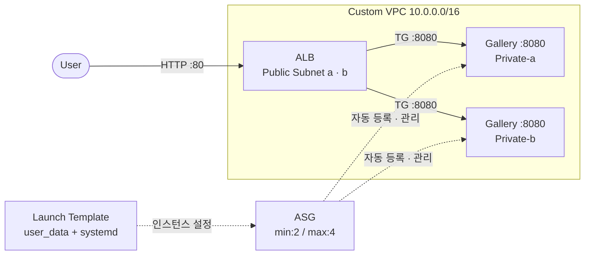

Ch04 Gallery에서 user_data로 배포를 자동화했지만, EC2 하나에 의존하는 구조였다. 05.02에서 3-Layer 모듈로 인프라를 구성하는 방법을 학습했다. 이번 Gallery에서는 이 두 가지를 결합한다: 3-Layer 모듈 기반으로 Launch Template + ASG를 구성해 Gallery 앱을 고가용성으로 배포한다.

| Chapter | Gallery 실습 | 핵심 변화 |
|---------|------------|----------|
| Ch02 | EC2 기본 배포 | 수동 설치 (SSM 접속). Local State |
| Ch04 | user_data 자동화 + Remote Backend | user_data + systemd. S3 Remote State |
| **Ch05** | **ALB + ASG** | **3-Layer 모듈, Launch Template + ASG. `ALB:80`** |
| Ch06 | 모듈 리팩토링 → 3-tier 확장 | modules/ 호출 구조 + RDS + S3 |

### 실습 목표

- 05.02 lab04의 3-Layer 모듈(network/platform/workload)을 Gallery에 적용한다
- workload 모듈을 EC2 단일 인스턴스에서 Launch Template + ASG로 전환한다
- ASG `target_group_arns`로 인스턴스를 Target Group에 자동 등록한다
- 접속 경로를 `EC2:8080` → `ALB:80`으로 변경한다
- root `local.infra`로 모듈 간 공유 설정을 단일 관리한다

---

# 1. 전체 아키텍처



Ch04 Gallery와 완전히 다른 구조다. Default VPC 위의 EC2 한 대가 Custom VPC 위의 ALB + ASG 구성으로 바뀌었다. 사용자는 ALB 엔드포인트(`:80`)로 접속하고, ALB가 Private Subnet의 Gallery 인스턴스(`:8080`)로 트래픽을 분산한다. ASG가 Launch Template을 기반으로 인스턴스를 생성하고 Target Group에 자동 등록한다.

**3-Layer 모듈 구조:**

| Layer | 모듈 | 리소스 |
|-------|------|--------|
| network | `modules/network/` | VPC, IGW, Subnet ×4, NAT GW, RTB |
| platform | `modules/platform/` | ALB, TG, Listener, SG(ALB), IAM Role/Profile |
| workload | `modules/workload/` | **Launch Template, ASG, SG(인스턴스)** |

workload 모듈이 lab04(EC2 + SG + TG 수동 등록)에서 Launch Template + ASG + SG로 변경된다. `aws_lb_target_group_attachment`가 사라지고 ASG `target_group_arns`가 인스턴스 등록을 자동으로 처리한다.

---

# 2. 사전 준비

- Ch05 Sec01~02 완료
- Ch04 Gallery 완료 (user_data 템플릿 참조)
- 04.03 lab01에서 생성한 S3 tfstate 버킷 존재 (`tf-core-tfstate`)

**05.02 lab04 코드를 복사해 시작한다.** Ch04 Gallery의 flat 구조가 아니라, lab04의 3-Layer 모듈 구조를 기반으로 한다.

```bash
$ cp -r "05 모듈/02 모듈 경계와 인프라 계층/lab04/." "05 모듈/03 [실습] Gallery: ALB + ASG/"
```

복사 후 workload 모듈과 Root 모듈을 Gallery에 맞게 수정한다. `templates/` 디렉토리는 새로 생성한다.

**디렉토리 구조:**

```text
Gallery/
├── main.tf
├── locals.tf
├── providers.tf
├── outputs.tf
└── modules/
    ├── network/
    │   ├── vpc.tf
    │   ├── subnet.tf
    │   ├── natgw.tf
    │   ├── locals.tf
    │   ├── variables.tf
    │   └── outputs.tf
    ├── platform/
    │   ├── lb.tf
    │   ├── iam.tf
    │   ├── locals.tf
    │   ├── datasources.tf
    │   ├── variables.tf
    │   └── outputs.tf
    └── workload/
        ├── asg.tf
        ├── locals.tf
        ├── datasources.tf
        ├── variables.tf
        ├── outputs.tf
        └── templates/
            └── user_data.sh.tpl
```

**설정:**

- region: **`ap-northeast-2`**
- instance_type: **`t3.small`** (Maven 빌드 메모리 여유)
- service_port: **`8080`** (Gallery 앱 포트)
- ALB listener: **`80`** (HTTP)
- Spring profile: **`dev`** (workload 모듈 내부 하드코딩. Ch07에서 환경별 분리)
- ASG: min **`2`** / max **`4`** / desired **`2`**

---

# 3. network · platform 모듈

network 모듈은 05.02 lab04와 **동일하다**. VPC, Subnet ×4, IGW, NAT GW, Route Table — 변경 없이 그대로 사용한다.

platform 모듈은 lab04에서 두 가지가 변경된다.

**① port variable화.** lab04에서는 listener와 TG port가 모두 80으로 하드코딩이었다. Gallery는 ALB listener(80)와 앱 service(8080)가 다르다. 이 값이 platform(TG port)과 workload(app port) 두 모듈에 전달되어야 하므로, root `local.infra`에서 단일 관리하고 variable로 받도록 변경한다.

**② health_check path.** lab04의 `/`에서 Gallery Spring Boot의 `/actuator/health`로 변경한다.

**③ iamrole name.** lab04에서 `"instance-web"` (EC2 직접 배포)이었지만, Gallery는 Launch Template 기반이므로 `"lt-web"`으로 변경한다. naming-tagging 규칙의 Target 패턴이 적용된다.

### platform/locals.tf

```hcl
locals {
  namespace = var.namespace

  vpc_id = var.vpc_id

  lb = {
    name = "main"

    load_balancer_type         = "application"
    internal                   = false
    enable_deletion_protection = false
    subnets                    = var.lb_subnets

    target_group = {
      port        = var.lb_target_group_port
      protocol    = "HTTP"
      target_type = "instance"

      health_check = {
        enabled             = true
        protocol            = "HTTP"
        path                = "/actuator/health"
        port                = var.lb_target_group_port
        healthy_threshold   = 3
        unhealthy_threshold = 3
        timeout             = 5
        interval            = 30
      }
    }

    listener = {
      port        = var.lb_listener_port
      cidr_blocks = ["0.0.0.0/0"]
      protocol    = "HTTP"
    }
  }

  iamrole = {
    name       = "lt-web"
    policy_arn = data.aws_iam_policy.aws_ssm_core_policy.arn
  }
}
```

lab04에서 80으로 하드코딩되었던 port가 `var.lb_target_group_port`(8080)와 `var.lb_listener_port`(80)로 분리된다. 값은 root `local.infra`에서 온다.

### platform/variables.tf

```hcl
variable "namespace" {
  type = string
}

variable "vpc_id" {
  type = string
}

variable "lb_target_group_port" {
  type = number
}

variable "lb_subnets" {
  type = list(string)
}

variable "lb_listener_port" {
  type = number
}
```

lab04(3개)에서 `lb_target_group_port`, `lb_listener_port`가 추가되어 5개가 되었다. capability prefix 규칙이 그대로 적용된다.

platform의 lb.tf, iam.tf, datasources.tf, outputs.tf는 05.02 lab04와 동일한 구조다. output에 computed key가 적용된다.

### platform/outputs.tf

```hcl
output "iamprofile" {
  value = {
    (local.iamrole.name) = {
      name = aws_iam_instance_profile.this.name
    }
  }
}

output "lb" {
  value = {
    (local.lb.name) = {
      dns_name = aws_lb.this.dns_name

      listener = {
        port     = aws_lb_listener.this.port
        protocol = aws_lb_listener.this.protocol
      }

      target_group = {
        arn = aws_lb_target_group.this.arn
      }
    }
  }
}
```

### 참고

- [05.02 lab04: workload — EC2 배포 + 전체 연결](02 모듈 경계와 인프라 계층/lab04/)

---

# 4. workload 모듈

lab04의 workload 모듈은 EC2 단일 인스턴스 + SG + TG 수동 등록이었다. Gallery에서는 이것을 Launch Template + ASG + SG로 전환한다.

**변경 요약:**

| 항목 | lab04 | Gallery |
|------|-------|---------|
| 인스턴스 생성 | `aws_instance` | `aws_launch_template` + `aws_autoscaling_group` |
| TG 등록 | `aws_lb_target_group_attachment` (수동) | ASG `target_group_arns` (자동) |
| 인스턴스 수 | 1개 (고정) | 2~4개 (ASG 관리) |
| user_data | 없음 | Launch Template에 포함 (base64 인코딩) |

기존 `instance.tf`를 삭제하고 `asg.tf`를 새로 작성한다.

## asg.tf

```hcl
resource "aws_autoscaling_group" "this" {
  name = "${local.namespace}-asg-${local.asg.name}"

  min_size         = local.asg.min_size
  max_size         = local.asg.max_size
  desired_capacity = local.asg.desired_capacity

  vpc_zone_identifier = local.asg.vpc_zone_identifier

  target_group_arns = local.asg.target_group_arns

  health_check_type         = local.asg.health_check_type
  health_check_grace_period = local.asg.health_check_grace_period

  launch_template {
    id      = aws_launch_template.this.id
    version = "$Latest"
  }

  instance_refresh {
    strategy = "Rolling"
    preferences {
      min_healthy_percentage = 50
    }
    triggers = ["tag"]
  }

  tag {
    key                 = "DeployVersion"
    value               = "${local.namespace}-asg-${local.asg.deploy_version}"
    propagate_at_launch = true
  }
}

resource "aws_launch_template" "this" {
  name = "${local.namespace}-lt-${local.lt.name}"

  image_id               = local.lt.image_id
  instance_type          = local.lt.instance_type
  vpc_security_group_ids = [aws_security_group.this.id]
  update_default_version = true

  iam_instance_profile {
    name = local.lt.iam_instance_profile.name
  }

  user_data = local.lt.user_data

  tag_specifications {
    resource_type = "instance"
    tags = {
      Name = "${local.namespace}-instance-${local.lt.name}"
    }
  }

  tags = {
    Name = "${local.namespace}-lt-${local.lt.name}"
  }
}

resource "aws_security_group" "this" {
  name = "${local.namespace}-sg-lt-${local.lt.name}"

  vpc_id = local.vpc_id

  ingress {
    from_port   = local.lt.allow_access.port
    to_port     = local.lt.allow_access.port
    protocol    = "tcp"
    cidr_blocks = local.lt.allow_access.cidr_blocks
  }

  egress {
    from_port   = 0
    to_port     = 0
    protocol    = "-1"
    cidr_blocks = ["0.0.0.0/0"]
  }

  tags = {
    Name = "${local.namespace}-sg-lt-${local.lt.name}"
  }
}
```

02.04에서 확립한 패턴이 그대로 적용된다. 모든 resource가 `local.*`만 참조한다. capability별 locals object(`local.asg`, `local.lt`)의 필드 이름이 resource argument와 대응한다.

### ① Security Group

lab04와 동일한 구조다. 인스턴스 SG는 `allow_access.port`(8080)만 허용하고, `cidr_blocks`는 Public Subnet CIDR로 제한한다. ALB를 경유하지 않는 직접 접근을 차단한다.

### ② Launch Template

`aws_instance`를 대체한다. 차이점:

- `iam_instance_profile`이 **블록 형태**다 (`aws_instance`에서는 문자열)
- `user_data`가 **Base64 인코딩 필수**다 (`aws_instance`는 Provider가 자동 인코딩)
- `tag_specifications`로 ASG가 생성하는 인스턴스의 태그를 지정한다
- `version = "$Latest"`: ASG가 항상 최신 버전의 Launch Template을 사용한다

### ③ Auto Scaling Group

인스턴스 생성과 Target Group 등록을 자동으로 처리한다.

- `target_group_arns`: 인스턴스가 Launch되면 이 Target Group에 자동 등록된다. Terminate되면 자동 해제된다. lab04의 `aws_lb_target_group_attachment`가 불필요해진다.
- `health_check_type = "ELB"`: Target Group의 헬스 체크 결과를 ASG가 활용한다. `"EC2"` (기본값)는 EC2 상태만 확인하므로 앱 레벨 장애를 감지하지 못한다.
- `health_check_grace_period`: 인스턴스 시작 후 이 시간 동안 헬스 체크 실패를 무시한다. Gallery 앱은 user_data 실행(JDK 설치 + Maven 빌드)에 약 5분이 소요되므로 넉넉하게 설정한다.

### ④ instance_refresh — tag 기반 Rolling Update

`instance_refresh` 블록이 ASG의 무중단 배포를 담당한다. `triggers = ["tag"]`로 설정하면 ASG의 `tag` 블록 값이 변경될 때 Rolling Update가 자동 실행된다.

- `DeployVersion` tag: `local.asg.deploy_version` 값을 변경하면 tag가 바뀌고, ASG가 `min_healthy_percentage = 50`을 유지하면서 인스턴스를 순차 교체한다.
- `propagate_at_launch = true`: 새로 Launch되는 인스턴스에 이 tag가 전파된다.

root `local.infra.instance.deploy_version`을 `"1.0.0"` → `"1.0.1"`로 변경하고 `terraform apply`하면 Rolling Update가 실행된다. 코드 변경 없이 설정값 하나로 배포를 트리거하는 운영 패턴이다.

> **default_tags 제한**: `aws_autoscaling_group`의 `tag` 블록에는 Provider의 `default_tags`가 적용되지 않는다. ASG가 생성한 인스턴스에도 `default_tags`(Organization, Project, ManagedBy)가 자동 전파되지 않는다. 여기서는 DeployVersion 태그만 관리하고, 전체 태그 자동화는 Ch06에서 개선한다.

## locals.tf — 모듈 구성

```hcl
locals {
  namespace = var.namespace

  vpc_id = var.vpc_id

  asg = {
    name = "web"

    min_size         = 2
    max_size         = 4
    desired_capacity = 2

    vpc_zone_identifier = var.asg_vpc_zone_identifier
    target_group_arns   = var.asg_target_group_arns

    health_check_type         = "ELB"
    health_check_grace_period = 600

    deploy_version = var.asg_deploy_version
  }

  lt = {
    name = "web"

    image_id      = data.aws_ami.amazon_linux.id
    instance_type = "t3.small"

    iam_instance_profile = {
      name = var.lt_iam_instance_profile_name
    }

    user_data = base64encode(templatefile("${path.module}/templates/user_data.sh.tpl", {
      profile     = "dev"
      server_port = var.lt_service_port
    }))

    allow_access = {
      port        = var.lt_service_port
      cidr_blocks = var.lt_allow_access_cidr_blocks
    }
  }
}
```

lab04의 workload locals에서 `lt`와 `asg` 두 capability object로 확장된다. `vpc_id`는 SG가 사용하므로 module-level에 둔다.

`user_data`는 `base64encode(templatefile(...))`로 모듈 내부에서 조립한다. `aws_launch_template`의 `user_data`는 `aws_instance`와 달리 Provider가 자동 인코딩하지 않으므로 명시적 `base64encode()`가 필요하다. `templates/user_data.sh.tpl`은 workload 모듈 안에 위치한다.

`profile = "dev"`는 Spring Boot profile이다. 지금은 하드코딩이고, Ch07에서 환경별 분리를 학습할 때 variable로 전환한다.

`asg.deploy_version`은 root `local.infra`에서 전달된다. 이 값이 변경되면 `instance_refresh`가 Rolling Update를 실행한다.

## datasources.tf

```hcl
data "aws_ami" "amazon_linux" {
  most_recent = true

  filter {
    name   = "name"
    values = ["al2023-ami-2023.*-x86_64"]
  }

  owners = ["amazon"]
}
```

## variables.tf

```hcl
variable "namespace" {
  type = string
}

variable "vpc_id" {
  type = string
}

variable "asg_vpc_zone_identifier" {
  type = list(string)
}

variable "asg_target_group_arns" {
  type = list(string)
}

variable "asg_deploy_version" {
  type    = string
  default = "1.0.0"
}

variable "lt_iam_instance_profile_name" {
  type = string
}

variable "lt_service_port" {
  type = number
}

variable "lt_allow_access_cidr_blocks" {
  type = list(string)
}
```

05.02에서 확립한 capability prefix 규칙이 그대로 적용된다. `asg_*` → `local.asg.*`, `lt_*` → `local.lt.*`. `vpc_id`는 module-level(prefix 없음)이다.

## outputs.tf

```hcl
output "asg" {
  value = {
    (local.asg.name) = {
      id             = aws_autoscaling_group.this.id
      arn            = aws_autoscaling_group.this.arn
      deploy_version = local.asg.deploy_version
    }
  }
}

output "lt" {
  value = {
    (local.lt.name) = {
      id  = aws_launch_template.this.id
      arn = aws_launch_template.this.arn
    }
  }
}
```

lab04의 `output "instance"`(인스턴스 ID, IP)가 `asg` + `lt` 정보로 바뀌었다. ASG 환경에서 개별 인스턴스 IP는 의미가 없다. 인스턴스가 교체되면 IP도 바뀌기 때문이다. 사용자 접속 엔드포인트는 ALB DNS(platform 모듈 output)가 담당한다. 02.04 lab02에서 도입한 computed key 패턴(`(local.asg.name)`)이 유지된다.

---

# 5. Root 모듈

## templates/user_data.sh.tpl

Ch04 Gallery와 동일한 템플릿이다. JDK 설치 → 소스 빌드 → systemd 서비스 등록을 자동화한다.

```bash
#!/bin/bash
set -euo pipefail

# 1. JDK 21 + git 설치
dnf install -y java-21-amazon-corretto-headless git

# 2. 디렉토리 준비
APP_DIR=/opt/gallery
REPO_DIR=/home/ec2-user/workspace
mkdir -p "$${APP_DIR}"
chown -R ec2-user:ec2-user "$${APP_DIR}"

# 3. 소스 클론 + 빌드
sudo -u ec2-user bash -lc "
set -euo pipefail
cd /home/ec2-user
rm -rf workspace
git clone --filter=blob:none --sparse https://github.com/kickscar/learning-series.git workspace
cd workspace
git sparse-checkout init --no-cone
git sparse-checkout set Cloud/Workloads/gallery-spring-boot
cd Cloud/Workloads/gallery-spring-boot
chmod +x ./mvnw
./mvnw clean package -DskipTests -Dbuild.finalName=gallery
"

# 4. JAR 복사
cp "$${REPO_DIR}/Cloud/Workloads/gallery-spring-boot/target/gallery.jar" "$${APP_DIR}/gallery.jar"
chown ec2-user:ec2-user "$${APP_DIR}/gallery.jar"

# 5. systemd 서비스 등록
cat >/etc/systemd/system/gallery.service <<EOF
[Unit]
Description=Gallery Spring Boot
After=network.target

[Service]
Type=simple
User=ec2-user
CapabilityBoundingSet=CAP_NET_BIND_SERVICE
AmbientCapabilities=CAP_NET_BIND_SERVICE
WorkingDirectory=/opt/gallery
ExecStart=/usr/bin/java -jar /opt/gallery/gallery.jar --spring.profiles.active=${profile} --server.port=${server_port}
Restart=always
RestartSec=5
SuccessExitStatus=143

[Install]
WantedBy=multi-user.target
EOF

systemctl daemon-reload
systemctl enable --now gallery.service
```

`${profile}`과 `${server_port}`는 `templatefile`이 Terraform 변수 값으로 치환한다. `$$`는 templatefile에서 리터럴 `$`를 출력하기 위한 이스케이프다.

## providers.tf

```hcl
terraform {
  required_version = ">=1.14.0"

  required_providers {
    aws = {
      source  = "hashicorp/aws"
      version = "~> 6.0"
    }
  }

  backend "s3" {
    bucket       = "tf-core-tfstate"
    key          = "gallery/terraform.tfstate"
    region       = "ap-northeast-2"
    encrypt      = true
    use_lockfile = true
  }
}

provider "aws" {
  region = "ap-northeast-2"

  default_tags {
    tags = {
      Organization = local.org
      Project      = local.project
      ManagedBy    = "Terraform"
    }
  }
}
```

lab04에서 `backend "s3"` 블록이 추가되었다. Ch04 Gallery와 동일한 S3 Remote Backend 설정이다. `key = "gallery/terraform.tfstate"`로 Gallery 전용 State 경로를 지정한다.

## locals.tf

```hcl
locals {
  org       = "tf-core"
  project   = "gallery"
  namespace = "${local.org}-${local.project}"

  infra = {
    lb = {
      listener_port = 80
    }

    instance = {
      service_port   = 8080
      deploy_version = "1.0.0"
    }
  }
}
```

lab04와 비교하면 `local.infra`가 추가되었다. 여러 모듈이 공유하는 설정을 root에서 단일 관리한다. `listener_port`(80)는 platform에, `service_port`(8080)는 platform TG와 workload LT 양쪽에 전달된다. port 값이 이곳저곳에 흩어지면 관리가 어렵다. root에서 한 곳으로 모으면 설정 전체가 보인다.

05.02에서 모듈 내부의 데이터 흐름은 `local → resource → output`이었다. root 모듈도 같은 패턴이다:

```text
child module: local → resource → output
root module:  local → module  → output
```

root의 "resource"가 `module` 블록이다. `local.infra`의 값이 module 호출의 인수로 전달되고, module output이 root output으로 나간다. 같은 흐름이 레벨만 다르게 적용된다.

## main.tf

```hcl
module "network" {
  source = "./modules/network"

  namespace = local.namespace
}

module "platform" {
  source = "./modules/platform"

  namespace = local.namespace

  vpc_id = module.network.vpc["main"].id

  lb_subnets           = [module.network.subnet["public-a"].id, module.network.subnet["public-b"].id]
  lb_listener_port     = local.infra.lb.listener_port
  lb_target_group_port = local.infra.instance.service_port
}

module "workload" {
  source = "./modules/workload"

  namespace = local.namespace

  vpc_id = module.network.vpc["main"].id

  asg_vpc_zone_identifier = [module.network.subnet["private-a"].id, module.network.subnet["private-b"].id]
  asg_target_group_arns   = [module.platform.lb["main"].target_group.arn]
  asg_deploy_version      = local.infra.instance.deploy_version

  lt_service_port              = local.infra.instance.service_port
  lt_allow_access_cidr_blocks  = [module.network.subnet["public-a"].cidr_block, module.network.subnet["public-b"].cidr_block]
  lt_iam_instance_profile_name = module.platform.iamprofile["lt-web"].name
}
```

root main.tf가 `local.infra`의 설정과 모듈 간 output을 배선한다. `local.infra.instance.service_port`(8080)가 platform의 TG port와 workload의 app port 양쪽에 전달되어 ALB:80 → TG:8080 → App:8080 경로가 일관되게 구성된다. computed key 덕분에 `module.network.vpc["main"].id`, `module.platform.iamprofile["lt-web"].name`처럼 이름으로 리소스를 특정한다.

## outputs.tf

```hcl
output "module" {
  value = {
    network  = module.network
    platform = module.platform
    workload = module.workload
  }
}

output "endpoint" {
  value = "${lower(module.platform.lb["main"].listener.protocol)}://${module.platform.lb["main"].dns_name}:${module.platform.lb["main"].listener.port}"
}
```

---

# 6. 배포

## terraform init

```bash
$ terraform init
```

```text
Initializing the backend...

Successfully configured the backend "s3"! Terraform will automatically
use this backend unless the backend configuration changes.

Initializing provider plugins...
- Finding hashicorp/aws versions matching "~> 6.0"...
- Installing hashicorp/aws v6.x.x...

Initializing modules...
- network in modules/network
- platform in modules/platform
- workload in modules/workload

Terraform has been successfully initialized!
```

S3 backend로 초기화되고, 3개 모듈이 로드된다.

## terraform apply

```bash
$ terraform apply
```

```text
data.aws_ami.amazon_linux: Reading...
data.aws_iam_policy.aws_ssm_core_policy: Reading...
...(생략)...

Terraform will perform the following actions:

  # module.network.aws_vpc.this will be created
  ...(생략)...

  # module.platform.aws_lb.this will be created
  ...(생략)...

  # module.workload.aws_launch_template.this will be created
  + resource "aws_launch_template" "this" {
      + name          = "tf-core-gallery-lt-web"
      + image_id      = "ami-xxxxxxxxxxxxxxxxx"
      + instance_type = "t3.small"
      + user_data     = "(base64 encoded)"
      ...
    }

  # module.workload.aws_autoscaling_group.this will be created
  + resource "aws_autoscaling_group" "this" {
      + name                = "tf-core-gallery-asg-web"
      + min_size            = 2
      + max_size            = 4
      + desired_capacity    = 2
      + target_group_arns   = (known after apply)
      + health_check_type   = "ELB"
      ...
    }

Plan: 26 to add, 0 to change, 0 to destroy.

Do you want to perform these actions?
  Enter a value: yes

...(생략)...

module.network.aws_vpc.this: Creating...
module.platform.aws_iam_role.this: Creating...
...(생략)...
module.workload.aws_launch_template.this: Creating...
module.workload.aws_launch_template.this: Creation complete after 1s
module.workload.aws_autoscaling_group.this: Creating...
module.workload.aws_autoscaling_group.this: Still creating... [10s elapsed]
module.workload.aws_autoscaling_group.this: Still creating... [20s elapsed]
module.workload.aws_autoscaling_group.this: Creation complete after 1m2s

Apply complete! Resources: 26 added, 0 changed, 0 destroyed.

Outputs:

endpoint = "http://tf-core-gallery-lb-main-xxxxxxxxxx.ap-northeast-2.elb.amazonaws.com"
module = {
  ...
}
```

26개 리소스가 생성된다. ASG 생성에 약 1분이 소요된다 — 인스턴스 2개를 Launch하고 Target Group에 등록하는 시간이다.

---

# 7. 결과 확인

ASG가 인스턴스를 Launch한 후 user_data 스크립트가 실행된다. JDK 설치 + Maven 빌드 + systemd 서비스 등록까지 **약 5분** 소요된다. 이 시간 동안 Target Group 헬스 체크가 실패하지만, `health_check_grace_period = 600`이 인스턴스를 보호한다.

## terraform output

```bash
$ terraform output endpoint
```

```text
"http://tf-core-gallery-lb-main-xxxxxxxxxx.ap-northeast-2.elb.amazonaws.com"
```

## Gallery 앱 접근

약 5분 후 브라우저에서 endpoint URL로 접속한다.

[콘솔화면: 브라우저 > http://{ALB DNS} > Gallery 앱 메인 화면]

**확인:**

- Gallery 앱 메인 페이지 로드 확인
- 하단의 Instance ID를 확인한다. 새로고침하면 다른 Instance ID로 바뀌면서 ALB가 트래픽을 분산하고 있음을 확인할 수 있다
- 이미지 업로드 후 새로고침하면 다른 인스턴스로 라우팅되어 업로드한 이미지가 보이지 않는다. 로컬 스토리지 + H2 인메모리 DB를 사용하기 때문이다. 중앙 스토리지(S3)와 공유 데이터베이스(RDS)가 필요하다. Ch06 Gallery에서 해결한다

## Target Group 상태 확인

[콘솔화면: AWS Console > EC2 > Target Groups > tf-core-gallery-tg-main > Targets 탭 > 2개 인스턴스 healthy]

두 인스턴스가 모두 `healthy` 상태인지 확인한다. `initial` 상태라면 아직 user_data가 실행 중이다 — 몇 분 후 다시 확인한다.

---

# 8. 하드코딩의 한계

05.02 lab04에서 정리한 3-Layer 구조의 장점(명확한 모듈 경계, 단방향 데이터 흐름, 선언적 모듈 구성, 가벼운 root)은 이 Gallery에서도 그대로 유지된다. 한계도 동일하다 — 리소스 코드의 반복. ASG가 인스턴스 수를 관리하지만, Subnet이나 SG를 늘리려면 여전히 코드를 복사해야 한다. Ch06에서 재사용 모듈로 추출하여 해결한다.

---

# 9. 정리

```bash
$ terraform destroy -auto-approve
```

```text
...(생략)...

module.workload.aws_autoscaling_group.this: Destroying...
module.workload.aws_autoscaling_group.this: Still destroying... [1m0s elapsed]
module.workload.aws_autoscaling_group.this: Destruction complete after 1m30s
module.workload.aws_launch_template.this: Destroying...
...(생략)...
module.network.aws_vpc.this: Destroying...
module.network.aws_vpc.this: Destruction complete after 1s

Destroy complete! Resources: 26 destroyed.
```

ASG 삭제에 약 1~2분 소요된다 — 인스턴스를 먼저 Terminate하고 ASG를 삭제하기 때문이다.

다음 Gallery(Ch06)에서는 이 디렉토리의 코드를 복사해 시작한다. `modules/` 디렉토리를 포함해 복사한다.

---

# 핵심 정리

- 05.02 lab04의 3-Layer 모듈 구조를 Gallery에 적용했다. 모듈 코드를 재사용하고 입력값만 변경
- workload 모듈을 EC2 단일 인스턴스에서 Launch Template + ASG로 전환했다
- `aws_launch_template`의 `user_data`는 `base64encode()` 필수. `aws_instance`와의 핵심 차이
- ASG `target_group_arns`로 인스턴스를 TG에 자동 등록. `aws_lb_target_group_attachment` 불필요
- `health_check_type = "ELB"` + `health_check_grace_period`로 앱 시작 시간을 보호한다
- `instance_refresh` + `DeployVersion` tag로 Rolling Update를 트리거한다
- 접속 경로가 `EC2 public IP:8080` → `ALB DNS:80`으로 변경되었다
- root `local.infra`로 모듈 간 공유 설정(port, deploy_version)을 단일 관리한다
- root 모듈의 데이터 흐름(`local → module → output`)은 child 모듈(`local → resource → output`)과 같은 패턴이다
- ASG 환경에서 `default_tags`가 인스턴스에 자동 전파되지 않는다. Launch Template `tag_specifications`로 관리
- 한계: 리소스 코드의 반복. Ch06에서 재사용 모듈로 추출하여 해결

---

# 참고 자료

- [aws_launch_template — Terraform Registry](https://registry.terraform.io/providers/hashicorp/aws/latest/docs/resources/launch_template)
- [aws_autoscaling_group — Terraform Registry](https://registry.terraform.io/providers/hashicorp/aws/latest/docs/resources/autoscaling_group)
- [aws_lb_target_group — Terraform Registry](https://registry.terraform.io/providers/hashicorp/aws/latest/docs/resources/lb_target_group)
- [templatefile — Terraform 공식 문서](https://developer.hashicorp.com/terraform/language/functions/templatefile)
- [base64encode — Terraform 공식 문서](https://developer.hashicorp.com/terraform/language/functions/base64encode)
