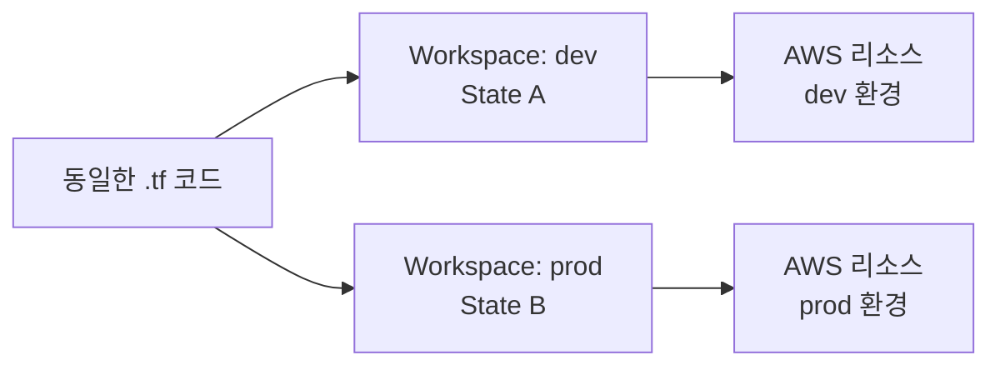

Ch06까지 모듈의 재사용성을 확보했다. 같은 모듈로 여러 환경(dev, stg, prod)에 인프라를 배포해야 할 때, 환경별로 독립된 State를 어떻게 관리할 것인가 — 이것이 Ch07의 주제다. 이번 섹션에서는 Terraform Workspace의 동작 원리와 한계를 이해하고, 디렉토리 기반 분리 방식과 비교한다.

# Workspace

Workspace(작업 공간)는 **동일한 코드베이스로 독립된 State를 관리하는** Terraform 내장 메커니즘이다.

## 1. Workspace란

하나의 Terraform 설정 디렉토리에서 여러 개의 독립된 인프라 인스턴스를 관리할 수 있다. 각 Workspace는 자체 State 파일을 가진다.



코드는 하나지만, Workspace 전환으로 완전히 독립된 State를 사용한다. `dev` Workspace에서 `apply`하면 dev 환경 리소스만, `prod`에서 `apply`하면 prod 환경 리소스만 관리한다.

## 2. default Workspace

Terraform은 `terraform init` 시 `default` Workspace를 자동 생성한다. 명시적으로 Workspace를 생성하지 않으면 모든 작업이 `default`에서 수행된다.

```bash
$ terraform workspace show
```

```text
default
```

Ch06까지의 모든 실습은 `default` Workspace에서 진행한 것이다. `default`는 삭제할 수 없다.

## 3. State 분리 메커니즘

### ① Local Backend

`default` Workspace의 State는 작업 디렉토리에 직접 저장된다. 사용자 정의 Workspace는 `terraform.tfstate.d/` 하위에 분리된다.

```text
project/
├── main.tf
├── terraform.tfstate              ← default workspace
└── terraform.tfstate.d/
    ├── dev/
    │   └── terraform.tfstate      ← dev workspace
    └── prod/
        └── terraform.tfstate      ← prod workspace
```

### ② S3 Backend

S3 Backend에서는 `workspace_key_prefix`와 `key`가 경로를 결정한다.

```hcl
terraform {
  backend "s3" {
    bucket               = "tf-core-tfstate"
    key                  = "gallery/terraform.tfstate"
    region               = "ap-northeast-2"
    workspace_key_prefix = "env:"    # 기본값
  }
}
```

| Workspace | S3 Key |
|-----------|--------|
| `default` | `gallery/terraform.tfstate` |
| `dev` | `env:/dev/gallery/terraform.tfstate` |
| `prod` | `env:/prod/gallery/terraform.tfstate` |

`default` Workspace는 `key` 값 그대로 사용한다. 사용자 정의 Workspace는 `{workspace_key_prefix}/{workspace_name}/{key}` 패턴으로 저장된다. `workspace_key_prefix` 기본값은 `"env:"`(콜론 포함)이다.

## 4. `terraform.workspace` 표현식

`terraform.workspace`는 현재 선택된 Workspace 이름을 문자열로 반환하는 내장 참조다.

```hcl
locals {
  org         = "tf-core"
  project     = "lab01"
  environment = terraform.workspace    # "dev" 또는 "prod"
  namespace   = "${local.org}-${local.project}-${local.environment}"
}
```

Ch05까지 namespace는 `{org}-{project}`였다. 환경 분리를 도입하면서 `{environment}`가 namespace에 추가된다. `terraform.workspace`가 이 값을 제공한다 — 변수를 전달할 필요 없이 Workspace 전환만으로 환경이 바뀐다.

### ① 조건 분기 패턴

```hcl
locals {
  env_config = {
    dev  = { instance_type = "t3.micro",  desired_count = 1 }
    prod = { instance_type = "t3.small",  desired_count = 2 }
  }

  config = local.env_config[terraform.workspace]
}

resource "aws_instance" "web" {
  instance_type = local.config.instance_type
  # ...
}
```

Workspace 이름을 키로 사용해 환경별 설정을 map에서 꺼낸다.

### ② 사용 불가능한 위치

`backend` 블록에서는 `terraform.workspace`를 사용할 수 없다. backend 설정은 `terraform init` 시점에 **정적으로 평가**되므로 변수, locals, 표현식 일체가 불허된다.

```hcl
# ✗ 불가 — backend 블록은 정적
terraform {
  backend "s3" {
    key = "${terraform.workspace}/terraform.tfstate"    # Error!
  }
}
```

---

# Workspace의 한계

## 1. 코드 공유의 구조적 한계

모든 Workspace가 **동일한 코드**를 공유한다. 환경별로 인프라 구성이 달라야 하는 경우(dev에는 없는 리소스가 prod에만 필요한 경우) 조건식이 코드 곳곳에 필요해진다.

```hcl
# 환경별 차이가 커지면 이런 코드가 곳곳에 생긴다
resource "aws_rds_instance" "main" {
  count = terraform.workspace == "prod" ? 1 : 0
  # ...
}
```

환경별 차이가 클수록 코드 복잡도가 급증한다.

## 2. 자격 증명 공유

동일 backend를 사용하므로 모든 Workspace가 **같은 AWS 자격 증명**으로 접근한다. 환경별로 다른 AWS 계정이나 IAM 권한이 필요한 경우 Workspace로는 분리할 수 없다.

## 3. workspace delete의 위험

`terraform workspace delete`는 **State 파일만 삭제**한다. 해당 Workspace로 생성된 AWS 리소스는 그대로 남는다.

```bash
# 올바른 순서
$ terraform workspace select dev
$ terraform destroy                    # 리소스 먼저 삭제
$ terraform workspace select default
$ terraform workspace delete dev       # state 삭제
```

`-force`로 리소스가 남아있는 Workspace를 삭제하면 "dangling" 리소스가 발생한다 — AWS에 존재하지만 Terraform이 더 이상 추적하지 못한다.

## 4. 전환 실수 위험

Workspace 전환을 잊고 `apply`하면 의도하지 않은 환경에 변경이 적용된다. `terraform workspace show`로 현재 Workspace를 확인하는 습관이 필요하다.

---

# 환경 분리 방식 비교

Terraform에서 환경을 분리하는 두 가지 방식을 비교한다.

## 1. Workspace 방식

```text
project/
├── main.tf
├── variables.tf
└── locals.tf          ← terraform.workspace로 환경별 분기
```

코드 하나, State만 분리. `terraform workspace select prod`로 전환 후 `apply`.

## 2. 디렉토리 방식

```text
project/
├── modules/           ← 공통 모듈
│   ├── network/
│   ├── platform/
│   └── workload/
├── envs/
│   ├── dev/
│   │   ├── main.tf   ← modules/ 호출
│   │   └── dev.tfvars
│   └── prod/
│       ├── main.tf   ← modules/ 호출
│       └── prod.tfvars
```

코드와 State 모두 분리. 각 환경 디렉토리에서 독립적으로 `init` → `apply`.

## 3. 비교

| 기준 | Workspace | 디렉토리 |
|------|-----------|---------|
| 코드 | 공유 (단일 복사본) | 분리 (환경별 모듈 호출) |
| State | 분리 | 분리 |
| 자격 증명 | 공유 | 환경별 분리 가능 |
| 환경별 리소스 차이 | 조건식 (복잡도 증가) | 코드 레벨에서 자유롭게 |
| 전환 실수 위험 | Workspace 전환 깜빡하면 위험 | 디렉토리 자체가 다르므로 낮음 |
| 코드 동기화 | 자동 (같은 코드) | 수동 관리 필요 |
| CI/CD 통합 | Workspace 이름 기반 분기 | 디렉토리 경로 기반 분기 |

## 4. 선택 기준

### ① Workspace가 적합한 경우

- 환경 간 인프라가 **거의 동일**하고 파라미터(instance_type, count)만 다른 경우
- 빠른 프로토타이핑, 개인 테스트 환경
- 동일 팀이 단일 자격 증명으로 관리하는 경우

### ② 디렉토리가 적합한 경우

- 환경별로 인프라 구성이 **다를 수 있는** 프로덕션 운용
- 환경별 다른 AWS 계정·IAM 권한 사용
- CI/CD 파이프라인에서 환경별 독립 배포
- 팀 간 접근 제어 분리 필요

### ③ HashiCorp 공식 입장

> "Workspaces are not appropriate for system decomposition or deployments requiring separate credentials and access controls."

> "Use workspaces for environments that do not greatly deviate from one another."

실무에서는 **디렉토리 기반 분리가 선호**된다. 환경별 차이가 처음에는 작아도 시간이 지나면 커지는 경향이 있기 때문이다. 이 시리즈에서는 Sec02에서 Workspace를 직접 실습하고, Sec03에서 디렉토리 방식을 실습한 뒤, Gallery(Sec05)에서 디렉토리 방식을 채택한다.

---

# 핵심 정리

- Workspace는 동일 코드베이스에서 독립된 State를 관리하는 메커니즘이다
- `terraform.workspace`로 현재 Workspace 이름을 참조해 환경별 분기가 가능하다
- State 저장 경로: Local은 `terraform.tfstate.d/{workspace}/`, S3는 `{workspace_key_prefix}/{workspace}/{key}`
- `backend` 블록에서 `terraform.workspace`는 사용 불가 — backend는 정적 평가
- `workspace delete`는 리소스를 destroy하지 않는다 — 반드시 destroy 먼저
- 환경별 인프라 차이가 클수록 디렉토리 분리가 적합하다
- HashiCorp 공식 권장: 파라미터만 다른 경우 Workspace, 구성이 다를 수 있는 경우 디렉토리

---

# 참고 자료

- [Workspace CLI 커맨드 — Terraform 공식 문서](https://developer.hashicorp.com/terraform/cli/commands/workspace)
- [Managing Workspaces — Terraform 공식 문서](https://developer.hashicorp.com/terraform/cli/workspaces)
- [State: Workspaces — Terraform 공식 문서](https://developer.hashicorp.com/terraform/language/state/workspaces)
- [S3 Backend 설정 — Terraform 공식 문서](https://developer.hashicorp.com/terraform/language/backend/s3)
