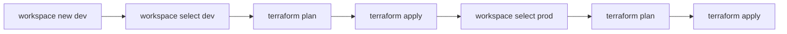
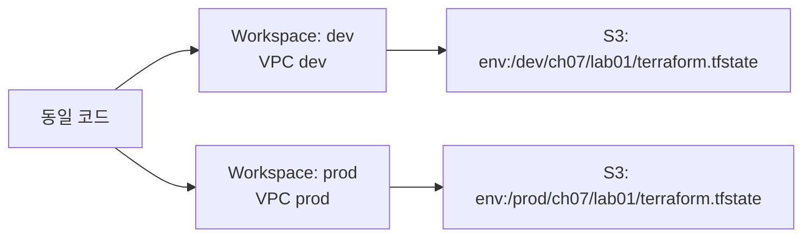
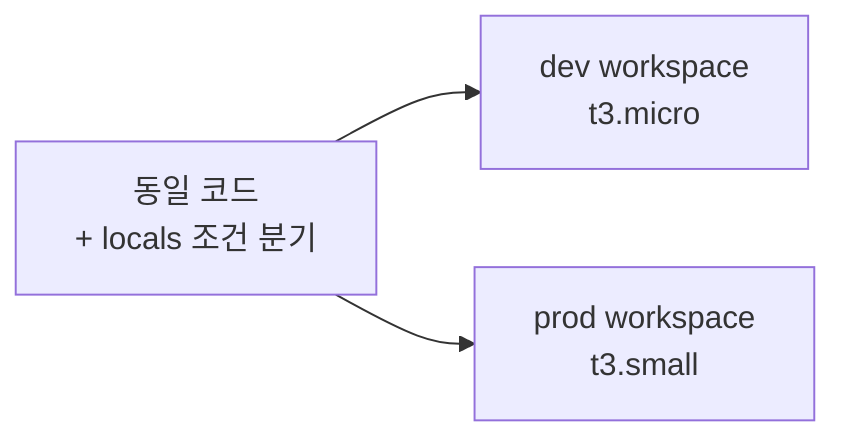

07.01에서 Workspace의 개념과 한계를 이해했다. 이번 섹션에서는 Workspace CLI 명령으로 환경을 생성·전환하고, `terraform.workspace`로 리소스를 차별화하는 것을 직접 실습한다.

# Workspace CLI

`terraform workspace` 명령은 5개 서브커맨드로 구성된다.

## 1. 주요 명령

| 명령 | 설명 |
|------|------|
| `terraform workspace list` | Workspace 목록 출력. 현재 Workspace에 `*` 표시 |
| `terraform workspace new <name>` | 새 Workspace 생성 + 자동 전환 |
| `terraform workspace select <name>` | 지정 Workspace로 전환 |
| `terraform workspace show` | 현재 Workspace 이름 출력 |
| `terraform workspace delete <name>` | Workspace 삭제 (현재 Workspace 삭제 불가) |

## 2. 워크플로우



Workspace를 생성(`new`)하면 자동으로 전환된다. 이후 `plan` → `apply`를 실행하면 해당 Workspace의 State에만 영향을 준다. 다른 환경에 배포하려면 `select`로 전환한 뒤 같은 흐름을 반복한다.

## 3. 삭제 순서

Workspace를 삭제하기 전에 반드시 리소스를 먼저 destroy해야 한다.

```bash
$ terraform workspace select dev
$ terraform destroy -auto-approve
$ terraform workspace select default
$ terraform workspace delete dev
```

리소스가 남아있는 상태에서 삭제하려면 `-force`가 필요하다. 이 경우 AWS에 리소스가 남지만 Terraform이 추적하지 못하는 "dangling" 상태가 된다.

---

# 핵심 정리

- `terraform workspace new`는 생성과 동시에 전환한다 — 빈 State로 시작
- `terraform workspace show`로 현재 Workspace를 항상 확인하는 습관이 필요하다
- 삭제 전 반드시 `terraform destroy` — State만 삭제하면 리소스가 남는다

---

# 참고 자료

- [Workspace CLI 커맨드 — Terraform 공식 문서](https://developer.hashicorp.com/terraform/cli/commands/workspace)
- [Managing Workspaces — Terraform 공식 문서](https://developer.hashicorp.com/terraform/cli/workspaces)

---

# [실습] lab01: workspace 생성 및 전환

# 1. 전체 아키텍처



하나의 VPC 리소스를 `dev`와 `prod` Workspace에서 각각 생성한다. S3 Backend에서 Workspace별 State 경로가 분리되는 것을 확인한다.

---

# 2. 사전 준비

- 04.03 lab01에서 생성한 S3 tfstate 버킷 존재 (`tf-core-tfstate`)

```text
lab01/
├── providers.tf
├── locals.tf
└── main.tf
```

**설정:**

- region: **`ap-northeast-2`**
- VPC CIDR: **`10.0.0.0/16`**

---

# 3. 파일 작성

## providers.tf

```hcl
terraform {
  required_version = ">= 1.14.0"

  required_providers {
    aws = {
      source  = "hashicorp/aws"
      version = "~> 6.0"
    }
  }

  backend "s3" {
    bucket       = "tf-core-tfstate"
    key          = "ch07/lab01/terraform.tfstate"
    region       = "ap-northeast-2"
    encrypt      = true
    use_lockfile = true
  }
}

provider "aws" {
  region = "ap-northeast-2"

  default_tags {
    tags = {
      Organization = local.org
      Project      = local.project
      Environment  = local.environment
      ManagedBy    = "Terraform"
    }
  }
}
```

`key = "ch07/lab01/terraform.tfstate"`로 설정한다. Workspace별 경로는 Terraform이 `workspace_key_prefix`(기본값 `env:`)를 자동으로 붙인다.

## locals.tf

```hcl
locals {
  org         = "tf-core"
  project     = "lab01"
  environment = terraform.workspace

  namespace = "${local.org}-${local.project}-${local.environment}"
}
```

`local.environment = terraform.workspace` — 환경 분리를 위해 namespace에 `{environment}`가 추가된다. Workspace 이름이 이 값을 결정한다. Workspace를 전환하면 namespace가 자동으로 바뀐다.

## main.tf

```hcl
resource "aws_vpc" "this" {
  cidr_block           = "10.0.0.0/16"
  enable_dns_support   = true
  enable_dns_hostnames = true

  tags = {
    Name = "${local.namespace}-vpc-main"
  }
}
```

VPC 하나만 생성한다. Name 태그에 namespace가 포함되므로 Workspace별로 다른 이름이 부여된다: `tf-core-lab01-dev-vpc-main`, `tf-core-lab01-prod-vpc-main`.

---

# 4. dev Workspace 생성 및 배포

```bash
$ terraform init
```

```text
Initializing the backend...

Successfully configured the backend "s3"!

Terraform has been successfully initialized!
```

현재 `default` Workspace에서 초기화된다.

```bash
$ terraform workspace new dev
```

```text
Created and switched to workspace "dev"!

You're now on a new, empty workspace. Workspaces isolate their state,
so if you run "terraform plan" Terraform will not see any existing state
for this configuration.
```

`dev` Workspace가 생성되고 자동 전환되었다. 빈 State로 시작한다.

```bash
$ terraform apply -auto-approve
```

```text
aws_vpc.this: Creating...
aws_vpc.this: Creation complete after 2s [id=vpc-0aaa...]

Apply complete! Resources: 1 added, 0 changed, 0 destroyed.
```

---

# 5. prod Workspace 생성 및 배포

```bash
$ terraform workspace new prod
```

```text
Created and switched to workspace "prod"!
```

```bash
$ terraform plan
```

```text
Terraform will perform the following actions:

  # aws_vpc.this will be created
  + resource "aws_vpc" "this" {
      + cidr_block = "10.0.0.0/16"
      + tags       = {
          + "Name" = "tf-core-lab01-prod-vpc-main"
        }
      ...
    }

Plan: 1 to add, 0 to change, 0 to destroy.
```

`dev`에서 생성한 VPC가 보이지 않는다 — `prod` Workspace는 별도의 State이므로 리소스가 0개인 상태다. Name 태그에 `prod`가 반영된다.

```bash
$ terraform apply -auto-approve
```

```text
Apply complete! Resources: 1 added, 0 changed, 0 destroyed.
```

---

# 6. State 경로 확인

```bash
$ terraform workspace list
```

```text
  default
  dev
* prod
```

현재 `prod` Workspace에 있다.

S3에서 State 파일 경로를 확인한다.

```bash
$ aws s3 ls s3://tf-core-tfstate/ch07/lab01/ --recursive
```

```text
env:/dev/ch07/lab01/terraform.tfstate
env:/prod/ch07/lab01/terraform.tfstate
```

| Workspace | S3 Key |
|-----------|--------|
| `dev` | `env:/dev/ch07/lab01/terraform.tfstate` |
| `prod` | `env:/prod/ch07/lab01/terraform.tfstate` |

`workspace_key_prefix`(기본값 `env:`)가 Workspace 이름 앞에 붙고, 그 뒤에 `key` 값이 온다. `default` Workspace는 prefix 없이 `ch07/lab01/terraform.tfstate`에 직접 저장된다.

---

# 7. 정리

각 Workspace에서 destroy한 뒤 삭제한다.

```bash
$ terraform workspace select dev
$ terraform destroy -auto-approve
$ terraform workspace select prod
$ terraform destroy -auto-approve
$ terraform workspace select default
$ terraform workspace delete dev
$ terraform workspace delete prod
```

```text
Deleted workspace "dev"!
Deleted workspace "prod"!
```

---

# [실습] lab02: workspace로 리소스 차별화

# 1. 전체 아키텍처



`terraform.workspace`를 locals 조건식에 활용해 Workspace별로 다른 인스턴스 타입을 적용한다.

---

# 2. 사전 준비

```text
lab02/
├── providers.tf
├── locals.tf
├── datasources.tf
├── main.tf
└── outputs.tf
```

**설정:**

- region: **`ap-northeast-2`**
- dev: instance_type **`t3.micro`**
- prod: instance_type **`t3.small`**

---

# 3. 파일 작성

## providers.tf

```hcl
terraform {
  required_version = ">= 1.14.0"

  required_providers {
    aws = {
      source  = "hashicorp/aws"
      version = "~> 6.0"
    }
  }
}

provider "aws" {
  region = "ap-northeast-2"

  default_tags {
    tags = {
      Organization = local.org
      Project      = local.project
      Environment  = local.environment
      ManagedBy    = "Terraform"
    }
  }
}
```

lab02는 Local State를 사용한다. Workspace의 리소스 차별화가 목적이므로 S3 Backend는 불필요하다.

## datasources.tf

```hcl
data "aws_ami" "amazon_linux" {
  most_recent = true

  filter {
    name   = "name"
    values = ["al2023-ami-*-x86_64"]
  }

  owners = ["amazon"]
}

data "aws_vpc" "default" {
  default = true
}

data "aws_subnets" "default" {
  filter {
    name   = "vpc-id"
    values = [data.aws_vpc.default.id]
  }
}

data "aws_iam_policy_document" "ec2_assume_role" {
  statement {
    actions = ["sts:AssumeRole"]
    effect  = "Allow"

    principals {
      type        = "Service"
      identifiers = ["ec2.amazonaws.com"]
    }
  }
}

data "aws_iam_policy" "ssm_core" {
  name = "AmazonSSMManagedInstanceCore"
}
```

## locals.tf

```hcl
locals {
  org         = "tf-core"
  project     = "lab02"
  environment = terraform.workspace

  namespace = "${local.org}-${local.project}-${local.environment}"

  env_config = {
    dev = {
      instance_type = "t3.micro"
    }
    prod = {
      instance_type = "t3.small"
    }
  }

  config = local.env_config[terraform.workspace]
}
```

`local.env_config`은 Workspace 이름을 키로 하는 map이다. `local.config`에서 현재 Workspace에 해당하는 설정을 꺼낸다. Workspace가 `dev`면 `t3.micro`, `prod`면 `t3.small`이 된다.

> `local.env_config`에 존재하지 않는 Workspace(예: `default`)에서 `apply`하면 key lookup 에러가 발생한다. Workspace 이름을 `dev` 또는 `prod`로 한정해야 한다.

## main.tf

```hcl
resource "aws_iam_role" "instance" {
  name               = "${local.namespace}-iamrole-instance"
  assume_role_policy = data.aws_iam_policy_document.ec2_assume_role.json

  tags = {
    Name = "${local.namespace}-iamrole-instance"
  }
}

resource "aws_iam_role_policy_attachment" "instance_ssm" {
  role       = aws_iam_role.instance.name
  policy_arn = data.aws_iam_policy.ssm_core.arn
}

resource "aws_iam_instance_profile" "instance" {
  name = "${local.namespace}-iamprofile-instance"
  role = aws_iam_role.instance.name

  tags = {
    Name = "${local.namespace}-iamprofile-instance"
  }
}

resource "aws_security_group" "instance" {
  name   = "${local.namespace}-sg-instance"
  vpc_id = data.aws_vpc.default.id

  egress {
    from_port   = 0
    to_port     = 0
    protocol    = "-1"
    cidr_blocks = ["0.0.0.0/0"]
  }

  tags = {
    Name = "${local.namespace}-sg-instance"
  }
}

resource "aws_instance" "web" {
  ami                    = data.aws_ami.amazon_linux.id
  instance_type          = local.config.instance_type
  subnet_id              = data.aws_subnets.default.ids[0]
  vpc_security_group_ids = [aws_security_group.instance.id]
  iam_instance_profile   = aws_iam_instance_profile.instance.name

  tags = {
    Name = "${local.namespace}-instance-web"
  }
}
```

`instance_type = local.config.instance_type` — Workspace에 따라 `t3.micro` 또는 `t3.small`이 적용된다. 모든 리소스의 Name 태그에 `local.namespace`(= `tf-core-lab02-{workspace}`)가 포함되어 AWS Console에서 환경별 리소스를 식별할 수 있다.

## outputs.tf

```hcl
output "instance" {
  value = {
    id            = aws_instance.web.id
    instance_type = aws_instance.web.instance_type
    workspace     = terraform.workspace
  }
}
```

---

# 4. dev Workspace 배포

```bash
$ terraform init
$ terraform workspace new dev
$ terraform apply -auto-approve
```

```text
Apply complete! Resources: 5 added, 0 changed, 0 destroyed.

Outputs:

instance = {
  "id"            = "i-0aaa..."
  "instance_type" = "t3.micro"
  "workspace"     = "dev"
}
```

dev Workspace에서 `t3.micro` 인스턴스가 생성되었다.

---

# 5. prod Workspace 배포

```bash
$ terraform workspace new prod
$ terraform apply -auto-approve
```

```text
Apply complete! Resources: 5 added, 0 changed, 0 destroyed.

Outputs:

instance = {
  "id"            = "i-0bbb..."
  "instance_type" = "t3.small"
  "workspace"     = "prod"
}
```

동일한 코드에서 Workspace만 전환했는데 `t3.small`이 적용되었다. `local.env_config` map이 Workspace 이름에 따라 다른 값을 반환하기 때문이다.

---

# 6. 결과 확인

```bash
$ terraform workspace select dev
$ terraform output -json instance | jq '.instance_type'
```

```text
"t3.micro"
```

```bash
$ terraform workspace select prod
$ terraform output -json instance | jq '.instance_type'
```

```text
"t3.small"
```

Workspace 전환 시 output도 해당 Workspace의 State에서 읽힌다. Local State 파일을 확인한다:

```bash
$ ls terraform.tfstate.d/
```

```text
dev/    prod/
```

`terraform.tfstate.d/dev/terraform.tfstate`와 `terraform.tfstate.d/prod/terraform.tfstate`가 독립적으로 존재한다.

---

# 7. 정리

```bash
$ terraform workspace select dev
$ terraform destroy -auto-approve
$ terraform workspace select prod
$ terraform destroy -auto-approve
$ terraform workspace select default
$ terraform workspace delete dev
$ terraform workspace delete prod
```

---

# 핵심 정리

- `terraform workspace new`는 생성 + 전환을 동시에 수행한다 — 빈 State로 시작
- S3 Backend에서 Workspace별 State 경로: `{workspace_key_prefix}/{workspace}/{key}` (default는 `{key}` 직접)
- `terraform.workspace`를 locals map 키로 사용하면 Workspace별 설정 분기가 가능하다
- `env_config` map에 없는 Workspace에서 apply하면 에러 — Workspace 이름 제한에 주의
- Workspace 삭제 순서: destroy → select default → delete

---

# 참고 자료

- [Workspace CLI 커맨드 — Terraform 공식 문서](https://developer.hashicorp.com/terraform/cli/commands/workspace)
- [S3 Backend workspace_key_prefix — Terraform 공식 문서](https://developer.hashicorp.com/terraform/language/backend/s3#workspace_key_prefix)
